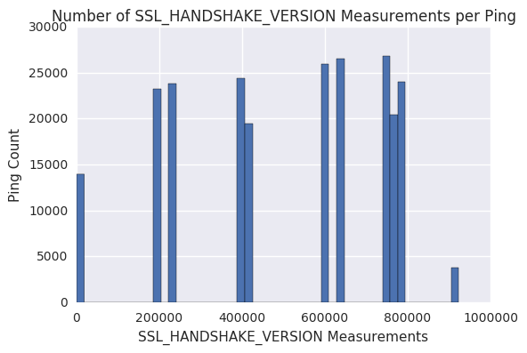
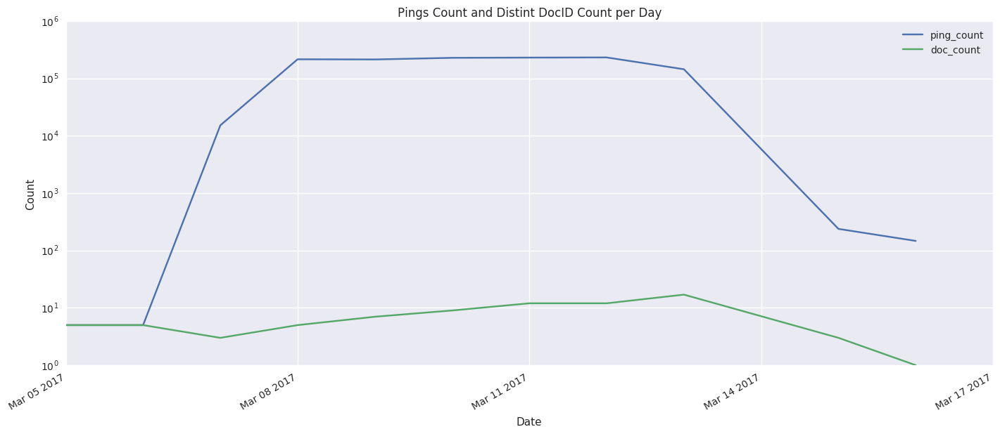

# SSL_HANDSHAKE_VERSION Spike

TL;DR: A single client sending duplicate pings with huge counts of SSL_HANDSHAKE_VERSION caused this spike.

[See the prior work here](https://github.com/ekr/telemetry-repro/pull/1), where I determined that the number of Measurements of SSL_HANDSHAKE_VERSION starting on 20170308 for Beta 49 increased by more than more than 3 orders of magnitude.

The associated ping count only increased by ~50%. This indicated that the problem was not just ping volume, but mostly histogram counts within the pings.

## Looking at 20170312 - the worst day

To find these offenders we'll look at the day with the highest count - $587 * 10^3$ pings but $113 * 10^9$ SSL_HANDSHAKE_VERSION measurements.


```python
from moztelemetry.dataset import Dataset
from moztelemetry.spark import get_pings_properties

from datetime import datetime, timedelta
import pandas as pd
import numpy as np
```
    Unable to parse whitelist: /mnt/anaconda2/lib/python2.7/site-packages/moztelemetry/histogram-whitelists.json.
    Assuming all histograms are acceptable.


```python
pings = Dataset \
.from_source('telemetry') \
.where (
    appUpdateChannel = 'beta',
    appVersion = lambda x: x.startswith('49'),
    submissionDate = '20170312'
).records(sc)
```
    fetching 16579.50070MB in 6728 files...


```python
def get_shv(ping):
    return ping.get('payload', {}).get('histograms', {}).get('SSL_HANDSHAKE_VERSION', {})

per_client = \
pings.map(
    lambda x: 
        (x.get('clientId'),
         get_shv(x))
).filter(
    lambda x: x[0] and x[1]
).map(
    lambda x: (x[0], {'sum': x[1]['sum'], 'count': sum(x[1]['values'].values())})
).reduceByKey(
    lambda x, y: {k: x[k] + y[k] for k in x}
)

#How many clients?
"Total Clients for Beta 49 on 20170312: {}".format(per_client.count())
```


    'Total Clients for Beta 49 on 20170312: 62423'


```python
#How bad is the worst offender?: > 100B Measurements
res = per_client.collect()

print "Max Count: {}".format(max(res, key = lambda x: x[1]['count'])[1])
print "Max Sum: {}".format(max(res, key = lambda x: x[1]['sum'])[1])

# Is this the only one?: Yes. No other clients come close
print "\nTop Five:"
[v[1] for v in sorted(res, key = lambda x: -x[1]['count'])[:5]]
```
    Max Count: {'count': 118021474114, 'sum': 354064422342}
    Max Sum: {'count': 118021474114, 'sum': 354064422342}
    
    Top Five:


    [{'count': 118021474114, 'sum': 354064422342},
     {'count': 1619126, 'sum': 4774548},
     {'count': 667404, 'sum': 1990022},
     {'count': 605598, 'sum': 1806468},
     {'count': 560419, 'sum': 1643153}]


## Found the Offending Client

Next is to determine the distribution of pings as well as the distribution of measurements. Were these all unique pings, or is this "fake" data similar to the [Aurora 51 client?](http://reports.telemetry.mozilla.org/post/projects%2Fproblematic_client.kp)


```python
cid = max(res, key = lambda x: x[1]['count'])[0]

cid_pings = pings.filter(
    lambda x: x.get('clientId') == cid
)

counts = cid_pings.map(
    lambda x: sum(get_shv(x).get('values', {}).values())
).collect()

"Client has {} pings".format(cid_pings.count())
```


    'Client has 232287 pings'


## Huge Counts per Ping

The below plot shows a histogram of SSL_HANDSHAKE_VERSION measurement counts per ping, where the height of the bar is number of pigns with that number of measurements. The high counts are why we are seeing such a spike, and the clustering indicates that these might be duplicates.


```python
from matplotlib import pyplot as plt
import seaborn as sns

%matplotlib inline

plt.title("Number of SSL_HANDSHAKE_VERSION Measurements per Ping")
plt.xlabel("SSL_HANDSHAKE_VERSION Measurements")
plt.ylabel("Ping Count")

plt.hist(counts, bins=50)
plt.legend()
```





## We are looking at duplicate pings

The plot below shows number of pings and number of distinct DocIDs for this single client per day (looking around the problem time period). We are seeing about 10 repeated docIds, all with high counts of SSL_HANDSHAKE_VERSION.

We have started deduping server-side so some of these pings would be removed; deduping will improve over the next few months so that we recieve less than 10% of dupes.


```python
# What does this client's distribution look like across a the bad days?
# We know bad days from the aggregates data, see
# https://github.com/fbertsch/telemetry-repro/blob/2bf7e062719ae498c12f15456e94af9ee7758093/output.txt

begin = '20170305'
end = '20170320'

cid_pings = Dataset \
    .from_source('telemetry') \
    .where (
        appUpdateChannel = 'beta',
        appVersion = lambda x: x.startswith('49'),
        submissionDate = lambda x: begin <= x <= end
    ).records(sc) \
    .filter(lambda x: x.get('clientId') == cid)

props = {
    'submission_date': 'meta/submissionDate',
    'version': 'version',
    'build_id': 'buildId',
    'document_id': 'meta/documentId',
    'timestamp': 'meta/Timestamp',
    'SSL_HANDSHAKE_VERSION': 'payload/histograms/SSL_HANDSHAKE_VERSION'
}
    
data = get_pings_properties(cid_pings, props)

"Total of {} pings from client".format(data.count())
```
    fetching 223752.06889MB in 118090 files...


    'Total of 1282154 pings from client'


```python
counts = data.map(
    lambda x: (datetime.strptime(x["submission_date"], '%Y%m%d'), 1)
).countByKey()

pings_counts = [(d,v) for d,v in counts.iteritems() if isinstance(d, datetime)]

doc_counts = data.map(
    lambda x: (datetime.strptime(x["submission_date"], '%Y%m%d'), {x['document_id']})
).reduceByKey(
    lambda x, y: x | y
).map(
    lambda x: (x[0], len(x[1]))
).collect()
```

```python
#How many pings and how many docs
ping_df = pd.DataFrame(pings_counts, columns=["date", "ping_count"]).set_index(["date"])
doc_df = pd.DataFrame(doc_counts, columns=["date", "doc_count"]).set_index(["date"])
joined_df = ping_df.join(doc_df)

joined_df.plot(figsize=(17, 7))
plt.xticks(np.arange(min(joined_df.index), max(joined_df.index) + timedelta(3), 3, dtype="datetime64[D]"))

plt.title("Pings Count and Distint DocID Count per Day")
plt.ylabel("Count")
plt.xlabel("Date")

ax = plt.subplot(111)
ax.set_yscale("log", nonposy='clip')

plt.grid(True)
plt.show()
```



