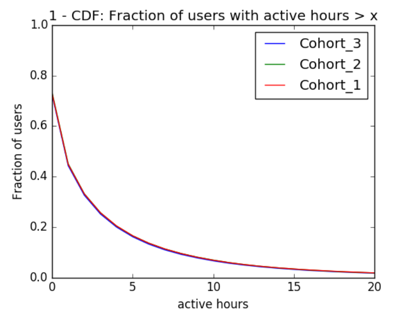
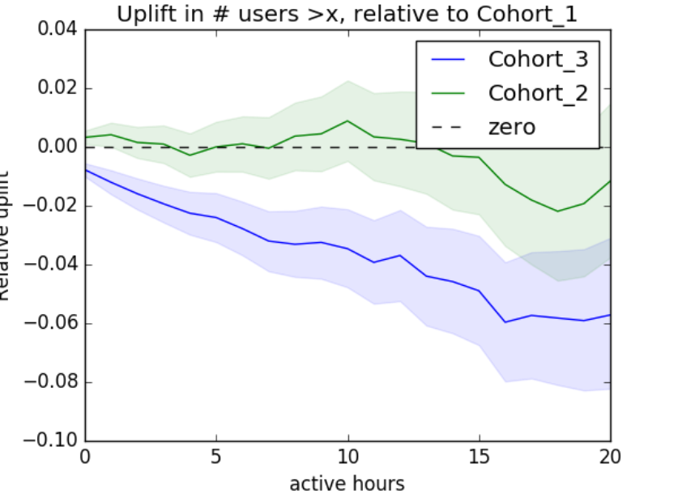

We want to block tracking cookies to increase user privacy, in line with Mozilla's broad goals. We need to watch for some potential negative effects, such as decreased revenue and the potential that we break certain sites, leading to unhappier users, decreased engagement and increased churn.

On December 17, we launched an experiment dividing 1.1% of eligible Firefox users into three branches:

- Cohort_1: The control, with no cookie restrictions
- Cohort_2: Tracking cookies from the basic list blocked (ETP)
- Cohort_3: All third party cookies blocked

The third branch, Cohort_3, went beyond what we would expect to deliver to users. This aggressive move was designed to cause user-noticeable breakage so that we could discover whether our experimental methods are sensitive enough to detect this level of user-noticeable breakage.

Figs 1 and 2 show what happened to clients between 1 and 2 weeks after enrollment.

<figure>
    <figcaption>Figure 1</figcaption>
</figure>

For each point on Fig 1, the y coordinate of the point gives the fraction of users in the branch who had >x active hours that week. "Active hours" refers to the amount of time that the user was interacting with the browser (clicking, scrolling, etc). So in all three branches, roughly 70% of users had at least _some_ activity in this time period (at x=0, y is roughly 0.7). Looking at x=5, fewer than 20% of users in each branch had more than 5 hours of activity.

In Fig 1 it's hard to see the difference between branches, so in Fig 2 we plot the "uplift" of each cohort vs the control, Cohort_1. The "uplift" is the ratio of y values in Fig 1, minus 1: if the uplift is zero then there is no change, if it is positive then more users have >x active hours. We shade the 90% probability bands around each of these uplifts.

<figure>
    <figcaption>Figure 2</figcaption>
</figure>

In Figure 2, for Cohort_3 (all third party cookies blocked) the entire band is well away from zero uplift: there is a significant difference between Cohort_3 and the control. It looks like we had around 1% fewer active users in Cohort_3, and between 2% and 5% fewer users who were active for over 10 hours. There is little ambiguity here: Cohort_3 was worse for user engagement and retention than the control. This gives us confidence in our ability to detect disasters using these techniques.

Since the impact on users was much larger than we had anticipated, Cohort_3 was terminated shortly after these graphs were generated, and the affected users were returned to the default settings.

Through the remainder of the experiment, we could not detect a significant difference in usage between Cohort_1 (the control) and Cohort_2 (ETP). For example, in each of the first five weeks after enrollment, the difference in active hours per user in Cohort_2 was within +/-2% of that for Cohort_1.

## References
[Bug](https://bugzilla.mozilla.org/show_bug.cgi?id=1506908)
