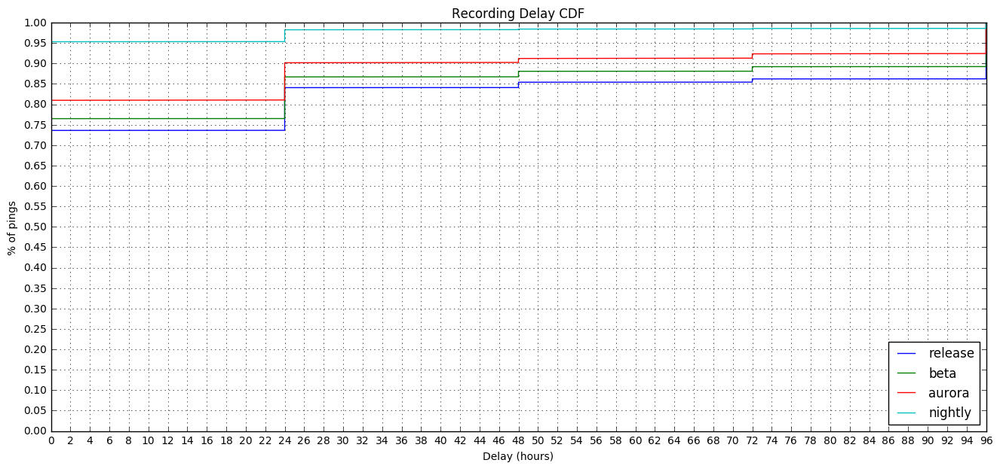
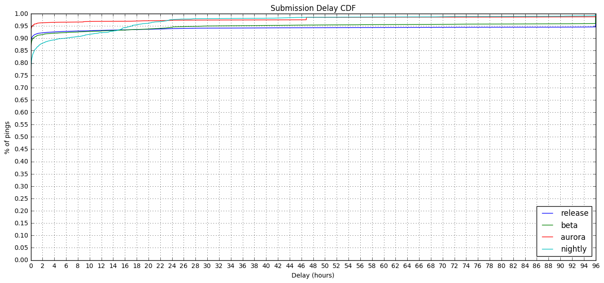

### Crash Ping Submission and Recording Delays by Channel

This is follow-up analysis to the [Main Ping Submission and Recording Delays by Channel](https://reports.telemetry.mozilla.org/post/projects/ping_delays.kp) analysis previously performed.

Specifically investigating what typical values of "recording delay" and "submission delay" might be.


```python
import ujson as json
import matplotlib.pyplot as plt
import pandas as pd
import numpy as np
import plotly.plotly as py
import IPython

from datetime import datetime, timedelta
from email.utils import parsedate_tz, mktime_tz, formatdate

from plotly.graph_objs import *
from moztelemetry import get_pings_properties, get_one_ping_per_client
from moztelemetry.dataset import Dataset

%matplotlib inline
IPython.core.pylabtools.figsize(16, 7)
```
Looking at Jan 10, 2017 to parallel the previous analysis.


```python
pings = Dataset.from_source("telemetry") \
    .where(docType='crash') \
    .where(submissionDate="20170110") \
    .records(sc, sample=0.5)
```
To look at delays, we need to look at times. There are a lot of times, and they are recorded relative to different clocks.

**`creationDate`** - The time the Telemetry code in Firefox created the ping, according to the client's clock, expressed as an ISO string. **`meta/creationTimestamp`** is the same time, but expressed in nanoseconds since the epoch.

**`meta/Date`** - The time the Telemetry code in Firefox sent the ping to the server, according to the client's clock, expressed as a Date string conforming to [RFC 7231](https://tools.ietf.org/html/rfc7231#section-7.1.1.1).

**`meta/Timestamp`** - The time the ping was received by the server, according to the server's
clock, expressed in nanoseconds since the epoch.

**`payload/crashDate`** - Sadly the only time info associated with the crash event itself is at day resolution. I expect cliffs to show at multiples of 24 hours on the CDFs.


```python
subset = get_pings_properties(pings, ["application/channel",
                                      "creationDate",
                                      "meta/creationTimestamp",
                                      "meta/Date",
                                      "meta/Timestamp",
                                      "payload/crashDate"])
```

```python
p = subset.take(1)[0]
```

```python
p
```


    {'application/channel': u'release',
     'creationDate': u'2017-01-10T10:20:56.247Z',
     'meta/Date': u'Tue, 10 Jan 2017 10:20:59 GMT',
     'meta/Timestamp': 1484043660992423424L,
     'meta/creationTimestamp': 1.484043656247e+18,
     'payload/crashDate': u'2017-01-09'}


Quick normalization: ditch any ping that doesn't have a subsessionLength, creationTimestamp, or Timestamp:


```python
prev_count = subset.count()
subset = subset.filter(lambda p:\
                       p["payload/crashDate"] is not None\
                       and p["meta/Timestamp"] is not None\
                       and p["meta/creationTimestamp"] is not None)
filtered_count = subset.count()
print "Filtered {} of {} pings ({:.2f}%)".format(prev_count - filtered_count, prev_count, (prev_count - filtered_count) / prev_count)
```
    Filtered 0 of 1191175 pings (0.00%)


We'll be plotting Cumulative Distribution Functions today.


```python
MAX_DELAY_S = 60 * 60 * 96.0
HOUR_IN_S = 60 * 60.0
CHANNELS = ['release', 'beta', 'aurora', 'nightly']
```

```python
def setup_plot(title, max_x):
    plt.title(title)
    plt.xlabel("Delay (hours)")
    plt.ylabel("% of pings")

    plt.xticks(range(0, int(max_x) + 1, 2))
    plt.yticks(map(lambda y: y / 20.0, range(0, 21, 1)))

    plt.ylim(0.0, 1.0)
    plt.xlim(0.0, max_x)

    plt.grid(True)

def plot_cdf(data):
    sortd = np.sort(data)
    ys = np.arange(len(sortd))/float(len(sortd))

    plt.plot(sortd, ys)
```

```python
def calculate_delays(p):
    
    created = datetime.fromtimestamp(p["meta/creationTimestamp"] / 1000.0 / 1000.0 / 1000.0)
    received = datetime.fromtimestamp(p["meta/Timestamp"] / 1000.0 / 1000.0 / 1000.0)
    sent = datetime.fromtimestamp(mktime_tz(parsedate_tz(p["meta/Date"]))) if p["meta/Date"] is not None else received
    clock_skew = received - sent
    
    reporting_delay = (created.date() - datetime.strptime(p["payload/crashDate"], "%Y-%m-%d").date()).total_seconds()
    submission_delay = (received - created - clock_skew).total_seconds()
    return (reporting_delay, submission_delay)
```

```python
delays_by_chan = subset.map(lambda p: (p["application/channel"], calculate_delays(p)))
```
### Recording Delay

**Recording Delay** is the time from when the data "happens" to the time we record it in a ping. 

Due to only having day-resolution time information about the crash, this will be approximate and might look weird.


```python
setup_plot("Recording Delay CDF", MAX_DELAY_S / HOUR_IN_S)

for chan in CHANNELS:
    plot_cdf(delays_by_chan\
             .filter(lambda d: d[0] == chan)\
             .map(lambda d: d[1][0] / HOUR_IN_S if d[1][0] < MAX_DELAY_S else MAX_DELAY_S / HOUR_IN_S)\
             .collect())
    
plt.legend(CHANNELS, loc="lower right")
```


    <matplotlib.legend.Legend at 0x7f8dcb4c8810>





Since we don't know when in the day a crash happened, we can't use the precise time of day the ping was created to tell us how long it's been. Thus we get this stair-step pattern as each ping is some quantum of days.

Still, it's enough to show us that Nightly is a clear winner with over 95% of its crashes recorded within a day. Release and beta still manage over 70% within a day and over 80% within two. However, it takes at least four days to reach 90%.

### Submission Delay

**Submission Delay** is the delay between the data being recorded on the client and it being received by our infrastructure. It is thought to be dominated by the length of time Firefox isn't open on a client's computer, though retransmission attempts and throttling can also contribute.

Here we run into a problem with **clock skew**. Clients' clocks aren't guaranteed to align with our server's clock, so we cannot necessarily compare the two. Luckily, with [bug 1144778](https://bugzilla.mozilla.org/show_bug.cgi?id=1144778) we introduced an HTTP `Date` header which tells us what time the client's clock thinks it is when it is sending the data. Coupled with the `Timestamp` field recorded which is what time the server's clock thinks it is when it receives the data, we can subtract the more egregious examples of clock skew and get values that are closer to reality.


```python
setup_plot("Submission Delay CDF", MAX_DELAY_S / HOUR_IN_S)

for chan in CHANNELS:
    plot_cdf(delays_by_chan\
             .filter(lambda d: d[0] == chan)\
             .map(lambda d: d[1][1] / HOUR_IN_S if d[1][1] < MAX_DELAY_S else MAX_DELAY_S / HOUR_IN_S)\
             .collect())
    
plt.legend(CHANNELS, loc="lower right")
```


    <matplotlib.legend.Legend at 0x7f8dbe677a10>





Submission delays are _really_ low across the board meaning there is very little time between the crash ping being created and it being received by our servers.

This echoes the code where the creation of the crash ping happens on the next restart of the browser, and is then sent almost immediately.

Nightly is an interesting subject, though, in that it starts out as the slowest performer before becoming the channel with the most submitted crashes after 24 hours.

### Recording + Submission Delay

And, summing the delays together and graphing them we get...


```python
setup_plot("Combined Delay CDF", MAX_DELAY_S / HOUR_IN_S)

for chan in CHANNELS:
    plot_cdf(delays_by_chan\
             .filter(lambda d: d[0] == chan)\
             .map(lambda d: (d[1][0] + d[1][1]) / HOUR_IN_S if (d[1][0] + d[1][1]) < MAX_DELAY_S else MAX_DELAY_S / HOUR_IN_S)\
             .collect())
    
plt.legend(CHANNELS, loc="lower right")
```


    <matplotlib.legend.Legend at 0x7f8dcafd1310>


Any measure that depends on a count of all crashes will be waiting a long time. Nightly's pretty quick about getting you to 95% within 24 hours, but every other channel requires more (possibly lots more in the case of release) than four days to get us information about 95% of their crashes.

There is [active work](https://bugzilla.mozilla.org/show_bug.cgi?id=1310703) to improve these speeds. I look forward to its affect on these delays.
