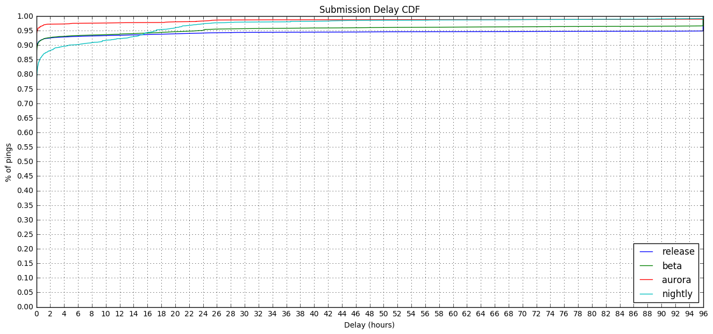

### Crash Ping Submission Delays by Channel

This is follow-up analysis to the [Main Ping Submission and Recording Delays by Channel](http://reports.telemetry.mozilla.org/post/projects/ping_delays.kp) analysis previously performed.

Specifically, I'm investigating what typical values of "submission delay" might be for "crash" pings.


```python
import ujson as json
import matplotlib.pyplot as plt
import pandas as pd
import numpy as np
import plotly.plotly as py
import IPython

from datetime import datetime, timedelta
from email.utils import parsedate_tz, mktime_tz, formatdate

from plotly.graph_objs import *
from moztelemetry import get_pings_properties, get_one_ping_per_client
from moztelemetry.dataset import Dataset

%matplotlib inline
IPython.core.pylabtools.figsize(16, 7)
```
Let's take a look at the "crash" ping. I am assuming that the recording delay is well under one second for crash events, as by their nature they are either recorded immediately or not at all.

Looking at Jan 10, 2017 as per the previous analysis.


```python
pings = Dataset.from_source("telemetry") \
    .where(docType='crash') \
    .where(submissionDate="20170110") \
    .records(sc, sample=0.5)
```
To look at delays, we need to look at times. There are a lot of times, and they are recorded relative to different clocks.

**`creationDate`** - The time the Telemetry code in Firefox created the ping, according to the client's clock, expressed as an ISO string. **`meta/creationTimestamp`** is the same time, but expressed in nanoseconds since the epoch.

**`meta/Date`** - The time the Telemetry code in Firefox sent the ping to the server, according to the client's clock, expressed as a Date string conforming to [RFC 7231](https://tools.ietf.org/html/rfc7231#section-7.1.1.1).

**`meta/Timestamp`** - The time the ping was received by the server, according to the server's
clock, expressed in nanoseconds since the epoch.


```python
subset = get_pings_properties(pings, ["application/channel",
                                      "creationDate",
                                      "meta/creationTimestamp",
                                      "meta/Date",
                                      "meta/Timestamp"])
```

```python
p = subset.take(1)[0]
```

```python
p
```


    {'application/channel': u'beta',
     'creationDate': u'2017-01-10T10:36:21.616Z',
     'meta/Date': None,
     'meta/Timestamp': 1484044584364459264L,
     'meta/creationTimestamp': 1.484044581616e+18}


Quick normalization: ditch any ping that doesn't have a creationTimestamp or Timestamp:


```python
prev_count = subset.count()
subset = subset.filter(lambda p:\
                       p["meta/Timestamp"] is not None\
                       and p["meta/creationTimestamp"] is not None)
filtered_count = subset.count()

"{:.2f}% ({} of {}) pings were filtered".format((prev_count - filtered_count) / prev_count, prev_count - filtered_count, prev_count)
```


    '0.00% (0 of 1188418) pings were filtered'


We'll be plotting Cumulative Distribution Functions today.


```python
MAX_DELAY_S = 60 * 60 * 96.0
HOUR_IN_S = 60 * 60.0
CHANNELS = ['release', 'beta', 'aurora', 'nightly']
```

```python
def setup_plot(title, max_x):
    plt.title(title)
    plt.xlabel("Delay (hours)")
    plt.ylabel("% of pings")

    plt.xticks(range(0, int(max_x) + 1, 2))
    plt.yticks(map(lambda y: y / 20.0, range(0, 21, 1)))

    plt.ylim(0.0, 1.0)
    plt.xlim(0.0, max_x)

    plt.grid(True)

def plot_cdf(data):
    sortd = np.sort(data)
    ys = np.arange(len(sortd))/float(len(sortd))

    plt.plot(sortd, ys)
```

```python
def calculate_submission_delay(p):
    created = datetime.fromtimestamp(p["meta/creationTimestamp"] / 1000.0 / 1000.0 / 1000.0)
    received = datetime.fromtimestamp(p["meta/Timestamp"] / 1000.0 / 1000.0 / 1000.0)
    sent = datetime.fromtimestamp(mktime_tz(parsedate_tz(p["meta/Date"]))) if p["meta/Date"] is not None else received
    clock_skew = received - sent
    
    submission_delay = (received - created - clock_skew).total_seconds()
    return submission_delay
```

```python
delay_by_chan = subset.map(lambda p: (p["application/channel"], calculate_submission_delay(p)))
```
### Submission Delay

**Submission Delay** is the delay between the data being recorded on the client and it being received by our infrastructure. It is thought to be dominated by the length of time Firefox isn't open on a client's computer, though retransmission attempts and throttling can also contribute.

Here we run into a problem with **clock skew**. Clients' clocks aren't guaranteed to align with our server's clock, so we cannot necessarily compare the two. Luckily, with [bug 1144778](https://bugzilla.mozilla.org/show_bug.cgi?id=1144778) we introduced an HTTP `Date` header which tells us what time the client's clock thinks it is when it is sending the data. Coupled with the `Timestamp` field recorded which is what time the server's clock thinks it is when it receives the data, we can subtract the more egregious examples of clock skew and get values that are closer to reality.


```python
setup_plot("Submission Delay CDF", MAX_DELAY_S / HOUR_IN_S)

for chan in CHANNELS:
    plot_cdf(delay_by_chan\
             .filter(lambda d: d[0] == chan)\
             .map(lambda d: d[1] / HOUR_IN_S if d[1] < MAX_DELAY_S else MAX_DELAY_S / HOUR_IN_S)\
             .collect())
    
plt.legend(CHANNELS, loc="lower right")
```


    <matplotlib.legend.Legend at 0x7fbea76be850>





Many crash pings are submitted with much lower delays than "main" pings.

However, especially for the release channel, the last 5% of crash pings take more than 96 hours, the same as for "main" pings.

The nightly channel is an interesting abberation compared to the others in that it starts as the slowest submitter, but at about 24 hours it has caught up with the fastest. My guess is that nightly users might be more prone to just let a crashed browser die and leave it until tomorrow to restart.

Using information from both types of pings in order to generate a single statistic (like "crash rates per thousand usage hours") will have problems wherever the lines do not line up. Until about 48 hours' delay, we have received too many "crash" pings and too few "main" pings for the counts to line up and provide us with a sensible rate.
