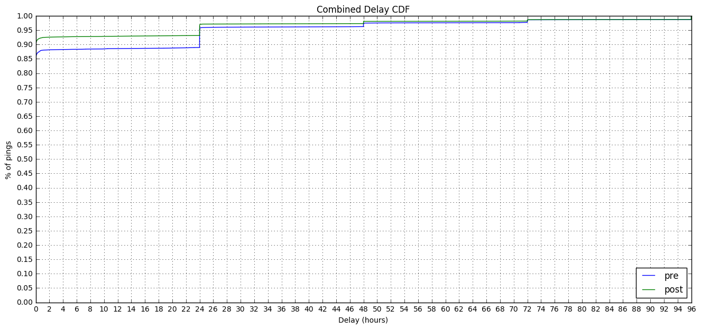

### Crash Ping Submission and Recording Delays - pingSender

This is follow-up analysis to the [Crash Ping Submission and Recording Delays by Channel](http://reports.telemetry.mozilla.org/post/projects/crash_ping_delays.kp) analysis previously performed.

Specifically, this one investigates the difference between typical values of "recording delay" and "submission delay" before and after [pingSender started sending pings](https://bugzilla.mozilla.org/show_bug.cgi?id=1310703).


```python
import ujson as json
import matplotlib.pyplot as plt
import pandas as pd
import numpy as np
import plotly.plotly as py
import IPython

from datetime import datetime, timedelta
from email.utils import parsedate_tz, mktime_tz, formatdate

from plotly.graph_objs import *
from moztelemetry import get_pings_properties, get_one_ping_per_client
from moztelemetry.dataset import Dataset

%matplotlib inline
IPython.core.pylabtools.figsize(16, 7)
```
    Unable to parse whitelist (/mnt/anaconda2/lib/python2.7/site-packages/moztelemetry/histogram-whitelists.json). Assuming all histograms are acceptable.


We'll be looking at two cohorts: Feb 1-14 and Feb 16 - Mar 1. `pingSender` was released Feb 15. We will be limiting to crashes submitted by builds built during the cohort range that were submitted during the cohort range.


```python
pre_pings = Dataset.from_source("telemetry") \
    .where(docType='crash') \
    .where(appUpdateChannel="nightly") \
    .where(submissionDate=lambda x: x >= "20170201" and x < "20170214") \
    .where(appBuildId=lambda x: x >= "20170201" and x < "20170214") \
    .records(sc, sample=1)
    
post_pings = Dataset.from_source("telemetry") \
    .where(docType='crash') \
    .where(appUpdateChannel="nightly") \
    .where(submissionDate=lambda x: x >= "20170216" and x < "20170301") \
    .where(appBuildId=lambda x: x >= "20170216" and x < "20170301") \
    .records(sc, sample=1)
```
To look at delays, we need to look at times. There are a lot of times, and they are recorded relative to different clocks.

**`creationDate`** - The time the Telemetry code in Firefox created the ping, according to the client's clock, expressed as an ISO string. **`meta/creationTimestamp`** is the same time, but expressed in nanoseconds since the epoch.

**`meta/Date`** - The time the Telemetry code in Firefox sent the ping to the server, according to the client's clock, expressed as a Date string conforming to [RFC 7231](https://tools.ietf.org/html/rfc7231#section-7.1.1.1).

**`meta/Timestamp`** - The time the ping was received by the server, according to the server's
clock, expressed in nanoseconds since the epoch.

**`payload/crashDate`** - Sadly the only time info associated with the crash event itself is at day resolution. I expect cliffs to show at multiples of 24 hours on the CDFs.


```python
pre_subset = get_pings_properties(pre_pings, ["application/channel",
                                              "id",
                                              "payload/processType",
                                              "creationDate",
                                              "meta/creationTimestamp",
                                              "meta/Date",
                                              "meta/Timestamp",
                                              "payload/crashDate"])

post_subset = get_pings_properties(post_pings, ["application/channel",
                                               "id",
                                               "payload/processType",
                                               "creationDate",
                                               "meta/creationTimestamp",
                                               "meta/Date",
                                               "meta/Timestamp",
                                               "payload/crashDate"])
```
The rest of the analysis is cleaner if we combine the two cohorts here.


```python
def add_pre(p):
    p['pre'] = 'pre'
    return p

def add_post(p):
    p['pre'] = 'post'
    return p

combined = pre_subset.map(add_pre).union(post_subset.map(add_post))
```
Quick normalization: ditch any ping that doesn't have a subsessionLength, creationTimestamp, or Timestamp:


```python
prev_count = combined.count()
combined = combined.filter(lambda p:\
                       p["payload/crashDate"] is not None\
                       and p["meta/Timestamp"] is not None\
                       and p["meta/creationTimestamp"] is not None)
filtered_count = combined.count()
print "Filtered {} of {} pings ({:.2f}%)".format(prev_count - filtered_count, prev_count, 100.0 * (prev_count - filtered_count) / prev_count)
```
    Filtered 0 of 186321 pings (0.00%)


`pingSender` only submits "crash" pings for main-process crashes, so let's limit ourselves to those.


```python
prev_count = combined.count()
combined = combined.filter(lambda p: p["payload/processType"] == "main")
filtered_count = combined.count()
print "Filtered {} of {} pings ({:.2f}%)".format(prev_count - filtered_count, prev_count, 100.0 * (prev_count - filtered_count) / prev_count)
```
    Filtered 138409 of 186321 pings (74.29%)


##### Deduplication
We sometimes receive crash pings more than once (identical document ids). This is usually below 1%, but there was a [known issue](https://bugzilla.mozilla.org/show_bug.cgi?id=1345153) that can complicate measurement.

So we'll dedupe here.


```python
combined_deduped = combined\
    .map(lambda p: (p["id"], p))\
    .reduceByKey(lambda a, b: a if a["meta/Timestamp"] < a["meta/Timestamp"] else b)\
    .map(lambda pair: pair[1])
```

```python
combined_count = combined.count()
combined_deduped_count = combined_deduped.count()
print "Filtered {} of {} crash pings ({:.2f}%)".format(combined_count - combined_deduped_count, combined_count, 100.0 * (combined_count - combined_deduped_count) / combined_count)
```
    Filtered 9684 of 47912 crash pings (20.21%)


```python
p = combined_deduped.take(1)[0]
```

```python
p
```


    <omitted just in case>


We'll be plotting Cumulative Distribution Functions today.


```python
MAX_DELAY_S = 60 * 60 * 96.0
HOUR_IN_S = 60 * 60.0
PRES = ['pre', 'post']
```

```python
def setup_plot(title, max_x):
    plt.title(title)
    plt.xlabel("Delay (hours)")
    plt.ylabel("% of pings")

    plt.xticks(range(0, int(max_x) + 1, 2))
    plt.yticks(map(lambda y: y / 20.0, range(0, 21, 1)))

    plt.ylim(0.0, 1.0)
    plt.xlim(0.0, max_x)

    plt.grid(True)

def plot_cdf(data):
    sortd = np.sort(data)
    ys = np.arange(len(sortd))/float(len(sortd))

    plt.plot(sortd, ys)
```

```python
def calculate_delays(p):
    
    created = datetime.fromtimestamp(p["meta/creationTimestamp"] / 1000.0 / 1000.0 / 1000.0)
    received = datetime.fromtimestamp(p["meta/Timestamp"] / 1000.0 / 1000.0 / 1000.0)
    sent = datetime.fromtimestamp(mktime_tz(parsedate_tz(p["meta/Date"]))) if p["meta/Date"] is not None else received
    clock_skew = received - sent
    
    reporting_delay = (created.date() - datetime.strptime(p["payload/crashDate"], "%Y-%m-%d").date()).total_seconds()
    submission_delay = (received - created - clock_skew).total_seconds()
    return (reporting_delay, submission_delay)
```

```python
delays_by_chan = combined_deduped.map(lambda p: (p["pre"], calculate_delays(p)))
```
### Recording Delay

**Recording Delay** is the time from when the data "happens" to the time we record it in a ping. 

Due to only having day-resolution time information about the crash, this will be approximate and might look weird.


```python
setup_plot("Recording Delay CDF", MAX_DELAY_S / HOUR_IN_S)

for pre in PRES:
    plot_cdf(delays_by_chan\
             .filter(lambda d: d[0] == pre)\
             .map(lambda d: d[1][0] / HOUR_IN_S if d[1][0] < MAX_DELAY_S else MAX_DELAY_S / HOUR_IN_S)\
             .collect())
    
plt.legend(PRES, loc="lower right")
```


    <matplotlib.legend.Legend at 0x7f37f4a49450>


As expected, more main-process "crash" pings are recorded more quickly with `pingSender`.

The only reason this isn't 100% at 0 days is probably due to "crash" pings failing to be received when sent by pingSender. (it tries at most once to send a ping). We will have better information on pingSender's success rate when [it sends some identifying headers](https://bugzilla.mozilla.org/show_bug.cgi?id=1336360#c36).

### Submission Delay

**Submission Delay** is the delay between the data being recorded on the client and it being received by our infrastructure. It is thought to be dominated by the length of time Firefox isn't open on a client's computer, though retransmission attempts and throttling can also contribute.

Here we run into a problem with **clock skew**. Clients' clocks aren't guaranteed to align with our server's clock, so we cannot necessarily compare the two. Luckily, with [bug 1144778](https://bugzilla.mozilla.org/show_bug.cgi?id=1144778) we introduced an HTTP `Date` header which tells us what time the client's clock thinks it is when it is sending the data. Coupled with the `Timestamp` field recorded which is what time the server's clock thinks it is when it receives the data, we can subtract the more egregious examples of clock skew and get values that are closer to reality.


```python
setup_plot("Submission Delay CDF", MAX_DELAY_S / HOUR_IN_S)

for pre in PRES:
    plot_cdf(delays_by_chan\
             .filter(lambda d: d[0] == pre)\
             .map(lambda d: d[1][1] / HOUR_IN_S if d[1][1] < MAX_DELAY_S else MAX_DELAY_S / HOUR_IN_S)\
             .collect())
    
plt.legend(PRES, loc="lower right")
```


    <matplotlib.legend.Legend at 0x7f37f4642550>


I did not expect any large difference in submission delay as, regardless of whether `pingSender` is doing it or `CrashManager` is doing it, we attempt to send main-process "crash" pings immediately upon creation.

Likely the only reason this isn't 100% at 0 is because of failing the initial transmission.

### Recording + Submission Delay

And, summing the delays together and graphing them we get...


```python
setup_plot("Combined Delay CDF", MAX_DELAY_S / HOUR_IN_S)

for pre in PRES:
    plot_cdf(delays_by_chan\
             .filter(lambda d: d[0] == pre)\
             .map(lambda d: (d[1][0] + d[1][1]) / HOUR_IN_S if (d[1][0] + d[1][1]) < MAX_DELAY_S else MAX_DELAY_S / HOUR_IN_S)\
             .collect())
    
plt.legend(PRES, loc="lower right")
```


    <matplotlib.legend.Legend at 0x7f37f449d2d0>





The use of `pingSender` results in an improvement in main-process "crash" ping client delay.
