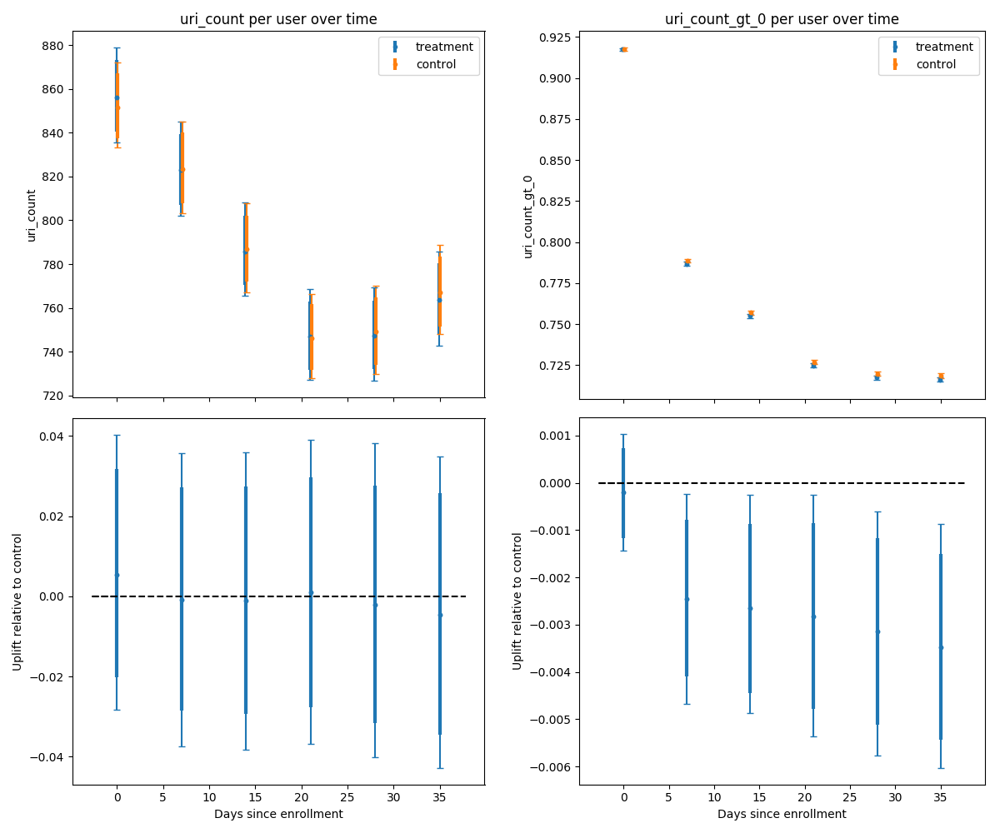

# TL;DR

There is a small but statistically significant drop in retention, affecting light and heavy users alike. By the 6th week after enrollment, between 0.2% and 0.6% fewer users were active.

# Experimental design

From [the experimenter page (non-public page)](https://experimenter.services.mozilla.com/experiments/fingerprinting-protections-retention-study/):

> We plan to study the effect of fingerprinting protections for 0.9% of users. Churn will be monitored during the study to inform a decision whether to move fingerprinting protections to Standard tracking Protection in Firefox 70.

In the control branch, browser fingerprinting JS blocking was not enabled. In the test branch (named “treatment”), fingerprinting blocking was enabled.

The concern is that fingerprinting protections might break websites, or make the internet a less friendly place (with more captchas), and we seek to detect this via increased churn or reduced usage.

# Active hours

<figure>
    <figcaption>Figure 1. (left, upper): Mean active hours per user in each week after enrollment. (left, lower): Test branch uplift in mean active hours per user. (right, upper): Fraction of users with >0 active hours in each week after enrollment. (right, lower): Test branch uplift in this fraction. Thick lines represent the 95% credible interval; thin lines represent the 99.5% credible interval.</figcaption>
</figure>

Fig. 1 (left) shows that each week after enrollment, there is at worst a 2% drop in mean active hours per user, and at best a ~4% increase (considering the 95% CI, the thick lines). Great: no statistically significant change, and we’re fairly sure that the change won’t be worse than a 2% drop.

However, Fig. 1 (right) has enough precision to tell a different story: in the test branch, a small fraction of users churn some time in the first week and don’t return (i.e. have 0 active hours in following weeks, when we would expect them to have >0 active hours). This fraction is quite small: retention in the second week drops by between 0.1% and 0.4%; by the 6th week after enrollment it drops by between 0.2% and 0.6%. It is tempting to read this graph as having a retention difference that increases over time, though it’s not immediately apparent from this analysis whether this is a real effect or a fluke.

Figure 1 (right) shows the effect on whether users are active at all in each week, but it can be instructive to look at more thresholds of activity to see whether heavy users are also affected. Figure 2 shows a generalisation to many thresholds, for users’ 1st (left graphs) and 6th (right graphs) weeks in the experiment.

<figure>
    <figcaption>Figure 2. (upper): Survival functions of users’ active hours for each branch in the 1st (left) and 6th (right) weeks in the experiment. x=0 in the left and right graphs respectively show the same data as x=0 and x=35 in Fig 1 (upper right). (lower): Uplift in the survival functions; relative change in the fraction of users with >x active hours in that week.</figcaption>
</figure>

Figure 2 (right) has the simpler story; let’s start with it. In the 6th week in the experiment, we expect a drop in retention across all kinds of users. For larger thresholds, above 5 active hours, the drop is no longer significant at 99.5%, but this is due to an increase in uncertainty rather than significantly different behaviour. So as well as there being a significant drop in the number of users with any activity, there is a significant drop in the number of users with >5 active hours. It looks like an across the board drop that we should assume hits heavy users proportionately to light users.

Figure 2 (left) is more nuanced: there is not a significant drop at x=0 and the CI is very narrow around “no change”. The 95% confidence interval drops below zero at x=1: there is a >95% probability of a drop in the fraction of users with >1 active hour in the first week following enrollment. So either users reduce their usage within an hour or so of post-enrollment activity, or we were unlucky.

Given that we _do_ see a significant drop at x=0 in the following weeks, I would draw the conclusion that the test branch is churning between 0.2% and 0.6% of users by the 6th week, irrespective of the users’ natural activity levels, and that the effect likely first becomes visible after a few hours of usage, and possibly churns more users with each passing week. Despite the statistical significance of these results, this is a relatively small fraction, so it might not rule out the possibility of rolling out this feature to gather more breakage reports or to drive more publishers to fix their sites.

# Uri count

<figure>
    <figcaption>Figure 3. (left, upper): Mean URIs browsed per user in each week after enrollment. (left, lower): Test branch uplift in URIs per user. (right, upper): Fraction of users with >0 URIs in each week after enrollment. (right, lower): Test branch uplift in this fraction.
</figcaption>
</figure>

Stop me if you’ve heard this before: there is no detectable change in mean URIs browsed per user in any week (Figure 3 (left)); and a small significant drop in the fraction of users visiting at least one URI in each of weeks 2-6, with between a 0.3% and 0.6% drop in the fraction of users with any browsing activity in week 6 (Figure 3 (right)).

The survival function for URIs browsed in the 6th week (Figure 4) is also similar to the survival function for active hours in the 6th week (Figure 2 (right)). Figure 4 is most consistent with an effect that is stronger for people who would normally browse more URIs, but the credible intervals are large enough that it is also consistent with an effect that hits all users equally (the line in Fig 4 (lower) trends downwards, but the surrounding shaded credible intervals (CIs) grow fast enough that the top edge of the CI does not convincingly drop.

<figure>
    <figcaption>Figure 4. (upper): Survival functions of users’ URIs browsed for each branch in the 6th week in the experiment. (lower): Uplift in the survival function; relative change in the fraction of users with >x URIs browsed in that week.
</figcaption>
</figure>

## References
[Bug](https://bugzilla.mozilla.org/show_bug.cgi?id=1562545)
