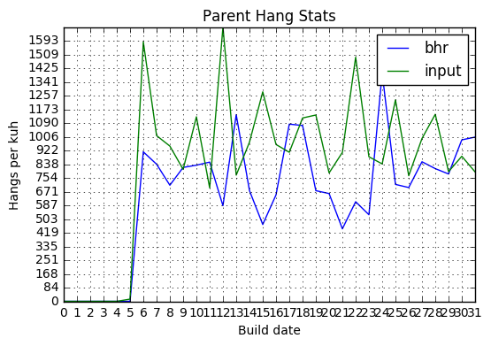
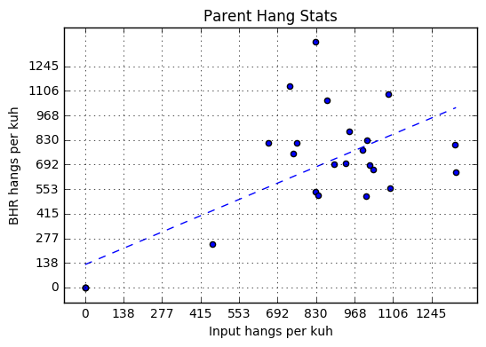
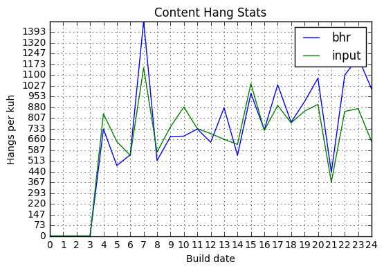
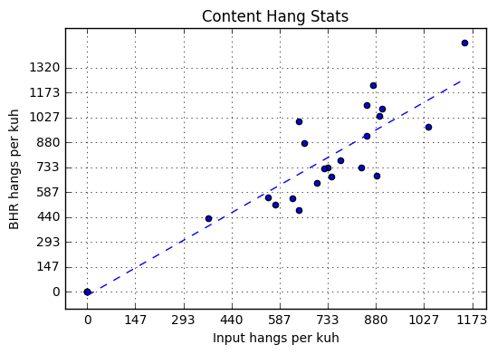
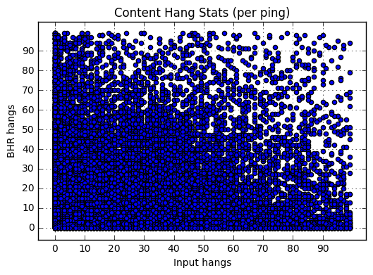
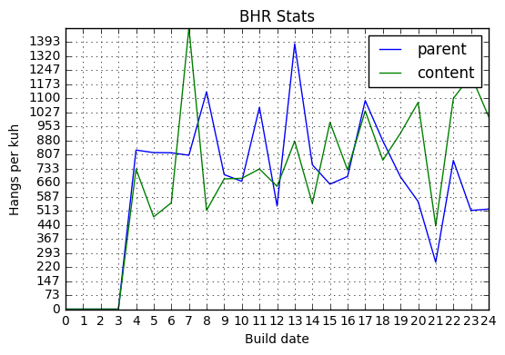
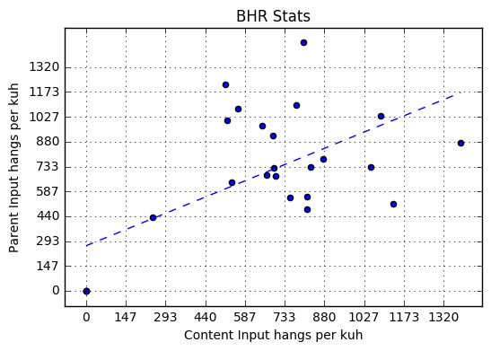
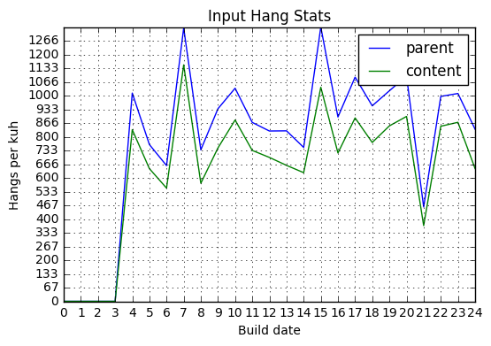
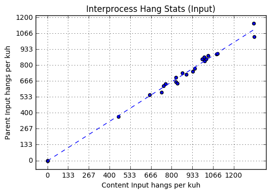

```python
import numpy as np
import matplotlib.pyplot as plt
import pandas as pd
from datetime import datetime, timedelta
from moztelemetry import get_pings_properties
from moztelemetry.dataset import Dataset
from scipy.stats import linregress

%matplotlib inline
```

```python
start_date = (datetime.today() + timedelta(days=-22))
start_date_str = start_date.strftime("%Y%m%d")
end_date = (datetime.today() + timedelta(days=-6))
end_date_str = end_date.strftime("%Y%m%d")

pings = (Dataset.from_source("telemetry")
    .where(docType='main')
    .where(appBuildId=lambda b: (b.startswith(start_date_str) or b > start_date_str)
                                 and (b.startswith(end_date_str) or b < end_date_str))
    .where(appUpdateChannel="nightly")
    .records(sc, sample=1.0))

subset = get_pings_properties(pings, [
        'environment/system/os/name',
        'application/buildId',
        'payload/info/subsessionLength',
        'payload/histograms/INPUT_EVENT_RESPONSE_COALESCED_MS',
        'payload/processes/content/histograms/INPUT_EVENT_RESPONSE_COALESCED_MS/values',
        'payload/childPayloads',
        'payload/threadHangStats',
    ])
```
    fetching 96379.93220MB in 95251 files...


This analysis is oriented toward understanding the relationship between BHR data (which can be viewed [here](http://squarewave.github.io/)), and input hang data (the "Input Lag measures [here](https://health.graphics/quantum/)). If for most BHR hangs, we have a corresponding "Input Lag" hang, and vice versa, then that means the stacks we visualize in the BHR dashboard are of high value for bettering our score on the "Input Lag" metric.

Our first step: let's just gather numbers for both of our metrics - one for the parent process, and one for content.


```python
def hang_has_user_interaction(hang):
    if 'annotations' not in hang:
        return False
    if len(hang['annotations']) == 0:
        return False
    return any('UserInteracting' in a and a['UserInteracting'] == 'true' for a in hang['annotations'])

def flatten_hangs(thread_hang):
    if 'name' not in thread_hang:
        return []

    hangs = thread_hang['hangs']

    return [
        {
            'thread_name': thread_hang['name'],
            'hang': x
        }
        for x in hangs
        if hang_has_user_interaction(x)
    ]

def flatten_all_hangs(ping):
    result = []

    if ping['payload/childPayloads'] is not None:
        for payload in ping['payload/childPayloads']:
            if 'threadHangStats' not in payload:
                continue

            for thread_hang in payload['threadHangStats']:
                result = result + flatten_hangs(thread_hang)

    if ping['payload/threadHangStats'] is not None:
        for thread_hang in ping['payload/threadHangStats']:
            result = result + flatten_hangs(thread_hang)

    return result

def count_bhr_hangs(thread_name, hangs):
    count = 0
    for hang in hangs:
        if hang['thread_name'] == thread_name:
            hist_data = hang['hang']['histogram']['values']
            key_ints = map(int, hist_data.keys())
            hist = pd.Series(hist_data.values(), index=key_ints)
            count += hist[hist.index > 2048].sum()
    return count
            
def count_parent_input_delays(ping):
    if ping['payload/histograms/INPUT_EVENT_RESPONSE_COALESCED_MS'] is None:
        return 0
    data = ping['payload/histograms/INPUT_EVENT_RESPONSE_COALESCED_MS']
    zipped = zip(data.values, map(int, data.keys()))
    vals = sorted(zipped, key=lambda x: x[1])

    return pd.Series([v for v,k in vals], index=[k for v,k in vals]).truncate(before=2048).sum()
    
def count_content_input_delays(ping):
    if ping['payload/processes/content/histograms/INPUT_EVENT_RESPONSE_COALESCED_MS/values'] is None:
        return 0
    data = ping['payload/processes/content/histograms/INPUT_EVENT_RESPONSE_COALESCED_MS/values']
    zipped = zip(data.values(), map(int, data.keys()))
    vals = sorted(zipped, key=lambda x: x[1])

    return pd.Series([v for v,k in vals], index=[k for v,k in vals]).truncate(before=2048).sum()

def get_counts(ping):
    hangs = flatten_all_hangs(ping)
    subsession_length = ping['payload/info/subsessionLength']
    return (ping['application/buildId'], {
        'subsession_length': subsession_length,
        'parent_bhr': count_bhr_hangs('Gecko', hangs),
        'content_bhr': count_bhr_hangs('Gecko_Child', hangs),
        'parent_input': count_parent_input_delays(ping),
        'content_input': count_content_input_delays(ping),
    })

def merge_counts(a, b):
    return {k: a[k] + b[k] for k in a.iterkeys()}

def ping_is_valid(ping):
    if not isinstance(ping["application/buildId"], basestring):
        return False
    if type(ping["payload/info/subsessionLength"]) != int:
        return False

    return ping["environment/system/os/name"] == "Windows_NT"

cached = subset.filter(ping_is_valid).map(get_counts).cache()
counts_result = cached.reduceByKey(merge_counts).collect()
```

```python
sorted_result = sorted(counts_result, key=lambda x: x[1])
```

```python
plot_data = np.array([
    [float(x['parent_bhr']) / x['subsession_length'] * 3600. * 1000. for k,x in sorted_result],
    [float(x['content_bhr']) / x['subsession_length'] * 3600. * 1000. for k,x in sorted_result],
    [float(x['parent_input']) / x['subsession_length'] * 3600. * 1000. for k,x in sorted_result],
    [float(x['content_input']) / x['subsession_length'] * 3600. * 1000. for k,x in sorted_result]
], np.float32)
```
Let's take a look at the parent numbers over time to get an intuition for their relationship:


```python
plt.title("Parent Hang Stats")
plt.xlabel("Build date")
plt.ylabel("Hangs per kuh")

bhr_index = 0
input_index = 2

plt.xticks(range(0, len(sorted_result)))
max_y = max(np.amax(plot_data[bhr_index]), np.amax(plot_data[input_index]))
plt.yticks(np.arange(0., max_y, max_y / 20.))

plt.grid(True)

plt.plot(range(0, len(sorted_result)), plot_data[bhr_index])
plt.plot(range(0, len(sorted_result)), plot_data[input_index])
plt.legend(["bhr", "input"], loc="upper right")
```


    <matplotlib.legend.Legend at 0x7fa35f3e4890>





Looks plausibly correlated to me - let's try a scatter plot:


```python
plt.title("Parent Hang Stats")
plt.ylabel("BHR hangs per kuh")
plt.xlabel("Input hangs per kuh")

bhr_index = 0
input_index = 2

max_val = max(np.amax(plot_data[bhr_index]), np.amax(plot_data[input_index]))
ticks = np.arange(0., max_val, max_val / 10.)
plt.yticks(ticks)
plt.xticks(ticks)


plt.grid(True)

plt.scatter(plot_data[input_index], plot_data[bhr_index])

slope, intercept, rvalue, pvalue, stderr = linregress(plot_data[input_index], plot_data[bhr_index])

max_x = np.amax(plot_data[input_index])
plt.plot([0, max_x], [intercept, intercept + max_x * slope], '--')
rvalue # print the correlation coefficient
```


    0.71141966513446731





Correlation coefficient of ~0.711, so, moderately correlated. Let's try the content process:


```python
plt.title("Content Hang Stats")
plt.xlabel("Build date")
plt.ylabel("Hangs per kuh")

bhr_index = 1
input_index = 3

plt.xticks(range(0, len(sorted_result)))
max_y = max(np.amax(plot_data[bhr_index]), np.amax(plot_data[input_index]))
plt.yticks(np.arange(0., max_y, max_y / 20.))

plt.grid(True)

plt.plot(range(0, len(sorted_result)), plot_data[bhr_index])
plt.plot(range(0, len(sorted_result)), plot_data[input_index])
plt.legend(["bhr", "input"], loc="upper right")
```


    <matplotlib.legend.Legend at 0x7fa35d5a0e50>





```python
plt.title("Content Hang Stats")
plt.ylabel("BHR hangs per kuh")
plt.xlabel("Input hangs per kuh")

bhr_index = 1
input_index = 3

max_val = max(np.amax(plot_data[bhr_index]), np.amax(plot_data[input_index]))
ticks = np.arange(0., max_val, max_val / 10.)
plt.yticks(ticks)
plt.xticks(ticks)

plt.grid(True)

plt.scatter(plot_data[input_index], plot_data[bhr_index])

slope, intercept, rvalue, pvalue, stderr = linregress(plot_data[input_index], plot_data[bhr_index])

max_x = np.amax(plot_data[input_index])
plt.plot([0, max_x], [intercept, intercept + max_x * slope], '--')
rvalue
```


    0.92448071222652162





~0.924. Much more strongly correlated. So it's _plausible_ that BHR hangs are a strong cause of content hangs. They could still be a significant cause of parent hangs, but it seems weaker.

Each data point in the above scatter plots is the sum of hang stats for a given build date. The correlation across build dates for the content process is high. How about across individual pings?


```python
collected = cached.collect()
plt.title("Content Hang Stats (per ping)")
plt.ylabel("BHR hangs")
plt.xlabel("Input hangs")

bhr_index = 1
input_index = 3

content_filtered = [x for k,x in collected if x['content_bhr'] < 100 and x['content_input'] < 100]

per_ping_data = plot_data = np.array([
    [x['parent_bhr'] for x in content_filtered],
    [x['content_bhr'] for x in content_filtered],
    [x['parent_input'] for x in content_filtered],
    [x['content_input'] for x in content_filtered]
], np.int32)

ticks = np.arange(0, 100, 10)
plt.yticks(ticks)
plt.xticks(ticks)

plt.grid(True)

plt.scatter(per_ping_data[input_index], per_ping_data[bhr_index])

slope, intercept, rvalue, pvalue, stderr = linregress(per_ping_data[input_index], per_ping_data[bhr_index])

max_x = 10.
plt.plot([0, max_x], [intercept, intercept + max_x * slope], '--')
rvalue
```


    0.41093048863293707





Interesting - the data split out per ping is significantly less correlated than the aggregate data by build date. This might suggest that individual BHR hangs don't seem to cause Input Lag events, which is unfortunate for us. That would imply however that there must be some third cause for the high correlation in the aggregate data.

Let's see if we can observe any strong correlation between BHR data between processes. This should give us a feel for whether there might be any forces external to FF that are influencing the numbers:


```python
plot_data = np.array([
    [float(x['parent_bhr']) / x['subsession_length'] * 3600. * 1000. for k,x in sorted_result],
    [float(x['content_bhr']) / x['subsession_length'] * 3600. * 1000. for k,x in sorted_result],
    [float(x['parent_input']) / x['subsession_length'] * 3600. * 1000. for k,x in sorted_result],
    [float(x['content_input']) / x['subsession_length'] * 3600. * 1000. for k,x in sorted_result]
], np.float32)
```

```python
plt.title("BHR Stats")
plt.xlabel("Build date")
plt.ylabel("Hangs per kuh")

parent_index = 0
content_index = 1

plt.xticks(range(0, len(sorted_result)))
max_y = max(np.amax(plot_data[parent_index]), np.amax(plot_data[content_index]))
plt.yticks(np.arange(0., max_y, max_y / 20.))

plt.grid(True)

plt.plot(range(0, len(sorted_result)), plot_data[parent_index])
plt.plot(range(0, len(sorted_result)), plot_data[content_index])
plt.legend(["parent", "content"], loc="upper right")
```


    <matplotlib.legend.Legend at 0x7fa34abfabd0>





```python
plt.title("BHR Stats")
plt.ylabel("Parent Input hangs per kuh")
plt.xlabel("Content Input hangs per kuh")

parent_index = 0
content_index = 1

max_val = max(np.amax(plot_data[parent_index]), np.amax(plot_data[content_index]))
ticks = np.arange(0., max_val, max_val / 10.)
plt.yticks(ticks)
plt.xticks(ticks)


plt.grid(True)

plt.scatter(plot_data[parent_index], plot_data[content_index])

slope, intercept, rvalue, pvalue, stderr = linregress(plot_data[parent_index], plot_data[content_index])

max_x = np.amax(plot_data[parent_index])
plt.plot([0, max_x], [intercept, intercept + max_x * slope], '--')
rvalue
```


    0.61208744161139772





Significantly lower than the correlation between BHR and input lag in the content process.

Let's look at input lag across processes:


```python
plt.title("Input Hang Stats")
plt.xlabel("Build date")
plt.ylabel("Hangs per kuh")

parent_index = 2
content_index = 3

plt.xticks(range(0, len(sorted_result)))
max_y = max(np.amax(plot_data[parent_index]), np.amax(plot_data[content_index]))
plt.yticks(np.arange(0., max_y, max_y / 20.))

plt.grid(True)

plt.plot(range(0, len(sorted_result)), plot_data[parent_index])
plt.plot(range(0, len(sorted_result)), plot_data[content_index])
plt.legend(["parent", "content"], loc="upper right")
```


    <matplotlib.legend.Legend at 0x7fa34b21d090>





```python
plt.title("Interprocess Hang Stats (Input)")
plt.ylabel("Parent Input hangs per kuh")
plt.xlabel("Content Input hangs per kuh")

parent_index = 2
content_index = 3

max_val = max(np.amax(plot_data[parent_index]), np.amax(plot_data[content_index]))
ticks = np.arange(0., max_val, max_val / 10.)
plt.yticks(ticks)
plt.xticks(ticks)


plt.grid(True)

plt.scatter(plot_data[parent_index], plot_data[content_index])

slope, intercept, rvalue, pvalue, stderr = linregress(plot_data[parent_index], plot_data[content_index])

max_x = np.amax(plot_data[parent_index])
plt.plot([0, max_x], [intercept, intercept + max_x * slope], '--')
rvalue
```


    0.99701789074391722





Extremely high correlation. There's some discussion of this in Bug 1383924. Essentially, the parent process gets all of the content process's events, so it makes sense that there's a good deal of overlap. However, this could help explain why the content process BHR and input lag are so tightly correlated while the parent process's aren't.

In any case, we have some interesting data here, but the biggest unanswered question I have at the end of this is why is the aggregate correlation between BHR and input lag in the content process so high, while the correlation in individual pings is so low?
