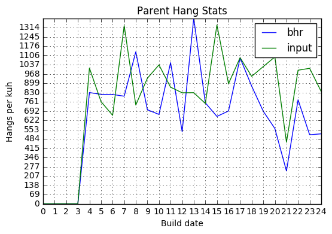

```python
import numpy as np
import matplotlib.pyplot as plt
import pandas as pd
from datetime import datetime, timedelta
from moztelemetry import get_pings_properties
from moztelemetry.dataset import Dataset

%matplotlib inline
```

```python
start_date = (datetime.today() + timedelta(days=-22))
start_date_str = start_date.strftime("%Y%m%d")
end_date = (datetime.today() + timedelta(days=-2))
end_date_str = end_date.strftime("%Y%m%d")

pings = (Dataset.from_source("telemetry")
    .where(docType='main')
    .where(appBuildId=lambda b: (b.startswith(start_date_str) or b > start_date_str)
                                 and (b.startswith(end_date_str) or b < end_date_str))
    .where(appUpdateChannel="nightly")
    .records(sc, sample=1.0))

subset = get_pings_properties(pings, [
        'environment/system/os/name',
        'application/buildId',
        'payload/info/subsessionLength',
        'payload/histograms/INPUT_EVENT_RESPONSE_COALESCED_MS',
        'payload/processes/content/histograms/INPUT_EVENT_RESPONSE_COALESCED_MS/values',
        'payload/childPayloads',
        'payload/threadHangStats',
    ])
```
    fetching 108936.21307MB in 101357 files...


This analysis is oriented toward understanding the relationship between BHR data (which can be viewed [here](http://squarewave.github.io/)), and input hang data (the "Input Lag measures [here](https://health.graphics/quantum/)). If for most BHR hangs, we have a corresponding "Input Lag" hang, and vice versa, then that means the stacks we visualize in the BHR dashboard are of high value for bettering our score on the "Input Lag" metric.

Our first step: let's just gather numbers for both of our metrics - one for the parent process, and one for content.


```python
def hang_has_user_interaction(hang):
    if 'annotations' not in hang:
        return False
    if len(hang['annotations']) == 0:
        return False
    return any('UserInteracting' in a and a['UserInteracting'] == 'true' for a in hang['annotations'])

def flatten_hangs(thread_hang):
    if 'name' not in thread_hang:
        return []

    hangs = thread_hang['hangs']

    return [
        {
            'thread_name': thread_hang['name'],
            'hang': x
        }
        for x in hangs
        if hang_has_user_interaction(x)
    ]

def flatten_all_hangs(ping):
    result = []

    if ping['payload/childPayloads'] is not None:
        for payload in ping['payload/childPayloads']:
            if 'threadHangStats' not in payload:
                continue

            for thread_hang in payload['threadHangStats']:
                result = result + flatten_hangs(thread_hang)

    if ping['payload/threadHangStats'] is not None:
        for thread_hang in ping['payload/threadHangStats']:
            result = result + flatten_hangs(thread_hang)

    return result

def count_bhr_hangs(thread_name, hangs):
    count = 0
    for hang in hangs:
        if hang['thread_name'] == thread_name:
            hist_data = hang['hang']['histogram']['values']
            key_ints = map(int, hist_data.keys())
            hist = pd.Series(hist_data.values(), index=key_ints)
            count += hist[hist.index > 2048].sum()
    return count
            
def count_parent_input_delays(ping):
    if ping['payload/histograms/INPUT_EVENT_RESPONSE_COALESCED_MS'] is None:
        return 0
    data = ping['payload/histograms/INPUT_EVENT_RESPONSE_COALESCED_MS']
    zipped = zip(data.values, map(int, data.keys()))
    vals = sorted(zipped, key=lambda x: x[1])

    return pd.Series([v for v,k in vals], index=[k for v,k in vals]).truncate(before=2048).sum()
    
def count_content_input_delays(ping):
    if ping['payload/processes/content/histograms/INPUT_EVENT_RESPONSE_COALESCED_MS/values'] is None:
        return 0
    data = ping['payload/processes/content/histograms/INPUT_EVENT_RESPONSE_COALESCED_MS/values']
    zipped = zip(data.values(), map(int, data.keys()))
    vals = sorted(zipped, key=lambda x: x[1])

    return pd.Series([v for v,k in vals], index=[k for v,k in vals]).truncate(before=2048).sum()

def get_counts(ping):
    hangs = flatten_all_hangs(ping)
    subsession_length = ping['payload/info/subsessionLength']
    return (ping['application/buildId'], {
        'subsession_length': subsession_length,
        'parent_bhr': count_bhr_hangs('Gecko', hangs),
        'content_bhr': count_bhr_hangs('Gecko_Child', hangs),
        'parent_input': count_parent_input_delays(ping),
        'content_input': count_content_input_delays(ping),
    })

def merge_counts(a, b):
    return {k: a[k] + b[k] for k in a.iterkeys()}

def ping_is_valid(ping):
    if not isinstance(ping["application/buildId"], basestring):
        return False
    if type(ping["payload/info/subsessionLength"]) != int:
        return False

    return ping["environment/system/os/name"] == "Windows_NT"

cached = subset.filter(ping_is_valid).map(get_counts).cache()
counts_result = cached.reduceByKey(merge_counts).collect()
```

```python
sorted_result = sorted(counts_result, key=lambda x: x[1])
```

```python
plot_data = np.array([
    [float(x['parent_bhr']) / x['subsession_length'] * 3600. * 1000. for k,x in sorted_result],
    [float(x['content_bhr']) / x['subsession_length'] * 3600. * 1000. for k,x in sorted_result],
    [float(x['parent_input']) / x['subsession_length'] * 3600. * 1000. for k,x in sorted_result],
    [float(x['content_input']) / x['subsession_length'] * 3600. * 1000. for k,x in sorted_result]
], np.float32)
```
Let's take a look at the parent numbers over time. If the graphs fit tightly together, that's probably a good indicator that they're closely related.


```python
plt.title("Parent Hang Stats")
plt.xlabel("Build date")
plt.ylabel("Hangs per kuh")

bhr_index = 0
input_index = 2

plt.xticks(range(0, len(sorted_result)))
max_y = max(np.amax(plot_data[bhr_index]), np.amax(plot_data[input_index]))
plt.yticks(np.arange(0., max_y, max_y / 20.))

plt.grid(True)

plt.plot(range(0, len(sorted_result)), plot_data[bhr_index])
plt.plot(range(0, len(sorted_result)), plot_data[input_index])
plt.legend(["bhr", "input"], loc="upper right")
```


    <matplotlib.legend.Legend at 0x7fd6e1205410>





The parent's data looks _pretty_ close. How about content's?


```python
plt.title("Content Hang Stats")
plt.xlabel("Build date")
plt.ylabel("Hangs per kuh")

bhr_index = 1
input_index = 3

plt.xticks(range(0, len(sorted_result)))
max_y = max(np.amax(plot_data[bhr_index]), np.amax(plot_data[input_index]))
plt.yticks(np.arange(0., max_y, max_y / 20.))

plt.grid(True)

plt.plot(range(0, len(sorted_result)), plot_data[bhr_index])
plt.plot(range(0, len(sorted_result)), plot_data[input_index])
plt.legend(["bhr", "input"], loc="upper right")
```


    <matplotlib.legend.Legend at 0x7fd6e10d9890>


Much more tightly correlated. There appear to be dates where bhr is above input and vice versa, but on the whole they go up and down together very nicely.

Let's look at the difference between BHR data and input lag data per ping. If they are tightly correlated, we should see the per-ping delta be low. (NOTE: we need to make sure to filter out pings that have no hang data here, since they will create a huge spike at 0 which is probably misleading.)


```python
def has_content_hangs(counts):
    return counts[1]['content_bhr'] > 0 or counts[1]['content_input'] > 0

def has_parent_hangs(counts):
    return counts[1]['parent_bhr'] > 0 or counts[1]['parent_input'] > 0

def subtract_content_input(counts):
    return counts[1]['content_bhr'] - counts[1]['content_input']

def subtract_parent_input(counts):
    return counts[1]['parent_bhr'] - counts[1]['parent_input']

content_delta_hist = cached.filter(has_content_hangs).map(subtract_content_input).histogram(range(-10,10))
parent_delta_hist = cached.filter(has_parent_hangs).map(subtract_parent_input).histogram(range(-10,10))
```

```python
def draw_histogram(title, hist):
    plt.title(title)

    plt.xticks(hist[0][:-1])
    plt.bar(hist[0][:-1], hist[1])
```

```python
draw_histogram("Content Per Hang Delta Distribution (bhr - input)", content_delta_hist)
```


```python
draw_histogram("Parent Per Hang Delta Distribution (bhr - input)", parent_delta_hist)
```


Not what I was hoping for. 0 is reasonably high on the graph, but -1 and 1 are much higher, indicating that BHR hangs and input lag hangs happen at about the same rate, but not together.


```python
content_input_count_hist = cached.map(lambda x: x[1]['content_input']).histogram(range(20))
draw_histogram("Content Input Hangs Distribution", content_input_count_hist)
```


```python
parent_input_count_hist = cached.map(lambda x: x[1]['parent_input']).histogram(range(20))
draw_histogram("Parent Input Hangs Distribution", parent_input_count_hist)
```


Let's take a look at what our most common hang numbers are in the content process.


```python
content_values = cached.map(lambda x: (x[1]['content_input'], x[1]['content_bhr'])).countByValue()
```

```python
sorted(content_values.iteritems(), key=lambda x: -x[1])[0:20]
```


    [((0, 0), 1293344),
     ((1, 0), 82617),
     ((0, 1), 60936),
     ((2, 0), 32277),
     ((1, 1), 28254),
     ((0, 2), 17548),
     ((3, 0), 16279),
     ((2, 1), 15375),
     ((4, 0), 9586),
     ((1, 2), 8831),
     ((0, 3), 8050),
     ((2, 2), 7529),
     ((3, 1), 6637),
     ((5, 0), 6521),
     ((3, 2), 5005),
     ((6, 0), 4702),
     ((0, 4), 4297),
     ((1, 3), 3632),
     ((7, 0), 3480),
     ((2, 3), 3416)]


Hmm. This looks like having an input lag hang means there was a greater chance of having a BHR hang, and vice versa, but it's very far from being a 1:1. That being said, I don't know how to explain the tightly coupled graph above that shows content hangs by build date, given these numbers.
