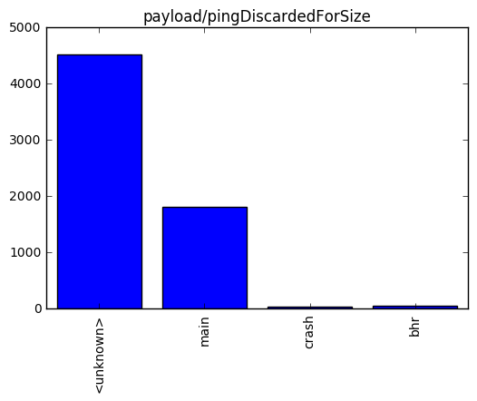
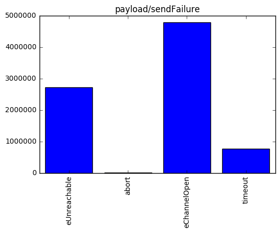
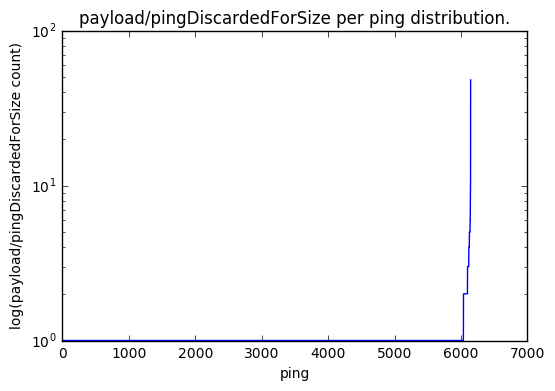
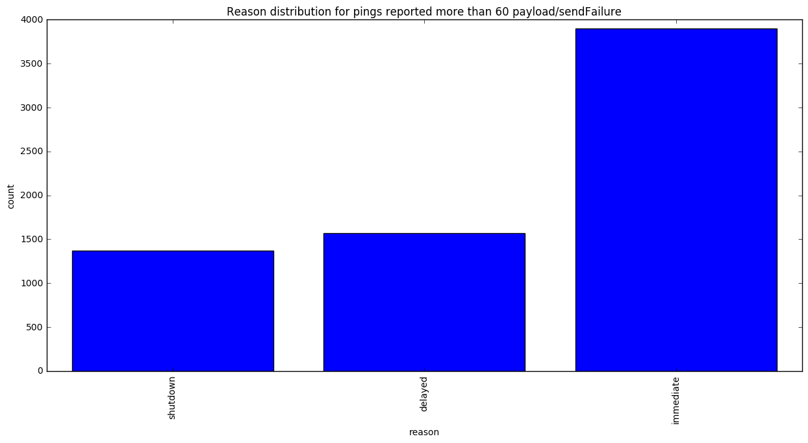
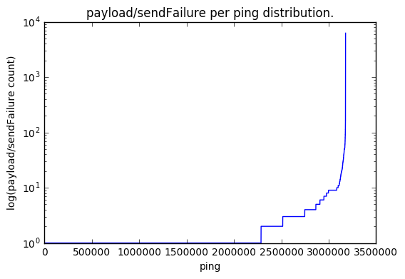
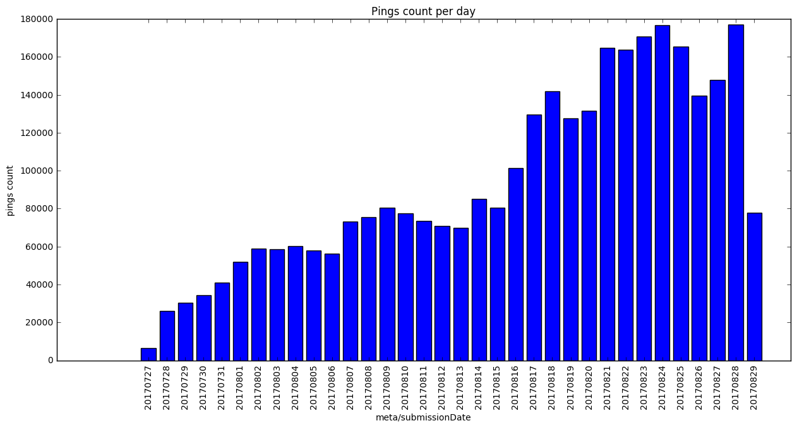
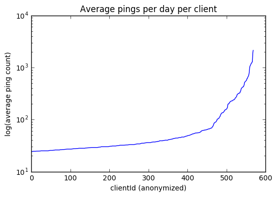
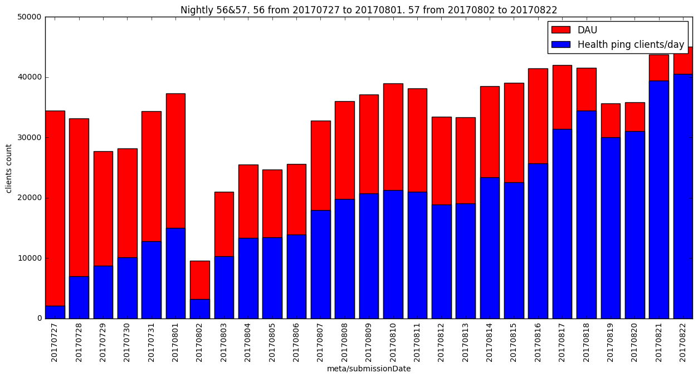

```python
import ujson as json
import matplotlib.pyplot as plt
import pandas as pd
import numpy as np
import plotly.plotly as py
import pandas as pd

from plotly.graph_objs import *
from moztelemetry import get_pings_properties, get_one_ping_per_client
from moztelemetry.dataset import Dataset
from collections import Counter
import operator

get_ipython().magic(u'matplotlib inline')
```

```python
pings = Dataset.from_source("telemetry") \
                .where(docType='health', appUpdateChannel="nightly") \
                .records(sc, sample=1)
        
cachedData = get_pings_properties(pings, ["creationDate", "payload/pingDiscardedForSize", "payload/sendFailure", 
                                             "clientId", "meta/submissionDate", "payload/os", "payload/reason", "application/version"]).cache()
```
    fetching 522.25817MB in 132777 files...


```python
cachedDataNightly57 = cachedData.filter(lambda ping: ping["meta/submissionDate"] > '20170801').cache()
```
# Nightly 56 & 57. Compute failures stats for each failure: sendFailure, discardedForSize. 

* for sendFailure stats include health ping count per failure type
* for discardedForSize stats include health ping count per ping type


```python
def aggregateFailures(first, second):
    if first is None:
        return second
    if second is None:
        return first
    
    res = first
    for k, v in second.items():
        if isinstance(v, int):
            if k in res:
                res[k] += v
            else: 
                res[k] = v;
    return res
```

```python
# return array of pairs [(failureName, {failureStatistic: count, ....}), ...]
# e.g. [(discardedForSize, {"main": 3, "crash": 5}), (sendFailure, {"timeout" : 34})]
def getFailuresStatPerFailureName(pings, failureNames):
    def reduceFailure(failureName):
        return pings.map(lambda p: p[failureName]).reduce(aggregateFailures)
    
    return [(name, reduceFailure(name)) for name in failureNames]
```

```python
failuresNames = ["payload/pingDiscardedForSize", "payload/sendFailure"]
```

```python
result = cachedData.map(lambda p: p['payload/pingDiscardedForSize']).filter(lambda p: p != None).collect()
```

```python
failuresStat = getFailuresStatPerFailureName(cachedData, failuresNames)
for fs in failuresStat:
    plt.title(fs[0])
    plt.bar(range(len(fs[1])), fs[1].values(), align='center')
    plt.xticks(range(len(fs[1])), fs[1].keys(), rotation=90)
    plt.show()
    print fs
```





    ('payload/pingDiscardedForSize', {u'<unknown>': 4523, u'main': 1810, u'crash': 35, u'bhr': 49})





    ('payload/sendFailure', {u'eUnreachable': 2725838, u'abort': 13191, u'eChannelOpen': 4789989, u'timeout': 771011})


Unknown currently represent all oversized pending pings. (https://bugzilla.mozilla.org/show_bug.cgi?id=1384903)

# Nightly 57. Compute failures stats for each failure: sendFailure, discardedForSize.

* for sendFailure stats include health ping count per failure type
* for discardedForSize stats include health ping count per ping type


```python
failuresStat = getFailuresStatPerFailureName(cachedDataNightly57, failuresNames)
for fs in failuresStat:
    plt.title(fs[0])
    plt.bar(range(len(fs[1])), fs[1].values(), align='center')
    plt.xticks(range(len(fs[1])), fs[1].keys(), rotation=90)
    plt.show()
    print fs
```


    ('payload/pingDiscardedForSize', {u'<unknown>': 4523, u'main': 1657, u'crash': 29, u'bhr': 49})


    ('payload/sendFailure', {u'eUnreachable': 2565221, u'abort': 12709, u'eChannelOpen': 4510507, u'timeout': 736047})


# Nightly 56 & 57. sendFailures/discardedForSize per ping.


```python
import matplotlib.dates as mdates
def plotlistofTuples(listOfTuples, title="", inColor='blue'):
    keys = [t[0] for t in listOfTuples]
    values = [t[1] for t in listOfTuples]

    plt.figure(1)
    fig = plt.gcf()
    fig.set_size_inches(15, 7)

    plt.title(title)
    plt.gca().xaxis.set_major_formatter(mdates.DateFormatter('%m/%d/%Y'))
    plt.bar(range(len(listOfTuples)), values, align='center', color=inColor)
    plt.xticks(range(len(listOfTuples)), keys, rotation=90)
```

```python
EXPECTED_SENDFAILURES_COUNT = 60
def failureCountReasonPerPing(pings, failureName):
    pingsWithSendFailure = pings.filter(lambda ping: ping[failureName] != None) 
    return pingsWithSendFailure.map(lambda ping: (sum(ping[failureName].values()), ping["payload/reason"])).collect()

def describefailureDistribution(sendFailureCountDistr, failureName):
    failuresCount = [k for k, v in sendFailureCountDistr]
    pingsPerDaySeries = pd.Series(failuresCount)
    print pingsPerDaySeries.describe([.25, .5, .75, .95])
    
    plt.title(failureName + " per ping distribution.")
    plt.yscale('log')
    plt.ylabel('log(' + failureName + ' count)')
    plt.xlabel('ping')
    plt.plot(sorted(failuresCount))
    plt.show()

def decribeReasonDistribution(sendFailureCountDistr, failureName):
    unexpectedPingsCount = [(k, v) for k, v in sendFailureCountDistr if k > EXPECTED_SENDFAILURES_COUNT]
    print "Pings reported more than " + str(EXPECTED_SENDFAILURES_COUNT) + " " + str(len(unexpectedPingsCount))
    
    if len(unexpectedPingsCount) != 0:
        reasonStat = Counter([v for k, v in unexpectedPingsCount])  
        plotlistofTuples(reasonStat.items(), title="Reason distribution for pings reported more than " + str(EXPECTED_SENDFAILURES_COUNT) + " " + failureName)
        plt.xlabel('reason') 
        plt.ylabel('count')
        plt.show()


def describe(pings, failure):
    print "\n COMPUTATION FOR " + failure + "\n"
    countAndReason = failureCountReasonPerPing(pings, failure)
    decribeReasonDistribution(countAndReason, failure) 
    describefailureDistribution(countAndReason, failure)

```

```python
for f in failuresNames:
    describe(cachedData, f) 
```
    
     COMPUTATION FOR payload/pingDiscardedForSize
    
    Pings reported more than 60 0
    count    6146.000000
    mean        1.044094
    std         0.696504
    min         1.000000
    25%         1.000000
    50%         1.000000
    75%         1.000000
    95%         1.000000
    max        48.000000
    dtype: float64





    
     COMPUTATION FOR payload/sendFailure
    
    Pings reported more than 60 6831





    count    3.177612e+06
    mean     2.612034e+00
    std      1.191218e+01
    min      1.000000e+00
    25%      1.000000e+00
    50%      1.000000e+00
    75%      2.000000e+00
    95%      9.000000e+00
    max      6.237000e+03
    dtype: float64





# Nightly 56 & 57. Validate payload
Check that:
* required fields are non-empty.
* payload/reason contains only expected values ("immediate", "delayed", "shutdown").
* payload/sendFailure and payload/discardedForSize are non empty together.
* count paramter in payload/sendFailure and payload/discardedForSize has type int.
* sendFailureType contains only expected values ("eOK", "eRequest", "eUnreachable", "eChannelOpen", "eRedirect", "abort", "timeout").
* payload/discardedForSize contains only 10 records.
* check the distribution of sendFailures (sum) per ping. We expected to have this number not more than 60. 


```python
def validate(ping):
    OK = ""
    MUST_NOT_BE_EMPTY = "must not be empty"

    # validate os
    clientId = ping["clientId"]
    
    if clientId == None:
        return ("clientId " + MUST_NOT_BE_EMPTY, ping)
    
    os = ping["payload/os"]
    if os == None:
        return ("OS " + MUST_NOT_BE_EMPTY, ping)

    name, version = os.items()
    if name == None:
        return ("OS name " + MUST_NOT_BE_EMPTY, ping)
    if version == None:
        return ("OS version " + MUST_NOT_BE_EMPTY, ping)
    
    # validate reason
    reason = ping["payload/reason"]
    if reason == None:
        return ("Reason " + MUST_NOT_BE_EMPTY, ping)
    
    if not reason in ["immediate", "delayed", "shutdown"]:
        return ("Reason must be equal to immediate, delayed or shutdown", ping)
    
    # doesn't contain failures
    sendFailure = ping["payload/sendFailure"]
    pingDiscardedForSize = ping["payload/pingDiscardedForSize"]
    if sendFailure == None and pingDiscardedForSize == None:
        return ("Ping must countain at least one of the failures", ping)

    
    # validate sendFailure
    supportedFailureTypes = ["eOK", "eRequest", "eUnreachable", "eChannelOpen", "eRedirect", "abort", "timeout"]
    if sendFailure != None and len(sendFailure) > len(supportedFailureTypes):
        return ("send Failure accept only 8 send failures", ping)
    
    if sendFailure != None:
        for key in sendFailure.keys():
            if not key in supportedFailureTypes:
                return (key + " type is not supported", ping)
        for count in sendFailure.values():
            if not isinstance(count, int):
                return ("Count must be int type", ping)
        if sum(sendFailure.values()) > 60:
            return ("sendFailure count must not be more than 60", ping)

    
     # validate pingDiscardedForSize
    if pingDiscardedForSize != None:
        if len(pingDiscardedForSize) > 10:
            return ("pingDicardedForSize accept only top ten pings types", ping)
        for count in pingDiscardedForSize.values():
            if not isinstance(count, int):
                return ("Count must be int type", ping)
    
    return (OK, ping)

# retrieve all needed fields 
validatedData = cachedData.map(validate)   
errorsPerProblem = validatedData.countByKey()   
errorsPerProblem
```


    defaultdict(int,
                {'': 3176610, 'sendFailure count must not be more than 60': 6831})


# Nightly 56 & 57. Investigate errors


```python
def printOSReason(data):
    return "os: " + str(data[0]) + " reason: " + str(data[1])

def osAndReasonForErros(error):
    result = validatedData.filter(lambda pair: pair[0] == error).map(lambda pair: (pair[1]["payload/os"], pair[1]["payload/reason"])).collect()
    return result[:min(10, len(result))]
  
print "Show only 10 info lines per problem \n"
for err in errorsPerProblem.keys():
    if err != '':
        print err
        print "\n".join(map(printOSReason, osAndReasonForErros(err)))
        print "\n"
```
    Show only 10 info lines per problem 
    
    sendFailure count must not be more than 60
    os: {u'version': u'10.0', u'name': u'WINNT'} reason: immediate
    os: {u'version': u'6.1', u'name': u'WINNT'} reason: delayed
    os: {u'version': u'10.0', u'name': u'WINNT'} reason: immediate
    os: {u'version': u'10.0', u'name': u'WINNT'} reason: immediate
    os: {u'version': u'10.0', u'name': u'WINNT'} reason: immediate
    os: {u'version': u'6.1', u'name': u'WINNT'} reason: immediate
    os: {u'version': u'6.1', u'name': u'WINNT'} reason: delayed
    os: {u'version': u'10.0', u'name': u'WINNT'} reason: immediate
    os: {u'version': u'6.1', u'name': u'WINNT'} reason: shutdown
    os: {u'version': u'10.0', u'name': u'WINNT'} reason: immediate
    
    


# Nightly 56 & 57. Compute pings count per day
This includes showing diagrams and printing stats


```python
from datetime import datetime

def pingsCountPerDay(pings):
    return pings.map(lambda ping: ping["meta/submissionDate"]).countByValue()

resultDictionary = pingsCountPerDay(cachedData)
```

```python
import matplotlib.dates as mdates
def plotlistofTuples(listOfTuples, title="", inColor='blue'):
    keys = [t[0] for t in listOfTuples]
    values = [t[1] for t in listOfTuples]

    plt.figure(1)
    fig = plt.gcf()
    fig.set_size_inches(15, 7)

    plt.title(title)
    plt.gca().xaxis.set_major_formatter(mdates.DateFormatter('%m/%d/%Y'))
    plt.bar(range(len(listOfTuples)), values, align='center', color=inColor)
    plt.xticks(range(len(listOfTuples)), keys, rotation=90)

```

```python
plotlistofTuples(sorted(resultDictionary.items(), key=lambda tup: tup[0]), "Pings count per day") 
plt.xlabel('meta/submissionDate') 
plt.ylabel('pings count')
plt.show()
```





```python
pingsPerDaySeries = pd.Series(resultDictionary.values())
pingsPerDaySeries.describe([.25, .5, .75, .95])
```


    count        34.000000
    mean      93630.617647
    std       49146.705206
    min        6475.000000
    25%       58565.750000
    50%       77670.500000
    75%      137599.500000
    95%      172715.950000
    max      176918.000000
    dtype: float64


# Nightly 56 & 57. Compute how many clients are reporting


```python
def getClients(pings):
    clients = pings.map(lambda ping: ping["clientId"]).distinct()
    return clients.collect()
```

```python
print str(len(getClients(cachedData))) + " clients are reporting health ping."
```
    148428 clients are reporting health ping.


# Nightly 56 & 57. Compute average number of pings per client per day

* We expect at most 24 pings per day as we send no more than one "health" ping per hour
* This includes showing diagrams and printing stats


```python
from collections import Counter

def getAvgPerDate(iterable):
    aggregare = Counter(iterable)
    result = sum(aggregare.values()) * 1.0 / len(aggregare)
    return result

def pingsPerClientPerDay(pings, date):
    return pings.map(lambda ping: (ping["clientId"], ping[date])).groupByKey()

def avgPingsPerClientPerDay(pings, date):
    idDateRDD = pingsPerClientPerDay(pings, date)
    return idDateRDD.map(lambda pair: getAvgPerDate(pair[1])).collect()
```

```python
def plotAvgPingPerDateDistr(pings, date):
    PINGS_COUNT_PER_DAY = 24
    resultDistributionList = avgPingsPerClientPerDay(pings, date)
    values = [v for v in resultDistributionList if v > PINGS_COUNT_PER_DAY]
    print date + " - clients sending too many \"health\" pings per day - " + str(len(values))
    if len(values) > 0:
        plt.title("Average pings per day per client")
        plt.ylabel('log(average ping count)')
        plt.xlabel("clientId (anonymized)")
        plt.yscale('log')
        plt.plot(sorted(values))  
        plt.show()
```

```python
plotAvgPingPerDateDistr(cachedData, "meta/submissionDate")
plotAvgPingPerDateDistr(cachedData, "creationDate")
```
    meta/submissionDate - clients sending too many "health" pings per day - 569





    creationDate - clients sending too many "health" pings per day - 0


Turns out, clients submit health pings properly (less that 24/day) but we get them on server with some delay

# Nightly 56 & 57. Daily active Health ping clients against DAU

DAU57, DAU56 from re:dash https://sql.telemetry.mozilla.org/queries/15337/source#table


```python
DAU57 = [('20170802', 9497), ('20170803', 20923), ('20170804', 25515), ('20170805', 24669), ('20170806', 25604), \
         ('20170807', 32762), ('20170808', 36011), ('20170809', 37101), ('20170810', 38934), ('20170811', 38128), \
         ('20170812', 33403), ('20170813', 33301), ('20170814', 38519), ('20170815', 39053), ('20170816', 41439), \
         ('20170817', 41982), ('20170818', 41557), ('20170819', 35654), ('20170820', 35820), ('20170821', 43760), \
         ('20170822', 45038)]
DAU56 = [('20170727', 34419), ('20170728', 33142), ('20170729', 27740), ('20170730', 28194), ('20170731', 34340), ('20170801', 37308)]
```

```python
def getClientsPerDay(pings, version, dateFrom, dateTo):
    clientsPerDay = pings.filter(lambda ping: ping["application/version"] == version) \
        .map(lambda ping: (ping["meta/submissionDate"], ping["clientId"])) \
        .groupByKey() \
        .map(lambda pair: (pair[0], len(set(pair[1])))).collect()
        
    return filter(lambda pair: pair[0] >= dateFrom and pair[0] <= dateTo, clientsPerDay)

filtered57 = getClientsPerDay(cachedData, '57.0a1', '20170801', '20170822')
filtered56 = getClientsPerDay(cachedData, '56.0a1', '20170727', '20170801')
```

```python
plotlistofTuples(sorted(DAU56 + DAU57), inColor='red')
plotlistofTuples(sorted(filtered56 + filtered57), "Nightly 56&57. 56 from 20170727 to 20170801. 57 from 20170802 to 20170822")
plt.legend(['DAU', 'Health ping clients/day'])
plt.xlabel('meta/submissionDate') 
plt.ylabel('clients count')
```


    <matplotlib.text.Text at 0x7fe88652ccd0>





Conclusion: Almost half of the DAU submits health ping. It is seemsed to be because of sendFailure types: eChannelOpen and eUnreachable. 

* eChannelOpen - This error happen when we failed to open channel, maybe it is better to avoid closing the channel and reuse existed channels instead. 

* eUnreachable - Probably internet connection problems. 


```python

```
