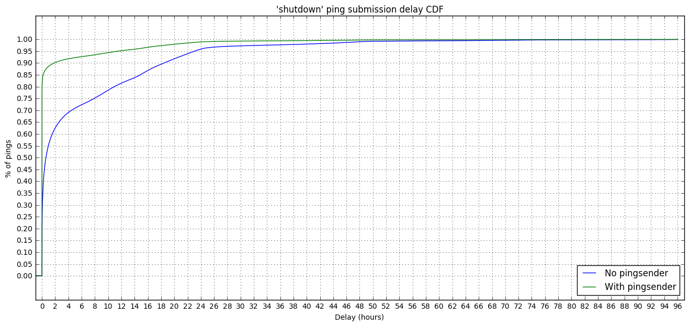
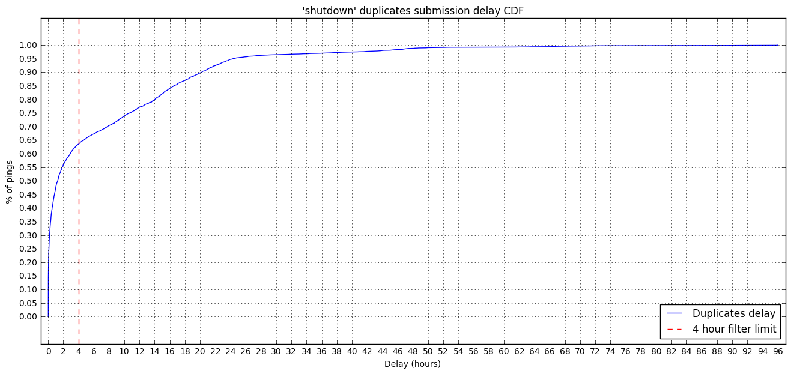
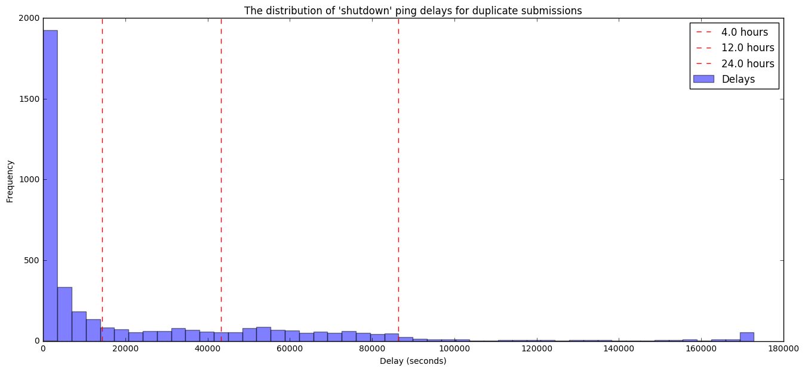
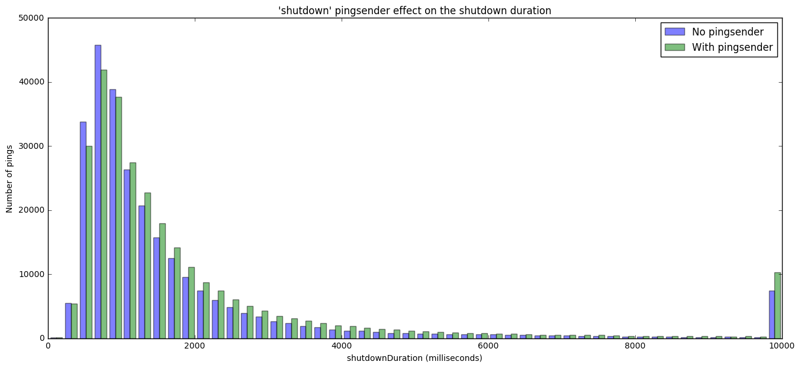

### Main Ping Submission and Recording Delays - pingSender

This analysis is an adaptation of [the one](http://reports.telemetry.mozilla.org/post/projects/crash_ping_delays_pingSender.kp) performed on crash pings to validate the effectiveness of the pingsender to reduce data latency.

Specifically, this one investigates the difference between typical values of "recording delay" and "submission delay" before and after [pingSender started sending "shutdown" pings](https://bugzilla.mozilla.org/show_bug.cgi?id=1356673).


```python
import ujson as json
import matplotlib.pyplot as plt
import pandas as pd
import numpy as np
import plotly.plotly as py
import IPython

from datetime import datetime, timedelta
from email.utils import parsedate_tz, mktime_tz, formatdate

from plotly.graph_objs import *
from moztelemetry import get_pings_properties, get_one_ping_per_client
from moztelemetry.dataset import Dataset

%matplotlib inline
IPython.core.pylabtools.figsize(16, 7)
```
    Unable to parse whitelist (/mnt/anaconda2/lib/python2.7/site-packages/moztelemetry/histogram-whitelists.json). Assuming all histograms are acceptable.


We'll be looking at two cohorts: April 2-8 and April 30 - May 6. The `pingsender` started sending `shudown` pings on the 14th of April, but due to some crashes we disabled it shortly after. We enabled sending the `shutdown` ping using the pingsender, again, on the 28th of April.

We will examing two cohorts: the first with `shutdown` pings sent without the `pingsender`, the second with `shutdown` pings sent with the `pingsender`.


```python
pre_pings = Dataset.from_source("telemetry") \
    .where(docType="main") \
    .where(appUpdateChannel="nightly") \
    .where(submissionDate=lambda x: "20170402" <= x < "20170408") \
    .where(appBuildId=lambda x: "20170402" <= x < "20170408") \
    .records(sc, sample=1)

post_pings = Dataset.from_source("telemetry") \
    .where(docType="main") \
    .where(appUpdateChannel="nightly") \
    .where(submissionDate=lambda x: "20170430" <= x < "20170506") \
    .where(appBuildId=lambda x: "20170430" <= x < "20170506") \
    .records(sc, sample=1)
```
To look at delays, we need to look at times. There are a lot of times, and they are recorded relative to different clocks.

**`meta/creationTimestamp`** The time the Telemetry code in Firefox created the ping, according to the client's clock, in nanoseconds since the epoch.

**`meta/Date`** - The time the Telemetry code in Firefox sent the ping to the server, according to the client's clock, expressed as a Date string conforming to [RFC 7231](https://tools.ietf.org/html/rfc7231#section-7.1.1.1).

**`meta/Timestamp`** - The time the ping was received by the server, according to the server's
clock, expressed in nanoseconds since the epoch.


```python
pre_subset = get_pings_properties(pre_pings, ["application/channel",
                                              "id",
                                              "meta/creationTimestamp",
                                              "meta/Date",
                                              "meta/Timestamp",
                                              "meta/X-PingSender-Version",
                                              "payload/info/reason",
                                              "payload/simpleMeasurements/shutdownDuration"])

post_subset = get_pings_properties(post_pings, ["application/channel",
                                                "id",
                                                "meta/creationTimestamp",
                                                "meta/Date",
                                                "meta/Timestamp",
                                                "meta/X-PingSender-Version",
                                                "payload/info/reason",
                                                "payload/simpleMeasurements/shutdownDuration"])
```
The `shutdown` ping is a particular kind of `main` ping with the `reason` field set to `shutdown`, as it's saved during shutdown.


```python
pre_subset = pre_subset.filter(lambda p: p.get("payload/info/reason") == "shutdown")
post_subset = post_subset.filter(lambda p: p.get("payload/info/reason") == "shutdown")
```
The rest of the analysis is cleaner if we combine the two cohorts here.


```python
def add_pre(p):
    p['pre'] = 'pre'
    return p

def add_post(p):
    p['pre'] = 'post'
    return p

combined = pre_subset.map(add_pre).union(post_subset.map(add_post))
```
Quick normalization: ditch any ping that doesn't have a creationTimestamp or Timestamp:


```python
prev_count = combined.count()
combined = combined.filter(lambda p:\
                       p["meta/Timestamp"] is not None\
                       and p["meta/creationTimestamp"] is not None)
filtered_count = combined.count()
print "Filtered {} of {} pings ({:.2f}%)"\
    .format(prev_count - filtered_count, prev_count, 100.0 * (prev_count - filtered_count) / prev_count)
```
    Filtered 0 of 570853 pings (0.00%)


##### Deduplication
We sometimes receive main pings more than once (identical document ids). This is usually low, but let's check if this is still true after using the pingsender.

So we'll dedupe here.


```python
def dedupe(pings):
    return pings\
            .map(lambda p: (p["id"], p))\
            .reduceByKey(lambda a, b: a if a["meta/Timestamp"] < b["meta/Timestamp"] else b)\
            .map(lambda pair: pair[1])

combined_deduped = dedupe(combined)
```

```python
combined_count = combined.count()
combined_deduped_count = combined_deduped.count()
print "Filtered {} of {} shutdown pings ({:.2f}%)"\
    .format(combined_count - combined_deduped_count, combined_count,
            100.0 * (combined_count - combined_deduped_count) / combined_count)
```
    Filtered 6136 of 570853 shutdown pings (1.07%)


We'll be plotting Cumulative Distribution Functions today.


```python
MAX_DELAY_S = 60 * 60 * 96.0
HOUR_IN_S = 60 * 60.0
PRES = ['pre', 'post']
```

```python
def setup_plot(title, max_x, area_border_x=0.1, area_border_y=0.1):
    plt.title(title)
    plt.xlabel("Delay (hours)")
    plt.ylabel("% of pings")

    plt.xticks(range(0, int(max_x) + 1, 2))
    plt.yticks(map(lambda y: y / 20.0, range(0, 21, 1)))

    plt.ylim(0.0 - area_border_y, 1.0 + area_border_y)
    plt.xlim(0.0 - area_border_x, max_x + area_border_x)

    plt.grid(True)

def plot_cdf(data):
    sortd = np.sort(data)
    ys = np.arange(len(sortd))/float(len(sortd))

    plt.plot(sortd, ys)
```

```python
def calculate_submission_delay(p):
    created = datetime.fromtimestamp(p["meta/creationTimestamp"] / 1000.0 / 1000.0 / 1000.0)
    received = datetime.fromtimestamp(p["meta/Timestamp"] / 1000.0 / 1000.0 / 1000.0)
    sent = datetime.fromtimestamp(mktime_tz(parsedate_tz(p["meta/Date"]))) if p["meta/Date"] is not None else received
    clock_skew = received - sent
    
    return (received - created - clock_skew).total_seconds()
```

```python
delays_by_chan = combined_deduped.map(lambda p: (p["pre"], calculate_submission_delay(p)))
```
### Submission Delay

**Submission Delay** is the delay between the data being recorded on the client and it being received by our infrastructure. It is thought to be dominated by the length of time Firefox isn't open on a client's computer, though retransmission attempts and throttling can also contribute.


```python
setup_plot("'shutdown' ping submission delay CDF", MAX_DELAY_S / HOUR_IN_S, area_border_x=1.0)

for pre in PRES:
    plot_cdf(delays_by_chan\
             .filter(lambda d: d[0] == pre)\
             .map(lambda d: d[1] / HOUR_IN_S if d[1] < MAX_DELAY_S else MAX_DELAY_S / HOUR_IN_S)\
             .collect())
    
plt.legend(["No pingsender", "With pingsender"], loc="lower right")
```


    <matplotlib.legend.Legend at 0x7fd034c91ad0>





The use of `pingsender` results in an improvement in the submission delay of the `shutdown` "main" ping. We receive almost 85% of the mentioned pings as soon as they are generated, instead of just ~30% within the first hour.

We don't receive 100% of the pings sooner for builds having the `pingsender` enabled because the `pingsender` can fail submitting the ping (e.g. the system or Firefox uses a proxy, poor connection, ...) and, when this happen, no retrasmission is attempted; the ping will be sent on the next restart by Firefox.

## How many duplicates come from the pingsender?
Let's start by separating the pings coming from the `pingsender` from the ones coming from the normal Firefox flow since the `pingsender` started sending the `shutdown` pings. 


```python
post_pingsender_only = post_subset.filter(lambda p: p.get("meta/X-PingSender-Version") is not None)
post_no_pingsender = post_subset.filter(lambda p: p.get("meta/X-PingSender-Version") is None)
```

```python
num_from_pingsender = post_pingsender_only.count()
num_no_pingsender = post_no_pingsender.count()
total_post = post_subset.count()
num_sent_by_both =\
    post_pingsender_only.map(lambda p: p["id"]).intersection(post_no_pingsender.map(lambda p: p["id"])).count()
```
We want to understand how many pings were sent by the pingsender, correctly received from the server, and sent again next time Firefox starts.


```python
def pct(a, b):
    return 100 * float(a) / b

print("Duplicate pings percentage: {:.2f}%".format(pct(num_sent_by_both, total_post)))
```
    Duplicate pings percentage: 1.38%


Do we get many more duplicates after landing the `shutdown pingsender`?


```python
count_deduped_pre = dedupe(pre_subset).count()
count_pre = pre_subset.count()
count_deduped_post = dedupe(post_subset).count()
count_post = post_subset.count()

print("Duplicates with shutdown pingsender:\nBefore:\t{:.2f}%\nAfter:\t{:.2f}%\n"\
      .format(pct(count_pre - count_deduped_pre, count_pre),
              pct(count_post - count_deduped_post, count_post)))
```
    Duplicates with shutdown pingsender:
    Before:	0.50%
    After:	1.61%
    


It looks like 1% of the pings sent by the `pingsender` are also being sent by Firefox next time it restarts. This is potentially due to `pingsender`:

- being terminated after sending the ping but before successfully deleting the ping from the disk;
- failing to remove the ping from the disk after sending it;
- receiving an error code from the server even when the ping was successfully sent.

It's important to note that the percentages of duplicate pings from the previous cells are not the same. The first, 1.38%, is the percentage of duplicates that were sent at least once by pingsender whereas the last, 1.61%, includes all duplicates regardless of whether pingsender was involved.

## What's the delay between duplicate submissions?
Start off by getting the pings that were sent by both the `pingsender` and the normal Firefox flow. This is basically mimicking an `intersectByKey`, which is not available on pySpark.


```python
pingsender_dupes = post_pingsender_only\
    .map(lambda p: (p["id"], calculate_submission_delay(p)))\
    .cogroup(post_no_pingsender\
           .map(lambda p: (p["id"], calculate_submission_delay(p))))\
    .filter(lambda p: p[1][0] and p[1][1])\
    .map(lambda p: (p[0], (list(p[1][0]), list(p[1][1]))))
```
The `pingsender_dupes` RDD should now contain only the data for the pings sent by both systems. Each entry is in the form:

`{ping-id: ([ delays for duplicates from the pingsender ], [delays for duplicates by FF])}`

We assume that the `pingsender` only sends a ping once and that Firefox might attempt to send more than once, hence might have more than one ping delay in its list. Let's see if these claims hold true.


```python
pingsender_dupes.first()
```


    (u'77426bfe-4b24-4c81-b4ae-a8de2ee56736', ([-0.457], [3846.543]))


```python
# Number of duplicates, for each duped ping, from the pingsender.
print pingsender_dupes.map(lambda p: len(p[1][0])).countByValue()
# Number of duplicates, for each duped ping, from Firefox.
print pingsender_dupes.map(lambda p: len(p[1][1])).countByValue()
```
    defaultdict(<type 'int'>, {1: 4067, 2: 2})
    defaultdict(<type 'int'>, {1: 4053, 2: 15, 3: 1})


It seems that the `pingsender` can, sometimes, send the ping more than once. That's unexpected, but it has a relatively low occurrence (just twice over 4069 duplicated pings). The same issue can be seen with Firefox, with the occurrence being a little higher.

Finally, compute the average delay between the duplicates from the `pingsender` and Firefox.


```python
delay_between_duplicates =\
    pingsender_dupes.map(lambda t: np.fabs(np.max(t[1][1]) - np.min(t[1][0])))
```

```python
setup_plot("'shutdown' duplicates submission delay CDF", MAX_DELAY_S / HOUR_IN_S, area_border_x=1.0)

plot_cdf(delay_between_duplicates\
         .map(lambda d: d / HOUR_IN_S if d < MAX_DELAY_S else MAX_DELAY_S / HOUR_IN_S)\
         .collect())
plt.axvline(x=4, ymin=0.0, ymax = 1.0, linewidth=1, linestyle='dashed', color='r')
plt.legend(["Duplicates delay", "4 hour filter limit"], loc="lower right")
```


    <matplotlib.legend.Legend at 0x7fd02e6807d0>





About ~65% of the duplicates can be caught by the deduplicator because they will arrive within a 4 hour window.


```python
collected_delays = delay_between_duplicates.collect()
```

```python
plt.title("The distribution of 'shutdown' ping delays for duplicate submissions")
plt.xlabel("Delay (seconds)")
plt.ylabel("Frequency")

# Use 50 bins for values up to the clip value, and accumulate the
# rest in the last bucket (instead of having a super-long tail).
plt.hist(np.clip(collected_delays, 0, 48.0 * HOUR_IN_S),
         alpha=0.5, bins=50, label="Delays")
# Plot some convenience marker for 4, 12 and 24 hours.
for m in [4.0, 12.0, 24.0]:
    plt.axvline(x=m * HOUR_IN_S, ymin=0.0, ymax = 1.0, linewidth=1, linestyle='dashed', color='r',
                label="{} hours".format(m))
plt.legend()
```


    <matplotlib.legend.Legend at 0x7fd02e1a8390>





## Did we regress shutdownDuration?
The `shutdownDuration` is [defined](https://gecko.readthedocs.io/en/latest/toolkit/components/telemetry/telemetry/data/main-ping.html#shutdownduration) as the time it takes to complete the Firefox shutdown process, in milliseconds. Extract the data from the two series: before the shutdown pingsender was enabled and after. Plot the data as two distinct distributions on the same plot.


```python
pre_shutdown_durations = pre_subset.map(lambda p: p.get("payload/simpleMeasurements/shutdownDuration", None))\
                                   .filter(lambda p: p is not None)\
                                   .collect()
post_shutdown_durations = post_subset.map(lambda p: p.get("payload/simpleMeasurements/shutdownDuration", None))\
                                     .filter(lambda p: p is not None)\
                                     .collect()
```

```python
plt.title("'shutdown' pingsender effect on the shutdown duration")
plt.xlabel("shutdownDuration (milliseconds)")
plt.ylabel("Number of pings")

# Use 50 bins for values up to the clip value, and accumulate the
# rest in the last bucket (instead of having a super-long tail).
CLIP_VALUE = 10000 # 10s
plt.hist([np.clip(pre_shutdown_durations, 0, CLIP_VALUE), np.clip(post_shutdown_durations, 0, CLIP_VALUE)],
         alpha=0.5, bins=50, label=["No pingsender", "With pingsender"])
plt.legend()
```


    <matplotlib.legend.Legend at 0x7fd02f2ce250>





It seems that the distribution of shutdown durations for builds with the pingsender enabled has a different shape compared to the distribution of shutdown durations for builds with no pingsender. The former seems to be a bit shifted toward higher values of the duration times. The same trend can be spotted on [TMO](https://mzl.la/2qobTpj).

Let's dig more into this by looking at some statistics about the durations.


```python
def stats(data, label):
    print("\n{}\n".format(label))
    print("Min:\t{}".format(np.min(data)))
    print("Max:\t{}".format(np.max(data)))
    print("Average:\t{}".format(np.mean(data)))
    print("50, 90 and 99 percentiles:\t{}\n".format(np.percentile(data, [0.5, 0.9, 0.99])))

stats(pre_shutdown_durations, "No pingsender (ms)")
stats(post_shutdown_durations, "With pingsender (ms)")
```
    
    No pingsender (ms)
    
    Min:	25
    Max:	146671322
    Average:	8797.70181773
    50, 90 and 99 percentiles:	[ 351.  374.  378.]
    
    
    With pingsender (ms)
    
    Min:	19
    Max:	94115063
    Average:	7670.99524021
    50, 90 and 99 percentiles:	[ 352.  377.  382.]
    


It seems that builds that are sending `shutdown` pings at shutdown are taking up to about 4ms more to close.


```python

```
