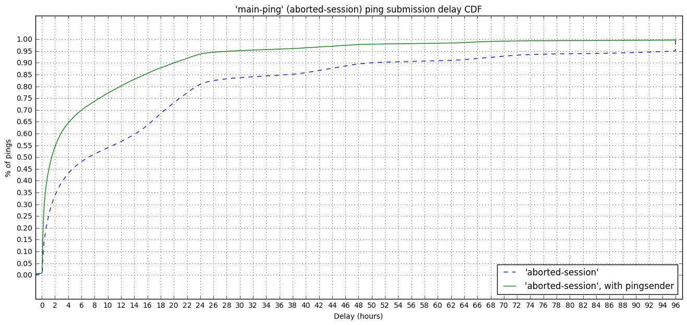
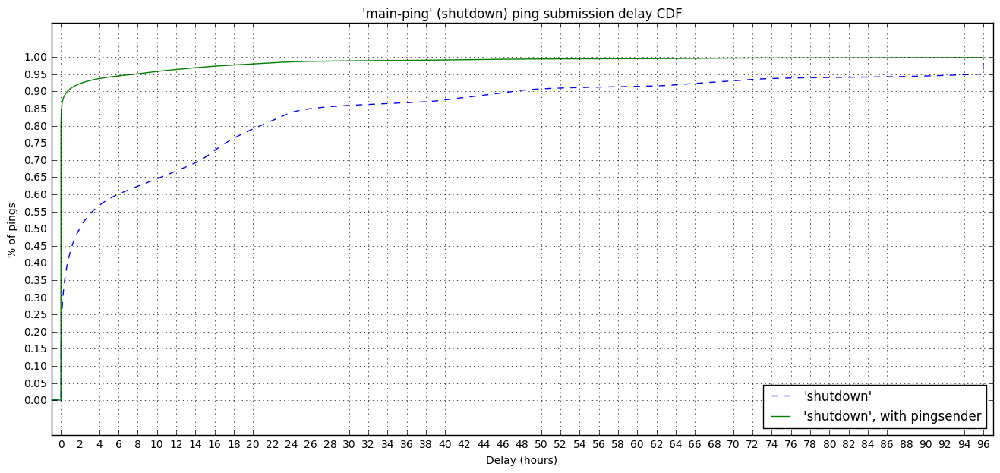
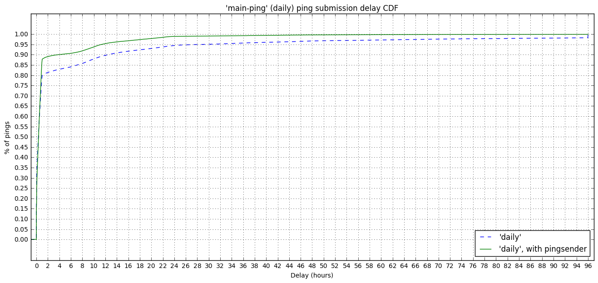
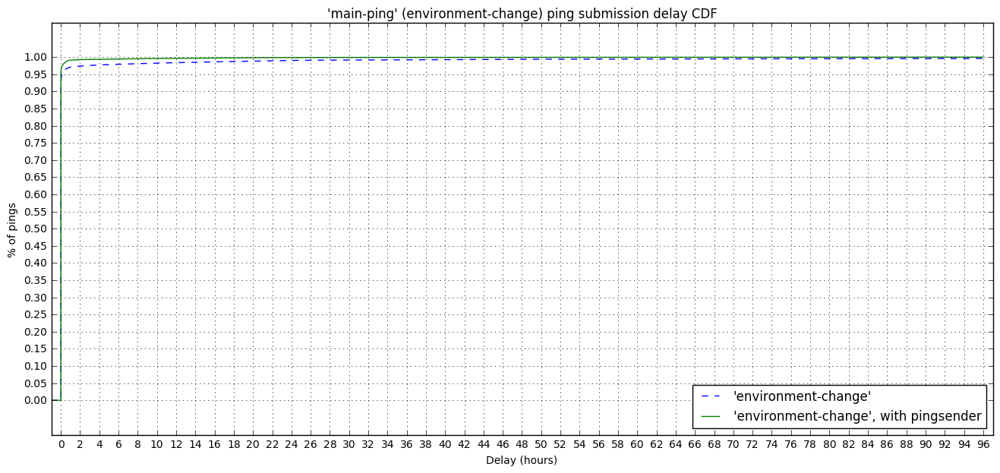
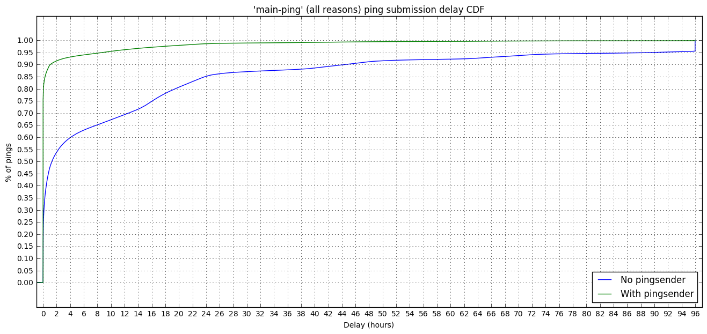

### Main Ping Submission Delay (Beta Channel)

In this notebook we extend the `shutdown main-ping` submission delay analysis done [here](http://reports.telemetry.mozilla.org/post/projects/main_ping_delays_pingsender_beta.kp), for Firefox Beta, to all the `main-ping` types regardless of their `reason` (i.e. `shutdown`, `daily`, ...).

Specifically, this one investigates the difference between typical values "submission delay" between the previous Beta build and the latest one. The latter includes the [pingSender that started sending "shutdown" pings](https://bugzilla.mozilla.org/show_bug.cgi?id=1356673).


```python
import ujson as json
import matplotlib.pyplot as plt
import pandas as pd
import numpy as np
import plotly.plotly as py
import IPython

from datetime import datetime, timedelta
from email.utils import parsedate_tz, mktime_tz, formatdate

from plotly.graph_objs import *
from moztelemetry import get_pings_properties, get_one_ping_per_client
from moztelemetry.dataset import Dataset

%matplotlib inline
IPython.core.pylabtools.figsize(16, 7)
```
We'll be looking at two cohorts: May 31 - June 7 (Beta 54, no `pingsender`) and June 14 - 20 (Beta 55, with the `pingsender` sending `shutdown` pings). The `pingsender` started sending `shudown` pings in Beta 55.


```python
pre_pings = Dataset.from_source("telemetry") \
    .where(docType="main") \
    .where(appUpdateChannel="beta") \
    .where(submissionDate=lambda x: "20170531" <= x < "20170607") \
    .where(appBuildId=lambda x: "20170420" <= x < "20170611") \
    .records(sc, sample=1)

post_pings = Dataset.from_source("telemetry") \
    .where(docType="main") \
    .where(appUpdateChannel="beta") \
    .where(submissionDate=lambda x: "20170614" <= x < "20170620") \
    .where(appBuildId=lambda x: "20170612" <= x < "20170622") \
    .records(sc, sample=1)
```
    fetching 1147169.41811MB in 39626 files...
    fetching 20894.21218MB in 8408 files...


To look at delays, we need to look at times. There are a lot of times, and they are recorded relative to different clocks.

**`meta/creationTimestamp`** The time the Telemetry code in Firefox created the ping, according to the client's clock, in nanoseconds since the epoch.

**`meta/Date`** - The time the Telemetry code in Firefox sent the ping to the server, according to the client's clock, expressed as a Date string conforming to [RFC 7231](https://tools.ietf.org/html/rfc7231#section-7.1.1.1).

**`meta/Timestamp`** - The time the ping was received by the server, according to the server's
clock, expressed in nanoseconds since the epoch.


```python
pre_subset = get_pings_properties(pre_pings, ["application/channel",
                                              "id",
                                              "meta/creationTimestamp",
                                              "meta/Date",
                                              "meta/Timestamp",
                                              "meta/X-PingSender-Version",
                                              "payload/info/reason",
                                              "payload/simpleMeasurements/shutdownDuration"])

post_subset = get_pings_properties(post_pings, ["application/channel",
                                                "id",
                                                "meta/creationTimestamp",
                                                "meta/Date",
                                                "meta/Timestamp",
                                                "meta/X-PingSender-Version",
                                                "payload/info/reason",
                                                "payload/simpleMeasurements/shutdownDuration"])
```
The rest of the analysis is cleaner if we combine the two cohorts here.


```python
def add_pre(p):
    p['pre'] = 'pre'
    return p

def add_post(p):
    p['pre'] = 'post'
    return p

combined = pre_subset.map(add_pre).union(post_subset.map(add_post))
```
Quick normalization: ditch any ping that doesn't have a creationTimestamp or Timestamp:


```python
prev_count = combined.count()
combined = combined.filter(lambda p:\
                       p["meta/Timestamp"] is not None\
                       and p["meta/creationTimestamp"] is not None)
filtered_count = combined.count()
print "Filtered {} of {} pings ({:.2f}%)"\
    .format(prev_count - filtered_count, prev_count, 100.0 * (prev_count - filtered_count) / prev_count)
```
    Filtered 0 of 42046459 pings (0.00%)


##### Deduplication
We sometimes receive main pings more than once (identical document ids). This is usually low, but let's check if this is still true after using the pingsender.

So we'll dedupe here.


```python
def dedupe(pings):
    return pings\
            .map(lambda p: (p["id"], p))\
            .reduceByKey(lambda a, b: a if a["meta/Timestamp"] < b["meta/Timestamp"] else b)\
            .map(lambda pair: pair[1])

combined_deduped = dedupe(combined)
```

```python
combined_count = combined.count()
combined_deduped_count = combined_deduped.count()
print "Filtered {} of {} main pings ({:.2f}%)"\
    .format(combined_count - combined_deduped_count, combined_count,
            100.0 * (combined_count - combined_deduped_count) / combined_count)
```
    Filtered 538004 of 42046459 main pings (1.28%)


The previous 1.28% is the duplicate rate over all the `main` pings.


```python
MAX_DELAY_S = 60 * 60 * 96.0
HOUR_IN_S = 60 * 60.0
PRES = ['pre', 'post']
MAIN_PING_REASONS = [
    'aborted-session', 'environment-change', 'shutdown', 'daily', 'environment-change'
]
```

```python
def setup_plot(title, max_x, area_border_x=0.1, area_border_y=0.1):
    plt.title(title)
    plt.xlabel("Delay (hours)")
    plt.ylabel("% of pings")

    plt.xticks(range(0, int(max_x) + 1, 2))
    plt.yticks(map(lambda y: y / 20.0, range(0, 21, 1)))

    plt.ylim(0.0 - area_border_y, 1.0 + area_border_y)
    plt.xlim(0.0 - area_border_x, max_x + area_border_x)

    plt.grid(True)

def plot_cdf(data, **kwargs):
    sortd = np.sort(data)
    ys = np.arange(len(sortd))/float(len(sortd))

    plt.plot(sortd, ys, **kwargs)
```

```python
def calculate_submission_delay(p):
    created = datetime.fromtimestamp(p["meta/creationTimestamp"] / 1000.0 / 1000.0 / 1000.0)
    received = datetime.fromtimestamp(p["meta/Timestamp"] / 1000.0 / 1000.0 / 1000.0)
    sent = datetime.fromtimestamp(mktime_tz(parsedate_tz(p["meta/Date"]))) if p["meta/Date"] is not None else received
    clock_skew = received - sent
    
    return (received - created - clock_skew).total_seconds()
```

```python
delays_by_chan = combined_deduped.map(lambda p: ((p["pre"], p["payload/info/reason"]), calculate_submission_delay(p)))
```
### Submission Delay

**Submission Delay** is the delay between the data being recorded on the client and it being received by our infrastructure. It is thought to be dominated by the length of time Firefox isn't open on a client's computer, though retransmission attempts and throttling can also contribute.

The following block of code plots the CDF of the submission delay for each *reason* of the `main-ping` (even though the pingsender is only used for the `shutdown` *reason*). 


```python
for reason in MAIN_PING_REASONS:
    setup_plot("'main-ping' ({}) ping submission delay CDF".format(reason),
               MAX_DELAY_S / HOUR_IN_S, area_border_x=1.0)
    
    for pre in PRES:
        # Build an useful label.
        using_pingsender = pre != 'pre'
        label = "'{}'{}".format(reason, ", with pingsender" if using_pingsender else "")
        
        plot_cdf(delays_by_chan\
                 .filter(lambda d: d[0][0] == pre and d[0][1] == reason)\
                 .map(lambda d: d[1] / HOUR_IN_S if d[1] < MAX_DELAY_S else MAX_DELAY_S / HOUR_IN_S)\
                 .collect(), label=label, linestyle="solid" if using_pingsender else "dashed")
    
    plt.legend(loc="lower right")
    plt.show()
```














Interestingly enough, it looks like enabling the pingsender on the `shutdown` `main-ping` allowed the latency to decrease for other ping types too. One possible reason for this is that the Telemetry sending queue has fewer pings to deal with and can deal with other types more efficiently.

Let's plot the overall latency, below.


```python
setup_plot("'main-ping' (all reasons) ping submission delay CDF",
           MAX_DELAY_S / HOUR_IN_S, area_border_x=1.0)

for pre in PRES:
    plot_cdf(delays_by_chan\
             .filter(lambda d: d[0][0] == pre)\
             .map(lambda d: d[1] / HOUR_IN_S if d[1] < MAX_DELAY_S else MAX_DELAY_S / HOUR_IN_S)\
             .collect())
    
plt.legend(["No pingsender", "With pingsender"], loc="lower right")
```


    <matplotlib.legend.Legend at 0x7fc0b4161610>





The use of `pingsender` results in an improvement in the submission delay of the `main-ping`:

- we receive more than 80% of the mentioned pings **within the first hour**, instead of about ~20% without the pingsender;
- ~95% of the `main-ping` within 8 hours, compared to ~95% received after over 90 hours without it.  

We don't receive 100% of the pings sooner for builds having the `pingsender` enabled because the `pingsender` can fail submitting the ping (e.g. the system or Firefox uses a proxy, poor connection, ...) and, when this happen, no retrasmission is attempted; the ping will be sent on the next restart by Firefox.


```python

```
