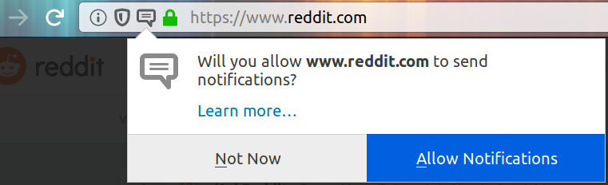
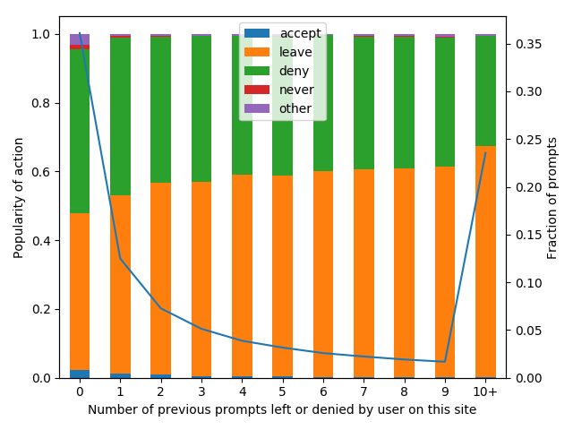
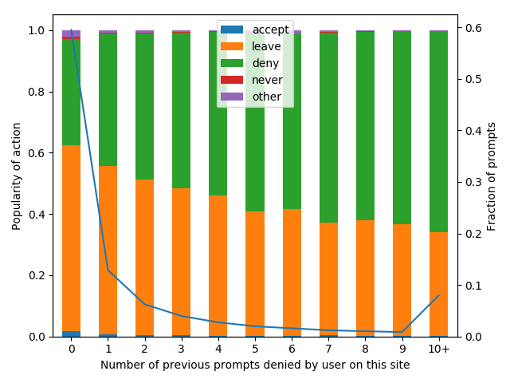
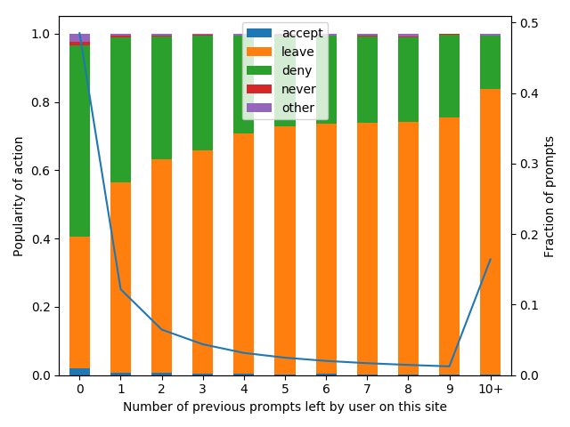
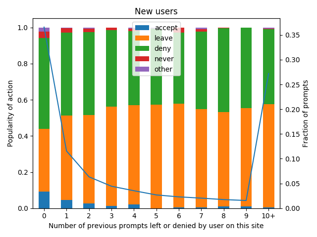

<figure></figure>

Investigation into whether notification permission prompts are a good experience for web users, and whether there is scope for improving the experience.

# TL;DR

* Only around 1% of permission requests are granted/allowed.
* Around 73% of allows come the first time the dialog is shown for a site.
* If permissions are not granted the first time the dialog is shown, then the user is extremely unlikely to grant the permissions for this site at any point in the future - regardless of whether the user clicked "Not now" or just ignored the dialog.

# Methodology/Dataset
We used Normandy to temporarily enable some additional telemetry [[1](https://telemetry.mozilla.org/probe-dictionary/?search=permissionprompt&detailView=event%2Fsecurity.ui.permissionprompt.show%23show), [2](https://telemetry.mozilla.org/probe-dictionary/?search=permissionprompt&detailView=event%2Fsecurity.ui.permissionprompt.accept%23remove)] for a random 0.1% of desktop Firefox users. With this telemetry enabled, these browsers locally keep track of which sites are asking for notification permissions and how the user responded to the prompt. For each notification prompt, they send us [some information](https://telemetry.mozilla.org/probe-dictionary/?search=permissionprompt&detailView=event%2Fsecurity.ui.permissionprompt.show%23show) about it - such as how many times the user had previously denied this prompt, and [whether the user accepted the request, denied permission, ignored the prompt, etc](https://telemetry.mozilla.org/probe-dictionary/?search=permissionprompt&detailView=event%2Fsecurity.ui.permissionprompt.accept%23remove).

We enrolled a random 0.1% of users into this study for a week, and then let sites build up a track record for a few weeks: the telemetry reports the number of times the user has previously denied a site’s request since we started recording this telemetry, and we really want to know the number of times that this has happened ever. Since we can’t measure the latter quantity, we approximate "forever" by "a few weeks". *cough*

New users pose a slightly different challenge: if we ignore their first few weeks of data then the data we look at isn’t really from "new users". But on the other hand, we know that we started recording this telemetry from pretty much the first time the user installed the browser, so we don’t have the aforementioned "forever" problem. Therefore we separately analyse the telemetry from new users’ first three weeks.

# Results

## All users
We received telemetry regarding 217K permission prompts in one week. We discarded data about 11% of prompts, coming from the approximately 40 users who had >200 prompts in the week.

<figure>
    <figcaption>Figure 1: User actions by the number of times the user had previously ignored or denied permission to this site.</figcaption>
</figure>

Figure 1 shows that the first time "ever" a user is prompted for permission to send notifications on a given site, 2.4% of requests are granted (the blue bar labelled 'accept', for x=0). 45% of such requests are ignored (the orange bar labelled 'leave'). For 48% of requests, the user takes the time to click "Not Now". Only 1.4% of users locate the "Never allow" option.

Moving our gaze rightwards along the x axis, we see that repeated prompts are less likely to be accepted than the first prompt. They are also less likely to be explicitly denied: our users become weary of interacting with the notification prompt and just start to ignore it.

The unlabelled blue line on Figure 1 shows that only 35% of prompts in the study period were "fresh" - for the rest of them, the user had at least once previously either denied permission or ignored the prompt.

Now for some related numbers that are not directly represented on Figure 1:

* Out of all accepted prompts, roughly 74% were accepted the first time: the user had not "ever" ignored/left a prompt or denied notification permissions to that site before.
* 91% of accepts were made without the prompt being ignored or denied three or more times.
* 95% of accepts were made without the prompt being ignored or denied five or more times.

### Action by number of _denied_ prompts

<figure>
    <figcaption>Figure 2: User actions by the number of times the user had previously denied permission to this site.</figcaption>
</figure>

The difference between Figures 1 and 2 is that Figure 1 counts the number of times a prompt had been ignored or denied by the user for the site, whereas Figure 2 only counts the number of times it had been denied. The march of the green bars shows that the more times a user has previously clicked "Not Now", the more likely they are to click it the next time.

Given one previous deny, the accept rate drops to 0.8%.

Out of all accepted prompts, roughly 85% were accepted without the user "ever" having previously clicked "Not Now". I wonder how many of the remaining 15% of accepts were from misclicks or frustrated users attempting to make the prompts go away.

### Action by number of _ignored_ prompts

<figure>
    <figcaption>Figure 3: User actions by the number of times the user had previously ignored permission prompts for this site.</figcaption>
</figure>

Figure 3 shows that ignoring a prompt is a similarly strong signal to clicking "Not now". From 0 to 1 previously ignored prompt on the site, the accept rate drops from 2% to 0.8%.

### Action by whether the prompt was made before user input

Some sites ask for notification permissions upon page load. Others only ask the question if they have a reasonable expectation that the answer will be "yes" - typically this latter case will happen after the user has interacted with the page.

Overall, the accept rate for prompts without previous user interaction was 1%, whereas the accept rate for prompts with interaction was 17%.

Taking a cue from the earlier sections and considering only first-time-for-this-site prompts, pre-interaction prompts had a 2% success rate, compared to a 24% success rate for post-interaction prompts.

Note that post-interaction prompts are sadly rare on today’s web: there were only 785 post-interaction first-time prompts in the dataset, compared to 66413 pre-interaction first-time prompts. So the post-interaction accepts only represent 11% of all accepts.

## New users

While the "All users" data gives us a snapshot of the typical user experience (albeit with caveats such as those around the words "forever" and "ever"), it’s also important to consider the new user experience. Existing users have typically already granted permissions to their everyday webapps like Gmail and Slack, and if we don’t consider new users’ behaviour then we risk damaging their experience.

<figure>
    <figcaption>Figure 4: New users' actions by the number of times the user had previously ignored or denied permission to this site.</figcaption>
</figure>

Comparing Figure 4 to the analogous Figure 1, we see that new users start with a much higher accept rate: 9%. Some of this difference is likely caused by the "forever" caveat distorting Figure 1, some of it will be the different mix of sites prompting for permission (by design we can’t tell this from telemetry, but I bet many of these accepts are for Gmail), and some of it could be that these fresh users have yet to be trained to ignore the prompt or reflexively click "Not now".

As prompts are ignored or denied, the 9% accept rate drops to 5%, then 2.7%. From the 10th deny or leave onwards, the accept rate is 0.36%.

Numbers not from the graph:

* For new users, 77% of granted permissions happen without the prompt ever being ignored or denied.
* 87% happen without the prompt ever being denied.
* 97% of granted permissions happen with the prompt being ignored or denied less than 5 times.
* The first time a prompt is shown for a site, pre-interaction prompts have a 7.6% accept rate, whereas post-interaction prompts have a whopping 56% accept rate.

# References
[Bug](https://bugzilla.mozilla.org/show_bug.cgi?id=1540808)
