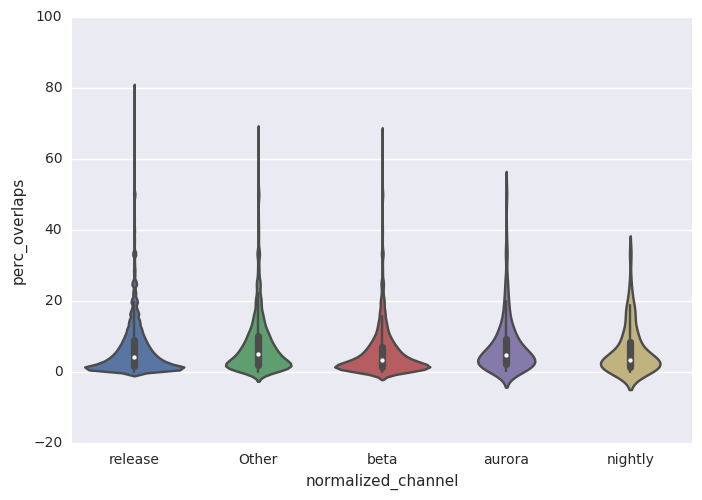
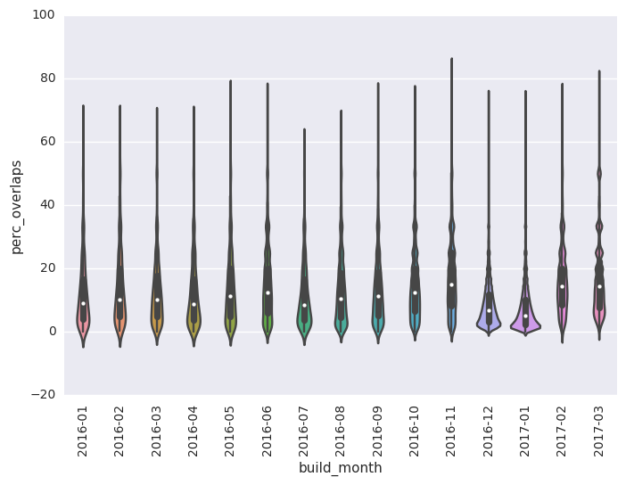

# Overview
In investigating long subsession lengths in longitudinal, @spensrose and I  discussed investigating an upper bound on subsession lenghts.
This upper bound that we concluded is that subsession lengths should not overlap.
This notebook explores long (> 24H) overlapping subsessions.
A long overlapping pair of subsessions might be where a subsession (> 24H) starts on a first day, completes on the following day, but another subsession is present on first day. 
This should not occur.

After determining how many users this issue effects, I specifically analyze the portion of users that do have the long overlapping subsessions.

## Window of Analysis
I look at users with `sample_id=42` and have a `subsession_start_date` between the current date and the beginning of the year (exclusive). 
I choose this window primarily to investigate newer data.
If this window is to be extended in the future, the pandas code will have to be refactored to run on spark, otherwise memory issues are likely to occur for the local pandas dataframes in this notebook.


```python
# dependencies dynamically added 
file_names = ['extract.py', 'transform.py', 'utils.py']
for file_name in file_names:
    sc.addPyFile(file_name)
from extract import *
from transform import *
```

```python
%matplotlib inline
import matplotlib.pylab as plt
import seaborn as sns
sns.set(color_codes=True)
```

```python
df = read_from_main_summary(sqlContext)
```
## Analysis By Aggregating Profile
The following questions are answered by aggregating by profile to determine distributions. 
Later, we will aggregate by profile & other fields, like `build_id`.


```python
aggregate_fields = ['client_id']
wide_df_by_client = long_to_wide(sqlContext, df, aggregate_fields)
```

```python
overlaps_rdd_by_client = wide_df_by_client.rdd.map(find_overlaps).cache()
```
### what's the percentage of profiles that have at least one overlapping session?


```python
num_total_profiles = df.count()
num_profiles_with_overlap = overlaps_rdd_by_client.count()
percentage = (float(num_profiles_with_overlap) / num_total_profiles) * 100 
print('Percentage of profiles with atleast one overlap: %.4r' % percentage) 
```
    Percentage of profiles with atleast one overlap: 1.49


### what are the percentages for overlapping subsessions of all subsessions per profile for each channel?
The violin plot below tells the story quite clearly below. 
The percentage of long overlapping subsessions in this scenario are very small. 
The statistical summaries per profile are shown after the violin plots.
I had used `sns.stripplot` & `sns.boxplot` previously, but they didn't show how narrow the majority of the distribution are on the `release` channel.
In the end I opted for a violin plot and a supplementary statistical summary.


```python
# tup[-1] is the percentage
perc_client_df = overlaps_rdd_by_client\
.filter(lambda tup: tup[-1] != 0)\
.toDF(aggregate_fields + ['normalized_channel', 'perc_overlaps'])\
.drop('client_id')\
.toPandas()
```

```python
sns.violinplot(x='normalized_channel', y='perc_overlaps', data=perc_client_df)
```


    <matplotlib.axes._subplots.AxesSubplot at 0x7f201f8d0ed0>





```python
perc_client_df\
.groupby('normalized_channel')\
.describe()\
.reset_index()\
.pivot('normalized_channel', 'level_1', values='perc_overlaps')
```


<div>
<table border="1" class="dataframe">
  <thead>
    <tr style="text-align: right;">
      <th>level_1</th>
      <th>25%</th>
      <th>50%</th>
      <th>75%</th>
      <th>count</th>
      <th>max</th>
      <th>mean</th>
      <th>min</th>
      <th>std</th>
    </tr>
    <tr>
      <th>normalized_channel</th>
      <th></th>
      <th></th>
      <th></th>
      <th></th>
      <th></th>
      <th></th>
      <th></th>
      <th></th>
    </tr>
  </thead>
  <tbody>
    <tr>
      <th>Other</th>
      <td>2.083333</td>
      <td>5.000000</td>
      <td>10.144928</td>
      <td>7892.0</td>
      <td>66.666667</td>
      <td>7.598560</td>
      <td>0.076278</td>
      <td>8.009482</td>
    </tr>
    <tr>
      <th>aurora</th>
      <td>2.272727</td>
      <td>4.807692</td>
      <td>9.435612</td>
      <td>583.0</td>
      <td>52.040816</td>
      <td>7.333567</td>
      <td>0.193798</td>
      <td>7.944685</td>
    </tr>
    <tr>
      <th>beta</th>
      <td>1.408451</td>
      <td>3.278689</td>
      <td>7.142857</td>
      <td>10056.0</td>
      <td>66.666667</td>
      <td>5.628529</td>
      <td>0.023469</td>
      <td>6.744382</td>
    </tr>
    <tr>
      <th>nightly</th>
      <td>1.538462</td>
      <td>3.296703</td>
      <td>8.527132</td>
      <td>137.0</td>
      <td>33.333333</td>
      <td>6.168507</td>
      <td>0.106838</td>
      <td>6.723542</td>
    </tr>
    <tr>
      <th>release</th>
      <td>1.639344</td>
      <td>4.166667</td>
      <td>8.928571</td>
      <td>493090.0</td>
      <td>80.000000</td>
      <td>6.530505</td>
      <td>0.000848</td>
      <td>7.161107</td>
    </tr>
  </tbody>
</table>
</div>


### how do the above distributions vary when considering only subsessions originating from recent Firefox builds?


```python
# app_version <-> app_build_id should be 1 to 1
aggregate_fields = ['client_id', 'app_version', 'app_build_id']
wide_df_by_build = long_to_wide(sqlContext, df, aggregate_fields)
```

```python
overlaps_rdd_by_build = wide_df_by_build.rdd.map(find_overlaps).cache()
```

```python
# we should now have percentages per client & build
perc_builds_df = overlaps_rdd_by_build\
.filter(lambda tup: tup[-1] != 0)\
.toDF(aggregate_fields + ['normalized_channel', 'perc_overlaps'])\
.drop('client_id')\
.toPandas()
```

```python
from datetime import datetime, date

def build_month(row):
    app_build_id = row['app_build_id']
    app_build_date_str = app_build_id[0:6]
    return app_build_date_str[0:4] + "-" + app_build_date_str[4:]

perc_builds_df['build_month'] = perc_builds_df.apply(build_month, 1)
```

```python
violin_order_month = sorted(list(set(perc_builds_df['build_month'])))
violin_order_month = [month for month in violin_order_month if month >= '2016-01']
violin_df = perc_builds_df[perc_builds_df['build_month'] >= '2016-01']
```
The following plot & summary statistic dataframe show the distribution of percentages of long, overlapping subsession lengths per client per build aggregated by the month of the build.
Overall we can see for each aggregation that there are outliers that still effect our distribution, similar to when we only aggregated by `normalized_channel`.


```python
pivot_column_str = 'build_month'
plt.xticks(rotation=90)
sns.violinplot(x=pivot_column_str, y='perc_overlaps', data=violin_df, order=violin_order_month)
```


    <matplotlib.axes._subplots.AxesSubplot at 0x7f2012276190>





```python
perc_builds_df\
.groupby(pivot_column_str)\
.describe()\
.reset_index()\
.pivot(pivot_column_str, 'level_1', values='perc_overlaps')
```


<div>
<table border="1" class="dataframe">
  <thead>
    <tr style="text-align: right;">
      <th>level_1</th>
      <th>25%</th>
      <th>50%</th>
      <th>75%</th>
      <th>count</th>
      <th>max</th>
      <th>mean</th>
      <th>min</th>
      <th>std</th>
    </tr>
    <tr>
      <th>build_month</th>
      <th></th>
      <th></th>
      <th></th>
      <th></th>
      <th></th>
      <th></th>
      <th></th>
      <th></th>
    </tr>
  </thead>
  <tbody>
    <tr>
      <th>2015-03</th>
      <td>15.000000</td>
      <td>15.000000</td>
      <td>15.000000</td>
      <td>1.0</td>
      <td>15.000000</td>
      <td>15.000000</td>
      <td>15.000000</td>
      <td>NaN</td>
    </tr>
    <tr>
      <th>2015-04</th>
      <td>14.035088</td>
      <td>14.035088</td>
      <td>14.035088</td>
      <td>1.0</td>
      <td>14.035088</td>
      <td>14.035088</td>
      <td>14.035088</td>
      <td>NaN</td>
    </tr>
    <tr>
      <th>2015-05</th>
      <td>3.800676</td>
      <td>5.955189</td>
      <td>9.090909</td>
      <td>24.0</td>
      <td>50.000000</td>
      <td>8.741663</td>
      <td>1.006711</td>
      <td>10.059148</td>
    </tr>
    <tr>
      <th>2015-06</th>
      <td>3.057330</td>
      <td>6.250000</td>
      <td>13.664596</td>
      <td>95.0</td>
      <td>50.000000</td>
      <td>9.984620</td>
      <td>0.337838</td>
      <td>10.449174</td>
    </tr>
    <tr>
      <th>2015-07</th>
      <td>2.518213</td>
      <td>7.142857</td>
      <td>14.495798</td>
      <td>139.0</td>
      <td>50.000000</td>
      <td>9.812872</td>
      <td>0.261097</td>
      <td>9.578310</td>
    </tr>
    <tr>
      <th>2015-08</th>
      <td>2.777778</td>
      <td>7.142857</td>
      <td>16.666667</td>
      <td>95.0</td>
      <td>50.000000</td>
      <td>11.677158</td>
      <td>0.204082</td>
      <td>11.650053</td>
    </tr>
    <tr>
      <th>2015-09</th>
      <td>2.777778</td>
      <td>7.142857</td>
      <td>14.285714</td>
      <td>1124.0</td>
      <td>55.555556</td>
      <td>9.829240</td>
      <td>0.156548</td>
      <td>9.290525</td>
    </tr>
    <tr>
      <th>2015-10</th>
      <td>2.857143</td>
      <td>7.894737</td>
      <td>16.666667</td>
      <td>3189.0</td>
      <td>75.000000</td>
      <td>11.087749</td>
      <td>0.023020</td>
      <td>10.678877</td>
    </tr>
    <tr>
      <th>2015-11</th>
      <td>2.987013</td>
      <td>6.066176</td>
      <td>11.111111</td>
      <td>92.0</td>
      <td>33.333333</td>
      <td>8.571121</td>
      <td>0.125786</td>
      <td>7.525495</td>
    </tr>
    <tr>
      <th>2015-12</th>
      <td>5.233700</td>
      <td>11.111111</td>
      <td>20.000000</td>
      <td>12442.0</td>
      <td>75.000000</td>
      <td>13.336775</td>
      <td>0.079145</td>
      <td>10.612435</td>
    </tr>
    <tr>
      <th>2016-01</th>
      <td>4.000000</td>
      <td>9.090909</td>
      <td>16.666667</td>
      <td>1834.0</td>
      <td>66.666667</td>
      <td>12.338127</td>
      <td>0.098328</td>
      <td>10.935919</td>
    </tr>
    <tr>
      <th>2016-02</th>
      <td>4.761905</td>
      <td>10.256410</td>
      <td>20.000000</td>
      <td>2079.0</td>
      <td>66.666667</td>
      <td>13.350533</td>
      <td>0.152439</td>
      <td>11.122064</td>
    </tr>
    <tr>
      <th>2016-03</th>
      <td>4.761905</td>
      <td>10.000000</td>
      <td>17.647059</td>
      <td>3593.0</td>
      <td>66.666667</td>
      <td>12.789990</td>
      <td>0.078616</td>
      <td>10.593256</td>
    </tr>
    <tr>
      <th>2016-04</th>
      <td>3.703704</td>
      <td>8.823529</td>
      <td>16.666667</td>
      <td>2289.0</td>
      <td>66.666667</td>
      <td>11.794920</td>
      <td>0.043937</td>
      <td>10.627409</td>
    </tr>
    <tr>
      <th>2016-05</th>
      <td>4.687500</td>
      <td>11.111111</td>
      <td>20.000000</td>
      <td>3287.0</td>
      <td>75.000000</td>
      <td>13.292632</td>
      <td>0.099404</td>
      <td>11.029829</td>
    </tr>
    <tr>
      <th>2016-06</th>
      <td>6.034483</td>
      <td>12.500000</td>
      <td>20.000000</td>
      <td>11633.0</td>
      <td>75.000000</td>
      <td>14.940370</td>
      <td>0.026553</td>
      <td>11.310856</td>
    </tr>
    <tr>
      <th>2016-07</th>
      <td>3.641907</td>
      <td>8.333333</td>
      <td>16.666667</td>
      <td>2554.0</td>
      <td>60.000000</td>
      <td>11.196439</td>
      <td>0.014749</td>
      <td>9.827475</td>
    </tr>
    <tr>
      <th>2016-08</th>
      <td>4.494382</td>
      <td>10.456439</td>
      <td>18.666667</td>
      <td>10970.0</td>
      <td>66.666667</td>
      <td>12.813731</td>
      <td>0.016929</td>
      <td>10.503366</td>
    </tr>
    <tr>
      <th>2016-09</th>
      <td>5.000000</td>
      <td>11.111111</td>
      <td>18.750000</td>
      <td>7209.0</td>
      <td>75.000000</td>
      <td>13.160460</td>
      <td>0.042265</td>
      <td>10.601474</td>
    </tr>
    <tr>
      <th>2016-10</th>
      <td>6.451613</td>
      <td>12.500000</td>
      <td>20.000000</td>
      <td>29266.0</td>
      <td>75.000000</td>
      <td>14.467175</td>
      <td>0.041135</td>
      <td>10.544938</td>
    </tr>
    <tr>
      <th>2016-11</th>
      <td>8.045977</td>
      <td>14.814815</td>
      <td>25.000000</td>
      <td>20635.0</td>
      <td>83.333333</td>
      <td>16.648694</td>
      <td>0.049529</td>
      <td>11.189531</td>
    </tr>
    <tr>
      <th>2016-12</th>
      <td>3.225806</td>
      <td>6.666667</td>
      <td>11.864407</td>
      <td>270810.0</td>
      <td>75.000000</td>
      <td>8.585782</td>
      <td>0.013163</td>
      <td>7.222534</td>
    </tr>
    <tr>
      <th>2017-01</th>
      <td>2.272727</td>
      <td>5.000000</td>
      <td>10.000000</td>
      <td>323579.0</td>
      <td>75.000000</td>
      <td>7.345305</td>
      <td>0.002613</td>
      <td>7.132362</td>
    </tr>
    <tr>
      <th>2017-02</th>
      <td>8.333333</td>
      <td>14.285714</td>
      <td>20.000000</td>
      <td>6413.0</td>
      <td>75.000000</td>
      <td>15.932386</td>
      <td>0.049358</td>
      <td>9.820090</td>
    </tr>
    <tr>
      <th>2017-03</th>
      <td>7.692308</td>
      <td>14.285714</td>
      <td>22.222222</td>
      <td>72266.0</td>
      <td>80.000000</td>
      <td>16.511717</td>
      <td>0.000919</td>
      <td>11.530197</td>
    </tr>
  </tbody>
</table>
</div>


### Using DocId
I've deduplicated with docid in `extract.py`. 
After deduplicating using docid, I move from a long dataset to a wide dataset, similar to longitudinal.
