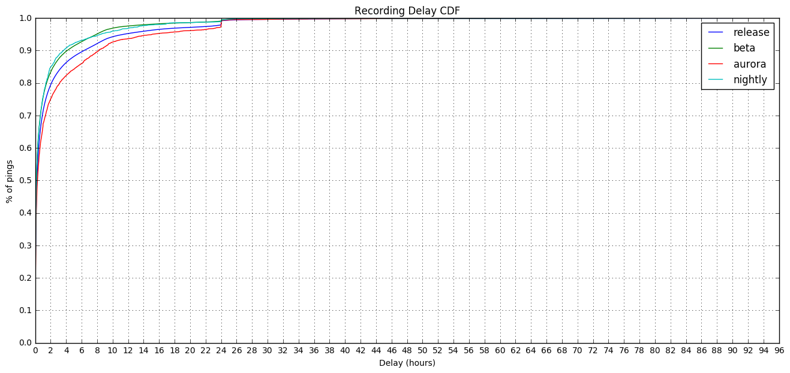
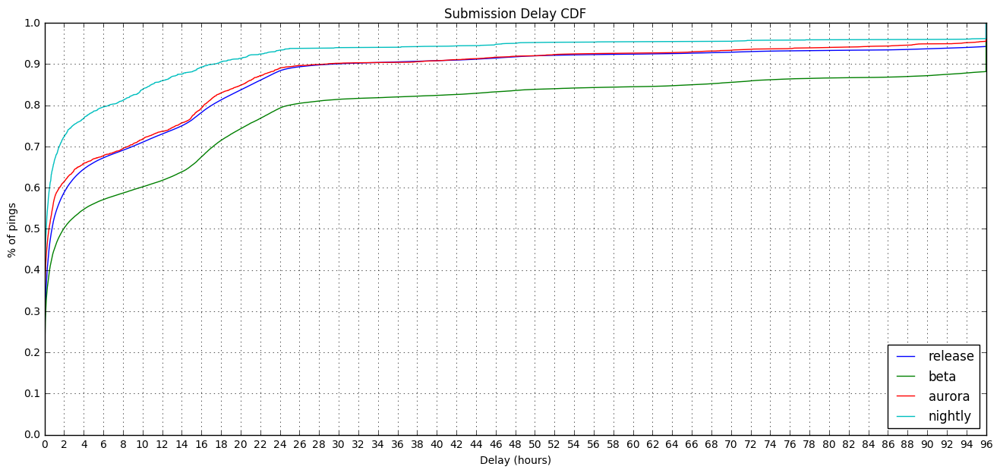
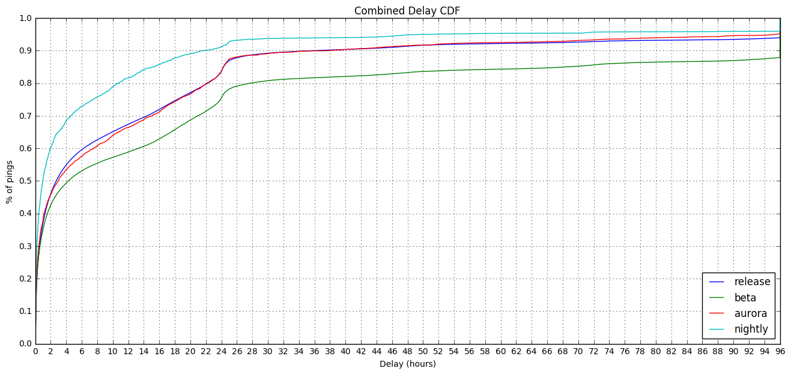

### Main Ping Submission and Recording Delays by Channel

This is some analysis to clarify some stuff I wrote in [a blog post](https://chuttenblog.wordpress.com/2016/11/10/data-science-is-hard-case-study-latency-of-firefox-crash-rates/).

Specifically investigating what typical values of "recording delay" and "submission delay" might be.


```python
import ujson as json
import matplotlib.pyplot as plt
import pandas as pd
import numpy as np
import plotly.plotly as py
import IPython

from datetime import datetime, timedelta
from email.utils import parsedate_tz, mktime_tz, formatdate

from plotly.graph_objs import *
from moztelemetry import get_pings_properties, get_one_ping_per_client
from moztelemetry.dataset import Dataset

%matplotlib inline
IPython.core.pylabtools.figsize(16, 7)
```
    Unable to parse whitelist (/home/hadoop/anaconda2/lib/python2.7/site-packages/moztelemetry/histogram-whitelists.json). Assuming all histograms are acceptable.


Start with the bread-and-butter of Telemetry reporting: the "main" ping

Looking at Jan 10, 2017 because it's a recent Tuesday that isn't too close to any holidays.


```python
pings = Dataset.from_source("telemetry") \
    .where(docType='main') \
    .where(submissionDate="20170110") \
    .records(sc, sample=0.01)
```
To look at delays, we need to look at times. There are a lot of times, and they are recorded relative to different clocks.

**`creationDate`** - The time the Telemetry code in Firefox created the ping, according to the client's clock, expressed as an ISO string. **`meta/creationTimestamp`** is the same time, but expressed in nanoseconds since the epoch.

**`meta/Date`** - The time the Telemetry code in Firefox sent the ping to the server, according to the client's clock, expressed as a Date string conforming to [RFC 7231](https://tools.ietf.org/html/rfc7231#section-7.1.1.1).

**`meta/Timestamp`** - The time the ping was received by the server, according to the server's
clock, expressed in nanoseconds since the epoch.

**`payload/info/subsessionLength`** - The length of time over which the ping was collecting data, according to the client's clock, expressed as a number of seconds. Working backwards from **`creationDate`** this gives us a subsession start time which allows us to determine Reporting Delay.


```python
subset = get_pings_properties(pings, ["application/channel",
                                      "creationDate",
                                      "meta/creationTimestamp",
                                      "meta/Date",
                                      "meta/Timestamp",
                                      "payload/info/subsessionLength"])
```

```python
p = subset.take(1)[0]
```

```python
p
```


    {'application/channel': u'release',
     'creationDate': u'2017-01-10T02:01:31.551Z',
     'meta/Date': u'Tue, 10 Jan 2017 02:01:31 GMT',
     'meta/Timestamp': 1484013691737682688L,
     'meta/creationTimestamp': 1.484013691551e+18,
     'payload/info/subsessionLength': 67}


Quick normalization: ditch any ping that doesn't have a subsessionLength, creationTimestamp, or Timestamp:


```python
subset = subset.filter(lambda p:\
                       p["payload/info/subsessionLength"] is not None\
                       and p["meta/Timestamp"] is not None\
                       and p["meta/creationTimestamp"] is not None)
```
We'll be plotting Cumulative Distribution Functions today.


```python
MAX_DELAY_S = 60 * 60 * 96.0
HOUR_IN_S = 60 * 60.0
CHANNELS = ['release', 'beta', 'aurora', 'nightly']
```

```python
def setup_plot(title, max_x):
    plt.title(title)
    plt.xlabel("Delay (hours)")
    plt.ylabel("% of pings")

    plt.xticks(range(0, int(max_x) + 1, 2))
    plt.yticks(map(lambda y: y / 10.0, range(0, 11, 1)))

    plt.ylim(0.0, 1.0)
    plt.xlim(0.0, max_x)

    plt.grid(True)

def plot_cdf(data):
    sortd = np.sort(data)
    ys = np.arange(len(sortd))/float(len(sortd))

    plt.plot(sortd, ys)
```

```python
def calculate_delays(p):
    reporting_delay = p["payload/info/subsessionLength"]
    
    created = datetime.fromtimestamp(p["meta/creationTimestamp"] / 1000.0 / 1000.0 / 1000.0)
    received = datetime.fromtimestamp(p["meta/Timestamp"] / 1000.0 / 1000.0 / 1000.0)
    sent = datetime.fromtimestamp(mktime_tz(parsedate_tz(p["meta/Date"]))) if p["meta/Date"] is not None else received
    clock_skew = received - sent
    
    submission_delay = (received - created - clock_skew).total_seconds()
    return (reporting_delay, submission_delay)
```

```python
delays_by_chan = subset.map(lambda p: (p["application/channel"], calculate_delays(p)))
```
### Recording Delay

**Recording Delay** is the time from when the data "happens" to the time we record it in a ping.

The maximum value for this is the `subsessionLength`: the length of time from the beginning of the interval over which this ping is reporting to the end, where the ping is recorded.


```python
setup_plot("Recording Delay CDF", MAX_DELAY_S / HOUR_IN_S)

for chan in CHANNELS:
    plot_cdf(delays_by_chan\
             .filter(lambda d: d[0] == chan)\
             .map(lambda d: d[1][0] / HOUR_IN_S if d[1][0] < MAX_DELAY_S else MAX_DELAY_S / HOUR_IN_S)\
             .collect())
    
plt.legend(CHANNELS, loc="best")
```


    <matplotlib.legend.Legend at 0x7fa3940834d0>





So it seems as though about 80% of recording delays on release are 2 hours or less, not much difference amongst the channels (though it is interesting that Aurora has the longer subsessions).

Note the cliff at 24 hours. We have code that tries to ensure that our data is recorded at least every day, around local midnight. Nice to see that it appears to be working.

### Submission Delay

**Submission Delay** is the delay between the data being recorded on the client and it being received by our infrastructure. It is thought to be dominated by the length of time Firefox isn't open on a client's computer, though retransmission attempts and throttling can also contribute.

Here we run into a problem with **clock skew**. Clients' clocks aren't guaranteed to align with our server's clock, so we cannot necessarily compare the two. Luckily, with [bug 1144778](https://bugzilla.mozilla.org/show_bug.cgi?id=1144778) we introduced an HTTP `Date` header which tells us what time the client's clock thinks it is when it is sending the data. Coupled with the `Timestamp` field recorded which is what time the server's clock thinks it is when it receives the data, we can subtract the more egregious examples of clock skew and get values that are closer to reality.


```python
setup_plot("Submission Delay CDF", MAX_DELAY_S / HOUR_IN_S)

for chan in CHANNELS:
    plot_cdf(delays_by_chan\
             .filter(lambda d: d[0] == chan)\
             .map(lambda d: d[1][1] / HOUR_IN_S if d[1][1] < MAX_DELAY_S else MAX_DELAY_S / HOUR_IN_S)\
             .collect())
    
plt.legend(CHANNELS, loc="lower right")
```


    <matplotlib.legend.Legend at 0x7fa38761a910>





Here we see a much larger variation in delays across the channels. Nightly, as you could expect, tends to have the shortest delays. I suspect this is because its rapid update cycle tends to encourage users to restart more often. Beta is a bit of a surprise for me as having the longest delays.

Maybe Beta users use their browsers less than other channels? But then I'd expect them to be bottom of the pile for engagement ratio, and they're more middle of the road. 

Something to follow up on, maybe.

Anyhoo, we get 80% of main pings from nightly within 6 hours of them being created by the client. Which is pretty awesome. From beta, we have to wait a little over 24 hours to get 80% of main pings.

If we're waiting for 90% the spread's even greater with nightly getting 9 out of every 10 pings before 18 hours is up, and beta having to wait more than 96 hours.

### Recording + Submission Delay

And, summing the delays together and graphing them we get...


```python
setup_plot("Combined Delay CDF", MAX_DELAY_S / HOUR_IN_S)

for chan in CHANNELS:
    plot_cdf(delays_by_chan\
             .filter(lambda d: d[0] == chan)\
             .map(lambda d: (d[1][0] + d[1][1]) / HOUR_IN_S if (d[1][0] + d[1][1]) < MAX_DELAY_S else MAX_DELAY_S / HOUR_IN_S)\
             .collect())
    
plt.legend(CHANNELS, loc="lower right")
```


    <matplotlib.legend.Legend at 0x7fa38743dad0>





The 80% numbers for the combined delay again have Nightly being speediest at just over 10 hours. Beta is once again the laggiest at 27 hours.
