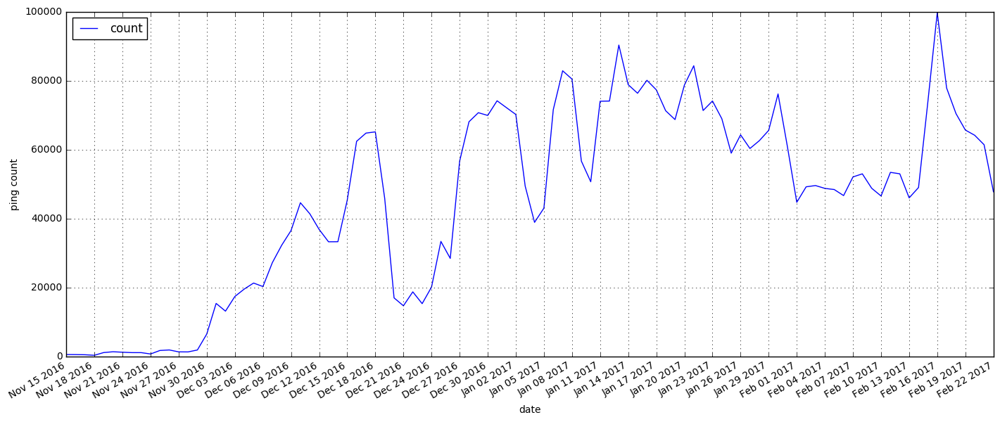
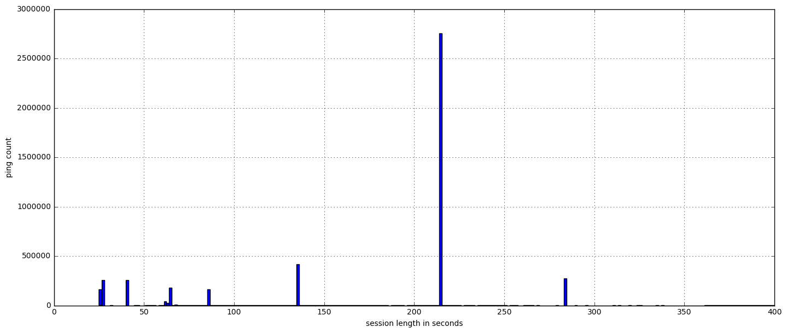
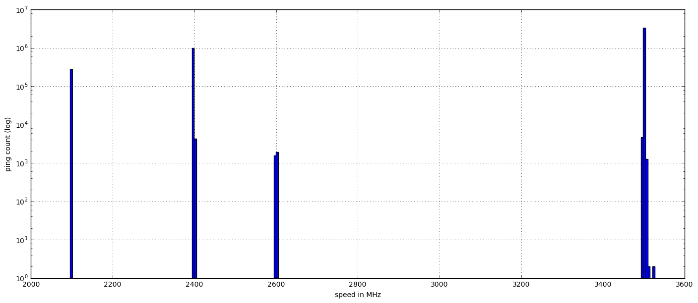

## One Problematic Aurora 51 Client

### Motivation

There is one particular client, whose `client_id` I've obscured, that seems to be sending orders of magnitude more "main" pings per day than is expected, or even possible.

I'm interested in figuring out what we can determine about this particular client to see if there are signifiers we can use to identify this anomalous use case. This identification would permit us to:
* filter data from these clients out of derived datasets that aren't relevant
* identify exceptional use-cases for Firefox we don't currently understand

### How many pings are we talking, here?


```python
import pandas as pd
import numpy as np
import matplotlib

from matplotlib import pyplot as plt
from moztelemetry.dataset import Dataset
from moztelemetry import get_pings_properties, get_one_ping_per_client
```
    Unable to parse whitelist (/home/hadoop/anaconda2/lib/python2.7/site-packages/moztelemetry/histogram-whitelists.json). Assuming all histograms are acceptable.


```python
all_pings = Dataset.from_source("telemetry") \
    .where(docType='main') \
    .where(appBuildId=lambda x: x.startswith("20161014")) \
    .where(appUpdateChannel="aurora") \
    .records(sc, sample=1)
```

```python
pings = all_pings.filter(lambda p: p['clientId'] == '<omitted for privacy>')
```

```python
submission_dates = get_pings_properties(pings, ["meta/submissionDate"])
```

```python
from datetime import datetime
ping_counts = submission_dates.map(lambda p: (datetime.strptime(p["meta/submissionDate"], '%Y%m%d'), 1)).countByKey()
```

```python
from datetime import timedelta
```

```python
df = pd.DataFrame(ping_counts.items(), columns=["date", "count"]).set_index(["date"])
df.plot(figsize=(17, 7))
plt.xticks(np.arange(min(df.index), max(df.index) + timedelta(3), 3, dtype="datetime64[D]"))
plt.ylabel("ping count")
plt.xlabel("date")
plt.grid(True)
plt.show()
```





Just about 100k main pings submitted by this client on a single day? (Feb 16)... that is one active client.

Or _many_ active clients.

### What Can We Learn About These Pings?

Well, since these pings all share the same clientId, they likely are sharing user profiles. This means things like profile `creationDate` and so forth won't change amongst them.

However, here's a list of things that might change in interesting ways or otherwise shed some light on the purpose of these installs.


```python
subset = get_pings_properties(pings, [
        "meta/geoCountry",
        "meta/geoCity",
        "environment/addons/activeAddons",
        "environment/settings/isDefaultBrowser",
        "environment/system/cpu/speedMHz",
        "environment/system/os/name",
        "environment/system/os/version",
        "payload/info/sessionLength",
        "payload/info/subsessionLength",        
    ])
```

```python
subset.count()
```


    4571188


#### Non-System Addons


```python
pings_with_addon = subset\
    .flatMap(lambda p: [(addon["name"], 1) for addon in filter(lambda x: "isSystem" not in x or not x["isSystem"], p["environment/addons/activeAddons"].values())])\
    .countByKey()
```

```python
sorted(pings_with_addon.items(), key=lambda x: x[1], reverse=True)[:5]
```


    [(u'Random Agent Spoofer', 4570618),
     (u'Alexa Traffic Rank', 419985),
     (u'Firefox Hotfix', 1)]


Nearly every single ping is reporting that it has an addon called 'Random Agent Spoofer'. Interesting.

#### Session Lengths


```python
SESSION_MAX = 400
```

```python
session_lengths = subset.map(lambda p: p["payload/info/sessionLength"] if p["payload/info/sessionLength"] < SESSION_MAX else SESSION_MAX).collect()
```

```python
pd.Series(session_lengths).hist(bins=250, figsize=(17, 7))
plt.ylabel("ping count")
plt.xlabel("session length in seconds")
plt.show()
```





```python
pd.Series(session_lengths).value_counts()[:10]
```


    215    2756799
    135     417410
    284     273834
    27      258250
    40      257293
    64      172439
    85      160477
    25      160317
    62       30421
    63       27640
    dtype: int64


The session lengths for over half of all the reported pings are exactly 215 seconds long. Two minutes and 35 seconds.

#### Is this Firefox even the default browser?


```python
subset.map(lambda p: (p["environment/settings/isDefaultBrowser"], 1)).countByKey()
```


    defaultdict(int, {False: 4571188})


No.

#### CPU speed


```python
MHZ_MAX = 5000
```

```python
mhzes = subset.map(lambda p: p["environment/system/cpu/speedMHz"] if p["environment/system/cpu/speedMHz"] < MHZ_MAX else MHZ_MAX).collect()
```

```python
ds = pd.Series(mhzes)
ds.hist(bins=250, figsize=(17, 7))
plt.ylabel("ping count (log)")
plt.xlabel("speed in MHz")
plt.yscale("log")
plt.show()
```





```python
pd.Series(mhzes).value_counts()[:10]
```


    3504    2796444
    2397     973539
    3503     506650
    2097     274870
    2400       4225
    2399       3324
    3495       3284
    2396       1962
    2600       1907
    2599       1540
    dtype: int64


There seems to be a family gathering of different hardware configurations this client is running on, most on a particular approximately-3.5GHz machine

#### Operating System


```python
def major_minor(version_string):
    return version_string.split('.')[0] + '.' + version_string.split('.')[1]
```

```python
pings_per_os = subset\
    .map(lambda p: (p["environment/system/os/name"] + " " + major_minor(p["environment/system/os/version"]), 1))\
    .countByKey()
```

```python
print len(pings_per_os)
sorted(pings_per_os.items(), key=lambda x: x[1], reverse=True)[:10]
```
    1


    [(u'Windows_NT 5.1', 4571188)]


All of the pings come from Windows XP.

#### Physical Location (geo-ip of submitting host)


```python
pings_per_city = subset\
    .map(lambda p: (p["meta/geoCountry"] + " " + p["meta/geoCity"], 1))\
    .countByKey()
```

```python
print len(pings_per_city)
sorted(pings_per_city.items(), key=lambda x: x[1], reverse=True)[:10]
```
    418


    [(u'US Costa Mesa', 599161),
     (u'US Phoenix', 449236),
     (u'FR Paris', 245990),
     (u'GB ??', 234012),
     (u'GB London', 187256),
     (u'FR ??', 183938),
     (u'DE ??', 144906),
     (u'US Los Angeles', 122247),
     (u'US Houston', 97413),
     (u'US New York', 93148)]


These pings are coming from all over the world, mostly from countries where Firefox user share is already decent. This may just be a map of Browser use across the world's population, which would be consistent with a profile that is inhabiting a set %ge of the browser-using population's computers.

### Conclusion

None of this is concrete, but if I were invited to speculate, I'd think there's some non-Mozilla code someplace that has embedded a particular (out-of-date) version of Firefox Developer Edition into themselves, automating it to perform a 2-minute-and-35-second task on Windows XP machines, possibly while masquerading as something completely different (using the addon).

This could be legitimate. Firefox contains a robust networking and rendering stack so it might be desireable to embed it within, say, a video game as a fully-featured embedded browser. The user-agent-spoofing addon could very well be used to set a custom user agent to identify the video game's browser, and of course it wouldn't be the user's default browser.

However, I can't so easily explain this client's broad geographical presence and Windows XP focus.
