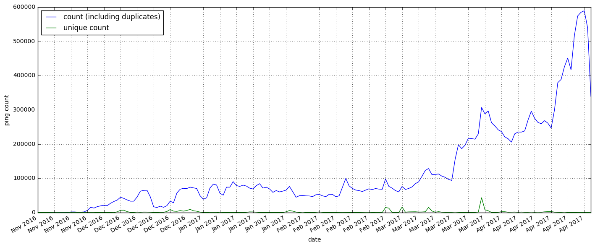
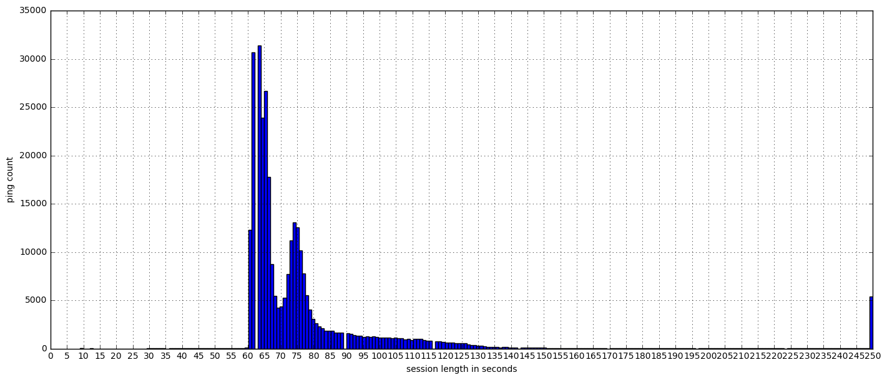
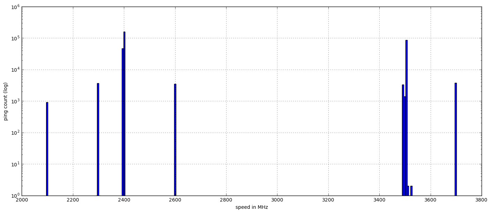

### That Aurora 51 Client

As [previously examined](http://reports.telemetry.mozilla.org/post/projects%2Fproblematic_client.kp) there is a large volume of pings coming from a single `client_id`

It's gotten much worse since then, so more investigation is needed.


```python
import ujson as json
import matplotlib.pyplot as plt
import pandas as pd
import numpy as np
import plotly.plotly as py

from plotly.graph_objs import *
from moztelemetry import get_pings_properties, get_one_ping_per_client
from moztelemetry.dataset import Dataset

%matplotlib inline
```
    Unable to parse whitelist (/mnt/anaconda2/lib/python2.7/site-packages/moztelemetry/histogram-whitelists.json). Assuming all histograms are acceptable.


```python
from datetime import datetime, timedelta
```

```python
pings = Dataset.from_source("telemetry") \
    .where(docType='main') \
    .where(appBuildId="20161014004013")\
    .where(appUpdateChannel="aurora") \
    .records(sc, sample=1)
```

```python
pings = pings.filter(lambda p: p["clientId"] == "omitted")
```
### How many pings over time

From last time, we know there was a roughly-increasing number of pings we were receiving from this client day over day. How has this changed?

Since the first analysis we've noticed that a lot of these pings are duplicates: they have the same id and everything! So while we're here let's skip the dupes and graph the volume of pings, counting only the first time we saw them.


```python
submission_dates = get_pings_properties(pings, ["id", "meta/submissionDate"])
```

```python
ping_counts = submission_dates.map(lambda p: (datetime.strptime(p["meta/submissionDate"], '%Y%m%d'), 1)).countByKey()
```

```python
first_ping_counts = submission_dates\
    .map(lambda p: (p["id"], p))\
    .reduceByKey(lambda a, b: a if a["meta/submissionDate"] < b["meta/submissionDate"] else b)\
    .map(lambda p: (datetime.strptime(p[1]["meta/submissionDate"], '%Y%m%d'), 1))\
    .countByKey()
```

```python
df = pd.DataFrame(ping_counts.items(), columns=["date", "count (including duplicates)"]).set_index(["date"])
ax = df.plot(figsize=(17, 7))
df2 = pd.DataFrame(first_ping_counts.items(), columns=["date", "unique count"]).set_index(["date"])
df2.plot(ax=ax)
plt.xticks(np.arange(min(df.index), max(df.index) + timedelta(3), 5, dtype="datetime64[D]"))
plt.ylabel("ping count")
plt.xlabel("date")
plt.grid(True)
plt.show()
```





We are seeing an ever-increasing volume of duplicate pings. Very few are unique.

### So, those non-duplicate pings...

Operating on the assumption that the duplicate pings were distributed along with the Aurora 51 binaries and profile directories, that means only the unique pings have the chance to contain accurate information about the clients.

Yes, this means the majority of the subsession and platform analysis from the previous report is likely bunk as it didn't filter out the duplicate pings. (To be fair, no one at the time knew the pings were duplicate and likely distributed with the binaries)

So, looking at only the non-duplicate pings, what can we see?


```python
subset = get_pings_properties(pings, [
        "id",
        "meta/geoCountry",
        "meta/geoCity",
        "environment/addons/activeAddons",
        "environment/settings/isDefaultBrowser",
        "environment/system/cpu/speedMHz",
        "environment/system/os/name",
        "environment/system/os/version",
        "payload/info/sessionLength",
        "payload/info/subsessionLength",        
    ])
```

```python
unique_pings = subset\
    .map(lambda p: (p["id"], p))\
    .reduceByKey(lambda a, b: "dupe")\
    .map(lambda p: p[1])\
    .filter(lambda p: p != "dupe")
```

```python
unique_pings.count()
```


    312266


### Non-System Addons


```python
pings_with_addon = unique_pings\
    .flatMap(lambda p: [(addon["name"], 1) for addon in filter(lambda x: "isSystem" not in x or not x["isSystem"], p["environment/addons/activeAddons"].values())])\
    .countByKey()
```

```python
sorted(pings_with_addon.items(), key=lambda x: x[1], reverse=True)[:5]
```


    [(u'Random Agent Spoofer', 311019),
     (u'Alexa Traffic Rank', 37439),
     (u'RefControl', 18358),
     (u'StopTube', 4831),
     (u'Stop YouTube Autoplay', 2)]


As before, every ping shows Random Agent Spoofer.

### Session Lengths


```python
SESSION_MAX = 250
```

```python
session_lengths = unique_pings\
    .map(lambda p: p["payload/info/sessionLength"] if p["payload/info/sessionLength"] < SESSION_MAX else SESSION_MAX)\
    .collect()
```

```python
s = pd.Series(session_lengths)
s.hist(bins=250, figsize=(17, 7))
plt.ylabel("ping count")
plt.xlabel("session length in seconds")
plt.xticks(np.arange(0, max(s) + 1, 5))
plt.show()
```





Not sure how this compares to "normal" session lengths on Aurora. But a peak around 1m and another around 1m15s is way too short for a human to be getting anything meaningful done.

### Default Browser?


```python
unique_pings.map(lambda p: (p["environment/settings/isDefaultBrowser"], 1)).countByKey()
```


    defaultdict(int, {None: 1, False: 312265})


Nope. (Note that this may mean nothing at all. Some platforms (lookin' at you, Windows 10) make it difficult to set your default browser. Also: even without it being default it can be used if the user's workflow is to always start by opening their browser.)

### CPU Speed


```python
MHZ_MAX = 5000
```

```python
mhzes = unique_pings\
    .map(lambda p: p["environment/system/cpu/speedMHz"] if p["environment/system/cpu/speedMHz"] < MHZ_MAX else MHZ_MAX)\
    .collect()
```

```python
ds = pd.Series(mhzes)
ds.hist(bins=250, figsize=(17, 7))
plt.ylabel("ping count (log)")
plt.xlabel("speed in MHz")
plt.yscale("log")
plt.show()
```





```python
ds.value_counts()[:10]
```


    2400    84819
    2399    73546
    2397    44691
    3504    44401
    3503    41217
    3495     3284
    3700     2141
    2396     2108
    2299     2059
    2398     1934
    dtype: int64


Nowhere near as monocultural as the original analysis suspected, but still not a very broad spread.

### Operating System


```python
def major_minor(version_string):
    return version_string.split('.')[0] + '.' + version_string.split('.')[1]
```

```python
pings_per_os = unique_pings\
    .map(lambda p: (p["environment/system/os/name"] + " " + major_minor(p["environment/system/os/version"]), 1))\
    .countByKey()
```

```python
print len(pings_per_os)
sorted(pings_per_os.items(), key=lambda x: x[1], reverse=True)[:10]
```
    1


    [(u'Windows_NT 5.1', 312266)]


100% Windows XP. I should be more surprised.

### Physical Location (geo-ip of submitting host)


```python
pings_per_city = unique_pings\
    .map(lambda p: (p["meta/geoCountry"] + " " + p["meta/geoCity"], 1))\
    .countByKey()
```

```python
print len(pings_per_city)
sorted(pings_per_city.items(), key=lambda x: x[1], reverse=True)[:10]
```
    458


    [(u'CA Montr\xe9al', 100792),
     (u'FR ??', 62789),
     (u'US Costa Mesa', 19677),
     (u'US Phoenix', 14828),
     (u'FR Paris', 8888),
     (u'GB ??', 7155),
     (u'DE ??', 5210),
     (u'GB London', 5190),
     (u'NZ Auckland', 5065),
     (u'US Los Angeles', 4072)]


As expected, this is little different from the analysis over the duplicated pings. The hosts submitting even the duplicated pings have come from the world over.

That being said, Montreal's very highly represented here. It's a lovely city and all, but what conditions might result in its unexpected prominence?

### Conclusion

#### What has changed since the first analysis?
Well, we now know that the overwhelming majority of pings sent by this client are geographically diverse and duplicated. This suggests that these instances were packaged up with their profile data directory intact, and are submitting a pre-packaged ping as soon as they come online.

This means the duplicated pings likely reflect the environment of the original host where the package was created: Windows XP, 3.5GHz CPU, 2m35s-long session, with Random Agent Spoofer installed.

These pings reflect likely reflect the hosts that are actually sending the pings: geographically diverse, but still running Windows XP while spending inhumanly-short times within the browser.

#### What hasn't changed since the first analysis?
We still don't know why this is happening. We do know that the number of initial duplicate pings we're receiving is continuing to increase. I see no sign of this ever stopping.
