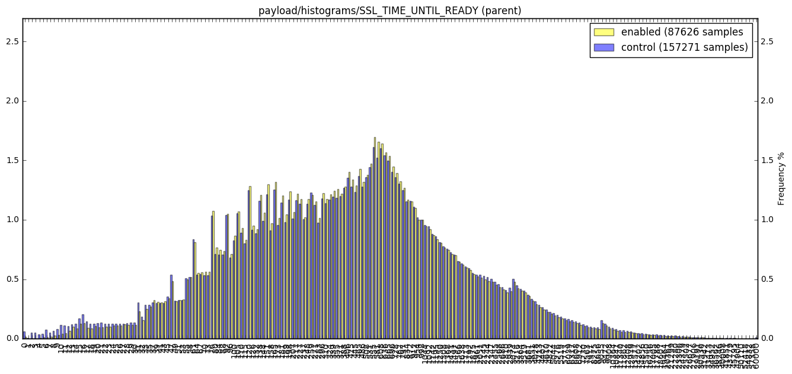
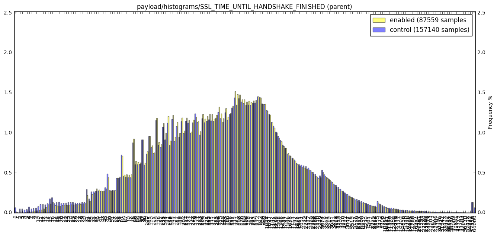
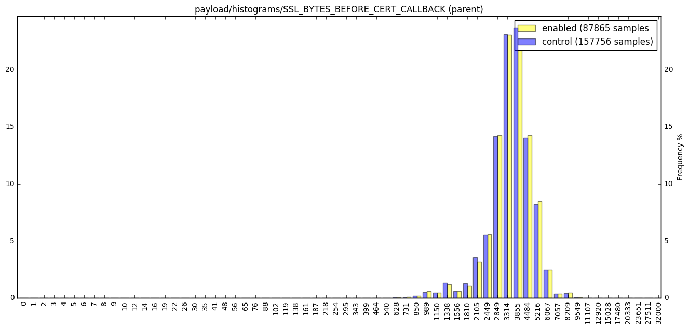
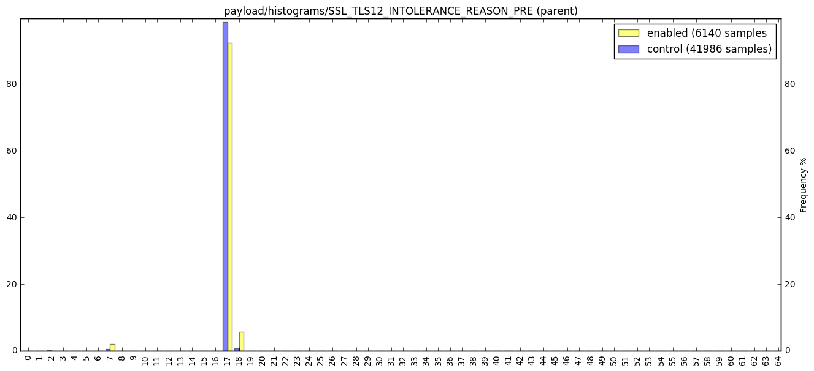
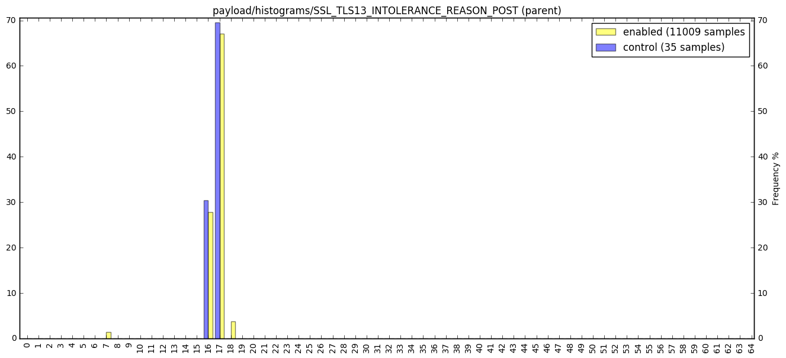
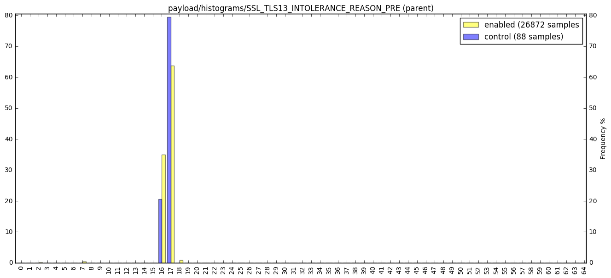

### TLS 1.3 Experiment Beta 51


```python
import ujson as json
import matplotlib.pyplot as plt
import pandas as pd
import numpy as np
import plotly.plotly as py
import IPython

from __future__ import division
from moztelemetry.spark import get_one_ping_per_client, get_pings_properties
from moztelemetry import Dataset
from montecarlino import grouped_permutation_test

%pylab inline
IPython.core.pylabtools.figsize(16, 7)
import warnings; warnings.simplefilter('ignore')
```
    


```python
sc.defaultParallelism
```


    320


```python
def chi2_distance(xs, ys, eps = 1e-10, normalize = True):
    histA = xs.sum(axis=0)
    histB = ys.sum(axis=0)
    
    if normalize:
        histA = histA/histA.sum()
        histB = histB/histB.sum()
    
    d = 0.5 * np.sum([((a - b) ** 2) / (a + b + eps)
        for (a, b) in zip(histA, histB)])

    return d

def median_diff(xs, ys):
    return np.median(xs) - np.median(ys)

def compare_histogram(histogram, branches, treatment, control):
    pvalue = grouped_permutation_test(chi2_distance, [treatment, control], num_samples=100)
    
    eTotal = treatment.sum()
    nTotal = control.sum()
        
    eTotal = 100*eTotal/eTotal.sum()
    nTotal = 100*nTotal/nTotal.sum()
        
    fig = plt.figure()
    fig.subplots_adjust(hspace=0.3)
        
    ax = fig.add_subplot(1, 1, 1)
    ax2 = ax.twinx()
    width = 0.4
    ylim = max(eTotal.max(), nTotal.max())
        
    eTotal.plot(kind="bar", alpha=0.5, color="yellow", label=branches[0], ax=ax, width=width, position=0, ylim=(0, ylim + 1))
    nTotal.plot(kind="bar", alpha=0.5, color="blue", label=branches[1], ax=ax2, width=width, position=1, grid=False, ylim=ax.get_ylim())
        
    ax.legend(ax.get_legend_handles_labels()[0] + ax2.get_legend_handles_labels()[0],
              ["{} ({} samples".format(branches[0], len(treatment)), "{} ({} samples)".format(branches[1], len(control))])

    plt.title(histogram)
    plt.xlabel(histogram)
    plt.ylabel("Frequency %")
    plt.show()
        
    print "The probability that the distributions for {} are differing by chance is {:.2f}.".format(histogram, pvalue)
    
def normalize_uptime_hour(frame):
    frame = frame[frame["payload/simpleMeasurements/uptime"] > 0]
    frame.drop("environment/addons/activeExperiment/branch", axis=1, inplace=True)
    frame = 60 * frame.apply(lambda x: x/frame["payload/simpleMeasurements/uptime"]) # Metric per hour
    frame.drop('payload/simpleMeasurements/uptime', axis=1, inplace=True)
    return frame
    
def compare_count_histograms(pings, branches, *histograms_names):
    
    properties = histograms_names + ("payload/simpleMeasurements/uptime", "environment/addons/activeExperiment/branch")

    frame = pd.DataFrame(get_pings_properties(pings, properties).collect())

    first = frame[frame["environment/addons/activeExperiment/branch"] == branches[0]]
    first = normalize_uptime_hour(first)
    
    second = frame[frame["environment/addons/activeExperiment/branch"] == branches[1]]
    second = normalize_uptime_hour(second)
    
    for histogram in first.columns:
        if histogram == "environment/addons/activeExperiment/branch" or histogram.endswith("_parent") or histogram.endswith("_children"):
            continue
        compare_scalars(histogram + " per hour", first[histogram].dropna(), second[histogram].dropna())

        
def compare_histograms(pings, branches, *histogram_names):
    frame = pd.DataFrame(get_pings_properties(pings, histogram_names + ("environment/addons/activeExperiment/branch",), with_processes=True).collect())
    first = frame[frame["environment/addons/activeExperiment/branch"] == branches[0]]
    second = frame[frame["environment/addons/activeExperiment/branch"] == branches[1]]
    
    for histogram in second.columns:
        if histogram == "environment/addons/activeExperiment/branch" or histogram.endswith("_parent") or histogram.endswith("_children"):
            continue
            
        has_children = np.sum(first[histogram + "_children"].notnull()) > 0
        has_parent = np.sum(first[histogram + "_parent"].notnull()) > 0
        
        if has_children and has_parent:
            compare_histogram(histogram + " (parent + children)", branches, first[histogram].dropna(), second[histogram].dropna())
            
        if has_parent:
            compare_histogram(histogram + " (parent)", branches, first[histogram + "_parent"].dropna(), second[histogram].dropna())
            
        if has_children:
            compare_histogram(histogram + " (children)", branches, first[histogram + "_children"].dropna(), second[histogram].dropna())
                    

                
def compare_scalars(metric, *groups):
    if groups[0].empty or groups[1].empty:
        return
    print "Median difference in {} is {:.2f}, ({:.2f}, {:.2f}).".format(metric,
                                                                        median_diff(*groups), 
                                                                        np.median(groups[0]),
                                                                        np.median(groups[1]))

    print "The probablity of this effect being purely by chance is {:.2f}.". \
        format(grouped_permutation_test(median_diff, groups, num_samples=10000))

def compare_enabled_control_histograms(pings, *histograms):
    return compare_histograms(pings, ['enabled', 'control'], *histograms)

def compare_enabled_disabled_histograms(pings, *histograms):
        return compare_histograms(pings, ['enabled', 'disabled'], *histograms)

def compare_enabled_control_count_histograms(pings, *histograms):
        return compare_count_histograms(pings, ['enabled', 'control'], *histograms)

def compare_enabled_disabled_count_histograms(pings, *histograms):
        return compare_count_histograms(pings, ['enabled', 'disabled'], *histograms)

```
#### Get treatment and control partitions

This experiment didn't have a control, but it was sampled for 10% of the population. We'll take a 10% sample of the population that wasn't in the experiment (from our initial filtered set that recreates the experimental eligibility criteria) and use that as our control group. Note that there may still be some confounding factors due to the way samples are taken for telemetry experiments, but for the purpose of this analysis, taking from the population of people who aren't in the experiment but could qualify is probably fine.


```python
def is_in_tls_experiment(ping):
    try:
        experiment = ping["environment"]["addons"]["activeExperiment"]
        return experiment["id"] == "tls13-compat-ff51@experiments.mozilla.org"
    except:
        return False

def is_not_in_tls_experiment(ping):
    try:
        experiment = ping["environment"]["addons"]["activeExperiment"]
    except:
        return False
    try:
        return experiment["id"] != "tls13-compat-ff51@experiments.mozilla.org"
    except:
        return True
```

```python
def tag_control(ping):
    ping["environment"]["addons"]["oldExperiment"] = ping["environment"]["addons"]["activeExperiment"]
    ping["environment"]["addons"]["activeExperiment"] = {
        u'branch': u'control',
        u'id': u'tls13-compat-ff51@experiments.mozilla.org'
    }
    return ping
```
Trying to get as close to the experiment's conditions as possible to draw from


```python
all_pings = (Dataset.from_source('telemetry')
                .where(docType='main')
                .where(appName='Firefox')
                .where(appUpdateChannel='beta')
                .where(appVersion=lambda x: x >= "51." and x < "52.")
                .where(appBuildId=lambda x: x >= "20170105155013")
                .where(submissionDate=lambda x: x >= '20170112' and x < '20170131')
                .records(sc, sample=0.02))
```

```python
experimental = all_pings.filter(is_in_tls_experiment)
```

```python
control = all_pings.filter(is_not_in_tls_experiment).sample(False, 0.1).map(tag_control)
```

```python
pings = experimental.union(control).persist()
```
How many pings do we have in each branch?


```python
pings.map(lambda x: (x["environment"]["addons"]["activeExperiment"].get("branch", None), 1))\
     .countByKey()
```


    defaultdict(int,
                {None: 1255,
                 u'control': 170133,
                 u'disabled': 1063,
                 u'enabled': 92458})


## Histogram Comparisons

#### Note: any "missing" histograms generally mean no results were found for that particular histogram in our sample

#### SSL Histograms


```python
def filter_histogram(p):
    branch = p["environment/addons/activeExperiment/branch"]
    histo = p["payload/histograms/SSL_VERSION_FALLBACK_INAPPROPRIATE"]
    return (branch, histo[histo != 0.0])

get_pings_properties(pings,
                     ["payload/histograms/SSL_VERSION_FALLBACK_INAPPROPRIATE",
                      "environment/addons/activeExperiment/branch"]) \
    .filter(lambda p: p["payload/histograms/SSL_VERSION_FALLBACK_INAPPROPRIATE"] is not None) \
    .map(filter_histogram) \
    .collect()
```


    [(u'control', 0    1.0
      dtype: float64), (u'control', 0    1.0
      dtype: float64)]


There was a single instance of SSL_VERSION_FALLBACK_INAPPROPRIATE in the entire sample


```python
def add_ssl_handshake_sum(p):
    handshakes = 0
    try:
        for k, v in p["payload"]["histograms"]["SSL_HANDSHAKE_VERSION"]["values"].iteritems():
            handshakes += v
        p["SSL_HANDSHAKE_VERSION_sum"] = handshakes
    except:
        pass
    return p

    
pings_with_sum = pings.map(add_ssl_handshake_sum)
compare_enabled_control_count_histograms(pings_with_sum, "SSL_HANDSHAKE_VERSION_sum")
```
    Median difference in SSL_HANDSHAKE_VERSION_sum per hour is -38.54, (238.38, 276.92).
    The probablity of this effect being purely by chance is 0.00.


This is very likely a result of the confounding factors in experiment eligibility -- running a similar comparison between the recent GPU experiment on nightly (gpu-process-nightly53@experiments.mozilla.org, which should not have an effect on SSL handshakes) and a "simulated" sample yields "-43.64, (174.55, 218.18)" with a simliar sized sample.


```python
def add_http_pageload_is_ssl_sum(p):
    handshakes = 0
    try:
        p["HTTP_PAGELOAD_IS_SSL_sum"] = p["payload"]["histograms"]["HTTP_PAGELOAD_IS_SSL"]["sum"]
    except:
        pass
    return p
    
pings_with_sum = pings.map(add_http_pageload_is_ssl_sum)
compare_enabled_control_count_histograms(pings_with_sum, "HTTP_PAGELOAD_IS_SSL_sum")
```
    Median difference in HTTP_PAGELOAD_IS_SSL_sum per hour is -2.24, (10.00, 12.24).
    The probablity of this effect being purely by chance is 0.00.


Similarly, the GPU experiment's results were -1.67, (7.06, 8.73).


```python
def add_http_pageload_is_not_ssl_sum(p):
    handshakes = 0
    try:
        p["HTTP_PAGELOAD_IS_NOT_SSL_sum"] = p["payload"]["histograms"]["HTTP_PAGELOAD_IS_SSL"]["values"]["0"]
    except:
        pass
    return p
    
pings_with_sum = pings.map(add_http_pageload_is_not_ssl_sum)
compare_enabled_control_count_histograms(pings_with_sum, "HTTP_PAGELOAD_IS_NOT_SSL_sum")
```
    Median difference in HTTP_PAGELOAD_IS_NOT_SSL_sum per hour is -0.68, (6.67, 7.35).
    The probablity of this effect being purely by chance is 0.00.


```python
compare_enabled_control_histograms(pings, "payload/histograms/SSL_TIME_UNTIL_READY")
```





    The probability that the distributions for payload/histograms/SSL_TIME_UNTIL_READY (parent) are differing by chance is 0.00.


```python
compare_enabled_control_histograms(pings, "payload/histograms/SSL_TIME_UNTIL_HANDSHAKE_FINISHED")
```





    The probability that the distributions for payload/histograms/SSL_TIME_UNTIL_HANDSHAKE_FINISHED (parent) are differing by chance is 0.00.


```python
compare_enabled_control_histograms(pings, "payload/histograms/SSL_BYTES_BEFORE_CERT_CALLBACK")
```





    The probability that the distributions for payload/histograms/SSL_BYTES_BEFORE_CERT_CALLBACK (parent) are differing by chance is 0.03.


#### SSL Intolerance


```python
compare_enabled_control_histograms(pings,
                   "payload/histograms/SSL_TLS13_INTOLERANCE_REASON_PRE",
                   "payload/histograms/SSL_TLS13_INTOLERANCE_REASON_POST",
                   "payload/histograms/SSL_TLS12_INTOLERANCE_REASON_PRE",
                   "payload/histograms/SSL_TLS12_INTOLERANCE_REASON_POST",
                   "payload/histograms/SSL_TLS11_INTOLERANCE_REASON_PRE",
                   "payload/histograms/SSL_TLS11_INTOLERANCE_REASON_POST",
                   "payload/histograms/SSL_TLS10_INTOLERANCE_REASON_PRE",
                   "payload/histograms/SSL_TLS10_INTOLERANCE_REASON_POST")
```





    The probability that the distributions for payload/histograms/SSL_TLS12_INTOLERANCE_REASON_PRE (parent) are differing by chance is 0.00.





    The probability that the distributions for payload/histograms/SSL_TLS13_INTOLERANCE_REASON_POST (parent) are differing by chance is 0.72.





    The probability that the distributions for payload/histograms/SSL_TLS13_INTOLERANCE_REASON_PRE (parent) are differing by chance is 0.53.


We shouldn't have any SSL_TLS13_INTOLERANCE_REASON_PRE/SSL_TLS13_INTOLERANCE_REASON_POST results in the control -- taking a closer look below


```python
def reasons(p):
    for message in p["payload/log"]:
        try:
            if message[0] == "EXPERIMENT_TERMINATION":
                if message[3] == "tls13-compat-ff51@experiments.mozilla.org":
                    return (message[2], p)
        except:
            continue
    if p["payload/info/addons"] and "tls13-compat-ff51%40experiments.mozilla.org" in p["payload/info/addons"]:
        return ("addonNoExperimentTag", p)
    return ("other", p)

def filter_for_histogram(p, histogram):
    if p[histogram] is None:
        return False
    try:
        return p[histogram].sum() > 0
    except:
        return False

def filter_for_ssl_tls13_intolerance_reason_pre(p):
    return filter_for_histogram(p, "payload/histograms/SSL_TLS13_INTOLERANCE_REASON_PRE")

get_pings_properties(pings, ["payload/histograms/SSL_TLS13_INTOLERANCE_REASON_PRE",
                             "environment/addons/activeExperiment/branch",
                             "payload/log",
                             "payload/info/addons",
                             "environment/addons/oldExperiment"]) \
    .filter(lambda p: p["environment/addons/activeExperiment/branch"] == "control") \
    .filter(filter_for_ssl_tls13_intolerance_reason_pre) \
    .map(reasons) \
    .countByKey()
```


    defaultdict(int, {u'EXPIRED': 28, 'addonNoExperimentTag': 8, 'other': 1})


The most common reason we see this histogram unexpectedly is when the client expired out of the experiment in the course of the subsession. Another common reason is that the client has the addon install but appears to have to active experiment -- we'll need to investigate why this might happen.
We have a single instance where neither of these conditions are true. It's possible this user manually enabled the tls13 preferance in about:config (that user's data is below.)


```python
get_pings_properties(pings, ["payload/histograms/SSL_TLS13_INTOLERANCE_REASON_PRE",
                             "environment/addons/activeExperiment/branch",
                             "payload/log",
                             "payload/info/addons",
                             "environment/addons/oldExperiment"]) \
    .filter(lambda p: p["environment/addons/activeExperiment/branch"] == "control") \
    .filter(filter_for_histogram) \
    .map(reasons) \
    .filter(lambda p: p[0] == "other") \
    .first()
```


    ('other',
     {'environment/addons/activeExperiment/branch': u'control',
      'environment/addons/oldExperiment': {},
      'payload/histograms/SSL_TLS13_INTOLERANCE_REASON_PRE': 0     0.0
      1     0.0
      2     0.0
      3     0.0
      4     0.0
      5     0.0
      6     0.0
      7     0.0
      8     0.0
      9     0.0
      10    0.0
      11    0.0
      12    0.0
      13    0.0
      14    0.0
      15    0.0
      16    0.0
      17    1.0
      18    0.0
      19    0.0
      20    0.0
      21    0.0
      22    0.0
      23    0.0
      24    0.0
      25    0.0
      26    0.0
      27    0.0
      28    0.0
      29    0.0
           ... 
      35    0.0
      36    0.0
      37    0.0
      38    0.0
      39    0.0
      40    0.0
      41    0.0
      42    0.0
      43    0.0
      44    0.0
      45    0.0
      46    0.0
      47    0.0
      48    0.0
      49    0.0
      50    0.0
      51    0.0
      52    0.0
      53    0.0
      54    0.0
      55    0.0
      56    0.0
      57    0.0
      58    0.0
      59    0.0
      60    0.0
      61    0.0
      62    0.0
      63    0.0
      64    0.0
      dtype: float64,
      'payload/info/addons': u'simpleClocks%40grbradt.org:2.4.5.1-signed.1-signed,Restart%40schuzak.jp:1.2.8,openwith%40darktrojan.net:6.7.2,%7B210249CE-F888-11DD-B868-4CB456D89593%7D:4.1.2,yesscript%40userstyles.org:2.2,firegestures%40xuldev.org:1.11,%7Bdc572301-7619-498c-a57d-39143191b318%7D:0.5.0.2pre.170102a1,%7B972ce4c6-7e08-4474-a285-3208198ce6fd%7D:51.0,%7B1280606b-2510-4fe0-97ef-9b5a22eafe30%7D:0.8.1.12,%7Bc4d362ec-1cff-4ca0-9031-99a8fad7995a%7D:25.0.0,%7Bf759ca51-3a91-4dd1-ae78-9db5eee9ebf0%7D:8.3.0,tabgroups%40quicksaver:2.1.3,osb%40quicksaver:1.6.14,uBlock0%40raymondhill.net:1.10.4,webcompat%40mozilla.org:1.0,aushelper%40mozilla.org:1.0,firefox%40getpocket.com:1.0.5,e10srollout%40mozilla.org:1.6',
      'payload/log': [[u'AUSHELPER_RESULT', 295, u'0'],
       [u'EXPERIMENT_ACTIVATION',
        2105,
        u'REJECTED',
        u'gpu-process-nightly53@experiments.mozilla.org',
        u'channel'],
       [u'EXPERIMENT_ACTIVATION',
        66540385,
        u'REJECTED',
        u'gpu-process-nightly53@experiments.mozilla.org',
        u'endTime'],
       [u'EXPERIMENT_ACTIVATION',
        153181764,
        u'REJECTED',
        u'gpu-process-nightly53@experiments.mozilla.org',
        u'endTime']]})


Now we do the same for SSL_TLS13_INTOLERANCE_REASON_POST


```python
def filter_for_ssl_tls13_intolerance_reason_post(p):
    return filter_for_histogram(p, "payload/histograms/SSL_TLS13_INTOLERANCE_REASON_POST")

get_pings_properties(pings, ["payload/histograms/SSL_TLS13_INTOLERANCE_REASON_POST",
                             "environment/addons/activeExperiment/branch",
                             "payload/log",
                             "payload/info/addons",
                             "environment/addons/oldExperiment"]) \
    .filter(lambda p: p["environment/addons/activeExperiment/branch"] == "control") \
    .filter(filter_for_ssl_tls13_intolerance_reason_post) \
    .map(reasons) \
    .countByKey()
```


    defaultdict(int, {u'EXPIRED': 6, 'addonNoExperimentTag': 3, 'other': 1})


Similar story here, and it appears the single client who doesn't fall into the two explanations is the same one from above


```python
get_pings_properties(pings, ["payload/histograms/SSL_TLS13_INTOLERANCE_REASON_POST",
                             "environment/addons/activeExperiment/branch",
                             "payload/log",
                             "payload/info/addons",
                             "environment/addons/oldExperiment"]) \
    .filter(lambda p: p["environment/addons/activeExperiment/branch"] == "control") \
    .filter(filter_for_ssl_tls13_intolerance_reason_post) \
    .map(reasons) \
    .filter(lambda p: p[0] == "other") \
    .first()
```


    ('other',
     {'environment/addons/activeExperiment/branch': u'control',
      'environment/addons/oldExperiment': {},
      'payload/histograms/SSL_TLS13_INTOLERANCE_REASON_POST': 0     0.0
      1     0.0
      2     0.0
      3     0.0
      4     0.0
      5     0.0
      6     0.0
      7     0.0
      8     0.0
      9     0.0
      10    0.0
      11    0.0
      12    0.0
      13    0.0
      14    0.0
      15    0.0
      16    0.0
      17    1.0
      18    0.0
      19    0.0
      20    0.0
      21    0.0
      22    0.0
      23    0.0
      24    0.0
      25    0.0
      26    0.0
      27    0.0
      28    0.0
      29    0.0
           ... 
      35    0.0
      36    0.0
      37    0.0
      38    0.0
      39    0.0
      40    0.0
      41    0.0
      42    0.0
      43    0.0
      44    0.0
      45    0.0
      46    0.0
      47    0.0
      48    0.0
      49    0.0
      50    0.0
      51    0.0
      52    0.0
      53    0.0
      54    0.0
      55    0.0
      56    0.0
      57    0.0
      58    0.0
      59    0.0
      60    0.0
      61    0.0
      62    0.0
      63    0.0
      64    0.0
      dtype: float64,
      'payload/info/addons': u'simpleClocks%40grbradt.org:2.4.5.1-signed.1-signed,Restart%40schuzak.jp:1.2.8,openwith%40darktrojan.net:6.7.2,%7B210249CE-F888-11DD-B868-4CB456D89593%7D:4.1.2,yesscript%40userstyles.org:2.2,firegestures%40xuldev.org:1.11,%7Bdc572301-7619-498c-a57d-39143191b318%7D:0.5.0.2pre.170102a1,%7B972ce4c6-7e08-4474-a285-3208198ce6fd%7D:51.0,%7B1280606b-2510-4fe0-97ef-9b5a22eafe30%7D:0.8.1.12,%7Bc4d362ec-1cff-4ca0-9031-99a8fad7995a%7D:25.0.0,%7Bf759ca51-3a91-4dd1-ae78-9db5eee9ebf0%7D:8.3.0,tabgroups%40quicksaver:2.1.3,osb%40quicksaver:1.6.14,uBlock0%40raymondhill.net:1.10.4,webcompat%40mozilla.org:1.0,aushelper%40mozilla.org:1.0,firefox%40getpocket.com:1.0.5,e10srollout%40mozilla.org:1.6',
      'payload/log': [[u'AUSHELPER_RESULT', 295, u'0'],
       [u'EXPERIMENT_ACTIVATION',
        2105,
        u'REJECTED',
        u'gpu-process-nightly53@experiments.mozilla.org',
        u'channel'],
       [u'EXPERIMENT_ACTIVATION',
        66540385,
        u'REJECTED',
        u'gpu-process-nightly53@experiments.mozilla.org',
        u'endTime'],
       [u'EXPERIMENT_ACTIVATION',
        153181764,
        u'REJECTED',
        u'gpu-process-nightly53@experiments.mozilla.org',
        u'endTime']]})


#### Crash counts


```python
compare_enabled_control_count_histograms(pings,
                   "payload/keyedHistograms/SUBPROCESS_CRASHES_WITH_DUMP/pluginhang",
                   "payload/keyedHistograms/SUBPROCESS_ABNORMAL_ABORT/plugin",
                   "payload/keyedHistograms/SUBPROCESS_ABNORMAL_ABORT/plucontentginhang",
                   "payload/keyedHistograms/SUBPROCESS_ABNORMAL_ABORT/gmplugin",
                   "payload/keyedHistograms/SUBPROCESS_CRASHES_WITH_DUMP/plugin",
                   "payload/keyedHistograms/SUBPROCESS_CRASHES_WITH_DUMP/content",
                   "payload/keyedHistograms/SUBPROCESS_CRASHES_WITH_DUMP/gmplugin",
                   "payload/keyedHistograms/PROCESS_CRASH_SUBMIT_ATTEMPT/main-crash",
                   "payload/keyedHistograms/PROCESS_CRASH_SUBMIT_ATTEMPT/content-crash",
                   "payload/keyedHistograms/PROCESS_CRASH_SUBMIT_ATTEMPT/plugin-crash"
                  )
```
    Median difference in payload/keyedHistograms/PROCESS_CRASH_SUBMIT_ATTEMPT/content-crash per hour is -0.01, (0.34, 0.35).
    The probablity of this effect being purely by chance is 1.00.
    Median difference in payload/keyedHistograms/PROCESS_CRASH_SUBMIT_ATTEMPT/main-crash per hour is 0.42, (2.35, 1.94).
    The probablity of this effect being purely by chance is 0.54.
    Median difference in payload/keyedHistograms/PROCESS_CRASH_SUBMIT_ATTEMPT/plugin-crash per hour is -0.33, (0.39, 0.72).
    The probablity of this effect being purely by chance is 0.56.
    Median difference in payload/keyedHistograms/SUBPROCESS_ABNORMAL_ABORT/gmplugin per hour is -2.64, (0.44, 3.08).
    The probablity of this effect being purely by chance is 1.00.
    Median difference in payload/keyedHistograms/SUBPROCESS_ABNORMAL_ABORT/plugin per hour is 0.09, (0.76, 0.67).
    The probablity of this effect being purely by chance is 0.44.
    Median difference in payload/keyedHistograms/SUBPROCESS_CRASHES_WITH_DUMP/content per hour is -0.02, (0.52, 0.54).
    The probablity of this effect being purely by chance is 0.65.
    Median difference in payload/keyedHistograms/SUBPROCESS_CRASHES_WITH_DUMP/gmplugin per hour is -2.64, (0.44, 3.08).
    The probablity of this effect being purely by chance is 1.00.
    Median difference in payload/keyedHistograms/SUBPROCESS_CRASHES_WITH_DUMP/plugin per hour is -0.04, (0.75, 0.79).
    The probablity of this effect being purely by chance is 0.75.
    Median difference in payload/keyedHistograms/SUBPROCESS_CRASHES_WITH_DUMP/pluginhang per hour is 0.12, (0.50, 0.38).
    The probablity of this effect being purely by chance is 0.28.


The conclusion from this comparison is that crashes are too rare of an event for our sample size. See the query at https://sql.telemetry.mozilla.org/queries/2637 for a comparison using the Crash Aggregates dataset, which includes all crashes.


```python

```
