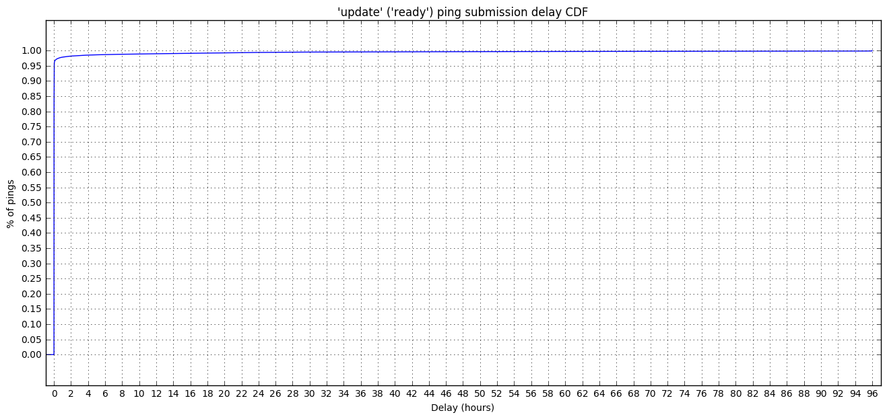

# Validate 'update' ping submissions on Nightly (`reason = ready`)

This analysis validates the `update` ping with `reason = ready`, which was introduced in [bug 1120372](https://bugzilla.mozilla.org/show_bug.cgi?id=1120372) and should be sent every time an update is downloaded and ready to be applied. We are going to verify that:

- the ping is received within a reasonable time after being created;
- we receive one ping per update;
- that the payload looks ok;
- check if the volume of update pings is within the expected range by cross-checking it with the main pings;
- that we don't receive many duplicates.


```python
import ujson as json
import matplotlib.pyplot as plt
import pandas as pd
import numpy as np
import plotly.plotly as py
import IPython

from plotly.graph_objs import *
from moztelemetry import get_pings_properties, get_one_ping_per_client
from moztelemetry.dataset import Dataset
from datetime import datetime, timedelta
from email.utils import parsedate_tz, mktime_tz, formatdate

%matplotlib inline
IPython.core.pylabtools.figsize(16, 7)
```
The `update` ping landed on the Nightly channel on the 27th of July, 2017. However, shortly after we had merge day. Let's try to get the first full-week of data after the merge week up to today: 6th of August to the 12th of August, 2017. Restrict to the data coming from the Nightly builds after the day the ping landed.


```python
update_pings = Dataset.from_source("telemetry") \
    .where(docType="OTHER") \
    .where(appUpdateChannel="nightly") \
    .where(submissionDate=lambda x: "20170806" <= x < "20170813") \
    .where(appBuildId=lambda x: "20170728" <= x < "20170813") \
    .records(sc, sample=1.0)
```
    fetching 180.82962MB in 11757 files...


```python
update_pings = update_pings.filter(lambda p: p.get("type") == "update")
```
### Define some misc functions


```python
def pct(a, b):
    return 100.0 * a / b

def dedupe(pings, duping_key):
    return pings\
            .map(lambda p: (p[duping_key], p))\
            .reduceByKey(lambda a, b: a if a["meta/Timestamp"] < b["meta/Timestamp"] else b)\
            .map(lambda pair: pair[1])
```
Misc functions to plot the CDF of the submission delay.


```python
MAX_DELAY_S = 60 * 60 * 96.0
HOUR_IN_S = 60 * 60.0

def setup_plot(title, max_x, area_border_x=0.1, area_border_y=0.1):
    plt.title(title)
    plt.xlabel("Delay (hours)")
    plt.ylabel("% of pings")

    plt.xticks(range(0, int(max_x) + 1, 2))
    plt.yticks(map(lambda y: y / 20.0, range(0, 21, 1)))

    plt.ylim(0.0 - area_border_y, 1.0 + area_border_y)
    plt.xlim(0.0 - area_border_x, max_x + area_border_x)

    plt.grid(True)

def plot_cdf(data, **kwargs):
    sortd = np.sort(data)
    ys = np.arange(len(sortd))/float(len(sortd))

    plt.plot(sortd, ys, **kwargs)
    
def calculate_submission_delay(p):
    created = datetime.fromtimestamp(p["meta/creationTimestamp"] / 1000.0 / 1000.0 / 1000.0)
    received = datetime.fromtimestamp(p["meta/Timestamp"] / 1000.0 / 1000.0 / 1000.0)
    sent = datetime.fromtimestamp(mktime_tz(parsedate_tz(p["meta/Date"]))) if p["meta/Date"] is not None else received
    clock_skew = received - sent

    return (received - created - clock_skew).total_seconds()
```
### Validate the ping payload
Check that the payload section contains the right entries with consistent values.


```python
subset = get_pings_properties(update_pings, ["id",
                                             "clientId",
                                             "meta/creationTimestamp",
                                             "meta/Date",
                                             "meta/Timestamp",
                                             "application/buildId",
                                             "application/channel",
                                             "application/version",
                                             "environment/system/os/name",
                                             "payload/reason",
                                             "payload/targetBuildId",
                                             "payload/targetChannel",
                                             "payload/targetVersion"])

ping_count = subset.count()
```
Quantify the percentage of duplicate pings we're receiving. We don't expect this value to be greater than ~1%, which is the amount we usually get from `main` and `crash`: as a rule of thumb, we threat anything less than 1% as *probably* well behaving.


```python
deduped_subset = dedupe(subset, "id")
deduped_count = deduped_subset.count()
print("Percentage of duplicate pings: {:.3f}".format(100.0 - pct(deduped_count, ping_count)))
```
    Percentage of duplicate pings: 0.236


The percentage of duplicate pings is within the expected range. Move on and verify the payload of the `update` pings.


```python
def validate_update_payload(p):
    PAYLOAD_KEYS = [
        "payload/reason",
        "payload/targetBuildId",
        "payload/targetChannel",
        "payload/targetVersion"
    ]

    # All the payload keys needs to be strings.
    for k in PAYLOAD_KEYS:
        if not isinstance(p.get(k), basestring):
            return ("'{}' is not a string".format(k), 1)
        
    # We only expect "reason" = ready.
    if p.get("payload/reason") != "ready":
        return ("Unexpected 'reason' {}".format(p.get("payload/reason"), 1))
        
    # For Nightly, the target channel should be the same as the
    # application channel.
    if p.get("payload/targetChannel") != p.get("application/channel"):
        return ("Target channel mismatch: expected {} got {}"\
                .format(p.get("payload/targetChannel"), p.get("application/channel")), 1)
                
    # The target buildId must be greater than the application build id.
    if p.get("payload/targetBuildId") <= p.get("application/buildId"):
        return ("Target buildId mismatch: {} must be more recent than {}"\
                .format(p.get("payload/targetBuildId"), p.get("application/buildId")), 1)
    
    return ("Ok", 1)

validation_results = deduped_subset.map(validate_update_payload).countByKey()
for k, v in sorted(validation_results.iteritems()):
    print("{}:\t{:.3f}%".format(k, pct(v, ping_count)))
```
    Ok:	99.712%
    Target buildId mismatch: 20170615030208 must be more recent than 20170731100325:	0.001%
    Target buildId mismatch: 20170630030203 must be more recent than 20170731100325:	0.001%
    Target buildId mismatch: 20170706060058 must be more recent than 20170731100325:	0.001%
    Target buildId mismatch: 20170723030206 must be more recent than 20170729100254:	0.001%
    Target buildId mismatch: 20170725030209 must be more recent than 20170731100325:	0.001%
    Target buildId mismatch: 20170726030207 must be more recent than 20170728100358:	0.001%
    Target buildId mismatch: 20170728100358 must be more recent than 20170731100325:	0.001%
    Target buildId mismatch: 20170729100254 must be more recent than 20170730100307:	0.001%
    Target buildId mismatch: 20170802100302 must be more recent than 20170803134456:	0.001%
    Target buildId mismatch: 20170802100302 must be more recent than 20170804100354:	0.001%
    Target buildId mismatch: 20170802100302 must be more recent than 20170804193726:	0.001%
    Target buildId mismatch: 20170802100302 must be more recent than 20170806100257:	0.002%
    Target buildId mismatch: 20170802100302 must be more recent than 20170807113452:	0.001%
    Target buildId mismatch: 20170802100302 must be more recent than 20170809100326:	0.001%
    Target buildId mismatch: 20170803100352 must be more recent than 20170805100334:	0.001%
    Target buildId mismatch: 20170803134456 must be more recent than 20170804100354:	0.001%
    Target buildId mismatch: 20170803134456 must be more recent than 20170804193726:	0.001%
    Target buildId mismatch: 20170803134456 must be more recent than 20170807113452:	0.001%
    Target buildId mismatch: 20170804100354 must be more recent than 20170804193726:	0.001%
    Target buildId mismatch: 20170804100354 must be more recent than 20170805100334:	0.002%
    Target buildId mismatch: 20170804100354 must be more recent than 20170806100257:	0.002%
    Target buildId mismatch: 20170804100354 must be more recent than 20170807113452:	0.001%
    Target buildId mismatch: 20170804193726 must be more recent than 20170805100334:	0.001%
    Target buildId mismatch: 20170804193726 must be more recent than 20170806100257:	0.001%
    Target buildId mismatch: 20170804193726 must be more recent than 20170807113452:	0.001%
    Target buildId mismatch: 20170804193726 must be more recent than 20170808100224:	0.001%
    Target buildId mismatch: 20170804193726 must be more recent than 20170809100326:	0.001%
    Target buildId mismatch: 20170804193726 must be more recent than 20170810100255:	0.001%
    Target buildId mismatch: 20170805100334 must be more recent than 20170806100257:	0.001%
    Target buildId mismatch: 20170805100334 must be more recent than 20170807113452:	0.001%
    Target buildId mismatch: 20170805100334 must be more recent than 20170809100326:	0.001%
    Target buildId mismatch: 20170806100257 must be more recent than 20170807113452:	0.002%
    Target buildId mismatch: 20170806100257 must be more recent than 20170808114032:	0.001%
    Target buildId mismatch: 20170806100257 must be more recent than 20170810100255:	0.001%
    Target buildId mismatch: 20170806100257 must be more recent than 20170812100345:	0.001%
    Target buildId mismatch: 20170807113452 must be more recent than 20170808114032:	0.002%
    Target buildId mismatch: 20170807113452 must be more recent than 20170809100326:	0.003%
    Target buildId mismatch: 20170807113452 must be more recent than 20170810100255:	0.002%
    Target buildId mismatch: 20170808100224 must be more recent than 20170808114032:	0.001%
    Target buildId mismatch: 20170808114032 must be more recent than 20170809100326:	0.005%
    Target buildId mismatch: 20170808114032 must be more recent than 20170810100255:	0.001%
    Target buildId mismatch: 20170809100326 must be more recent than 20170810100255:	0.002%
    Target buildId mismatch: 20170809100326 must be more recent than 20170811100330:	0.001%
    Target buildId mismatch: 20170810100255 must be more recent than 20170811100330:	0.001%
    Target buildId mismatch: 20170810100255 must be more recent than 20170812100345:	0.001%
    Target channel mismatch: expected nightly-cck-mint got nightly:	0.005%
    Target channel mismatch: expected nightly-cck-rambler got nightly:	0.002%


The vast majority of the data in the payload seems reasonable (99.71%).

However, a handful of `update` pings are reporting a `targetBuildId` which is older than the current build reported by the ping's environment: this is unexpected, as the the target build id must be always greater than the current one. After discussing this with the *update team*, it seems like this could either be due to Nigthly channel weirdness or to the customization applied by the [CCK tool](https://mike.kaply.com/cck2/). Additionally, some pings are reporting a `targetChannel` different than the one in the environment: this is definitely due to the CCK tool, given the *cck* entry in the channel name. These issues do not represent a problem, as most of the data is correct and their volume is fairly low.

## Check that we receive one ping per client and target update
For each ping, build a key with the client id and the target update details. Since we expect to have exactly one ping for each update bundle marked as *ready*, we don't expect duplicate keys.


```python
update_dupes = deduped_subset.map(lambda p: ((p.get("clientId"),
                                              p.get("payload/targetChannel"),
                                              p.get("payload/targetVersion"),
                                              p.get("payload/targetBuildId")), 1)).countByKey()

print("Percentage of pings related to the same update (for the same client):\t{:.3f}%"\
      .format(pct(sum([v for v in update_dupes.values() if v > 1]), deduped_count)))
```
    Percentage of pings related to the same update (for the same client):	1.742%


We're receiving `update` pings with different `documentId` related to the same target update bundle, for a few clients. One possible reason for this could be users having multiple copies of Firefox installed on their machine. Let's see if that's the case.


```python
clientIds_sending_dupes = [k[0] for k, v in update_dupes.iteritems() if v > 1]

def check_same_original_build(ping_list):
    # Build a "unique" identifier for the build by
    # concatenating the buildId, channel and version.
    unique_build_ids = [
        "{}{}{}".format(p.get("application/buildId"), p.get("application/channel"), p.get("application/version"))\
        for p in ping_list[1]
    ]
    
    # Remove the duplicates and return True if all the pings came
    # from the same build.
    return len(set(unique_build_ids)) < 2
    
# Count how many duplicates come from the same builds and how many come from
# different original builds.
original_builds_same =\
    deduped_subset.filter(lambda p: p.get("clientId") in clientIds_sending_dupes)\
                  .map(lambda p: ((p.get("clientId"),
                                   p.get("payload/targetChannel"),
                                   p.get("payload/targetVersion"),
                                   p.get("payload/targetBuildId")), [p]))\
                  .reduceByKey(lambda a, b: a + b)\
                  .filter(lambda p: len(p[1]) > 1)\
                  .map(check_same_original_build).countByValue()
                    
print("Original builds are identical:\t{:.3f}%"\
      .format(pct(original_builds_same.get(True), sum(original_builds_same.values()))))
print("Original builds are different:\t{:.3f}%"\
      .format(pct(original_builds_same.get(False), sum(original_builds_same.values()))))
```
    Original builds are identical:	66.219%
    Original builds are different:	33.781%


The data shows that the `update` pings with the same target version are not necessarily coming from the same profile being used on different Firefox builds/installation. After discussing this with the *update team*, it turns out that this can be explained by updates failing to apply: for certain classes of errors, we download the update blob again and thus send a new `update` ping with the same target version. This problem shows up in the [update orphaning](https://telemetry.mozilla.org/update-orphaning/) dashboard as well but, unfortunately, it only reports Release data.

## Validate the submission delay


```python
delays = deduped_subset.map(lambda p: calculate_submission_delay(p))
```

```python
setup_plot("'update' ('ready') ping submission delay CDF",
           MAX_DELAY_S / HOUR_IN_S, area_border_x=1.0)

plot_cdf(delays\
         .map(lambda d: d / HOUR_IN_S if d < MAX_DELAY_S else MAX_DELAY_S / HOUR_IN_S)\
         .collect(), label="CDF", linestyle="solid")

plt.show()
```





Almost all of the `update` ping are submitted within an hour from the update being ready.

## Make sure that the volume of incoming `update` pings is reasonable
This is a tricky one. The `update` ping with `reason = "ready"` is sent as soon as an update package is downloaded, verified and deemed ready to be applied. However, nothing guarantees that the update is immediately (or ever) applied. To check if the volume of `update` pings is in the ballpark, we can:

1. Get a list of client ids for a specific target update build id '20170809xxxxxx'.
2. Get the `main-ping` for that version of Firefox.
3. Check how many clients from the list at (1) are in the list at (2).

**Step 1** - Get the list of client ids updating to build '20170809xxxxxx'


```python
TARGET_BUILDID_MIN = '20170809000000'
TARGET_BUILDID_MAX = '20170809999999'

update_candidates =\
    deduped_subset.filter(lambda p: TARGET_BUILDID_MIN <= p.get("payload/targetBuildId") <= TARGET_BUILDID_MAX)
update_candidates_clientIds = dedupe(update_candidates, "clientId").map(lambda p: p.get("clientId"))
candidates_count = update_candidates_clientIds.count()
```
**Step 2** - Get the `main-ping` from that Nightly build and extract the list of client ids.


```python
updated_main_pings = Dataset.from_source("telemetry") \
    .where(docType="main") \
    .where(appUpdateChannel="nightly") \
    .where(submissionDate=lambda x: "20170809" <= x < "20170816") \
    .where(appBuildId=lambda x: TARGET_BUILDID_MIN <= x <= TARGET_BUILDID_MAX) \
    .records(sc, sample=1)
```
    fetching 9871.08945MB in 1135 files...


We just need the client ids and a few other fields to dedupe.


```python
subset_main = get_pings_properties(updated_main_pings, ["id",
                                                        "clientId",
                                                        "meta/Timestamp",
                                                        "application/buildId",
                                                        "application/channel",
                                                        "application/version"])
```
Start by deduping by document id. After that, only get a single ping per client and extract the list of client ids.


```python
deduped_main = dedupe(subset_main, "id")
updated_clientIds = dedupe(deduped_main, "clientId").map(lambda p: p.get("clientId"))
updated_count = updated_clientIds.count()
```
**Step 3** - Count how many clients that were meant to update actually updated in the following 7 days.


```python
matching_clientIds = update_candidates_clientIds.intersection(updated_clientIds)
matching_count = matching_clientIds.count()
```

```python
print("{:.3f}% of the clients that sent the update ping updated to the newer Nightly build within a week."\
      .format(pct(matching_count, candidates_count)))
print("{:.3f}% of the clients that were seen on the newer Nightly build sent an update ping."\
      .format(pct(candidates_count, updated_count)))
```
    93.419% of the clients that sent the update ping updated to the newer Nightly build within a week.
    79.678% of the clients that were seen on the newer Nightly build sent an update ping.


Roughly 80% of the clients that were seen in the new Nightly build also sent the update ping. The 95%ile of the `main-ping` data from Nightly 57 reaches us with a 9.4 hour delay (see [here](https://sql.telemetry.mozilla.org/queries/6576)), so most of the data should be in already. This could be due to a few reasons:

- some users are disabling automatic updates and no `update` ping is sent [in that case](https://bugzilla.mozilla.org/show_bug.cgi?id=1386619) if an update is manually triggered;
- some users are doing pave-over installs, by re-installing Firefox through the installer rather than relying on the update system;
- another unkown edge case in the client, that was not documented.


```python

```
