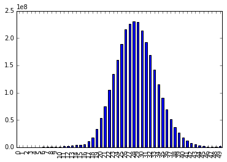

### Longitudinal Dataset Tutorial

The longitudinal dataset is logically organized as a table where rows represent profiles and columns the various metrics (e.g. startup time). Each field of the table contains a list of values, one per Telemetry submission received for that profile.

The dataset is going to be regenerated from scratch every week, this allows us to apply non backward compatible changes to the schema and not worry about merging procedures. 

The current version of the longitudinal dataset has been build with all main pings received from 1% of profiles across all channels after mid November, which is shortly after Unified Telemetry landed. Future version will store up to 180 days of data.


```python
import matplotlib.pyplot as plt
import pandas as pd
import numpy as np
import plotly.plotly as py

%pylab inline
```
    Populating the interactive namespace from numpy and matplotlib


```python
sc.defaultParallelism
```


    32


The longitudinal dataset can be accessed as a Spark [DataFrame](https://spark.apache.org/docs/1.5.2/api/python/pyspark.sql.html#pyspark.sql.DataFrame), which is a distributed collection of data organized into named columns. It is conceptually equivalent to a table in a relational database or a data frame in R/Python.


```python
frame = sqlContext.sql("SELECT * FROM longitudinal")
```
Number of profiles:


```python
frame.count()
```


    5421821


The dataset contains all histograms but it doesn't yet include all metrics stored in the various sections of the pings. See the [code](https://github.com/vitillo/telemetry-batch-view/blob/longitudinal/src/main/scala/streams/Longitudinal.scala#L68) that generates the dataset for a complete list of supported metrics. More metrics are going to be included in future versions of the dataset, inclusion of specific metrics can be prioritized by filing a bug.

### Scalar metrics

A Spark bug is slowing down the *first* and *take* methods on a dataframe. A way around that for now is to first convert the dataframe to a rdd and then invoke *first* or *take*, e.g.:


```python
first = frame.filter("normalized_channel = 'release'")\
    .select("build",
            "system", 
            "gc_ms",
            "fxa_configured",
            "browser_set_default_always_check",
            "browser_set_default_dialog_prompt_rawcount")\
    .rdd.first()
```
As mentioned earlier on, each field of the dataframe is an array containing one value per submission per client. The submissions are chronologically sorted.


```python
len(first.build)
```


    103


```python
first.build[:5]
```


    [Row(application_id=u'{ec8030f7-c20a-464f-9b0e-13a3a9e97384}', application_name=u'Firefox', architecture=u'x86', architectures_in_binary=None, build_id=u'20160210153822', version=u'44.0.2', vendor=u'Mozilla', platform_version=u'44.0.2', xpcom_abi=u'x86-msvc', hotfix_version=u'20160128.01'),
     Row(application_id=u'{ec8030f7-c20a-464f-9b0e-13a3a9e97384}', application_name=u'Firefox', architecture=u'x86', architectures_in_binary=None, build_id=u'20160210153822', version=u'44.0.2', vendor=u'Mozilla', platform_version=u'44.0.2', xpcom_abi=u'x86-msvc', hotfix_version=u'20160128.01'),
     Row(application_id=u'{ec8030f7-c20a-464f-9b0e-13a3a9e97384}', application_name=u'Firefox', architecture=u'x86', architectures_in_binary=None, build_id=u'20160210153822', version=u'44.0.2', vendor=u'Mozilla', platform_version=u'44.0.2', xpcom_abi=u'x86-msvc', hotfix_version=u'20160128.01'),
     Row(application_id=u'{ec8030f7-c20a-464f-9b0e-13a3a9e97384}', application_name=u'Firefox', architecture=u'x86', architectures_in_binary=None, build_id=u'20160210153822', version=u'44.0.2', vendor=u'Mozilla', platform_version=u'44.0.2', xpcom_abi=u'x86-msvc', hotfix_version=u'20160128.01'),
     Row(application_id=u'{ec8030f7-c20a-464f-9b0e-13a3a9e97384}', application_name=u'Firefox', architecture=u'x86', architectures_in_binary=None, build_id=u'20160210153822', version=u'44.0.2', vendor=u'Mozilla', platform_version=u'44.0.2', xpcom_abi=u'x86-msvc', hotfix_version=u'20160128.01')]


Different sections of the ping are stored in different fields of the dataframe. Refer to the schema of the dataframe for a complete layout.


```python
first.system[0]
```


    Row(memory_mb=1909, virtual_max_mb=None, is_wow64=True)


Dataframes support fields that can contain structs, maps, arrays, scalars and combination thereof. Note that in the previous example the system field is an array of [Rows](https://spark.apache.org/docs/1.5.2/api/python/pyspark.sql.html#pyspark.sql.Row). You can think of a Row as a struct that allows each field to be accessed invididually. 


```python
first.system[0].memory_mb
```


    1909


### Histograms

Not all profiles have all histograms. If a certain histogram, say GC_MS, is N/A for all submissions of a profile, then the field in the DataFrame will be N/A.


```python
first.gc_ms == None
```


    True


If at least one histogram is present in the history of a profile, then all other submission that do not have that histogram will be initialized with an empty histogram.

Flag and count "histograms" are represented as scalars.


```python
first.fxa_configured[:5]
```


    [False, False, False, False, False]


Boolean histograms are represented with an array of two integers. Similarly, enumerated histograms are represented with an array of N integers.


```python
first.browser_set_default_always_check[:5]
```


    [[0, 1], [0, 0], [0, 0], [0, 1], [0, 1]]


Exponential and linear histograms are represented as a struct containing an array of N integers (*values* field) and the sum of the entries (*sum* field).


```python
first.browser_set_default_dialog_prompt_rawcount[:5]
```


    [Row(values=[1, 0, 0, 0, 0, 0, 0, 0, 0, 0, 0, 0, 0, 0, 0], sum=0),
     Row(values=[0, 0, 0, 0, 0, 0, 0, 0, 0, 0, 0, 0, 0, 0, 0], sum=0),
     Row(values=[0, 0, 0, 0, 0, 0, 0, 0, 0, 0, 0, 0, 0, 0, 0], sum=0),
     Row(values=[1, 0, 0, 0, 0, 0, 0, 0, 0, 0, 0, 0, 0, 0, 0], sum=0),
     Row(values=[1, 0, 0, 0, 0, 0, 0, 0, 0, 0, 0, 0, 0, 0, 0], sum=0)]


Keyed histograms are stored within a map from strings to values where the values depend on the histogram types and and have the same structure as mentioned above.


```python
frame.select("search_counts").rdd.take(2)
```


    [Row(search_counts={u'amazondotcom-de.searchbar': [0, 0, 0, 0, 0, 0, 0, 0, 0, 0, 0, 0, 0, 1, 0, 0, 0, 0, 0, 0, 0, 0, 0, 0, 0, 0, 0, 0, 0, 0, 0, 0, 0, 0, 0, 0, 0, 0, 0, 0, 0, 0, 0, 0, 0, 0, 0, 0, 0, 0, 0, 0, 0, 0, 0, 0, 0, 0, 0, 0, 0, 0, 0, 0, 0, 0, 0, 0, 0, 0, 0, 0, 0, 0, 0, 0, 0, 0, 0, 0, 0, 0, 0, 0, 0, 0, 0, 0, 0, 0, 0, 0, 0, 0, 0, 0, 0, 0, 0, 0, 0, 0, 0], u'google.searchbar': [0, 0, 0, 0, 0, 0, 0, 1, 0, 1, 0, 1, 0, 0, 0, 0, 1, 1, 1, 1, 1, 0, 0, 0, 0, 0, 0, 0, 0, 0, 0, 0, 0, 0, 0, 0, 1, 2, 1, 1, 1, 1, 0, 1, 0, 1, 5, 1, 1, 5, 1, 0, 1, 1, 1, 1, 1, 0, 2, 1, 1, 1, 1, 6, 1, 0, 0, 1, 1, 3, 1, 0, 3, 2, 4, 0, 1, 1, 0, 0, 2, 2, 0, 0, 3, 0, 0, 0, 2, 0, 0, 0, 0, 0, 0, 1, 2, 0, 0, 0, 1, 2, 0], u'google.urlbar': [0, 0, 0, 0, 0, 0, 0, 0, 0, 0, 0, 0, 0, 0, 0, 0, 0, 0, 0, 0, 0, 0, 0, 0, 0, 0, 0, 0, 0, 0, 0, 0, 0, 0, 0, 0, 0, 0, 0, 0, 0, 0, 0, 0, 0, 0, 0, 0, 0, 0, 0, 0, 0, 0, 0, 0, 0, 0, 0, 0, 0, 0, 0, 0, 0, 0, 0, 0, 0, 0, 0, 0, 0, 0, 0, 0, 0, 0, 0, 0, 0, 0, 0, 0, 0, 0, 0, 0, 0, 1, 0, 1, 0, 0, 0, 0, 0, 0, 1, 0, 0, 0, 0], u'other-Bing\xae.searchbar': [0, 0, 0, 1, 0, 0, 0, 0, 0, 0, 0, 0, 2, 0, 0, 0, 0, 0, 0, 0, 0, 0, 0, 0, 2, 0, 0, 0, 0, 0, 0, 0, 0, 0, 0, 0, 0, 0, 0, 0, 0, 0, 0, 0, 0, 0, 0, 0, 0, 0, 0, 0, 0, 0, 0, 0, 0, 0, 0, 0, 0, 0, 0, 0, 0, 0, 0, 0, 0, 0, 0, 0, 0, 0, 0, 0, 0, 0, 0, 0, 0, 0, 0, 0, 0, 0, 0, 0, 0, 0, 0, 0, 0, 0, 0, 0, 0, 0, 0, 0, 0, 0, 0]}),
     Row(search_counts={u'yandex.urlbar': [0, 0, 0, 0, 0, 0, 0, 0, 0, 0, 0, 0, 0, 0, 0, 0, 0, 0, 0, 0, 0, 0, 0, 0, 1, 0, 0, 0, 0, 0, 0, 0, 0, 0, 0, 0, 0, 0, 0, 0, 0, 0, 0, 0, 0, 0, 0, 0, 0, 0, 0, 0, 0, 0, 0, 0, 0, 0, 0, 3, 0, 0, 0, 1, 0, 0, 0, 0, 0, 0, 0, 0, 0, 0, 0, 0, 0, 0, 0, 0, 1, 0, 0, 0, 0, 0, 0, 0, 0, 0, 0, 0, 0, 0, 0, 0, 0, 0, 0, 0, 0, 0, 1, 0, 0, 0, 0, 0, 0, 0, 0, 0, 1, 1, 0, 0, 0, 0, 0, 0, 0, 0, 0, 0, 0, 0, 0, 0, 0, 0, 0, 0, 0, 0, 0, 1, 2, 0, 0, 0, 0, 1, 0, 0, 0, 0, 1, 0, 0, 0, 1, 1, 0, 0, 0, 0, 0, 0, 0, 0, 0, 0, 0, 0, 0, 0, 0, 0, 1, 1, 0, 0, 0, 0, 0, 0, 0, 0, 0, 0, 0, 0, 0, 1, 0, 0, 0, 0, 0, 0, 0, 0, 0, 0, 0, 0, 0, 0, 0, 0, 0, 0, 0, 0, 0, 0, 0, 0, 0, 0, 0, 0, 1, 0, 0, 0, 0, 0, 0, 0, 0, 0, 0, 0, 0, 0, 0, 0, 0, 0, 0, 0, 0, 0, 0, 0, 0, 0, 0, 0, 0, 0, 0, 0, 0, 0, 0, 0, 0, 0, 0, 0, 1, 0, 0, 0, 0, 0, 0, 0, 0, 0, 0, 0, 0, 0, 0, 0, 0, 0, 0, 0, 0, 0, 0, 0, 0, 0, 0, 0, 0, 0, 0, 0, 0, 0, 0, 0, 0, 0, 0, 0, 0, 0, 0, 0, 0, 0, 0, 0, 0, 0, 0, 0, 0, 0, 1, 0, 0, 0, 0, 0, 1, 0, 0, 0, 0, 0, 0, 0, 0, 0, 0, 0, 0, 0, 0, 0, 0, 0, 0, 1, 0, 0, 0, 0, 0, 0, 0, 0, 0, 0, 1, 0, 0, 0, 0, 0, 0, 0, 0, 0, 0, 0, 0, 0, 0, 0, 0, 0, 0, 0, 0, 0, 0, 0, 0, 0, 1, 0, 0, 0, 0, 0, 0, 0, 0, 0, 0, 0, 0, 0, 0, 0, 0, 0, 0, 0, 0, 0, 0, 0, 0, 1, 0, 1, 0, 0, 0, 0, 0, 0, 0, 0, 0, 0, 0, 0, 0, 0, 0, 0, 0, 0, 0, 0, 0, 1, 0, 0, 0, 0, 0, 0, 0, 0, 0, 0, 0, 0, 0, 0, 0, 0, 0, 0, 0, 0, 0, 0, 0, 0, 0, 0, 0, 0, 0, 0, 0, 0, 0, 1, 0, 0, 0, 1, 0, 0, 0, 0, 0, 0, 0, 0, 0, 0, 0, 0, 0, 0, 0, 0, 0, 0, 0, 0, 0, 0, 0, 0, 0, 0, 0, 0, 0, 1, 0, 0, 0, 0, 0, 0, 0, 0, 0, 0, 0, 0, 0, 0, 0, 0, 0, 0, 1, 0, 0, 0, 0, 0, 0, 0, 1, 1, 0, 0, 0, 0, 0, 0, 0, 0, 0, 0, 0, 0, 0, 0, 0, 0, 0, 0, 0, 0, 0, 0, 0, 0, 0, 0, 0, 0, 0, 0, 0, 0, 0, 0, 0, 0, 0, 0, 0, 0, 0, 1, 1, 0, 0, 0, 2, 0, 0, 0, 0, 0, 0, 0, 0, 0, 0, 0, 0, 0, 0, 0, 1, 0, 0, 0, 0, 0, 0, 0, 0, 0, 0, 0, 0, 0, 0, 0, 0, 0, 0, 0, 0, 0, 0, 0, 0, 0, 0, 1, 0, 0, 0, 0, 0, 0, 0, 0, 0, 0, 0, 0, 1, 0, 0, 0, 0, 0, 0, 0, 0, 0, 1, 0, 0, 0, 0, 0, 0, 0, 0, 0, 0, 0, 0, 0, 0, 0, 0, 1, 0, 0, 0, 0, 0, 0, 0, 0, 0, 0, 0, 0, 0, 0, 1, 0, 1, 0, 0, 0, 0, 0, 0, 0, 0, 0, 0, 1, 0, 0, 0, 0, 0, 0, 0, 0, 1, 0, 0, 0, 0, 0, 0, 0, 0, 0, 0, 0, 0, 0, 1, 0, 0, 0, 0, 0, 0, 0, 0, 0, 0, 0, 0, 0, 0, 0, 0, 0, 1, 0, 0, 0, 0, 0, 0, 0, 0, 0, 0, 0, 0, 0, 0, 0, 0, 0, 0, 0, 0, 0, 1, 0, 0, 0, 0, 0, 1, 0, 0, 0, 0, 0, 1, 0, 0, 0, 0, 0, 0, 2, 0, 0, 0, 0, 0, 0, 0, 1, 0, 0, 0, 0, 0, 0, 0, 0, 0, 0, 0, 0, 0, 0, 0, 0, 1, 0, 0, 0, 0, 0, 0, 2, 1, 0, 0, 0, 0, 1, 1, 0, 0, 0, 0, 0, 0, 1, 0, 0, 0, 0, 0, 0, 0, 0, 0, 0, 0, 0, 0, 0, 0, 0, 1, 0, 0, 0, 0, 0, 0, 0, 0, 0, 0, 0, 0, 0, 0, 0, 0, 0, 0, 0, 0, 0, 0, 0, 0, 0, 0, 0, 1, 0, 0, 0, 0, 0, 0, 0, 0, 0, 0, 0, 0, 0, 0, 0, 0, 0, 0, 0, 0, 1, 0, 0, 0, 0, 0, 0, 0, 0, 0, 0, 0, 0, 0, 0, 0, 0, 0, 0, 0, 0, 3, 1, 0, 0, 0, 0, 0, 0, 0, 0, 0, 0, 0, 0, 0, 1, 0, 0, 0, 0, 0, 0, 0, 1, 0, 0, 0, 0, 0, 0, 1, 0, 0, 0, 0, 0, 0, 0, 0, 0, 0, 0, 0, 0, 0, 0, 0, 1, 0, 0, 0, 0, 0, 0, 0, 0, 0, 0, 0, 0, 0, 0, 0, 0, 0, 0, 0, 0, 0, 0, 0, 0, 0, 0, 0, 0, 2, 0, 0, 0, 0, 0, 0, 0, 0, 0, 0, 0, 0, 3, 0, 0, 0, 0, 0, 0, 0, 0, 0, 0, 0, 0, 0, 0, 0, 0, 0, 0, 0, 0, 0, 0, 0], u'yandex.searchbar': [0, 0, 0, 0, 0, 0, 0, 0, 0, 0, 0, 0, 0, 0, 0, 0, 0, 0, 0, 1, 0, 0, 0, 0, 0, 0, 0, 0, 0, 0, 0, 0, 0, 0, 0, 0, 0, 0, 0, 0, 0, 0, 0, 0, 0, 0, 0, 0, 0, 0, 0, 0, 0, 0, 0, 1, 0, 0, 0, 0, 0, 0, 0, 0, 0, 0, 0, 0, 0, 0, 0, 0, 0, 0, 0, 0, 0, 0, 0, 0, 0, 0, 0, 0, 0, 0, 0, 0, 0, 0, 0, 0, 0, 0, 0, 0, 0, 0, 0, 0, 0, 0, 0, 0, 0, 0, 0, 0, 0, 0, 0, 0, 0, 0, 0, 0, 0, 0, 0, 0, 0, 0, 0, 0, 0, 0, 0, 0, 0, 0, 0, 0, 0, 0, 0, 0, 0, 0, 0, 0, 0, 0, 0, 0, 1, 0, 0, 0, 0, 0, 1, 0, 0, 0, 0, 0, 0, 0, 0, 0, 0, 0, 0, 0, 0, 0, 0, 0, 0, 0, 0, 0, 0, 0, 0, 0, 0, 0, 0, 0, 0, 0, 0, 0, 0, 0, 0, 0, 0, 0, 0, 0, 0, 0, 0, 0, 0, 0, 0, 0, 0, 0, 0, 0, 0, 0, 0, 0, 0, 0, 0, 0, 0, 0, 0, 0, 0, 0, 0, 0, 0, 0, 0, 0, 0, 0, 0, 0, 0, 0, 0, 0, 0, 0, 0, 1, 0, 0, 0, 0, 0, 0, 1, 0, 0, 0, 0, 0, 0, 0, 0, 0, 0, 1, 0, 0, 0, 0, 0, 0, 0, 0, 0, 0, 0, 0, 0, 0, 0, 0, 0, 0, 0, 0, 0, 0, 0, 0, 0, 0, 0, 0, 0, 0, 0, 0, 0, 0, 0, 0, 0, 0, 0, 0, 0, 0, 0, 0, 0, 0, 0, 0, 0, 0, 0, 0, 0, 0, 0, 0, 0, 0, 0, 0, 0, 0, 0, 0, 0, 0, 0, 0, 0, 0, 0, 0, 0, 0, 0, 0, 0, 0, 0, 0, 0, 0, 0, 0, 0, 0, 0, 0, 0, 0, 0, 0, 0, 0, 0, 0, 0, 0, 0, 1, 0, 0, 0, 0, 0, 0, 0, 0, 0, 0, 0, 0, 0, 0, 1, 0, 0, 0, 0, 0, 0, 0, 0, 0, 0, 0, 0, 0, 0, 0, 0, 0, 0, 0, 0, 0, 0, 0, 0, 0, 0, 0, 0, 0, 0, 0, 0, 0, 0, 0, 0, 0, 0, 0, 0, 0, 0, 0, 0, 0, 0, 0, 0, 0, 0, 0, 0, 0, 0, 0, 0, 0, 0, 0, 0, 0, 0, 0, 0, 0, 0, 0, 0, 0, 0, 0, 0, 0, 0, 0, 0, 0, 0, 0, 0, 0, 0, 0, 0, 0, 0, 0, 0, 0, 0, 0, 0, 0, 0, 0, 0, 0, 0, 0, 0, 1, 0, 0, 0, 0, 0, 0, 0, 0, 0, 0, 0, 0, 0, 0, 0, 0, 0, 0, 0, 0, 0, 0, 0, 0, 0, 0, 0, 0, 0, 0, 0, 0, 0, 0, 1, 0, 0, 0, 0, 0, 0, 0, 0, 1, 0, 0, 0, 0, 0, 0, 0, 0, 0, 0, 0, 0, 0, 0, 0, 0, 0, 0, 0, 0, 0, 0, 0, 0, 0, 0, 0, 0, 1, 1, 0, 0, 0, 0, 0, 0, 0, 0, 0, 0, 0, 0, 0, 0, 0, 0, 0, 0, 0, 0, 0, 0, 0, 0, 0, 0, 1, 1, 0, 0, 0, 0, 0, 0, 0, 0, 0, 0, 0, 1, 0, 0, 0, 1, 0, 0, 1, 0, 0, 0, 0, 0, 0, 0, 0, 0, 0, 0, 0, 1, 1, 0, 0, 0, 0, 0, 0, 0, 0, 0, 0, 1, 1, 0, 0, 0, 1, 0, 0, 0, 0, 2, 1, 0, 0, 0, 0, 0, 0, 1, 0, 0, 0, 0, 0, 0, 0, 0, 0, 0, 1, 0, 1, 0, 0, 0, 0, 0, 0, 1, 0, 0, 0, 0, 0, 0, 0, 0, 0, 0, 0, 0, 0, 0, 0, 0, 0, 1, 0, 0, 0, 0, 0, 0, 0, 0, 0, 0, 0, 0, 0, 0, 0, 0, 0, 0, 0, 0, 0, 0, 1, 0, 0, 0, 0, 0, 0, 0, 1, 1, 1, 0, 0, 0, 0, 0, 0, 0, 0, 0, 0, 0, 0, 0, 0, 0, 0, 0, 0, 0, 0, 0, 0, 0, 0, 0, 0, 0, 0, 0, 0, 0, 0, 0, 0, 0, 0, 0, 0, 0, 0, 0, 0, 0, 0, 0, 0, 0, 0, 0, 0, 0, 0, 0, 0, 0, 0, 0, 0, 0, 0, 0, 0, 0, 0, 0, 0, 0, 0, 0, 0, 0, 0, 0, 1, 0, 0, 0, 0, 0, 0, 0, 1, 0, 0, 0, 0, 0, 0, 0, 0, 0, 0, 0, 0, 0, 0, 0, 0, 0, 0, 0, 0, 0, 0, 0, 0, 0, 0, 0, 0, 0, 0, 0, 0, 0, 0, 2, 0, 0, 0, 0, 0, 1, 0, 0, 0, 0, 0, 0, 0, 0, 0, 0, 0, 0, 0, 0, 0, 0, 0, 0, 0, 0, 0, 0, 0, 0, 0, 0, 0, 1, 0, 0, 0, 0, 0, 0, 0, 0, 0, 0, 0, 0, 0, 0, 0, 0, 0, 0, 0, 0, 0, 0, 0, 0, 0, 0, 0, 0, 0, 0, 0, 0, 0, 0, 0, 0, 0, 0, 0, 0, 0, 0, 0, 0, 0, 0, 0, 0, 0, 0, 0, 0, 0, 0, 0, 0, 0, 0, 0, 0, 0, 0, 0, 0, 0, 0, 0, 1, 3, 0, 0, 0, 0, 0, 1, 0, 0, 1, 0, 0, 0, 0, 0, 0, 0, 0, 0, 0, 0, 0, 0, 0, 0, 0, 0, 0, 0, 0, 0, 0, 0, 0, 0, 1, 0, 0, 0, 0, 0, 0, 0, 0, 0, 0, 0, 0, 0, 0, 0, 0, 0, 0, 0, 0, 0, 0, 0, 0, 0, 0, 0, 0, 0, 0, 0, 0, 0, 2, 0, 0, 0, 0, 1], u'yandex.contextmenu': [0, 0, 0, 0, 0, 0, 0, 0, 0, 0, 0, 0, 0, 0, 0, 0, 0, 0, 0, 0, 0, 0, 0, 0, 0, 0, 0, 0, 0, 0, 0, 0, 0, 0, 0, 0, 0, 0, 0, 0, 0, 0, 0, 0, 0, 0, 0, 0, 0, 0, 0, 0, 0, 0, 0, 0, 0, 0, 0, 0, 0, 0, 0, 0, 0, 0, 0, 0, 0, 0, 0, 0, 0, 0, 0, 0, 0, 0, 0, 0, 0, 0, 0, 0, 0, 0, 0, 0, 0, 0, 0, 0, 0, 0, 0, 0, 0, 0, 0, 0, 0, 0, 0, 0, 0, 0, 0, 0, 0, 0, 0, 0, 0, 0, 0, 0, 0, 0, 0, 0, 0, 0, 0, 0, 0, 0, 0, 0, 0, 0, 0, 0, 0, 0, 0, 0, 0, 0, 0, 0, 0, 0, 0, 0, 0, 0, 0, 0, 0, 0, 0, 0, 0, 0, 0, 0, 0, 0, 0, 0, 0, 0, 0, 0, 0, 0, 0, 0, 0, 0, 0, 0, 0, 0, 0, 0, 0, 0, 0, 0, 0, 0, 0, 0, 0, 0, 0, 0, 0, 0, 0, 0, 0, 0, 0, 0, 0, 0, 0, 0, 0, 0, 0, 0, 0, 0, 0, 0, 0, 0, 0, 0, 0, 0, 0, 0, 0, 0, 0, 0, 0, 0, 0, 0, 0, 0, 0, 0, 0, 0, 0, 0, 0, 0, 0, 0, 0, 0, 0, 0, 0, 0, 0, 0, 0, 0, 0, 0, 0, 0, 0, 0, 0, 0, 0, 0, 0, 0, 0, 0, 0, 0, 0, 0, 0, 0, 0, 0, 0, 0, 0, 0, 0, 0, 0, 0, 0, 0, 0, 0, 0, 0, 0, 0, 0, 0, 0, 0, 0, 0, 0, 0, 0, 0, 0, 0, 0, 0, 0, 0, 0, 0, 0, 0, 0, 0, 0, 0, 0, 0, 0, 0, 0, 0, 0, 0, 0, 0, 0, 0, 0, 0, 0, 0, 0, 0, 0, 0, 0, 0, 0, 0, 0, 0, 0, 0, 0, 0, 0, 0, 0, 0, 0, 0, 0, 0, 0, 0, 0, 0, 0, 0, 0, 0, 0, 0, 0, 0, 0, 0, 0, 0, 0, 0, 0, 0, 0, 0, 0, 0, 0, 0, 0, 0, 0, 0, 0, 0, 0, 0, 0, 0, 0, 0, 0, 0, 0, 0, 0, 0, 0, 0, 0, 0, 0, 0, 0, 0, 0, 0, 0, 0, 0, 0, 0, 0, 0, 0, 0, 0, 0, 0, 0, 0, 0, 0, 0, 0, 0, 0, 0, 0, 0, 0, 0, 0, 0, 0, 0, 0, 0, 0, 0, 0, 0, 0, 0, 0, 0, 0, 0, 0, 0, 0, 0, 0, 0, 0, 0, 0, 0, 0, 0, 0, 0, 0, 0, 0, 0, 0, 0, 0, 0, 0, 0, 0, 0, 0, 0, 0, 0, 0, 0, 0, 0, 0, 0, 0, 0, 0, 0, 0, 0, 0, 0, 0, 0, 0, 0, 0, 0, 0, 0, 0, 0, 0, 0, 0, 0, 0, 0, 0, 0, 0, 0, 0, 0, 0, 0, 0, 0, 0, 0, 0, 0, 0, 0, 0, 0, 0, 0, 0, 0, 0, 0, 0, 0, 0, 0, 0, 0, 0, 0, 0, 0, 0, 0, 0, 0, 0, 0, 0, 0, 0, 0, 0, 0, 0, 0, 0, 0, 0, 0, 0, 0, 0, 0, 0, 0, 0, 0, 0, 0, 0, 0, 0, 0, 0, 0, 0, 0, 0, 0, 0, 0, 0, 0, 0, 0, 0, 0, 0, 0, 0, 0, 0, 0, 0, 0, 0, 0, 0, 0, 0, 0, 0, 0, 0, 0, 0, 0, 0, 0, 0, 0, 0, 0, 0, 0, 0, 0, 0, 0, 0, 0, 0, 0, 0, 0, 0, 0, 0, 0, 0, 0, 0, 0, 0, 0, 0, 0, 0, 0, 0, 0, 0, 0, 0, 0, 0, 0, 0, 0, 0, 0, 0, 0, 0, 0, 0, 0, 0, 0, 0, 0, 0, 0, 0, 0, 0, 0, 0, 0, 0, 0, 0, 0, 0, 0, 0, 0, 0, 0, 0, 0, 0, 0, 0, 0, 0, 0, 0, 0, 0, 0, 0, 0, 0, 0, 0, 0, 0, 0, 0, 0, 0, 0, 0, 0, 0, 0, 0, 0, 0, 0, 0, 0, 0, 0, 0, 0, 0, 0, 0, 0, 0, 0, 0, 0, 0, 0, 0, 0, 0, 0, 0, 0, 0, 0, 0, 0, 0, 0, 0, 0, 0, 0, 0, 0, 0, 0, 0, 0, 0, 0, 0, 0, 0, 0, 0, 0, 0, 0, 0, 0, 0, 0, 0, 0, 0, 0, 0, 0, 0, 0, 0, 0, 0, 0, 0, 0, 0, 0, 0, 0, 0, 0, 0, 0, 0, 0, 0, 0, 0, 0, 0, 0, 0, 0, 0, 0, 0, 0, 0, 0, 0, 0, 0, 0, 0, 0, 0, 0, 0, 0, 0, 0, 0, 0, 0, 0, 0, 0, 0, 0, 0, 0, 0, 0, 0, 0, 0, 0, 0, 0, 0, 0, 0, 0, 0, 0, 0, 0, 0, 0, 0, 0, 0, 0, 0, 0, 0, 0, 0, 0, 0, 0, 0, 0, 0, 0, 0, 0, 0, 0, 0, 0, 0, 0, 0, 0, 0, 0, 0, 0, 0, 0, 0, 0, 0, 0, 0, 0, 0, 0, 0, 0, 0, 0, 0, 0, 0, 0, 0, 0, 0, 0, 0, 0, 0, 0, 0, 0, 0, 0, 0, 0, 0, 0, 1, 0, 0, 0, 0, 0, 0, 0, 0, 0, 0, 0, 0, 0, 0, 0, 0, 0, 0, 0, 0, 0, 0, 0, 0, 0, 0, 0, 0, 0, 0, 0, 0, 0, 0, 0, 0, 0, 0, 0, 0, 0, 0, 0, 0, 0, 0, 0, 0, 0, 0, 0, 0, 0, 0, 0, 0, 0, 0, 0, 0, 0, 0, 0, 0, 0, 0, 0, 0, 0, 0, 0, 0, 0, 0, 0, 0, 0, 0, 0, 0, 0, 0, 0, 0, 0, 0, 0, 0, 0, 0, 0, 0, 0, 0, 0, 0, 0, 0, 0], u'google.searchbar': [0, 0, 0, 0, 0, 0, 0, 0, 0, 0, 0, 0, 0, 0, 0, 0, 0, 0, 0, 0, 0, 0, 0, 0, 0, 0, 0, 0, 0, 0, 0, 0, 0, 0, 0, 0, 0, 0, 0, 0, 0, 0, 0, 0, 0, 0, 0, 0, 0, 0, 0, 0, 0, 0, 0, 0, 0, 0, 0, 0, 0, 0, 0, 0, 0, 0, 0, 0, 0, 0, 0, 0, 0, 0, 0, 0, 0, 0, 0, 0, 0, 0, 0, 0, 0, 0, 0, 0, 0, 0, 0, 0, 0, 0, 0, 0, 0, 0, 0, 0, 0, 0, 0, 0, 0, 0, 0, 0, 0, 0, 0, 0, 0, 0, 0, 0, 0, 0, 0, 0, 0, 0, 0, 0, 0, 0, 0, 0, 0, 0, 0, 0, 0, 0, 0, 0, 0, 0, 1, 0, 0, 0, 0, 0, 0, 0, 0, 0, 0, 0, 0, 0, 0, 0, 0, 0, 0, 0, 0, 0, 0, 0, 0, 0, 0, 0, 0, 0, 0, 0, 0, 0, 0, 0, 0, 0, 0, 0, 0, 0, 0, 0, 0, 0, 0, 0, 0, 0, 0, 0, 0, 0, 0, 0, 0, 0, 0, 0, 0, 0, 0, 0, 0, 0, 0, 0, 0, 0, 0, 0, 0, 0, 1, 0, 0, 0, 0, 0, 0, 0, 0, 0, 0, 0, 0, 0, 0, 0, 0, 0, 0, 0, 0, 0, 0, 0, 0, 0, 0, 0, 0, 0, 0, 0, 0, 0, 0, 0, 0, 0, 0, 0, 0, 0, 0, 0, 0, 0, 0, 0, 0, 0, 0, 0, 0, 0, 0, 0, 0, 0, 0, 0, 0, 0, 0, 0, 0, 0, 0, 0, 1, 0, 0, 0, 0, 0, 0, 0, 0, 0, 0, 0, 0, 0, 0, 0, 0, 0, 0, 0, 0, 0, 0, 0, 0, 0, 0, 0, 0, 0, 0, 0, 0, 0, 0, 0, 0, 0, 0, 0, 0, 0, 0, 0, 0, 0, 0, 0, 0, 0, 0, 0, 0, 0, 0, 0, 0, 0, 0, 0, 0, 0, 0, 0, 0, 0, 0, 0, 0, 0, 0, 0, 0, 0, 0, 0, 0, 0, 0, 0, 0, 0, 0, 0, 0, 0, 0, 0, 0, 0, 0, 0, 0, 0, 0, 0, 0, 0, 0, 0, 0, 0, 0, 0, 0, 0, 0, 0, 0, 0, 0, 0, 0, 0, 0, 0, 0, 0, 0, 0, 0, 0, 0, 0, 0, 0, 0, 0, 0, 0, 0, 0, 0, 0, 0, 0, 0, 0, 0, 0, 0, 0, 0, 0, 0, 0, 0, 0, 0, 0, 0, 0, 0, 0, 0, 0, 0, 0, 0, 0, 0, 0, 0, 0, 0, 0, 0, 0, 0, 0, 0, 0, 0, 0, 0, 0, 0, 0, 0, 0, 0, 0, 0, 0, 0, 0, 0, 0, 0, 0, 1, 0, 0, 0, 0, 0, 0, 0, 0, 0, 0, 0, 0, 0, 0, 0, 0, 0, 0, 0, 0, 0, 0, 0, 0, 0, 0, 0, 0, 0, 0, 0, 0, 0, 0, 0, 0, 0, 0, 0, 0, 0, 1, 0, 0, 0, 0, 0, 0, 0, 0, 0, 0, 0, 0, 0, 0, 0, 0, 0, 0, 0, 0, 0, 0, 0, 0, 0, 0, 0, 0, 0, 0, 0, 0, 0, 0, 0, 0, 0, 0, 0, 0, 0, 0, 0, 0, 0, 0, 0, 0, 0, 0, 0, 0, 0, 0, 0, 0, 0, 0, 0, 0, 0, 0, 0, 0, 0, 0, 0, 0, 0, 0, 0, 0, 0, 0, 1, 0, 0, 0, 0, 0, 0, 0, 0, 0, 0, 0, 0, 0, 0, 0, 0, 0, 0, 0, 0, 0, 0, 0, 0, 0, 0, 0, 0, 0, 0, 0, 0, 0, 0, 0, 0, 0, 0, 0, 0, 0, 0, 0, 0, 0, 0, 0, 0, 0, 0, 0, 0, 0, 0, 0, 0, 0, 0, 0, 0, 0, 0, 0, 0, 0, 0, 0, 0, 0, 0, 0, 0, 0, 0, 0, 0, 0, 0, 0, 0, 0, 0, 0, 1, 0, 0, 0, 0, 0, 0, 0, 0, 0, 0, 0, 0, 0, 0, 0, 0, 0, 0, 0, 0, 0, 0, 0, 0, 0, 0, 0, 0, 0, 0, 0, 0, 0, 0, 0, 0, 0, 0, 0, 0, 0, 0, 0, 0, 0, 0, 0, 0, 0, 0, 0, 0, 0, 0, 0, 0, 0, 0, 0, 0, 0, 0, 0, 0, 0, 0, 0, 0, 0, 0, 0, 0, 0, 0, 0, 0, 0, 0, 0, 0, 0, 1, 0, 0, 0, 0, 0, 0, 0, 0, 0, 0, 0, 0, 0, 0, 0, 0, 0, 0, 0, 0, 0, 0, 0, 3, 0, 0, 0, 0, 0, 0, 0, 0, 0, 0, 0, 0, 0, 0, 0, 0, 0, 0, 0, 0, 0, 0, 0, 0, 0, 0, 0, 0, 0, 0, 0, 0, 0, 0, 0, 0, 0, 0, 0, 0, 0, 0, 0, 0, 0, 0, 0, 0, 0, 0, 0, 0, 0, 0, 0, 0, 0, 0, 0, 0, 0, 0, 0, 0, 0, 0, 0, 0, 0, 0, 0, 0, 0, 0, 0, 0, 0, 0, 0, 0, 0, 0, 0, 0, 0, 0, 0, 0, 0, 0, 0, 0, 0, 0, 0, 0, 0, 0, 0, 0, 0, 0, 0, 0, 0, 0, 0, 0, 0, 0, 0, 0, 0, 0, 0, 0, 0, 0, 0, 0, 0, 0, 0, 0, 0, 0, 0, 0, 0, 0, 0, 0, 0, 0, 0, 0, 0, 0, 0, 0, 0, 0, 0, 0, 0, 0, 0, 0, 0, 0, 0, 0, 0, 0, 0, 0, 0, 0, 0, 0, 0, 0, 0, 0, 0, 0, 0, 0, 0, 0, 0, 0, 0, 0, 0, 0, 0, 0, 0, 0, 0, 0, 0, 0, 0, 0, 0, 0, 0, 0, 0, 0, 0, 0, 0, 0, 0, 0, 0, 0, 0, 0, 0, 0, 0, 0, 0, 0, 0, 0, 0, 0, 0, 0, 0, 0, 0, 0, 0, 0, 0], u'wikipedia-ru.searchbar': [0, 0, 0, 0, 0, 0, 0, 0, 0, 0, 0, 0, 0, 0, 0, 0, 0, 0, 0, 0, 0, 0, 0, 0, 0, 0, 0, 0, 0, 0, 0, 0, 0, 0, 0, 0, 0, 0, 0, 0, 0, 0, 0, 0, 0, 0, 0, 0, 0, 0, 0, 0, 0, 0, 0, 0, 0, 0, 0, 0, 0, 0, 0, 0, 0, 0, 0, 0, 0, 0, 0, 0, 0, 0, 0, 0, 0, 0, 0, 0, 0, 0, 0, 0, 0, 0, 0, 0, 0, 0, 0, 0, 0, 0, 0, 0, 0, 0, 0, 0, 0, 0, 0, 0, 0, 0, 0, 0, 0, 0, 0, 0, 0, 0, 0, 0, 0, 0, 0, 0, 0, 0, 0, 0, 0, 0, 0, 0, 0, 0, 0, 0, 0, 0, 0, 0, 1, 0, 0, 0, 0, 0, 0, 0, 0, 0, 0, 0, 0, 0, 0, 0, 0, 0, 0, 0, 0, 0, 0, 0, 0, 0, 0, 0, 0, 0, 0, 0, 0, 0, 0, 0, 0, 0, 0, 0, 0, 0, 0, 0, 0, 0, 0, 0, 0, 0, 0, 0, 0, 0, 0, 0, 0, 0, 0, 0, 0, 0, 0, 0, 0, 0, 0, 0, 0, 0, 0, 0, 0, 0, 0, 0, 0, 0, 0, 0, 0, 0, 0, 0, 0, 0, 0, 0, 0, 0, 0, 0, 0, 0, 0, 0, 0, 0, 0, 0, 0, 0, 0, 0, 0, 0, 0, 0, 0, 0, 0, 0, 0, 0, 0, 0, 0, 0, 0, 0, 0, 0, 0, 0, 0, 0, 0, 0, 0, 0, 0, 0, 0, 0, 0, 0, 0, 0, 0, 0, 0, 0, 0, 0, 0, 0, 0, 0, 0, 0, 0, 0, 0, 0, 0, 0, 0, 0, 0, 0, 0, 0, 0, 0, 0, 0, 0, 0, 0, 0, 0, 0, 0, 0, 0, 0, 0, 0, 0, 0, 0, 0, 0, 0, 0, 0, 0, 0, 0, 0, 0, 0, 0, 0, 0, 0, 0, 0, 0, 0, 0, 0, 0, 0, 0, 0, 0, 0, 0, 0, 0, 0, 0, 0, 0, 0, 0, 0, 0, 0, 0, 0, 0, 0, 0, 0, 0, 0, 0, 0, 0, 0, 0, 0, 0, 0, 0, 0, 0, 0, 0, 0, 0, 0, 0, 0, 0, 0, 0, 0, 0, 0, 0, 0, 0, 0, 0, 0, 0, 0, 0, 0, 0, 0, 0, 0, 0, 0, 0, 0, 0, 0, 0, 0, 0, 0, 0, 0, 0, 0, 0, 0, 0, 0, 0, 0, 0, 0, 0, 0, 0, 0, 0, 0, 0, 0, 0, 0, 0, 0, 0, 0, 0, 0, 0, 0, 0, 0, 0, 0, 0, 0, 0, 0, 0, 0, 0, 0, 0, 0, 0, 0, 0, 0, 0, 0, 0, 0, 0, 0, 0, 0, 0, 0, 0, 0, 0, 0, 0, 0, 0, 0, 0, 0, 0, 0, 0, 0, 0, 0, 0, 0, 0, 0, 0, 0, 0, 0, 0, 0, 0, 0, 0, 0, 0, 0, 0, 0, 0, 0, 0, 0, 0, 0, 0, 0, 0, 0, 0, 0, 0, 0, 0, 0, 0, 0, 0, 0, 0, 0, 0, 0, 0, 0, 0, 0, 0, 0, 0, 0, 0, 0, 0, 0, 0, 0, 0, 0, 0, 0, 0, 0, 0, 0, 0, 0, 0, 0, 0, 0, 0, 0, 0, 0, 0, 0, 0, 0, 0, 0, 0, 0, 0, 0, 0, 0, 0, 0, 0, 0, 0, 0, 0, 0, 0, 0, 0, 0, 0, 0, 0, 0, 0, 0, 0, 0, 0, 0, 0, 0, 0, 0, 0, 0, 0, 0, 0, 0, 0, 0, 0, 0, 0, 1, 0, 0, 0, 0, 0, 0, 0, 0, 0, 0, 0, 0, 0, 0, 0, 0, 0, 0, 0, 0, 0, 0, 0, 0, 0, 0, 0, 0, 0, 0, 0, 0, 0, 0, 0, 0, 0, 0, 0, 0, 0, 0, 0, 0, 0, 0, 0, 0, 0, 0, 0, 0, 0, 0, 0, 0, 0, 0, 0, 0, 0, 0, 0, 0, 0, 0, 0, 0, 0, 0, 0, 0, 0, 0, 0, 0, 0, 0, 0, 0, 0, 0, 0, 0, 0, 0, 0, 0, 0, 0, 0, 0, 0, 0, 0, 0, 0, 0, 0, 0, 0, 0, 0, 0, 0, 0, 0, 0, 0, 0, 0, 0, 0, 0, 0, 0, 0, 0, 0, 0, 0, 0, 0, 0, 0, 0, 0, 0, 0, 0, 0, 0, 0, 0, 0, 0, 0, 0, 0, 0, 0, 0, 0, 0, 0, 0, 0, 0, 0, 0, 0, 0, 0, 0, 0, 0, 0, 0, 0, 0, 0, 0, 0, 0, 0, 0, 0, 0, 0, 0, 0, 0, 0, 0, 0, 0, 0, 0, 0, 0, 0, 0, 0, 0, 0, 0, 0, 0, 0, 0, 0, 0, 0, 0, 0, 0, 0, 0, 0, 0, 0, 0, 0, 0, 0, 0, 0, 0, 0, 0, 0, 0, 0, 0, 0, 0, 0, 0, 0, 0, 0, 0, 0, 0, 0, 0, 0, 0, 0, 0, 0, 0, 0, 0, 0, 0, 0, 0, 0, 0, 0, 0, 0, 0, 0, 1, 0, 0, 0, 0, 0, 0, 0, 0, 0, 0, 0, 0, 0, 0, 0, 0, 0, 0, 0, 0, 0, 0, 0, 0, 0, 0, 0, 0, 0, 0, 1, 0, 0, 0, 0, 0, 0, 0, 0, 0, 0, 0, 0, 0, 0, 0, 0, 0, 0, 0, 0, 0, 0, 0, 0, 0, 0, 0, 0, 0, 0, 0, 0, 0, 0, 0, 0, 0, 0, 0, 0, 0, 0, 0, 0, 0, 0, 0, 0, 0, 0, 0, 0, 0, 0, 0, 0, 0, 0, 0, 0, 0, 0, 0, 0, 0, 0, 0, 0, 0, 0, 0, 0, 0, 0, 0, 2, 0, 0, 0, 0, 0, 0, 0, 0, 0, 0, 0, 0, 0, 0, 0, 0, 0, 0, 0, 0, 0, 0, 0, 0, 0, 0, 0, 0, 0, 0, 0, 0, 0, 0, 0, 0]})]


### Queries

Note that the following queries are run on a single machine and have been annotated with their run-time.

##### Project a column with [select](https://spark.apache.org/docs/1.5.2/api/python/pyspark.sql.html#pyspark.sql.DataFrame.select):


```python
%time frame.select("system").rdd.first().system[:2]
```
    CPU times: user 8 ms, sys: 0 ns, total: 8 ms
    Wall time: 1.53 s


    [Row(memory_mb=1909, virtual_max_mb=None, is_wow64=True),
     Row(memory_mb=1909, virtual_max_mb=None, is_wow64=True)]


###### Project a nested field:


```python
%time frame.select("system.memory_mb").rdd.first()
```
    CPU times: user 8 ms, sys: 4 ms, total: 12 ms
    Wall time: 1.57 s


    Row(memory_mb=[1909, 1909, 1909, 1909, 1909, 1909, 1909, 1909, 1909, 1909, 1909, 1909, 1909, 1909, 1909, 1909, 1909, 1909, 1909, 1909, 1909, 1909, 1909, 1909, 1909, 1909, 1909, 1909, 1909, 1909, 1909, 1909, 1909, 1909, 1909, 1909, 1909, 1909, 1909, 1909, 1909, 1909, 1909, 1909, 1909, 1909, 1909, 1909, 1909, 1909, 1909, 1909, 1909, 1909, 1909, 1909, 1909, 1909, 1909, 1909, 1909, 1909, 1909, 1909, 1909, 1909, 1909, 1909, 1909, 1909, 1909, 1909, 1909, 1909, 1909, 1909, 1909, 1909, 1909, 1909, 1909, 1909, 1909, 1909, 1909, 1909, 1909, 1909, 1909, 1909, 1909, 1909, 1909, 1909, 1909, 1909, 1909, 1909, 1909, 1909, 1909, 1909, 1909])


###### Project a set of sql expressions with [selectExpr](https://spark.apache.org/docs/1.5.2/api/python/pyspark.sql.html#pyspark.sql.DataFrame.selectExpr):


```python
%time frame.selectExpr("size(system.memory_mb) as num_submissions").rdd.take(5)
```
    CPU times: user 4 ms, sys: 4 ms, total: 8 ms
    Wall time: 1.63 s


    [Row(num_submissions=103),
     Row(num_submissions=999),
     Row(num_submissions=1),
     Row(num_submissions=455),
     Row(num_submissions=144)]


```python
%time frame.selectExpr("system_os.name[0] as os_name").rdd.take(5)
```
    CPU times: user 12 ms, sys: 4 ms, total: 16 ms
    Wall time: 1.58 s


    [Row(os_name=u'Windows_NT'),
     Row(os_name=u'Windows_NT'),
     Row(os_name=u'Windows_NT'),
     Row(os_name=u'Windows_NT'),
     Row(os_name=u'Windows_NT')]


##### Filter profiles with where:


```python
%time frame.selectExpr("system_os.name[0] as os_name").where("os_name = 'Darwin'").count()
```
    CPU times: user 12 ms, sys: 8 ms, total: 20 ms
    Wall time: 2min 26s


    262622


Note that metrics that don't tend to change often can be "uplifted" from their nested structure for fast selection. One of such metrics is the operating system name. More metrics can be uplifed on request.


```python
%time frame.select("os").where("os = 'Darwin'").count()
```
    CPU times: user 8 ms, sys: 0 ns, total: 8 ms
    Wall time: 1min 15s


    262622


##### Transform to RDD

Dataframes can be transformed to RDDs that allow to easily apply user defined functions. In general it's worthwhile spending some time learning the Dataframe API as operations are optimized and run entirely in the JVM which can make queries faster.


```python
rdd = frame.rdd
```

```python
out = rdd.map(lambda x: x.search_counts).take(2)
```
##### Window functions

Select the earliest build-id with which a profile was seen using [window functions](https://databricks.com/blog/2015/07/15/introducing-window-functions-in-spark-sql.html):


```python
from pyspark.sql.window import Window
from pyspark.sql import Row
import pyspark.sql.functions as func
```

```python
subset = frame.selectExpr("client_id", "explode(build.build_id) as build_id")
```
The [explode](https://spark.apache.org/docs/1.5.2/api/python/pyspark.sql.html#pyspark.sql.functions.explode) function returns a new row for each element in the given array or map. See the [documentation](https://spark.apache.org/docs/1.5.2/api/python/pyspark.sql.html#module-pyspark.sql.functions) for the complete list of functions supported by DataFrames.


```python
window_spec = Window.partitionBy(subset["client_id"]).orderBy(subset["build_id"])
```

```python
min_buildid = func.min(subset["build_id"]).over(window_spec)
```

```python
%time subset.select("client_id", "build_id", min_buildid.alias("first_build_id")).count()
```
    CPU times: user 40 ms, sys: 8 ms, total: 48 ms
    Wall time: 6min 6s


    620203170


##### Count the number searches performed with yahoo from the urlbar

Note how individual keys can be accessed without any custom Python code.  


```python
%time sensitive = frame.select("search_counts.`yahoo.urlbar`").map(lambda x: np.sum(x[0]) if x[0] else 0).sum()
```
    CPU times: user 296 ms, sys: 144 ms, total: 440 ms
    Wall time: 2min 17s


And the same operation without custom Python:


```python
%time sensitive = frame.selectExpr("explode(search_counts.`yahoo.urlbar`) as searches").agg({"searches": "sum"}).collect()
```
    CPU times: user 20 ms, sys: 0 ns, total: 20 ms
    Wall time: 2min 14s


Exploding arrays seems not to be more efficient compared to custom Python code. That said, while RDD based analyses are likely not going to improve in terms of speed over time with new Spark releases, the same isn't true for DataFrame based ones.

##### Aggregate GC_MS histograms for all users with extended Telemetry enabled


```python
%%time

def sum_array(x, y):    
    tmp = [0]*len(x)
    for i in range(len(x)):
        tmp[i] = x[i] + y[i]
    return tmp

histogram = frame.select("GC_MS", "settings.telemetry_enabled")\
    .where("telemetry_enabled[0] = True")\
    .flatMap(lambda x: [v.values for v in x.GC_MS] if x.GC_MS else [])\
    .reduce(lambda x, y: sum_array(x, y))

histogram
```
    CPU times: user 300 ms, sys: 128 ms, total: 428 ms
    Wall time: 5min 12s


```python
pd.Series(histogram).plot(kind="bar")
```


    <matplotlib.axes._subplots.AxesSubplot at 0x7fa87155ad10>





### Schema


```python
frame.printSchema()
```
    root
     |-- client_id: string (nullable = true)
     |-- os: string (nullable = true)
     |-- normalized_channel: string (nullable = true)
     |-- submission_date: array (nullable = true)
     |    |-- element: string (containsNull = true)
     |-- sample_id: array (nullable = true)
     |    |-- element: double (containsNull = true)
     |-- size: array (nullable = true)
     |    |-- element: double (containsNull = true)
     |-- geo_country: array (nullable = true)
     |    |-- element: string (containsNull = true)
     |-- geo_city: array (nullable = true)
     |    |-- element: string (containsNull = true)
     |-- dnt_header: array (nullable = true)
     |    |-- element: string (containsNull = true)
     |-- addons: array (nullable = true)
     |    |-- element: string (containsNull = true)
     |-- async_plugin_init: array (nullable = true)
     |    |-- element: boolean (containsNull = true)
     |-- flash_version: array (nullable = true)
     |    |-- element: string (containsNull = true)
     |-- previous_build_id: array (nullable = true)
     |    |-- element: string (containsNull = true)
     |-- previous_session_id: array (nullable = true)
     |    |-- element: string (containsNull = true)
     |-- previous_subsession_id: array (nullable = true)
     |    |-- element: string (containsNull = true)
     |-- profile_subsession_counter: array (nullable = true)
     |    |-- element: integer (containsNull = true)
     |-- profile_creation_date: array (nullable = true)
     |    |-- element: string (containsNull = true)
     |-- profile_reset_date: array (nullable = true)
     |    |-- element: string (containsNull = true)
     |-- reason: array (nullable = true)
     |    |-- element: string (containsNull = true)
     |-- revision: array (nullable = true)
     |    |-- element: string (containsNull = true)
     |-- session_id: array (nullable = true)
     |    |-- element: string (containsNull = true)
     |-- session_length: array (nullable = true)
     |    |-- element: long (containsNull = true)
     |-- session_start_date: array (nullable = true)
     |    |-- element: string (containsNull = true)
     |-- subsession_counter: array (nullable = true)
     |    |-- element: integer (containsNull = true)
     |-- subsession_id: array (nullable = true)
     |    |-- element: string (containsNull = true)
     |-- subsession_length: array (nullable = true)
     |    |-- element: long (containsNull = true)
     |-- subsession_start_date: array (nullable = true)
     |    |-- element: string (containsNull = true)
     |-- timezone_offset: array (nullable = true)
     |    |-- element: integer (containsNull = true)
     |-- build: array (nullable = true)
     |    |-- element: struct (containsNull = true)
     |    |    |-- application_id: string (nullable = true)
     |    |    |-- application_name: string (nullable = true)
     |    |    |-- architecture: string (nullable = true)
     |    |    |-- architectures_in_binary: string (nullable = true)
     |    |    |-- build_id: string (nullable = true)
     |    |    |-- version: string (nullable = true)
     |    |    |-- vendor: string (nullable = true)
     |    |    |-- platform_version: string (nullable = true)
     |    |    |-- xpcom_abi: string (nullable = true)
     |    |    |-- hotfix_version: string (nullable = true)
     |-- partner: array (nullable = true)
     |    |-- element: struct (containsNull = true)
     |    |    |-- distribution_id: string (nullable = true)
     |    |    |-- distribution_version: string (nullable = true)
     |    |    |-- partner_id: string (nullable = true)
     |    |    |-- distributor: string (nullable = true)
     |    |    |-- distributor_channel: string (nullable = true)
     |    |    |-- partner_names: array (nullable = true)
     |    |    |    |-- element: string (containsNull = true)
     |-- settings: array (nullable = true)
     |    |-- element: struct (containsNull = true)
     |    |    |-- addon_compatibility_check_enabled: boolean (nullable = true)
     |    |    |-- blocklist_enabled: boolean (nullable = true)
     |    |    |-- is_default_browser: boolean (nullable = true)
     |    |    |-- default_search_engine: string (nullable = true)
     |    |    |-- default_search_engine_data: struct (nullable = true)
     |    |    |    |-- name: string (nullable = true)
     |    |    |    |-- load_path: string (nullable = true)
     |    |    |    |-- submission_url: string (nullable = true)
     |    |    |-- search_cohort: string (nullable = true)
     |    |    |-- e10s_enabled: boolean (nullable = true)
     |    |    |-- telemetry_enabled: boolean (nullable = true)
     |    |    |-- locale: string (nullable = true)
     |    |    |-- update: struct (nullable = true)
     |    |    |    |-- channel: string (nullable = true)
     |    |    |    |-- enabled: boolean (nullable = true)
     |    |    |    |-- auto_download: boolean (nullable = true)
     |    |    |-- user_prefs: map (nullable = true)
     |    |    |    |-- key: string
     |    |    |    |-- value: string (valueContainsNull = true)
     |-- system: array (nullable = true)
     |    |-- element: struct (containsNull = true)
     |    |    |-- memory_mb: integer (nullable = true)
     |    |    |-- virtual_max_mb: string (nullable = true)
     |    |    |-- is_wow64: boolean (nullable = true)
     |-- system_cpu: array (nullable = true)
     |    |-- element: struct (containsNull = true)
     |    |    |-- cores: integer (nullable = true)
     |    |    |-- count: integer (nullable = true)
     |    |    |-- vendor: string (nullable = true)
     |    |    |-- family: integer (nullable = true)
     |    |    |-- model: integer (nullable = true)
     |    |    |-- stepping: integer (nullable = true)
     |    |    |-- l2cache_kb: integer (nullable = true)
     |    |    |-- l3cache_kb: integer (nullable = true)
     |    |    |-- extensions: array (nullable = true)
     |    |    |    |-- element: string (containsNull = true)
     |    |    |-- speed_mhz: integer (nullable = true)
     |-- system_device: array (nullable = true)
     |    |-- element: struct (containsNull = true)
     |    |    |-- model: string (nullable = true)
     |    |    |-- manufacturer: string (nullable = true)
     |    |    |-- hardware: string (nullable = true)
     |    |    |-- is_tablet: boolean (nullable = true)
     |-- system_os: array (nullable = true)
     |    |-- element: struct (containsNull = true)
     |    |    |-- name: string (nullable = true)
     |    |    |-- version: string (nullable = true)
     |    |    |-- kernel_version: string (nullable = true)
     |    |    |-- service_pack_major: integer (nullable = true)
     |    |    |-- service_pack_minor: integer (nullable = true)
     |    |    |-- locale: string (nullable = true)
     |-- system_hdd: array (nullable = true)
     |    |-- element: struct (containsNull = true)
     |    |    |-- profile: struct (nullable = true)
     |    |    |    |-- model: string (nullable = true)
     |    |    |    |-- revision: string (nullable = true)
     |    |    |-- binary: struct (nullable = true)
     |    |    |    |-- model: string (nullable = true)
     |    |    |    |-- revision: string (nullable = true)
     |    |    |-- system: struct (nullable = true)
     |    |    |    |-- model: string (nullable = true)
     |    |    |    |-- revision: string (nullable = true)
     |-- system_gfx: array (nullable = true)
     |    |-- element: struct (containsNull = true)
     |    |    |-- d2d_enabled: boolean (nullable = true)
     |    |    |-- d_write_enabled: boolean (nullable = true)
     |    |    |-- adapters: array (nullable = true)
     |    |    |    |-- element: struct (containsNull = true)
     |    |    |    |    |-- description: string (nullable = true)
     |    |    |    |    |-- vendor_id: string (nullable = true)
     |    |    |    |    |-- device_id: string (nullable = true)
     |    |    |    |    |-- subsys_id: string (nullable = true)
     |    |    |    |    |-- ram: integer (nullable = true)
     |    |    |    |    |-- driver: string (nullable = true)
     |    |    |    |    |-- driver_version: string (nullable = true)
     |    |    |    |    |-- driver_date: string (nullable = true)
     |    |    |    |    |-- gpu_active: boolean (nullable = true)
     |    |    |-- monitors: array (nullable = true)
     |    |    |    |-- element: struct (containsNull = true)
     |    |    |    |    |-- screen_width: integer (nullable = true)
     |    |    |    |    |-- screen_height: integer (nullable = true)
     |    |    |    |    |-- refresh_rate: string (nullable = true)
     |    |    |    |    |-- pseudo_display: boolean (nullable = true)
     |    |    |    |    |-- scale: double (nullable = true)
     |-- active_addons: array (nullable = true)
     |    |-- element: map (containsNull = true)
     |    |    |-- key: string
     |    |    |-- value: struct (valueContainsNull = true)
     |    |    |    |-- blocklisted: boolean (nullable = true)
     |    |    |    |-- description: string (nullable = true)
     |    |    |    |-- name: string (nullable = true)
     |    |    |    |-- user_disabled: boolean (nullable = true)
     |    |    |    |-- app_disabled: boolean (nullable = true)
     |    |    |    |-- version: string (nullable = true)
     |    |    |    |-- scope: integer (nullable = true)
     |    |    |    |-- type: string (nullable = true)
     |    |    |    |-- foreign_install: boolean (nullable = true)
     |    |    |    |-- has_binary_components: boolean (nullable = true)
     |    |    |    |-- install_day: long (nullable = true)
     |    |    |    |-- update_day: long (nullable = true)
     |    |    |    |-- signed_state: integer (nullable = true)
     |-- theme: array (nullable = true)
     |    |-- element: struct (containsNull = true)
     |    |    |-- id: string (nullable = true)
     |    |    |-- blocklisted: boolean (nullable = true)
     |    |    |-- description: string (nullable = true)
     |    |    |-- name: string (nullable = true)
     |    |    |-- user_disabled: boolean (nullable = true)
     |    |    |-- app_disabled: boolean (nullable = true)
     |    |    |-- version: string (nullable = true)
     |    |    |-- scope: integer (nullable = true)
     |    |    |-- foreign_install: boolean (nullable = true)
     |    |    |-- has_binary_components: boolean (nullable = true)
     |    |    |-- install_day: long (nullable = true)
     |    |    |-- update_day: long (nullable = true)
     |-- active_plugins: array (nullable = true)
     |    |-- element: array (containsNull = true)
     |    |    |-- element: struct (containsNull = true)
     |    |    |    |-- name: string (nullable = true)
     |    |    |    |-- version: string (nullable = true)
     |    |    |    |-- description: string (nullable = true)
     |    |    |    |-- blocklisted: boolean (nullable = true)
     |    |    |    |-- disabled: boolean (nullable = true)
     |    |    |    |-- clicktoplay: boolean (nullable = true)
     |    |    |    |-- mime_types: array (nullable = true)
     |    |    |    |    |-- element: string (containsNull = true)
     |    |    |    |-- update_day: long (nullable = true)
     |-- active_gmp_plugins: array (nullable = true)
     |    |-- element: map (containsNull = true)
     |    |    |-- key: string
     |    |    |-- value: struct (valueContainsNull = true)
     |    |    |    |-- version: string (nullable = true)
     |    |    |    |-- user_disabled: boolean (nullable = true)
     |    |    |    |-- apply_background_updates: integer (nullable = true)
     |-- active_experiment: array (nullable = true)
     |    |-- element: struct (containsNull = true)
     |    |    |-- id: string (nullable = true)
     |    |    |-- branch: string (nullable = true)
     |-- persona: array (nullable = true)
     |    |-- element: string (containsNull = true)
     |-- thread_hang_activity: array (nullable = true)
     |    |-- element: map (containsNull = true)
     |    |    |-- key: string
     |    |    |-- value: struct (valueContainsNull = true)
     |    |    |    |-- values: array (nullable = true)
     |    |    |    |    |-- element: integer (containsNull = true)
     |    |    |    |-- sum: long (nullable = true)
     |-- thread_hang_stacks: array (nullable = true)
     |    |-- element: map (containsNull = true)
     |    |    |-- key: string
     |    |    |-- value: map (valueContainsNull = true)
     |    |    |    |-- key: string
     |    |    |    |-- value: struct (valueContainsNull = true)
     |    |    |    |    |-- values: array (nullable = true)
     |    |    |    |    |    |-- element: integer (containsNull = true)
     |    |    |    |    |-- sum: long (nullable = true)
     |-- simple_measurements: array (nullable = true)
     |    |-- element: struct (containsNull = true)
     |    |    |-- active_ticks: long (nullable = true)
     |    |    |-- profile_before_change: long (nullable = true)
     |    |    |-- select_profile: long (nullable = true)
     |    |    |-- session_restore_init: long (nullable = true)
     |    |    |-- first_load_uri: long (nullable = true)
     |    |    |-- uptime: long (nullable = true)
     |    |    |-- total_time: long (nullable = true)
     |    |    |-- saved_pings: long (nullable = true)
     |    |    |-- start: long (nullable = true)
     |    |    |-- startup_session_restore_read_bytes: long (nullable = true)
     |    |    |-- pings_overdue: long (nullable = true)
     |    |    |-- first_paint: long (nullable = true)
     |    |    |-- shutdown_duration: long (nullable = true)
     |    |    |-- session_restored: long (nullable = true)
     |    |    |-- startup_window_visible_write_bytes: long (nullable = true)
     |    |    |-- startup_crash_detection_end: long (nullable = true)
     |    |    |-- startup_session_restore_write_bytes: long (nullable = true)
     |    |    |-- startup_crash_detection_begin: long (nullable = true)
     |    |    |-- startup_interrupted: long (nullable = true)
     |    |    |-- after_profile_locked: long (nullable = true)
     |    |    |-- delayed_startup_started: long (nullable = true)
     |    |    |-- main: long (nullable = true)
     |    |    |-- create_top_level_window: long (nullable = true)
     |    |    |-- session_restore_initialized: long (nullable = true)
     |    |    |-- maximal_number_of_concurrent_threads: long (nullable = true)
     |    |    |-- startup_window_visible_read_bytes: long (nullable = true)
     |-- spdy_npn_connect: array (nullable = true)
     |    |-- element: array (containsNull = true)
     |    |    |-- element: integer (containsNull = true)
     |-- fennec_sync_number_of_syncs_failed: array (nullable = true)
     |    |-- element: integer (containsNull = true)
     |-- devtools_canvasdebugger_opened_per_user_flag: array (nullable = true)
     |    |-- element: boolean (containsNull = true)
     |-- telemetry_scheduler_tick_exception: array (nullable = true)
     |    |-- element: integer (containsNull = true)
     |-- moz_sqlite_open_ms: array (nullable = true)
     |    |-- element: struct (containsNull = true)
     |    |    |-- values: array (nullable = true)
     |    |    |    |-- element: integer (containsNull = true)
     |    |    |-- sum: long (nullable = true)
     |-- disk_cache_revalidation_safe: array (nullable = true)
     |    |-- element: array (containsNull = true)
     |    |    |-- element: integer (containsNull = true)
     |-- fx_session_restore_corrupt_file: array (nullable = true)
     |    |-- element: array (containsNull = true)
     |    |    |-- element: integer (containsNull = true)
     |-- loop_copy_panel_actions: array (nullable = true)
     |    |-- element: array (containsNull = true)
     |    |    |-- element: integer (containsNull = true)
     |-- fx_sanitize_sessions: array (nullable = true)
     |    |-- element: struct (containsNull = true)
     |    |    |-- values: array (nullable = true)
     |    |    |    |-- element: integer (containsNull = true)
     |    |    |-- sum: long (nullable = true)
     |-- predictor_predict_work_time: array (nullable = true)
     |    |-- element: struct (containsNull = true)
     |    |    |-- values: array (nullable = true)
     |    |    |    |-- element: integer (containsNull = true)
     |    |    |-- sum: long (nullable = true)
     |-- moz_sqlite_truncate_main_thread_ms: array (nullable = true)
     |    |-- element: struct (containsNull = true)
     |    |    |-- values: array (nullable = true)
     |    |    |    |-- element: integer (containsNull = true)
     |    |    |-- sum: long (nullable = true)
     |-- http_cache_entry_reuse_count: array (nullable = true)
     |    |-- element: struct (containsNull = true)
     |    |    |-- values: array (nullable = true)
     |    |    |    |-- element: integer (containsNull = true)
     |    |    |-- sum: long (nullable = true)
     |-- telemetry_test_keyed_count_init_no_record: map (nullable = true)
     |    |-- key: string
     |    |-- value: array (valueContainsNull = true)
     |    |    |-- element: integer (containsNull = true)
     |-- prconnectcontinue_blocking_time_connectivity_change: array (nullable = true)
     |    |-- element: struct (containsNull = true)
     |    |    |-- values: array (nullable = true)
     |    |    |    |-- element: integer (containsNull = true)
     |    |    |-- sum: long (nullable = true)
     |-- history_lastvisited_tree_query_time_ms: array (nullable = true)
     |    |-- element: struct (containsNull = true)
     |    |    |-- values: array (nullable = true)
     |    |    |    |-- element: integer (containsNull = true)
     |    |    |-- sum: long (nullable = true)
     |-- fx_thumbnails_bg_capture_queue_time_ms: array (nullable = true)
     |    |-- element: struct (containsNull = true)
     |    |    |-- values: array (nullable = true)
     |    |    |    |-- element: integer (containsNull = true)
     |    |    |-- sum: long (nullable = true)
     |-- devtools_hud_reflow_duration: map (nullable = true)
     |    |-- key: string
     |    |-- value: array (valueContainsNull = true)
     |    |    |-- element: struct (containsNull = true)
     |    |    |    |-- values: array (nullable = true)
     |    |    |    |    |-- element: integer (containsNull = true)
     |    |    |    |-- sum: long (nullable = true)
     |-- fennec_load_saved_page: array (nullable = true)
     |    |-- element: array (containsNull = true)
     |    |    |-- element: integer (containsNull = true)
     |-- webfont_download_time_after_start: array (nullable = true)
     |    |-- element: struct (containsNull = true)
     |    |    |-- values: array (nullable = true)
     |    |    |    |-- element: integer (containsNull = true)
     |    |    |-- sum: long (nullable = true)
     |-- httpconnmgr_used_speculative_conn: array (nullable = true)
     |    |-- element: struct (containsNull = true)
     |    |    |-- values: array (nullable = true)
     |    |    |    |-- element: integer (containsNull = true)
     |    |    |-- sum: long (nullable = true)
     |-- push_api_quota_reset_to: array (nullable = true)
     |    |-- element: struct (containsNull = true)
     |    |    |-- values: array (nullable = true)
     |    |    |    |-- element: integer (containsNull = true)
     |    |    |-- sum: long (nullable = true)
     |-- prconnect_fail_blocking_time_normal: array (nullable = true)
     |    |-- element: struct (containsNull = true)
     |    |    |-- values: array (nullable = true)
     |    |    |    |-- element: integer (containsNull = true)
     |    |    |-- sum: long (nullable = true)
     |-- fx_sanitize_sitesettings: array (nullable = true)
     |    |-- element: struct (containsNull = true)
     |    |    |-- values: array (nullable = true)
     |    |    |    |-- element: integer (containsNull = true)
     |    |    |-- sum: long (nullable = true)
     |-- update_not_pref_update_service_enabled_external: array (nullable = true)
     |    |-- element: integer (containsNull = true)
     |-- places_annos_pages_count: array (nullable = true)
     |    |-- element: struct (containsNull = true)
     |    |    |-- values: array (nullable = true)
     |    |    |    |-- element: integer (containsNull = true)
     |    |    |-- sum: long (nullable = true)
     |-- gradient_duration: array (nullable = true)
     |    |-- element: struct (containsNull = true)
     |    |    |-- values: array (nullable = true)
     |    |    |    |-- element: integer (containsNull = true)
     |    |    |-- sum: long (nullable = true)
     |-- spdy_syn_ratio: array (nullable = true)
     |    |-- element: struct (containsNull = true)
     |    |    |-- values: array (nullable = true)
     |    |    |    |-- element: integer (containsNull = true)
     |    |    |-- sum: long (nullable = true)
     |-- devtools_perftools_recording_import_flag: array (nullable = true)
     |    |-- element: boolean (containsNull = true)
     |-- devtools_debugger_rdp_local_navigateto_ms: array (nullable = true)
     |    |-- element: struct (containsNull = true)
     |    |    |-- values: array (nullable = true)
     |    |    |    |-- element: integer (containsNull = true)
     |    |    |-- sum: long (nullable = true)
     |-- defective_permissions_sql_removed: array (nullable = true)
     |    |-- element: integer (containsNull = true)
     |-- loop_max_audio_receive_track: array (nullable = true)
     |    |-- element: struct (containsNull = true)
     |    |    |-- values: array (nullable = true)
     |    |    |    |-- element: integer (containsNull = true)
     |    |    |-- sum: long (nullable = true)
     |-- push_api_subscribe_failed: array (nullable = true)
     |    |-- element: integer (containsNull = true)
     |-- cache_service_lock_wait_mainthread_nscacheservice_opencacheentry: array (nullable = true)
     |    |-- element: struct (containsNull = true)
     |    |    |-- values: array (nullable = true)
     |    |    |    |-- element: integer (containsNull = true)
     |    |    |-- sum: long (nullable = true)
     |-- search_service_country_timeout: array (nullable = true)
     |    |-- element: array (containsNull = true)
     |    |    |-- element: integer (containsNull = true)
     |-- devtools_developertoolbar_opened_count: array (nullable = true)
     |    |-- element: integer (containsNull = true)
     |-- devtools_debugger_rdp_local_threaddetach_ms: array (nullable = true)
     |    |-- element: struct (containsNull = true)
     |    |    |-- values: array (nullable = true)
     |    |    |    |-- element: integer (containsNull = true)
     |    |    |-- sum: long (nullable = true)
     |-- paint_build_displaylist_time: array (nullable = true)
     |    |-- element: struct (containsNull = true)
     |    |    |-- values: array (nullable = true)
     |    |    |    |-- element: integer (containsNull = true)
     |    |    |-- sum: long (nullable = true)
     |-- social_enabled_on_session: array (nullable = true)
     |    |-- element: boolean (containsNull = true)
     |-- urlclassifier_update_remote_status: array (nullable = true)
     |    |-- element: array (containsNull = true)
     |    |    |-- element: integer (containsNull = true)
     |-- telemetry_discarded_content_pings_count: array (nullable = true)
     |    |-- element: integer (containsNull = true)
     |-- fx_session_restore_send_update_caused_oom: array (nullable = true)
     |    |-- element: integer (containsNull = true)
     |-- cycle_collector_time_between: array (nullable = true)
     |    |-- element: struct (containsNull = true)
     |    |    |-- values: array (nullable = true)
     |    |    |    |-- element: integer (containsNull = true)
     |    |    |-- sum: long (nullable = true)
     |-- social_toolbar_buttons: array (nullable = true)
     |    |-- element: array (containsNull = true)
     |    |    |-- element: integer (containsNull = true)
     |-- push_api_permission_granted: array (nullable = true)
     |    |-- element: integer (containsNull = true)
     |-- webrtc_video_quality_inbound_packetloss_rate: array (nullable = true)
     |    |-- element: struct (containsNull = true)
     |    |    |-- values: array (nullable = true)
     |    |    |    |-- element: integer (containsNull = true)
     |    |    |-- sum: long (nullable = true)
     |-- devtools_debugger_rdp_local_release_ms: array (nullable = true)
     |    |-- element: struct (containsNull = true)
     |    |    |-- values: array (nullable = true)
     |    |    |    |-- element: integer (containsNull = true)
     |    |    |-- sum: long (nullable = true)
     |-- devtools_menu_eyedropper_opened_count: array (nullable = true)
     |    |-- element: integer (containsNull = true)
     |-- ssl_reasons_for_not_false_starting: array (nullable = true)
     |    |-- element: array (containsNull = true)
     |    |    |-- element: integer (containsNull = true)
     |-- predictor_wait_time: array (nullable = true)
     |    |-- element: struct (containsNull = true)
     |    |    |-- values: array (nullable = true)
     |    |    |    |-- element: integer (containsNull = true)
     |    |    |-- sum: long (nullable = true)
     |-- fennec_distribution_code_category: array (nullable = true)
     |    |-- element: array (containsNull = true)
     |    |    |-- element: integer (containsNull = true)
     |-- cache_service_lock_wait_mainthread_nscacheservice_isstorageenabledforpolicy: array (nullable = true)
     |    |-- element: struct (containsNull = true)
     |    |    |-- values: array (nullable = true)
     |    |    |    |-- element: integer (containsNull = true)
     |    |    |-- sum: long (nullable = true)
     |-- html_background_reflow_ms_2: array (nullable = true)
     |    |-- element: struct (containsNull = true)
     |    |    |-- values: array (nullable = true)
     |    |    |    |-- element: integer (containsNull = true)
     |    |    |-- sum: long (nullable = true)
     |-- device_reset_reason: array (nullable = true)
     |    |-- element: array (containsNull = true)
     |    |    |-- element: integer (containsNull = true)
     |-- places_favicon_ico_sizes: array (nullable = true)
     |    |-- element: struct (containsNull = true)
     |    |    |-- values: array (nullable = true)
     |    |    |    |-- element: integer (containsNull = true)
     |    |    |-- sum: long (nullable = true)
     |-- search_service_country_fetch_result: array (nullable = true)
     |    |-- element: array (containsNull = true)
     |    |    |-- element: integer (containsNull = true)
     |-- http_sub_open_to_first_from_cache_v2: array (nullable = true)
     |    |-- element: struct (containsNull = true)
     |    |    |-- values: array (nullable = true)
     |    |    |    |-- element: integer (containsNull = true)
     |    |    |-- sum: long (nullable = true)
     |-- network_cache_hit_rate_per_cache_size: array (nullable = true)
     |    |-- element: array (containsNull = true)
     |    |    |-- element: integer (containsNull = true)
     |-- cert_validation_success_by_ca: array (nullable = true)
     |    |-- element: array (containsNull = true)
     |    |    |-- element: integer (containsNull = true)
     |-- fx_gesture_install_snapshot_of_page: array (nullable = true)
     |    |-- element: struct (containsNull = true)
     |    |    |-- values: array (nullable = true)
     |    |    |    |-- element: integer (containsNull = true)
     |    |    |-- sum: long (nullable = true)
     |-- devtools_debugger_rdp_remote_blackbox_ms: array (nullable = true)
     |    |-- element: struct (containsNull = true)
     |    |    |-- values: array (nullable = true)
     |    |    |    |-- element: integer (containsNull = true)
     |    |    |-- sum: long (nullable = true)
     |-- cycle_collector_worker_visited_gced: array (nullable = true)
     |    |-- element: struct (containsNull = true)
     |    |    |-- values: array (nullable = true)
     |    |    |    |-- element: integer (containsNull = true)
     |    |    |-- sum: long (nullable = true)
     |-- network_disk_cache_shutdown_clear_private: array (nullable = true)
     |    |-- element: struct (containsNull = true)
     |    |    |-- values: array (nullable = true)
     |    |    |    |-- element: integer (containsNull = true)
     |    |    |-- sum: long (nullable = true)
     |-- devtools_scratchpad_window_opened_count: array (nullable = true)
     |    |-- element: integer (containsNull = true)
     |-- cert_pinning_moz_test_results_by_host: array (nullable = true)
     |    |-- element: array (containsNull = true)
     |    |    |-- element: integer (containsNull = true)
     |-- webrtc_audio_quality_inbound_bandwidth_kbits: array (nullable = true)
     |    |-- element: struct (containsNull = true)
     |    |    |-- values: array (nullable = true)
     |    |    |    |-- element: integer (containsNull = true)
     |    |    |-- sum: long (nullable = true)
     |-- webrtc_video_decoder_framerate_10x_std_dev_per_call: array (nullable = true)
     |    |-- element: struct (containsNull = true)
     |    |    |-- values: array (nullable = true)
     |    |    |    |-- element: integer (containsNull = true)
     |    |    |-- sum: long (nullable = true)
     |-- telemetry_memory_reporter_ms: array (nullable = true)
     |    |-- element: struct (containsNull = true)
     |    |    |-- values: array (nullable = true)
     |    |    |    |-- element: integer (containsNull = true)
     |    |    |-- sum: long (nullable = true)
     |-- network_cache_v1_miss_time_ms: array (nullable = true)
     |    |-- element: struct (containsNull = true)
     |    |    |-- values: array (nullable = true)
     |    |    |    |-- element: integer (containsNull = true)
     |    |    |-- sum: long (nullable = true)
     |-- devtools_debugger_rdp_remote_clientevaluate_ms: array (nullable = true)
     |    |-- element: struct (containsNull = true)
     |    |    |-- values: array (nullable = true)
     |    |    |    |-- element: integer (containsNull = true)
     |    |    |-- sum: long (nullable = true)
     |-- ssl_handshake_type: array (nullable = true)
     |    |-- element: array (containsNull = true)
     |    |    |-- element: integer (containsNull = true)
     |-- update_ping_count_notify: array (nullable = true)
     |    |-- element: integer (containsNull = true)
     |-- newtab_page_blocked_sites_count: array (nullable = true)
     |    |-- element: struct (containsNull = true)
     |    |    |-- values: array (nullable = true)
     |    |    |    |-- element: integer (containsNull = true)
     |    |    |-- sum: long (nullable = true)
     |-- process_crash_submit_success: map (nullable = true)
     |    |-- key: string
     |    |-- value: array (valueContainsNull = true)
     |    |    |-- element: array (containsNull = true)
     |    |    |    |-- element: integer (containsNull = true)
     |-- fx_thumbnails_bg_queue_size_on_capture: array (nullable = true)
     |    |-- element: struct (containsNull = true)
     |    |    |-- values: array (nullable = true)
     |    |    |    |-- element: integer (containsNull = true)
     |    |    |-- sum: long (nullable = true)
     |-- cache_service_lock_wait_mainthread_nscacheentrydescriptor_getlastfetched: array (nullable = true)
     |    |-- element: struct (containsNull = true)
     |    |    |-- values: array (nullable = true)
     |    |    |    |-- element: integer (containsNull = true)
     |    |    |-- sum: long (nullable = true)
     |-- urlclassifier_cl_update_time: array (nullable = true)
     |    |-- element: struct (containsNull = true)
     |    |    |-- values: array (nullable = true)
     |    |    |    |-- element: integer (containsNull = true)
     |    |    |-- sum: long (nullable = true)
     |-- devtools_debugger_rdp_local_tabdetach_ms: array (nullable = true)
     |    |-- element: struct (containsNull = true)
     |    |    |-- values: array (nullable = true)
     |    |    |    |-- element: integer (containsNull = true)
     |    |    |-- sum: long (nullable = true)
     |-- push_api_notify_registration_lost: array (nullable = true)
     |    |-- element: integer (containsNull = true)
     |-- scroll_input_methods: array (nullable = true)
     |    |-- element: array (containsNull = true)
     |    |    |-- element: integer (containsNull = true)
     |-- devtools_hud_app_startup_time_mediaenumerated: map (nullable = true)
     |    |-- key: string
     |    |-- value: array (valueContainsNull = true)
     |    |    |-- element: struct (containsNull = true)
     |    |    |    |-- values: array (nullable = true)
     |    |    |    |    |-- element: integer (containsNull = true)
     |    |    |    |-- sum: long (nullable = true)
     |-- devtools_hud_app_memory_navigationloaded_v2: map (nullable = true)
     |    |-- key: string
     |    |-- value: array (valueContainsNull = true)
     |    |    |-- element: struct (containsNull = true)
     |    |    |    |-- values: array (nullable = true)
     |    |    |    |    |-- element: integer (containsNull = true)
     |    |    |    |-- sum: long (nullable = true)
     |-- cache_disk_search_2: array (nullable = true)
     |    |-- element: struct (containsNull = true)
     |    |    |-- values: array (nullable = true)
     |    |    |    |-- element: integer (containsNull = true)
     |    |    |-- sum: long (nullable = true)
     |-- fullscreen_change_ms: array (nullable = true)
     |    |-- element: struct (containsNull = true)
     |    |    |-- values: array (nullable = true)
     |    |    |    |-- element: integer (containsNull = true)
     |    |    |-- sum: long (nullable = true)
     |-- memory_storage_sqlite: array (nullable = true)
     |    |-- element: struct (containsNull = true)
     |    |    |-- values: array (nullable = true)
     |    |    |    |-- element: integer (containsNull = true)
     |    |    |-- sum: long (nullable = true)
     |-- weave_has_no_keys_when_unlocked: array (nullable = true)
     |    |-- element: integer (containsNull = true)
     |-- network_cache_metadata_size: array (nullable = true)
     |    |-- element: struct (containsNull = true)
     |    |    |-- values: array (nullable = true)
     |    |    |    |-- element: integer (containsNull = true)
     |    |    |-- sum: long (nullable = true)
     |-- audiostream_first_open_ms: array (nullable = true)
     |    |-- element: struct (containsNull = true)
     |    |    |-- values: array (nullable = true)
     |    |    |    |-- element: integer (containsNull = true)
     |    |    |-- sum: long (nullable = true)
     |-- browser_set_default_result: array (nullable = true)
     |    |-- element: array (containsNull = true)
     |    |    |-- element: integer (containsNull = true)
     |-- decoder_instantiated_macromanian: array (nullable = true)
     |    |-- element: boolean (containsNull = true)
     |-- early_gluestartup_read_transfer: array (nullable = true)
     |    |-- element: struct (containsNull = true)
     |    |    |-- values: array (nullable = true)
     |    |    |    |-- element: integer (containsNull = true)
     |    |    |-- sum: long (nullable = true)
     |-- aboutcrashes_opened_count: array (nullable = true)
     |    |-- element: integer (containsNull = true)
     |-- webrtc_video_quality_outbound_rtt: array (nullable = true)
     |    |-- element: struct (containsNull = true)
     |    |    |-- values: array (nullable = true)
     |    |    |    |-- element: integer (containsNull = true)
     |    |    |-- sum: long (nullable = true)
     |-- loop_audio_quality_outbound_bandwidth_kbits: array (nullable = true)
     |    |-- element: struct (containsNull = true)
     |    |    |-- values: array (nullable = true)
     |    |    |    |-- element: integer (containsNull = true)
     |    |    |-- sum: long (nullable = true)
     |-- devtools_webide_opened_count: array (nullable = true)
     |    |-- element: integer (containsNull = true)
     |-- telemetry_test_count_init_no_record: array (nullable = true)
     |    |-- element: integer (containsNull = true)
     |-- url_path_ends_in_exclamation: array (nullable = true)
     |    |-- element: array (containsNull = true)
     |    |    |-- element: integer (containsNull = true)
     |-- fx_thumbnails_bg_capture_canvas_draw_time_ms: array (nullable = true)
     |    |-- element: struct (containsNull = true)
     |    |    |-- values: array (nullable = true)
     |    |    |    |-- element: integer (containsNull = true)
     |    |    |-- sum: long (nullable = true)
     |-- devtools_debugger_rdp_remote_threaddetach_ms: array (nullable = true)
     |    |-- element: struct (containsNull = true)
     |    |    |-- values: array (nullable = true)
     |    |    |    |-- element: integer (containsNull = true)
     |    |    |-- sum: long (nullable = true)
     |-- search_service_country_fetch_time_ms: array (nullable = true)
     |    |-- element: struct (containsNull = true)
     |    |    |-- values: array (nullable = true)
     |    |    |    |-- element: integer (containsNull = true)
     |    |    |-- sum: long (nullable = true)
     |-- moz_sqlite_truncate_ms: array (nullable = true)
     |    |-- element: struct (containsNull = true)
     |    |    |-- values: array (nullable = true)
     |    |    |    |-- element: integer (containsNull = true)
     |    |    |-- sum: long (nullable = true)
     |-- loop_datachannel_negotiated: array (nullable = true)
     |    |-- element: array (containsNull = true)
     |    |    |-- element: integer (containsNull = true)
     |-- httpconnmgr_unused_speculative_conn: array (nullable = true)
     |    |-- element: struct (containsNull = true)
     |    |    |-- values: array (nullable = true)
     |    |    |    |-- element: integer (containsNull = true)
     |    |    |-- sum: long (nullable = true)
     |-- gluestartup_read_transfer: array (nullable = true)
     |    |-- element: struct (containsNull = true)
     |    |    |-- values: array (nullable = true)
     |    |    |    |-- element: integer (containsNull = true)
     |    |    |-- sum: long (nullable = true)
     |-- onbeforeunload_prompt_count: array (nullable = true)
     |    |-- element: integer (containsNull = true)
     |-- about_accounts_content_server_load_started_count: map (nullable = true)
     |    |-- key: string
     |    |-- value: array (valueContainsNull = true)
     |    |    |-- element: integer (containsNull = true)
     |-- pwmgr_form_autofill_result: array (nullable = true)
     |    |-- element: array (containsNull = true)
     |    |    |-- element: integer (containsNull = true)
     |-- devtools_canvasdebugger_time_active_seconds: array (nullable = true)
     |    |-- element: struct (containsNull = true)
     |    |    |-- values: array (nullable = true)
     |    |    |    |-- element: integer (containsNull = true)
     |    |    |-- sum: long (nullable = true)
     |-- loop_video_decoder_framerate_avg_per_call: array (nullable = true)
     |    |-- element: struct (containsNull = true)
     |    |    |-- values: array (nullable = true)
     |    |    |    |-- element: integer (containsNull = true)
     |    |    |-- sum: long (nullable = true)
     |-- devtools_debugger_rdp_remote_prototypesandproperties_ms: array (nullable = true)
     |    |-- element: struct (containsNull = true)
     |    |    |-- values: array (nullable = true)
     |    |    |    |-- element: integer (containsNull = true)
     |    |    |-- sum: long (nullable = true)
     |-- push_api_quota_expiration_time: array (nullable = true)
     |    |-- element: struct (containsNull = true)
     |    |    |-- values: array (nullable = true)
     |    |    |    |-- element: integer (containsNull = true)
     |    |    |-- sum: long (nullable = true)
     |-- fx_session_restore_dom_storage_size_estimate_chars: array (nullable = true)
     |    |-- element: struct (containsNull = true)
     |    |    |-- values: array (nullable = true)
     |    |    |    |-- element: integer (containsNull = true)
     |    |    |-- sum: long (nullable = true)
     |-- video_eme_request_success_latency_ms: array (nullable = true)
     |    |-- element: struct (containsNull = true)
     |    |    |-- values: array (nullable = true)
     |    |    |    |-- element: integer (containsNull = true)
     |    |    |-- sum: long (nullable = true)
     |-- gc_slice_ms: array (nullable = true)
     |    |-- element: struct (containsNull = true)
     |    |    |-- values: array (nullable = true)
     |    |    |    |-- element: integer (containsNull = true)
     |    |    |-- sum: long (nullable = true)
     |-- spdy_settings_dl_bw: array (nullable = true)
     |    |-- element: struct (containsNull = true)
     |    |    |-- values: array (nullable = true)
     |    |    |    |-- element: integer (containsNull = true)
     |    |    |-- sum: long (nullable = true)
     |-- devtools_webide_project_editor_save_per_user_flag: array (nullable = true)
     |    |-- element: boolean (containsNull = true)
     |-- ntlm_module_used_2: array (nullable = true)
     |    |-- element: array (containsNull = true)
     |    |    |-- element: integer (containsNull = true)
     |-- webrtc_ice_success_time: array (nullable = true)
     |    |-- element: struct (containsNull = true)
     |    |    |-- values: array (nullable = true)
     |    |    |    |-- element: integer (containsNull = true)
     |    |    |-- sum: long (nullable = true)
     |-- cache_service_lock_wait_mainthread_nscacheentrydescriptor_isstreambased: array (nullable = true)
     |    |-- element: struct (containsNull = true)
     |    |    |-- values: array (nullable = true)
     |    |    |    |-- element: integer (containsNull = true)
     |    |    |-- sum: long (nullable = true)
     |-- devtools_scratchpad_window_time_active_seconds: array (nullable = true)
     |    |-- element: struct (containsNull = true)
     |    |    |-- values: array (nullable = true)
     |    |    |    |-- element: integer (containsNull = true)
     |    |    |-- sum: long (nullable = true)
     |-- push_api_subscribe_http2_time: array (nullable = true)
     |    |-- element: struct (containsNull = true)
     |    |    |-- values: array (nullable = true)
     |    |    |    |-- element: integer (containsNull = true)
     |    |    |-- sum: long (nullable = true)
     |-- decoder_instantiated_koi8r: array (nullable = true)
     |    |-- element: boolean (containsNull = true)
     |-- plugin_called_directly: array (nullable = true)
     |    |-- element: boolean (containsNull = true)
     |-- e10s_addons_blocker_ran: array (nullable = true)
     |    |-- element: boolean (containsNull = true)
     |-- url_path_contains_exclamation_double_slash: array (nullable = true)
     |    |-- element: array (containsNull = true)
     |    |    |-- element: integer (containsNull = true)
     |-- fx_session_restore_write_file_ms: array (nullable = true)
     |    |-- element: struct (containsNull = true)
     |    |    |-- values: array (nullable = true)
     |    |    |    |-- element: integer (containsNull = true)
     |    |    |-- sum: long (nullable = true)
     |-- devtools_fontinspector_opened_per_user_flag: array (nullable = true)
     |    |-- element: boolean (containsNull = true)
     |-- ipc_message_size: map (nullable = true)
     |    |-- key: string
     |    |-- value: array (valueContainsNull = true)
     |    |    |-- element: struct (containsNull = true)
     |    |    |    |-- values: array (nullable = true)
     |    |    |    |    |-- element: integer (containsNull = true)
     |    |    |    |-- sum: long (nullable = true)
     |-- devtools_debugger_rdp_local_workerdetach_ms: array (nullable = true)
     |    |-- element: struct (containsNull = true)
     |    |    |-- values: array (nullable = true)
     |    |    |    |-- element: integer (containsNull = true)
     |    |    |-- sum: long (nullable = true)
     |-- fx_migration_errors: map (nullable = true)
     |    |-- key: string
     |    |-- value: array (valueContainsNull = true)
     |    |    |-- element: array (containsNull = true)
     |    |    |    |-- element: integer (containsNull = true)
     |-- plugin_hang_time: array (nullable = true)
     |    |-- element: struct (containsNull = true)
     |    |    |-- values: array (nullable = true)
     |    |    |    |-- element: integer (containsNull = true)
     |    |    |-- sum: long (nullable = true)
     |-- bucket_order_errors: array (nullable = true)
     |    |-- element: struct (containsNull = true)
     |    |    |-- values: array (nullable = true)
     |    |    |    |-- element: integer (containsNull = true)
     |    |    |-- sum: long (nullable = true)
     |-- localdomstorage_getkey_blocking_ms: array (nullable = true)
     |    |-- element: struct (containsNull = true)
     |    |    |-- values: array (nullable = true)
     |    |    |    |-- element: integer (containsNull = true)
     |    |    |-- sum: long (nullable = true)
     |-- geolocation_getcurrentposition_secure_origin: array (nullable = true)
     |    |-- element: array (containsNull = true)
     |    |    |-- element: integer (containsNull = true)
     |-- devtools_shadereditor_time_active_seconds: array (nullable = true)
     |    |-- element: struct (containsNull = true)
     |    |    |-- values: array (nullable = true)
     |    |    |    |-- element: integer (containsNull = true)
     |    |    |-- sum: long (nullable = true)
     |-- keygen_generated_key_type: map (nullable = true)
     |    |-- key: string
     |    |-- value: array (valueContainsNull = true)
     |    |    |-- element: integer (containsNull = true)
     |-- predictor_predict_time_to_action: array (nullable = true)
     |    |-- element: struct (containsNull = true)
     |    |    |-- values: array (nullable = true)
     |    |    |    |-- element: integer (containsNull = true)
     |    |    |-- sum: long (nullable = true)
     |-- devtools_responsive_time_active_seconds: array (nullable = true)
     |    |-- element: struct (containsNull = true)
     |    |    |-- values: array (nullable = true)
     |    |    |    |-- element: integer (containsNull = true)
     |    |    |-- sum: long (nullable = true)
     |-- web_notification_request_permission_callback: array (nullable = true)
     |    |-- element: array (containsNull = true)
     |    |    |-- element: integer (containsNull = true)
     |-- newtab_page_shown: array (nullable = true)
     |    |-- element: array (containsNull = true)
     |    |    |-- element: integer (containsNull = true)
     |-- telemetry_archive_scan_ping_count: array (nullable = true)
     |    |-- element: struct (containsNull = true)
     |    |    |-- values: array (nullable = true)
     |    |    |    |-- element: integer (containsNull = true)
     |    |    |-- sum: long (nullable = true)
     |-- webrtc_audio_quality_outbound_packetloss_rate: array (nullable = true)
     |    |-- element: struct (containsNull = true)
     |    |    |-- values: array (nullable = true)
     |    |    |    |-- element: integer (containsNull = true)
     |    |    |-- sum: long (nullable = true)
     |-- loop_call_type: array (nullable = true)
     |    |-- element: array (containsNull = true)
     |    |    |-- element: integer (containsNull = true)
     |-- loop_video_decoder_bitrate_std_dev_per_call_kbps: array (nullable = true)
     |    |-- element: struct (containsNull = true)
     |    |    |-- values: array (nullable = true)
     |    |    |    |-- element: integer (containsNull = true)
     |    |    |-- sum: long (nullable = true)
     |-- localdomstorage_value_size_bytes: array (nullable = true)
     |    |-- element: struct (containsNull = true)
     |    |    |-- values: array (nullable = true)
     |    |    |    |-- element: integer (containsNull = true)
     |    |    |-- sum: long (nullable = true)
     |-- weave_configured_master_password: array (nullable = true)
     |    |-- element: array (containsNull = true)
     |    |    |-- element: integer (containsNull = true)
     |-- prclose_tcp_blocking_time_connectivity_change: array (nullable = true)
     |    |-- element: struct (containsNull = true)
     |    |    |-- values: array (nullable = true)
     |    |    |    |-- element: integer (containsNull = true)
     |    |    |-- sum: long (nullable = true)
     |-- plugins_notification_user_action: array (nullable = true)
     |    |-- element: array (containsNull = true)
     |    |    |-- element: integer (containsNull = true)
     |-- devtools_webide_new_project_per_user_flag: array (nullable = true)
     |    |-- element: boolean (containsNull = true)
     |-- cache_service_lock_wait_mainthread_nscacheentrydescriptor_close: array (nullable = true)
     |    |-- element: struct (containsNull = true)
     |    |    |-- values: array (nullable = true)
     |    |    |    |-- element: integer (containsNull = true)
     |    |    |-- sum: long (nullable = true)
     |-- update_download_code_partial: array (nullable = true)
     |    |-- element: array (containsNull = true)
     |    |    |-- element: integer (containsNull = true)
     |-- devtools_options_opened_per_user_flag: array (nullable = true)
     |    |-- element: boolean (containsNull = true)
     |-- devtools_debugger_rdp_local_threadgrips_ms: array (nullable = true)
     |    |-- element: struct (containsNull = true)
     |    |    |-- values: array (nullable = true)
     |    |    |    |-- element: integer (containsNull = true)
     |    |    |-- sum: long (nullable = true)
     |-- stumbler_observations_per_day: array (nullable = true)
     |    |-- element: struct (containsNull = true)
     |    |    |-- values: array (nullable = true)
     |    |    |    |-- element: integer (containsNull = true)
     |    |    |-- sum: long (nullable = true)
     |-- network_cache_metadata_first_read_time_ms: array (nullable = true)
     |    |-- element: struct (containsNull = true)
     |    |    |-- values: array (nullable = true)
     |    |    |    |-- element: integer (containsNull = true)
     |    |    |-- sum: long (nullable = true)
     |-- gradient_retention_time: array (nullable = true)
     |    |-- element: struct (containsNull = true)
     |    |    |-- values: array (nullable = true)
     |    |    |    |-- element: integer (containsNull = true)
     |    |    |-- sum: long (nullable = true)
     |-- gc_slow_phase: array (nullable = true)
     |    |-- element: array (containsNull = true)
     |    |    |-- element: integer (containsNull = true)
     |-- update_last_notify_interval_days_external: array (nullable = true)
     |    |-- element: struct (containsNull = true)
     |    |    |-- values: array (nullable = true)
     |    |    |    |-- element: integer (containsNull = true)
     |    |    |-- sum: long (nullable = true)
     |-- bad_fallback_font: array (nullable = true)
     |    |-- element: array (containsNull = true)
     |    |    |-- element: integer (containsNull = true)
     |-- devtools_debugger_rdp_remote_scope_ms: array (nullable = true)
     |    |-- element: struct (containsNull = true)
     |    |    |-- values: array (nullable = true)
     |    |    |    |-- element: integer (containsNull = true)
     |    |    |-- sum: long (nullable = true)
     |-- http_page_open_to_first_from_cache_v2: array (nullable = true)
     |    |-- element: struct (containsNull = true)
     |    |    |-- values: array (nullable = true)
     |    |    |    |-- element: integer (containsNull = true)
     |    |    |-- sum: long (nullable = true)
     |-- urlclassifier_cl_check_time: array (nullable = true)
     |    |-- element: struct (containsNull = true)
     |    |    |-- values: array (nullable = true)
     |    |    |    |-- element: integer (containsNull = true)
     |    |    |-- sum: long (nullable = true)
     |-- devtools_hud_app_startup_time_contentinteractive: map (nullable = true)
     |    |-- key: string
     |    |-- value: array (valueContainsNull = true)
     |    |    |-- element: struct (containsNull = true)
     |    |    |    |-- values: array (nullable = true)
     |    |    |    |    |-- element: integer (containsNull = true)
     |    |    |    |-- sum: long (nullable = true)
     |-- ssl_cert_error_overrides: array (nullable = true)
     |    |-- element: array (containsNull = true)
     |    |    |-- element: integer (containsNull = true)
     |-- composite_time: array (nullable = true)
     |    |-- element: struct (containsNull = true)
     |    |    |-- values: array (nullable = true)
     |    |    |    |-- element: integer (containsNull = true)
     |    |    |-- sum: long (nullable = true)
     |-- csp_documents_count: array (nullable = true)
     |    |-- element: integer (containsNull = true)
     |-- decoder_instantiated_macarabic: array (nullable = true)
     |    |-- element: boolean (containsNull = true)
     |-- devtools_picker_eyedropper_opened_count: array (nullable = true)
     |    |-- element: integer (containsNull = true)
     |-- devtools_computedview_opened_per_user_flag: array (nullable = true)
     |    |-- element: boolean (containsNull = true)
     |-- fennec_reader_view_cache_size: array (nullable = true)
     |    |-- element: struct (containsNull = true)
     |    |    |-- values: array (nullable = true)
     |    |    |    |-- element: integer (containsNull = true)
     |    |    |-- sum: long (nullable = true)
     |-- sts_poll_and_event_the_last_cycle: array (nullable = true)
     |    |-- element: struct (containsNull = true)
     |    |    |-- values: array (nullable = true)
     |    |    |    |-- element: integer (containsNull = true)
     |    |    |-- sum: long (nullable = true)
     |-- devtools_scratchpad_opened_per_user_flag: array (nullable = true)
     |    |-- element: boolean (containsNull = true)
     |-- ssl_auth_ecdsa_curve_full: array (nullable = true)
     |    |-- element: array (containsNull = true)
     |    |    |-- element: integer (containsNull = true)
     |-- weave_start_count: array (nullable = true)
     |    |-- element: struct (containsNull = true)
     |    |    |-- values: array (nullable = true)
     |    |    |    |-- element: integer (containsNull = true)
     |    |    |-- sum: long (nullable = true)
     |-- devtools_inspector_opened_per_user_flag: array (nullable = true)
     |    |-- element: boolean (containsNull = true)
     |-- xul_background_reflow_ms: array (nullable = true)
     |    |-- element: struct (containsNull = true)
     |    |    |-- values: array (nullable = true)
     |    |    |    |-- element: integer (containsNull = true)
     |    |    |-- sum: long (nullable = true)
     |-- sts_poll_block_time: array (nullable = true)
     |    |-- element: struct (containsNull = true)
     |    |    |-- values: array (nullable = true)
     |    |    |    |-- element: integer (containsNull = true)
     |    |    |-- sum: long (nullable = true)
     |-- telemetry_ping: array (nullable = true)
     |    |-- element: struct (containsNull = true)
     |    |    |-- values: array (nullable = true)
     |    |    |    |-- element: integer (containsNull = true)
     |    |    |-- sum: long (nullable = true)
     |-- flash_plugin_states: array (nullable = true)
     |    |-- element: array (containsNull = true)
     |    |    |-- element: integer (containsNull = true)
     |-- fullscreen_transition_black_ms: array (nullable = true)
     |    |-- element: struct (containsNull = true)
     |    |    |-- values: array (nullable = true)
     |    |    |    |-- element: integer (containsNull = true)
     |    |    |-- sum: long (nullable = true)
     |-- cache_service_lock_wait_mainthread_nscacheservice_onprofileshutdown: array (nullable = true)
     |    |-- element: struct (containsNull = true)
     |    |    |-- values: array (nullable = true)
     |    |    |    |-- element: integer (containsNull = true)
     |    |    |-- sum: long (nullable = true)
     |-- devtools_memory_diff_census: array (nullable = true)
     |    |-- element: array (containsNull = true)
     |    |    |-- element: integer (containsNull = true)
     |-- network_disk_cache_streamio_close_main_thread: array (nullable = true)
     |    |-- element: struct (containsNull = true)
     |    |    |-- values: array (nullable = true)
     |    |    |    |-- element: integer (containsNull = true)
     |    |    |-- sum: long (nullable = true)
     |-- devtools_debugger_rdp_local_detach_ms: array (nullable = true)
     |    |-- element: struct (containsNull = true)
     |    |    |-- values: array (nullable = true)
     |    |    |    |-- element: integer (containsNull = true)
     |    |    |-- sum: long (nullable = true)
     |-- sts_number_of_pending_events_in_the_last_cycle: array (nullable = true)
     |    |-- element: struct (containsNull = true)
     |    |    |-- values: array (nullable = true)
     |    |    |    |-- element: integer (containsNull = true)
     |    |    |-- sum: long (nullable = true)
     |-- devtools_webide_import_project_count: array (nullable = true)
     |    |-- element: integer (containsNull = true)
     |-- moz_storage_async_requests_ms: array (nullable = true)
     |    |-- element: struct (containsNull = true)
     |    |    |-- values: array (nullable = true)
     |    |    |    |-- element: integer (containsNull = true)
     |    |    |-- sum: long (nullable = true)
     |-- cache_service_lock_wait_mainthread_nscacheentrydescriptor_getsecurityinfo: array (nullable = true)
     |    |-- element: struct (containsNull = true)
     |    |    |-- values: array (nullable = true)
     |    |    |    |-- element: integer (containsNull = true)
     |    |    |-- sum: long (nullable = true)
     |-- cache_service_lock_wait_mainthread_nsdiskcachedevicedeactivateentryevent_run: array (nullable = true)
     |    |-- element: struct (containsNull = true)
     |    |    |-- values: array (nullable = true)
     |    |    |    |-- element: integer (containsNull = true)
     |    |    |-- sum: long (nullable = true)
     |-- moz_sqlite_webapps_write_b: array (nullable = true)
     |    |-- element: struct (containsNull = true)
     |    |    |-- values: array (nullable = true)
     |    |    |    |-- element: integer (containsNull = true)
     |    |    |-- sum: long (nullable = true)
     |-- geolocation_win8_source_is_mls: array (nullable = true)
     |    |-- element: array (containsNull = true)
     |    |    |-- element: integer (containsNull = true)
     |-- xhr_in_worker: array (nullable = true)
     |    |-- element: integer (containsNull = true)
     |-- gc_reason_2: array (nullable = true)
     |    |-- element: array (containsNull = true)
     |    |    |-- element: integer (containsNull = true)
     |-- weave_fxa_key_fetch_auth_errors: array (nullable = true)
     |    |-- element: integer (containsNull = true)
     |-- geolocation_watchposition_secure_origin: array (nullable = true)
     |    |-- element: array (containsNull = true)
     |    |    |-- element: integer (containsNull = true)
     |-- translated_characters: array (nullable = true)
     |    |-- element: struct (containsNull = true)
     |    |    |-- values: array (nullable = true)
     |    |    |    |-- element: integer (containsNull = true)
     |    |    |-- sum: long (nullable = true)
     |-- update_invalid_lastupdatetime_external: array (nullable = true)
     |    |-- element: integer (containsNull = true)
     |-- localdomstorage_shutdown_database_ms: array (nullable = true)
     |    |-- element: struct (containsNull = true)
     |    |    |-- values: array (nullable = true)
     |    |    |    |-- element: integer (containsNull = true)
     |    |    |-- sum: long (nullable = true)
     |-- devtools_custom_time_active_seconds: array (nullable = true)
     |    |-- element: struct (containsNull = true)
     |    |    |-- values: array (nullable = true)
     |    |    |    |-- element: integer (containsNull = true)
     |    |    |-- sum: long (nullable = true)
     |-- rejected_message_manager_message: map (nullable = true)
     |    |-- key: string
     |    |-- value: array (valueContainsNull = true)
     |    |    |-- element: integer (containsNull = true)
     |-- sts_number_of_pending_events: array (nullable = true)
     |    |-- element: struct (containsNull = true)
     |    |    |-- values: array (nullable = true)
     |    |    |    |-- element: integer (containsNull = true)
     |    |    |-- sum: long (nullable = true)
     |-- memory_unique: array (nullable = true)
     |    |-- element: struct (containsNull = true)
     |    |    |-- values: array (nullable = true)
     |    |    |    |-- element: integer (containsNull = true)
     |    |    |-- sum: long (nullable = true)
     |-- fennec_search_loader_time_ms: array (nullable = true)
     |    |-- element: struct (containsNull = true)
     |    |    |-- values: array (nullable = true)
     |    |    |    |-- element: integer (containsNull = true)
     |    |    |-- sum: long (nullable = true)
     |-- tracking_protection_pbm_disabled: array (nullable = true)
     |    |-- element: array (containsNull = true)
     |    |    |-- element: integer (containsNull = true)
     |-- gfx_crash: array (nullable = true)
     |    |-- element: array (containsNull = true)
     |    |    |-- element: integer (containsNull = true)
     |-- media_ogg_loaded_is_chained: array (nullable = true)
     |    |-- element: array (containsNull = true)
     |    |    |-- element: integer (containsNull = true)
     |-- devtools_jsdebugger_opened_count: array (nullable = true)
     |    |-- element: integer (containsNull = true)
     |-- devtools_webconsole_opened_per_user_flag: array (nullable = true)
     |    |-- element: boolean (containsNull = true)
     |-- webrtc_load_state_normal_short: array (nullable = true)
     |    |-- element: struct (containsNull = true)
     |    |    |-- values: array (nullable = true)
     |    |    |    |-- element: integer (containsNull = true)
     |    |    |-- sum: long (nullable = true)
     |-- tab_switch_cache_position: array (nullable = true)
     |    |-- element: struct (containsNull = true)
     |    |    |-- values: array (nullable = true)
     |    |    |    |-- element: integer (containsNull = true)
     |    |    |-- sum: long (nullable = true)
     |-- places_most_recent_expired_visit_days: array (nullable = true)
     |    |-- element: struct (containsNull = true)
     |    |    |-- values: array (nullable = true)
     |    |    |    |-- element: integer (containsNull = true)
     |    |    |-- sum: long (nullable = true)
     |-- urlclassifier_lc_completions: array (nullable = true)
     |    |-- element: struct (containsNull = true)
     |    |    |-- values: array (nullable = true)
     |    |    |    |-- element: integer (containsNull = true)
     |    |    |-- sum: long (nullable = true)
     |-- webrtc_call_type: array (nullable = true)
     |    |-- element: array (containsNull = true)
     |    |    |-- element: integer (containsNull = true)
     |-- places_backups_tojson_ms: array (nullable = true)
     |    |-- element: struct (containsNull = true)
     |    |    |-- values: array (nullable = true)
     |    |    |    |-- element: integer (containsNull = true)
     |    |    |-- sum: long (nullable = true)
     |-- devtools_reload_addon_reload_count: array (nullable = true)
     |    |-- element: integer (containsNull = true)
     |-- localdomstorage_unload_blocking_ms: array (nullable = true)
     |    |-- element: struct (containsNull = true)
     |    |    |-- values: array (nullable = true)
     |    |    |    |-- element: integer (containsNull = true)
     |    |    |-- sum: long (nullable = true)
     |-- reader_mode_download_result: array (nullable = true)
     |    |-- element: array (containsNull = true)
     |    |    |-- element: integer (containsNull = true)
     |-- subprocess_abnormal_abort: map (nullable = true)
     |    |-- key: string
     |    |-- value: array (valueContainsNull = true)
     |    |    |-- element: integer (containsNull = true)
     |-- cookie_scheme_security: array (nullable = true)
     |    |-- element: array (containsNull = true)
     |    |    |-- element: integer (containsNull = true)
     |-- devtools_memory_opened_per_user_flag: array (nullable = true)
     |    |-- element: boolean (containsNull = true)
     |-- fx_touch_used: array (nullable = true)
     |    |-- element: integer (containsNull = true)
     |-- checkerboard_severity: array (nullable = true)
     |    |-- element: struct (containsNull = true)
     |    |    |-- values: array (nullable = true)
     |    |    |    |-- element: integer (containsNull = true)
     |    |    |-- sum: long (nullable = true)
     |-- about_accounts_content_server_loaded_time_ms: map (nullable = true)
     |    |-- key: string
     |    |-- value: array (valueContainsNull = true)
     |    |    |-- element: struct (containsNull = true)
     |    |    |    |-- values: array (nullable = true)
     |    |    |    |    |-- element: integer (containsNull = true)
     |    |    |    |-- sum: long (nullable = true)
     |-- telemetry_archive_directories_count: array (nullable = true)
     |    |-- element: struct (containsNull = true)
     |    |    |-- values: array (nullable = true)
     |    |    |    |-- element: integer (containsNull = true)
     |    |    |-- sum: long (nullable = true)
     |-- http_cache_miss_halflife_experiment_2: array (nullable = true)
     |    |-- element: array (containsNull = true)
     |    |    |-- element: integer (containsNull = true)
     |-- loop_audio_quality_outbound_rtt: array (nullable = true)
     |    |-- element: struct (containsNull = true)
     |    |    |-- values: array (nullable = true)
     |    |    |    |-- element: integer (containsNull = true)
     |    |    |-- sum: long (nullable = true)
     |-- link_icon_sizes_attr_dimension: array (nullable = true)
     |    |-- element: struct (containsNull = true)
     |    |    |-- values: array (nullable = true)
     |    |    |    |-- element: integer (containsNull = true)
     |    |    |-- sum: long (nullable = true)
     |-- devtools_shadereditor_opened_count: array (nullable = true)
     |    |-- element: integer (containsNull = true)
     |-- http_09_info: array (nullable = true)
     |    |-- element: array (containsNull = true)
     |    |    |-- element: integer (containsNull = true)
     |-- plugin_hang_ui_response_time: array (nullable = true)
     |    |-- element: struct (containsNull = true)
     |    |    |-- values: array (nullable = true)
     |    |    |    |-- element: integer (containsNull = true)
     |    |    |-- sum: long (nullable = true)
     |-- popup_notification_dismissal_ms: map (nullable = true)
     |    |-- key: string
     |    |-- value: array (valueContainsNull = true)
     |    |    |-- element: struct (containsNull = true)
     |    |    |    |-- values: array (nullable = true)
     |    |    |    |    |-- element: integer (containsNull = true)
     |    |    |    |-- sum: long (nullable = true)
     |-- a11y_iatable_usage_flag: array (nullable = true)
     |    |-- element: boolean (containsNull = true)
     |-- fx_thumbnails_hit_or_miss: array (nullable = true)
     |    |-- element: array (containsNull = true)
     |    |    |-- element: integer (containsNull = true)
     |-- slow_script_notify_delay: array (nullable = true)
     |    |-- element: struct (containsNull = true)
     |    |    |-- values: array (nullable = true)
     |    |    |    |-- element: integer (containsNull = true)
     |    |    |-- sum: long (nullable = true)
     |-- fennec_sync11_migrations_failed: array (nullable = true)
     |    |-- element: integer (containsNull = true)
     |-- localdomstorage_getlength_blocking_ms: array (nullable = true)
     |    |-- element: struct (containsNull = true)
     |    |    |-- values: array (nullable = true)
     |    |    |    |-- element: integer (containsNull = true)
     |    |    |-- sum: long (nullable = true)
     |-- tracking_protection_shield: array (nullable = true)
     |    |-- element: array (containsNull = true)
     |    |    |-- element: integer (containsNull = true)
     |-- http_cache_entry_alive_time: array (nullable = true)
     |    |-- element: struct (containsNull = true)
     |    |    |-- values: array (nullable = true)
     |    |    |    |-- element: integer (containsNull = true)
     |    |    |-- sum: long (nullable = true)
     |-- fx_urlbar_selected_result_type: array (nullable = true)
     |    |-- element: array (containsNull = true)
     |    |    |-- element: integer (containsNull = true)
     |-- devtools_paintflashing_opened_count: array (nullable = true)
     |    |-- element: integer (containsNull = true)
     |-- devtools_browserconsole_opened_count: array (nullable = true)
     |    |-- element: integer (containsNull = true)
     |-- devtools_reload_addon_installed_count: array (nullable = true)
     |    |-- element: integer (containsNull = true)
     |-- webfont_size: array (nullable = true)
     |    |-- element: struct (containsNull = true)
     |    |    |-- values: array (nullable = true)
     |    |    |    |-- element: integer (containsNull = true)
     |    |    |-- sum: long (nullable = true)
     |-- devtools_hud_warnings: map (nullable = true)
     |    |-- key: string
     |    |-- value: array (valueContainsNull = true)
     |    |    |-- element: integer (containsNull = true)
     |-- fx_sanitize_downloads: array (nullable = true)
     |    |-- element: struct (containsNull = true)
     |    |    |-- values: array (nullable = true)
     |    |    |    |-- element: integer (containsNull = true)
     |    |    |-- sum: long (nullable = true)
     |-- low_memory_events_commit_space: array (nullable = true)
     |    |-- element: struct (containsNull = true)
     |    |    |-- values: array (nullable = true)
     |    |    |    |-- element: integer (containsNull = true)
     |    |    |-- sum: long (nullable = true)
     |-- devtools_debugger_rdp_local_resume_ms: array (nullable = true)
     |    |-- element: struct (containsNull = true)
     |    |    |-- values: array (nullable = true)
     |    |    |    |-- element: integer (containsNull = true)
     |    |    |-- sum: long (nullable = true)
     |-- plugin_hang_notice_count: array (nullable = true)
     |    |-- element: integer (containsNull = true)
     |-- telemetry_pending_load_failure_parse: array (nullable = true)
     |    |-- element: integer (containsNull = true)
     |-- spdy_server_initiated_streams: array (nullable = true)
     |    |-- element: struct (containsNull = true)
     |    |    |-- values: array (nullable = true)
     |    |    |    |-- element: integer (containsNull = true)
     |    |    |-- sum: long (nullable = true)
     |-- devtools_memory_export_snapshot_count: array (nullable = true)
     |    |-- element: integer (containsNull = true)
     |-- decoder_instantiated_maccyrillic: array (nullable = true)
     |    |-- element: boolean (containsNull = true)
     |-- webrtc_video_decoder_framerate_avg_per_call: array (nullable = true)
     |    |-- element: struct (containsNull = true)
     |    |    |-- values: array (nullable = true)
     |    |    |    |-- element: integer (containsNull = true)
     |    |    |-- sum: long (nullable = true)
     |-- url_path_contains_exclamation_slash: array (nullable = true)
     |    |-- element: array (containsNull = true)
     |    |    |-- element: integer (containsNull = true)
     |-- fx_content_crash_presented: array (nullable = true)
     |    |-- element: integer (containsNull = true)
     |-- idle_notify_idle_ms: array (nullable = true)
     |    |-- element: struct (containsNull = true)
     |    |    |-- values: array (nullable = true)
     |    |    |    |-- element: integer (containsNull = true)
     |    |    |-- sum: long (nullable = true)
     |-- devtools_options_time_active_seconds: array (nullable = true)
     |    |-- element: struct (containsNull = true)
     |    |    |-- values: array (nullable = true)
     |    |    |    |-- element: integer (containsNull = true)
     |    |    |-- sum: long (nullable = true)
     |-- video_canplaytype_h264_constraint_set_flag: array (nullable = true)
     |    |-- element: array (containsNull = true)
     |    |    |-- element: integer (containsNull = true)
     |-- update_not_pref_update_enabled_notify: array (nullable = true)
     |    |-- element: integer (containsNull = true)
     |-- stumbler_upload_cell_count: array (nullable = true)
     |    |-- element: struct (containsNull = true)
     |    |    |-- values: array (nullable = true)
     |    |    |    |-- element: integer (containsNull = true)
     |    |    |-- sum: long (nullable = true)
     |-- social_sidebar_state: array (nullable = true)
     |    |-- element: array (containsNull = true)
     |    |    |-- element: integer (containsNull = true)
     |-- devtools_hud_app_memory_navigationinteractive_v2: map (nullable = true)
     |    |-- key: string
     |    |-- value: array (valueContainsNull = true)
     |    |    |-- element: struct (containsNull = true)
     |    |    |    |-- values: array (nullable = true)
     |    |    |    |    |-- element: integer (containsNull = true)
     |    |    |    |-- sum: long (nullable = true)
     |-- telemetry_archive_evicting_dirs_ms: array (nullable = true)
     |    |-- element: struct (containsNull = true)
     |    |    |-- values: array (nullable = true)
     |    |    |    |-- element: integer (containsNull = true)
     |    |    |-- sum: long (nullable = true)
     |-- http_page_tcp_connection: array (nullable = true)
     |    |-- element: struct (containsNull = true)
     |    |    |-- values: array (nullable = true)
     |    |    |    |-- element: integer (containsNull = true)
     |    |    |-- sum: long (nullable = true)
     |-- devtools_jsbrowserdebugger_opened_per_user_flag: array (nullable = true)
     |    |-- element: boolean (containsNull = true)
     |-- pwmgr_login_page_safety: array (nullable = true)
     |    |-- element: array (containsNull = true)
     |    |    |-- element: integer (containsNull = true)
     |-- cache_service_lock_wait_mainthread_nscacheentrydescriptor_openoutputstream: array (nullable = true)
     |    |-- element: struct (containsNull = true)
     |    |    |-- values: array (nullable = true)
     |    |    |    |-- element: integer (containsNull = true)
     |    |    |-- sum: long (nullable = true)
     |-- webfont_size_per_page: array (nullable = true)
     |    |-- element: struct (containsNull = true)
     |    |    |-- values: array (nullable = true)
     |    |    |    |-- element: integer (containsNull = true)
     |    |    |-- sum: long (nullable = true)
     |-- spdy_settings_cwnd: array (nullable = true)
     |    |-- element: struct (containsNull = true)
     |    |    |-- values: array (nullable = true)
     |    |    |    |-- element: integer (containsNull = true)
     |    |    |-- sum: long (nullable = true)
     |-- crash_store_compressed_bytes: array (nullable = true)
     |    |-- element: struct (containsNull = true)
     |    |    |-- values: array (nullable = true)
     |    |    |    |-- element: integer (containsNull = true)
     |    |    |-- sum: long (nullable = true)
     |-- prconnectcontinue_blocking_time_link_change: array (nullable = true)
     |    |-- element: struct (containsNull = true)
     |    |    |-- values: array (nullable = true)
     |    |    |    |-- element: integer (containsNull = true)
     |    |    |-- sum: long (nullable = true)
     |-- http_cache_disposition_2: array (nullable = true)
     |    |-- element: array (containsNull = true)
     |    |    |-- element: integer (containsNull = true)
     |-- cookies_3rdparty_num_sites_accepted: array (nullable = true)
     |    |-- element: struct (containsNull = true)
     |    |    |-- values: array (nullable = true)
     |    |    |    |-- element: integer (containsNull = true)
     |    |    |-- sum: long (nullable = true)
     |-- webrtc_video_encoder_bitrate_avg_per_call_kbps: array (nullable = true)
     |    |-- element: struct (containsNull = true)
     |    |    |-- values: array (nullable = true)
     |    |    |    |-- element: integer (containsNull = true)
     |    |    |-- sum: long (nullable = true)
     |-- devtools_webaudioeditor_opened_count: array (nullable = true)
     |    |-- element: integer (containsNull = true)
     |-- webrtc_call_count_2: array (nullable = true)
     |    |-- element: integer (containsNull = true)
     |-- telemetry_sessiondata_failed_parse: array (nullable = true)
     |    |-- element: boolean (containsNull = true)
     |-- prconnect_fail_blocking_time_link_change: array (nullable = true)
     |    |-- element: struct (containsNull = true)
     |    |    |-- values: array (nullable = true)
     |    |    |    |-- element: integer (containsNull = true)
     |    |    |-- sum: long (nullable = true)
     |-- fx_sanitize_formdata: array (nullable = true)
     |    |-- element: struct (containsNull = true)
     |    |    |-- values: array (nullable = true)
     |    |    |    |-- element: integer (containsNull = true)
     |    |    |-- sum: long (nullable = true)
     |-- devtools_responsive_opened_count: array (nullable = true)
     |    |-- element: integer (containsNull = true)
     |-- predictor_prefetch_time: array (nullable = true)
     |    |-- element: struct (containsNull = true)
     |    |    |-- values: array (nullable = true)
     |    |    |    |-- element: integer (containsNull = true)
     |    |    |-- sum: long (nullable = true)
     |-- predictor_subresource_degradation: array (nullable = true)
     |    |-- element: struct (containsNull = true)
     |    |    |-- values: array (nullable = true)
     |    |    |    |-- element: integer (containsNull = true)
     |    |    |-- sum: long (nullable = true)
     |-- ssl_resumed_session: array (nullable = true)
     |    |-- element: array (containsNull = true)
     |    |    |-- element: integer (containsNull = true)
     |-- http_request_per_conn: array (nullable = true)
     |    |-- element: struct (containsNull = true)
     |    |    |-- values: array (nullable = true)
     |    |    |    |-- element: integer (containsNull = true)
     |    |    |-- sum: long (nullable = true)
     |-- devtools_debugger_rdp_remote_listaddons_ms: array (nullable = true)
     |    |-- element: struct (containsNull = true)
     |    |    |-- values: array (nullable = true)
     |    |    |    |-- element: integer (containsNull = true)
     |    |    |-- sum: long (nullable = true)
     |-- pwmgr_username_present: array (nullable = true)
     |    |-- element: array (containsNull = true)
     |    |    |-- element: integer (containsNull = true)
     |-- loop_ice_on_time_trickle_arrival_time: array (nullable = true)
     |    |-- element: struct (containsNull = true)
     |    |    |-- values: array (nullable = true)
     |    |    |    |-- element: integer (containsNull = true)
     |    |    |-- sum: long (nullable = true)
     |-- devtools_reload_addon_installed_per_user_flag: array (nullable = true)
     |    |-- element: boolean (containsNull = true)
     |-- sqlitebridge_provider_home_locked: array (nullable = true)
     |    |-- element: array (containsNull = true)
     |    |    |-- element: integer (containsNull = true)
     |-- flash_plugin_area: array (nullable = true)
     |    |-- element: struct (containsNull = true)
     |    |    |-- values: array (nullable = true)
     |    |    |    |-- element: integer (containsNull = true)
     |    |    |-- sum: long (nullable = true)
     |-- fontlist_initfacenamelists: array (nullable = true)
     |    |-- element: struct (containsNull = true)
     |    |    |-- values: array (nullable = true)
     |    |    |    |-- element: integer (containsNull = true)
     |    |    |-- sum: long (nullable = true)
     |-- cache_service_lock_wait_mainthread_nscacheentrydescriptor_getexpirationtime: array (nullable = true)
     |    |-- element: struct (containsNull = true)
     |    |    |-- values: array (nullable = true)
     |    |    |    |-- element: integer (containsNull = true)
     |    |    |-- sum: long (nullable = true)
     |-- devtools_debugger_rdp_remote_listprocesses_ms: array (nullable = true)
     |    |-- element: struct (containsNull = true)
     |    |    |-- values: array (nullable = true)
     |    |    |    |-- element: integer (containsNull = true)
     |    |    |-- sum: long (nullable = true)
     |-- predictor_total_predictions: array (nullable = true)
     |    |-- element: struct (containsNull = true)
     |    |    |-- values: array (nullable = true)
     |    |    |    |-- element: integer (containsNull = true)
     |    |    |-- sum: long (nullable = true)
     |-- push_api_permission_requested: array (nullable = true)
     |    |-- element: integer (containsNull = true)
     |-- charset_override_situation: array (nullable = true)
     |    |-- element: array (containsNull = true)
     |    |    |-- element: integer (containsNull = true)
     |-- fx_session_restore_startup_init_session_ms: array (nullable = true)
     |    |-- element: struct (containsNull = true)
     |    |    |-- values: array (nullable = true)
     |    |    |    |-- element: integer (containsNull = true)
     |    |    |-- sum: long (nullable = true)
     |-- devtools_debugger_rdp_local_parameternames_ms: array (nullable = true)
     |    |-- element: struct (containsNull = true)
     |    |    |-- values: array (nullable = true)
     |    |    |    |-- element: integer (containsNull = true)
     |    |    |-- sum: long (nullable = true)
     |-- telemetry_discarded_pending_pings_size_mb: array (nullable = true)
     |    |-- element: struct (containsNull = true)
     |    |    |-- values: array (nullable = true)
     |    |    |    |-- element: integer (containsNull = true)
     |    |    |-- sum: long (nullable = true)
     |-- pdf_viewer_document_generator: array (nullable = true)
     |    |-- element: array (containsNull = true)
     |    |    |-- element: integer (containsNull = true)
     |-- browser_set_default_always_check: array (nullable = true)
     |    |-- element: array (containsNull = true)
     |    |    |-- element: integer (containsNull = true)
     |-- fx_tab_switch_total_ms: array (nullable = true)
     |    |-- element: struct (containsNull = true)
     |    |    |-- values: array (nullable = true)
     |    |    |    |-- element: integer (containsNull = true)
     |    |    |-- sum: long (nullable = true)
     |-- link_icon_sizes_attr_usage: array (nullable = true)
     |    |-- element: array (containsNull = true)
     |    |    |-- element: integer (containsNull = true)
     |-- devtools_save_heap_snapshot_ms: array (nullable = true)
     |    |-- element: struct (containsNull = true)
     |    |    |-- values: array (nullable = true)
     |    |    |    |-- element: integer (containsNull = true)
     |    |    |-- sum: long (nullable = true)
     |-- sandbox_capabilities_seccomp_tsync: array (nullable = true)
     |    |-- element: boolean (containsNull = true)
     |-- network_disk_cache_revalidation: array (nullable = true)
     |    |-- element: struct (containsNull = true)
     |    |    |-- values: array (nullable = true)
     |    |    |    |-- element: integer (containsNull = true)
     |    |    |-- sum: long (nullable = true)
     |-- places_favicon_gif_sizes: array (nullable = true)
     |    |-- element: struct (containsNull = true)
     |    |    |-- values: array (nullable = true)
     |    |    |    |-- element: integer (containsNull = true)
     |    |    |-- sum: long (nullable = true)
     |-- cache_service_lock_wait_mainthread_nscacheservice_setofflinecachecapacity: array (nullable = true)
     |    |-- element: struct (containsNull = true)
     |    |    |-- values: array (nullable = true)
     |    |    |    |-- element: integer (containsNull = true)
     |    |    |-- sum: long (nullable = true)
     |-- gc_minor_reason: array (nullable = true)
     |    |-- element: array (containsNull = true)
     |    |    |-- element: integer (containsNull = true)
     |-- about_accounts_content_server_failure_time_ms: map (nullable = true)
     |    |-- key: string
     |    |-- value: array (valueContainsNull = true)
     |    |    |-- element: struct (containsNull = true)
     |    |    |    |-- values: array (nullable = true)
     |    |    |    |    |-- element: integer (containsNull = true)
     |    |    |    |-- sum: long (nullable = true)
     |-- devtools_hud_app_startup_time_scanend: map (nullable = true)
     |    |-- key: string
     |    |-- value: array (valueContainsNull = true)
     |    |    |-- element: struct (containsNull = true)
     |    |    |    |-- values: array (nullable = true)
     |    |    |    |    |-- element: integer (containsNull = true)
     |    |    |    |-- sum: long (nullable = true)
     |-- predictor_total_preconnects_used: array (nullable = true)
     |    |-- element: struct (containsNull = true)
     |    |    |-- values: array (nullable = true)
     |    |    |    |-- element: integer (containsNull = true)
     |    |    |-- sum: long (nullable = true)
     |-- update_check_no_update_notify: array (nullable = true)
     |    |-- element: integer (containsNull = true)
     |-- devtools_debugger_rdp_remote_reconfigurethread_ms: array (nullable = true)
     |    |-- element: struct (containsNull = true)
     |    |    |-- values: array (nullable = true)
     |    |    |    |-- element: integer (containsNull = true)
     |    |    |-- sum: long (nullable = true)
     |-- pwmgr_manage_deleted_all: array (nullable = true)
     |    |-- element: integer (containsNull = true)
     |-- prconnect_fail_blocking_time_shutdown: array (nullable = true)
     |    |-- element: struct (containsNull = true)
     |    |    |-- values: array (nullable = true)
     |    |    |    |-- element: integer (containsNull = true)
     |    |    |-- sum: long (nullable = true)
     |-- cache_service_lock_wait_mainthread_nscacheentrydescriptor_setstoragepolicy: array (nullable = true)
     |    |-- element: struct (containsNull = true)
     |    |    |-- values: array (nullable = true)
     |    |    |    |-- element: integer (containsNull = true)
     |    |    |-- sum: long (nullable = true)
     |-- video_mft_output_null_samples: array (nullable = true)
     |    |-- element: array (containsNull = true)
     |    |    |-- element: integer (containsNull = true)
     |-- shutdown_ok: array (nullable = true)
     |    |-- element: array (containsNull = true)
     |    |    |-- element: integer (containsNull = true)
     |-- places_favicon_bmp_sizes: array (nullable = true)
     |    |-- element: struct (containsNull = true)
     |    |    |-- values: array (nullable = true)
     |    |    |    |-- element: integer (containsNull = true)
     |    |    |-- sum: long (nullable = true)
     |-- places_history_library_search_time_ms: array (nullable = true)
     |    |-- element: struct (containsNull = true)
     |    |    |-- values: array (nullable = true)
     |    |    |    |-- element: integer (containsNull = true)
     |    |    |-- sum: long (nullable = true)
     |-- idle_notify_idle_listeners: array (nullable = true)
     |    |-- element: struct (containsNull = true)
     |    |    |-- values: array (nullable = true)
     |    |    |    |-- element: integer (containsNull = true)
     |    |    |-- sum: long (nullable = true)
     |-- ssl_permanent_cert_error_overrides: array (nullable = true)
     |    |-- element: struct (containsNull = true)
     |    |    |-- values: array (nullable = true)
     |    |    |    |-- element: integer (containsNull = true)
     |    |    |-- sum: long (nullable = true)
     |-- fx_identity_popup_open_ms: array (nullable = true)
     |    |-- element: struct (containsNull = true)
     |    |    |-- values: array (nullable = true)
     |    |    |    |-- element: integer (containsNull = true)
     |    |    |-- sum: long (nullable = true)
     |-- webrtc_call_duration: array (nullable = true)
     |    |-- element: struct (containsNull = true)
     |    |    |-- values: array (nullable = true)
     |    |    |    |-- element: integer (containsNull = true)
     |    |    |-- sum: long (nullable = true)
     |-- cache_service_lock_wait_2: array (nullable = true)
     |    |-- element: struct (containsNull = true)
     |    |    |-- values: array (nullable = true)
     |    |    |    |-- element: integer (containsNull = true)
     |    |    |-- sum: long (nullable = true)
     |-- memory_images_content_used_uncompressed: array (nullable = true)
     |    |-- element: struct (containsNull = true)
     |    |    |-- values: array (nullable = true)
     |    |    |    |-- element: integer (containsNull = true)
     |    |    |-- sum: long (nullable = true)
     |-- devtools_tabs_pinned_peak_linear: array (nullable = true)
     |    |-- element: struct (containsNull = true)
     |    |    |-- values: array (nullable = true)
     |    |    |    |-- element: integer (containsNull = true)
     |    |    |-- sum: long (nullable = true)
     |-- pdf_viewer_font_types: array (nullable = true)
     |    |-- element: array (containsNull = true)
     |    |    |-- element: integer (containsNull = true)
     |-- cache_service_lock_wait_mainthread_nscompressoutputstreamwrapper_release: array (nullable = true)
     |    |-- element: struct (containsNull = true)
     |    |    |-- values: array (nullable = true)
     |    |    |    |-- element: integer (containsNull = true)
     |    |    |-- sum: long (nullable = true)
     |-- image_decode_latency_us: array (nullable = true)
     |    |-- element: struct (containsNull = true)
     |    |    |-- values: array (nullable = true)
     |    |    |    |-- element: integer (containsNull = true)
     |    |    |-- sum: long (nullable = true)
     |-- http_cache_disposition_2_v2: array (nullable = true)
     |    |-- element: array (containsNull = true)
     |    |    |-- element: integer (containsNull = true)
     |-- fx_migration_usage: map (nullable = true)
     |    |-- key: string
     |    |-- value: array (valueContainsNull = true)
     |    |    |-- element: array (containsNull = true)
     |    |    |    |-- element: integer (containsNull = true)
     |-- fx_session_restore_collect_all_windows_data_ms: array (nullable = true)
     |    |-- element: struct (containsNull = true)
     |    |    |-- values: array (nullable = true)
     |    |    |    |-- element: integer (containsNull = true)
     |    |    |-- sum: long (nullable = true)
     |-- moz_sqlite_cookies_write_main_thread_ms: array (nullable = true)
     |    |-- element: struct (containsNull = true)
     |    |    |-- values: array (nullable = true)
     |    |    |    |-- element: integer (containsNull = true)
     |    |    |-- sum: long (nullable = true)
     |-- fennec_sync11_migrations_succeeded: array (nullable = true)
     |    |-- element: integer (containsNull = true)
     |-- ssl_auth_algorithm_full: array (nullable = true)
     |    |-- element: array (containsNull = true)
     |    |    |-- element: integer (containsNull = true)
     |-- webrtc_ice_late_trickle_arrival_time: array (nullable = true)
     |    |-- element: struct (containsNull = true)
     |    |    |-- values: array (nullable = true)
     |    |    |    |-- element: integer (containsNull = true)
     |    |    |-- sum: long (nullable = true)
     |-- ssl_key_exchange_algorithm_resumed: array (nullable = true)
     |    |-- element: array (containsNull = true)
     |    |    |-- element: integer (containsNull = true)
     |-- devtools_memory_dominator_tree_count: array (nullable = true)
     |    |-- element: integer (containsNull = true)
     |-- graphics_sanity_test: array (nullable = true)
     |    |-- element: array (containsNull = true)
     |    |    |-- element: integer (containsNull = true)
     |-- video_vp9_benchmark_fps: array (nullable = true)
     |    |-- element: struct (containsNull = true)
     |    |    |-- values: array (nullable = true)
     |    |    |    |-- element: integer (containsNull = true)
     |    |    |-- sum: long (nullable = true)
     |-- devtools_developertoolbar_opened_per_user_flag: array (nullable = true)
     |    |-- element: boolean (containsNull = true)
     |-- startup_measurement_errors: array (nullable = true)
     |    |-- element: array (containsNull = true)
     |    |    |-- element: integer (containsNull = true)
     |-- spdy_settings_iw: array (nullable = true)
     |    |-- element: struct (containsNull = true)
     |    |    |-- values: array (nullable = true)
     |    |    |    |-- element: integer (containsNull = true)
     |    |    |-- sum: long (nullable = true)
     |-- gc_budget_ms: array (nullable = true)
     |    |-- element: struct (containsNull = true)
     |    |    |-- values: array (nullable = true)
     |    |    |    |-- element: integer (containsNull = true)
     |    |    |-- sum: long (nullable = true)
     |-- devtools_hud_app_memory_scanend_v2: map (nullable = true)
     |    |-- key: string
     |    |-- value: array (valueContainsNull = true)
     |    |    |-- element: struct (containsNull = true)
     |    |    |    |-- values: array (nullable = true)
     |    |    |    |    |-- element: integer (containsNull = true)
     |    |    |    |-- sum: long (nullable = true)
     |-- graphics_sanity_test_os_snapshot: array (nullable = true)
     |    |-- element: array (containsNull = true)
     |    |    |-- element: integer (containsNull = true)
     |-- devtools_debugger_rdp_local_property_ms: array (nullable = true)
     |    |-- element: struct (containsNull = true)
     |    |    |-- values: array (nullable = true)
     |    |    |    |-- element: integer (containsNull = true)
     |    |    |-- sum: long (nullable = true)
     |-- display_scaling_linux: array (nullable = true)
     |    |-- element: struct (containsNull = true)
     |    |    |-- values: array (nullable = true)
     |    |    |    |-- element: integer (containsNull = true)
     |    |    |-- sum: long (nullable = true)
     |-- devtools_tilt_opened_count: array (nullable = true)
     |    |-- element: integer (containsNull = true)
     |-- remote_jar_protocol_used: array (nullable = true)
     |    |-- element: integer (containsNull = true)
     |-- predictor_predict_attempts: array (nullable = true)
     |    |-- element: struct (containsNull = true)
     |    |    |-- values: array (nullable = true)
     |    |    |    |-- element: integer (containsNull = true)
     |    |    |-- sum: long (nullable = true)
     |-- web_notification_menu: array (nullable = true)
     |    |-- element: array (containsNull = true)
     |    |    |-- element: integer (containsNull = true)
     |-- devtools_debugger_rdp_local_addondetach_ms: array (nullable = true)
     |    |-- element: struct (containsNull = true)
     |    |    |-- values: array (nullable = true)
     |    |    |    |-- element: integer (containsNull = true)
     |    |    |-- sum: long (nullable = true)
     |-- update_not_pref_update_staging_enabled_external: array (nullable = true)
     |    |-- element: integer (containsNull = true)
     |-- update_service_installed_notify: array (nullable = true)
     |    |-- element: array (containsNull = true)
     |    |    |-- element: integer (containsNull = true)
     |-- loop_activity_counter: array (nullable = true)
     |    |-- element: array (containsNull = true)
     |    |    |-- element: integer (containsNull = true)
     |-- webrtc_video_encoder_dropped_frames_per_call_fpm: array (nullable = true)
     |    |-- element: struct (containsNull = true)
     |    |    |-- values: array (nullable = true)
     |    |    |    |-- element: integer (containsNull = true)
     |    |    |-- sum: long (nullable = true)
     |-- memory_total: array (nullable = true)
     |    |-- element: struct (containsNull = true)
     |    |    |-- values: array (nullable = true)
     |    |    |    |-- element: integer (containsNull = true)
     |    |    |-- sum: long (nullable = true)
     |-- urlclassifier_lc_prefixes: array (nullable = true)
     |    |-- element: struct (containsNull = true)
     |    |    |-- values: array (nullable = true)
     |    |    |    |-- element: integer (containsNull = true)
     |    |    |-- sum: long (nullable = true)
     |-- telemetry_test_count: array (nullable = true)
     |    |-- element: integer (containsNull = true)
     |-- devtools_webide_connection_result: array (nullable = true)
     |    |-- element: array (containsNull = true)
     |    |    |-- element: integer (containsNull = true)
     |-- print_preview_simplify_page_opened_count: array (nullable = true)
     |    |-- element: integer (containsNull = true)
     |-- image_decode_count: array (nullable = true)
     |    |-- element: struct (containsNull = true)
     |    |    |-- values: array (nullable = true)
     |    |    |    |-- element: integer (containsNull = true)
     |    |    |-- sum: long (nullable = true)
     |-- devtools_debugger_rdp_local_listtabs_ms: array (nullable = true)
     |    |-- element: struct (containsNull = true)
     |    |    |-- values: array (nullable = true)
     |    |    |    |-- element: integer (containsNull = true)
     |    |    |-- sum: long (nullable = true)
     |-- predictor_learn_full_queue: array (nullable = true)
     |    |-- element: struct (containsNull = true)
     |    |    |-- values: array (nullable = true)
     |    |    |    |-- element: integer (containsNull = true)
     |    |    |-- sum: long (nullable = true)
     |-- slow_script_page_count: array (nullable = true)
     |    |-- element: integer (containsNull = true)
     |-- devtools_ruleview_opened_per_user_flag: array (nullable = true)
     |    |-- element: boolean (containsNull = true)
     |-- web_notification_senders: array (nullable = true)
     |    |-- element: integer (containsNull = true)
     |-- places_database_pagesize_b: array (nullable = true)
     |    |-- element: struct (containsNull = true)
     |    |    |-- values: array (nullable = true)
     |    |    |    |-- element: integer (containsNull = true)
     |    |    |-- sum: long (nullable = true)
     |-- moz_sqlite_cookies_write_b: array (nullable = true)
     |    |-- element: struct (containsNull = true)
     |    |    |-- values: array (nullable = true)
     |    |    |    |-- element: integer (containsNull = true)
     |    |    |-- sum: long (nullable = true)
     |-- devtools_debugger_rdp_local_frames_ms: array (nullable = true)
     |    |-- element: struct (containsNull = true)
     |    |    |-- values: array (nullable = true)
     |    |    |    |-- element: integer (containsNull = true)
     |    |    |-- sum: long (nullable = true)
     |-- cookies_3rdparty_num_attempts_blocked: array (nullable = true)
     |    |-- element: struct (containsNull = true)
     |    |    |-- values: array (nullable = true)
     |    |    |    |-- element: integer (containsNull = true)
     |    |    |-- sum: long (nullable = true)
     |-- media_rust_mp4parse_track_match_video: array (nullable = true)
     |    |-- element: array (containsNull = true)
     |    |    |-- element: integer (containsNull = true)
     |-- loop_ice_add_candidate_errors_given_failure: array (nullable = true)
     |    |-- element: struct (containsNull = true)
     |    |    |-- values: array (nullable = true)
     |    |    |    |-- element: integer (containsNull = true)
     |    |    |-- sum: long (nullable = true)
     |-- loop_audio_quality_inbound_bandwidth_kbits: array (nullable = true)
     |    |-- element: struct (containsNull = true)
     |    |    |-- values: array (nullable = true)
     |    |    |    |-- element: integer (containsNull = true)
     |    |    |-- sum: long (nullable = true)
     |-- devtools_debugger_rdp_local_assign_ms: array (nullable = true)
     |    |-- element: struct (containsNull = true)
     |    |    |-- values: array (nullable = true)
     |    |    |    |-- element: integer (containsNull = true)
     |    |    |-- sum: long (nullable = true)
     |-- places_favicon_svg_sizes: array (nullable = true)
     |    |-- element: struct (containsNull = true)
     |    |    |-- values: array (nullable = true)
     |    |    |    |-- element: integer (containsNull = true)
     |    |    |-- sum: long (nullable = true)
     |-- update_not_pref_update_enabled_external: array (nullable = true)
     |    |-- element: integer (containsNull = true)
     |-- devtools_debugger_rdp_local_reconfigurethread_ms: array (nullable = true)
     |    |-- element: struct (containsNull = true)
     |    |    |-- values: array (nullable = true)
     |    |    |    |-- element: integer (containsNull = true)
     |    |    |-- sum: long (nullable = true)
     |-- http_proxy_type: array (nullable = true)
     |    |-- element: array (containsNull = true)
     |    |    |-- element: integer (containsNull = true)
     |-- devtools_debugger_display_source_remote_ms: array (nullable = true)
     |    |-- element: struct (containsNull = true)
     |    |    |-- values: array (nullable = true)
     |    |    |    |-- element: integer (containsNull = true)
     |    |    |-- sum: long (nullable = true)
     |-- loop_video_decoder_framerate_10x_std_dev_per_call: array (nullable = true)
     |    |-- element: struct (containsNull = true)
     |    |    |-- values: array (nullable = true)
     |    |    |    |-- element: integer (containsNull = true)
     |    |    |-- sum: long (nullable = true)
     |-- ssl_symmetric_cipher_resumed: array (nullable = true)
     |    |-- element: array (containsNull = true)
     |    |    |-- element: integer (containsNull = true)
     |-- prconnectcontinue_blocking_time_normal: array (nullable = true)
     |    |-- element: struct (containsNull = true)
     |    |    |-- values: array (nullable = true)
     |    |    |    |-- element: integer (containsNull = true)
     |    |    |-- sum: long (nullable = true)
     |-- cookies_3rdparty_num_sites_blocked: array (nullable = true)
     |    |-- element: struct (containsNull = true)
     |    |    |-- values: array (nullable = true)
     |    |    |    |-- element: integer (containsNull = true)
     |    |    |-- sum: long (nullable = true)
     |-- devtools_hud_uss: map (nullable = true)
     |    |-- key: string
     |    |-- value: array (valueContainsNull = true)
     |    |    |-- element: struct (containsNull = true)
     |    |    |    |-- values: array (nullable = true)
     |    |    |    |    |-- element: integer (containsNull = true)
     |    |    |    |-- sum: long (nullable = true)
     |-- gc_minor_reason_long: array (nullable = true)
     |    |-- element: array (containsNull = true)
     |    |    |-- element: integer (containsNull = true)
     |-- update_check_code_external: array (nullable = true)
     |    |-- element: array (containsNull = true)
     |    |    |-- element: integer (containsNull = true)
     |-- devtools_debugger_rdp_local_reload_ms: array (nullable = true)
     |    |-- element: struct (containsNull = true)
     |    |    |-- values: array (nullable = true)
     |    |    |    |-- element: integer (containsNull = true)
     |    |    |-- sum: long (nullable = true)
     |-- alerts_service_dnd_supported_flag: array (nullable = true)
     |    |-- element: boolean (containsNull = true)
     |-- devtools_jsprofiler_opened_per_user_flag: array (nullable = true)
     |    |-- element: boolean (containsNull = true)
     |-- webrtc_video_quality_outbound_packetloss_rate: array (nullable = true)
     |    |-- element: struct (containsNull = true)
     |    |    |-- values: array (nullable = true)
     |    |    |    |-- element: integer (containsNull = true)
     |    |    |-- sum: long (nullable = true)
     |-- network_disk_cache_trashrename: array (nullable = true)
     |    |-- element: struct (containsNull = true)
     |    |    |-- values: array (nullable = true)
     |    |    |    |-- element: integer (containsNull = true)
     |    |    |-- sum: long (nullable = true)
     |-- devtools_developertoolbar_time_active_seconds: array (nullable = true)
     |    |-- element: struct (containsNull = true)
     |    |    |-- values: array (nullable = true)
     |    |    |    |-- element: integer (containsNull = true)
     |    |    |-- sum: long (nullable = true)
     |-- http_page_complete_load_net_v2: array (nullable = true)
     |    |-- element: struct (containsNull = true)
     |    |    |-- values: array (nullable = true)
     |    |    |    |-- element: integer (containsNull = true)
     |    |    |-- sum: long (nullable = true)
     |-- moz_sqlite_places_write_b: array (nullable = true)
     |    |-- element: struct (containsNull = true)
     |    |    |-- values: array (nullable = true)
     |    |    |    |-- element: integer (containsNull = true)
     |    |    |-- sum: long (nullable = true)
     |-- browser_is_user_default: array (nullable = true)
     |    |-- element: array (containsNull = true)
     |    |    |-- element: integer (containsNull = true)
     |-- dnt_usage: array (nullable = true)
     |    |-- element: array (containsNull = true)
     |    |    |-- element: integer (containsNull = true)
     |-- cache_service_lock_wait_mainthread_nscacheservice_setdiskcacheenabled: array (nullable = true)
     |    |-- element: struct (containsNull = true)
     |    |    |-- values: array (nullable = true)
     |    |    |    |-- element: integer (containsNull = true)
     |    |    |-- sum: long (nullable = true)
     |-- requests_of_original_content: array (nullable = true)
     |    |-- element: integer (containsNull = true)
     |-- devtools_webide_wifi_connection_result: array (nullable = true)
     |    |-- element: array (containsNull = true)
     |    |    |-- element: integer (containsNull = true)
     |-- loop_video_recovery_before_error_per_min: array (nullable = true)
     |    |-- element: struct (containsNull = true)
     |    |    |-- values: array (nullable = true)
     |    |    |    |-- element: integer (containsNull = true)
     |    |    |-- sum: long (nullable = true)
     |-- fx_migration_homepage_imported: map (nullable = true)
     |    |-- key: string
     |    |-- value: array (valueContainsNull = true)
     |    |    |-- element: array (containsNull = true)
     |    |    |    |-- element: integer (containsNull = true)
     |-- fennec_topsites_loader_time_ms: array (nullable = true)
     |    |-- element: struct (containsNull = true)
     |    |    |-- values: array (nullable = true)
     |    |    |    |-- element: integer (containsNull = true)
     |    |    |-- sum: long (nullable = true)
     |-- update_state_code_unknown_stage: array (nullable = true)
     |    |-- element: array (containsNull = true)
     |    |    |-- element: integer (containsNull = true)
     |-- devtools_webide_time_active_seconds: array (nullable = true)
     |    |-- element: struct (containsNull = true)
     |    |    |-- values: array (nullable = true)
     |    |    |    |-- element: integer (containsNull = true)
     |    |    |-- sum: long (nullable = true)
     |-- cache_service_lock_wait_mainthread_nscacheservice_onprofilechanged: array (nullable = true)
     |    |-- element: struct (containsNull = true)
     |    |    |-- values: array (nullable = true)
     |    |    |    |-- element: integer (containsNull = true)
     |    |    |-- sum: long (nullable = true)
     |-- predictor_learn_work_time: array (nullable = true)
     |    |-- element: struct (containsNull = true)
     |    |    |-- values: array (nullable = true)
     |    |    |    |-- element: integer (containsNull = true)
     |    |    |-- sum: long (nullable = true)
     |-- http_sub_first_sent_to_last_received: array (nullable = true)
     |    |-- element: struct (containsNull = true)
     |    |    |-- values: array (nullable = true)
     |    |    |    |-- element: integer (containsNull = true)
     |    |    |-- sum: long (nullable = true)
     |-- top_level_content_documents_destroyed: array (nullable = true)
     |    |-- element: integer (containsNull = true)
     |-- total_count_high_errors: array (nullable = true)
     |    |-- element: struct (containsNull = true)
     |    |    |-- values: array (nullable = true)
     |    |    |    |-- element: integer (containsNull = true)
     |    |    |-- sum: long (nullable = true)
     |-- devtools_debugger_rdp_remote_listserviceworkerregistrations_ms: array (nullable = true)
     |    |-- element: struct (containsNull = true)
     |    |    |-- values: array (nullable = true)
     |    |    |    |-- element: integer (containsNull = true)
     |    |    |-- sum: long (nullable = true)
     |-- pdf_viewer_time_to_view_ms: array (nullable = true)
     |    |-- element: struct (containsNull = true)
     |    |    |-- values: array (nullable = true)
     |    |    |    |-- element: integer (containsNull = true)
     |    |    |-- sum: long (nullable = true)
     |-- pdf_viewer_print: array (nullable = true)
     |    |-- element: array (containsNull = true)
     |    |    |-- element: integer (containsNull = true)
     |-- early_gluestartup_read_ops: array (nullable = true)
     |    |-- element: struct (containsNull = true)
     |    |    |-- values: array (nullable = true)
     |    |    |    |-- element: integer (containsNull = true)
     |    |    |-- sum: long (nullable = true)
     |-- weave_engine_apply_new_failures: map (nullable = true)
     |    |-- key: string
     |    |-- value: array (valueContainsNull = true)
     |    |    |-- element: integer (containsNull = true)
     |-- cache_service_lock_wait_mainthread_nscacheentrydescriptor_getpredicteddatasize: array (nullable = true)
     |    |-- element: struct (containsNull = true)
     |    |    |-- values: array (nullable = true)
     |    |    |    |-- element: integer (containsNull = true)
     |    |    |-- sum: long (nullable = true)
     |-- webrtc_get_user_media_secure_origin: array (nullable = true)
     |    |-- element: array (containsNull = true)
     |    |    |-- element: integer (containsNull = true)
     |-- popup_notification_stats: map (nullable = true)
     |    |-- key: string
     |    |-- value: array (valueContainsNull = true)
     |    |    |-- element: array (containsNull = true)
     |    |    |    |-- element: integer (containsNull = true)
     |-- graphics_driver_startup_test: array (nullable = true)
     |    |-- element: array (containsNull = true)
     |    |    |-- element: integer (containsNull = true)
     |-- fx_sanitize_plugins: array (nullable = true)
     |    |-- element: struct (containsNull = true)
     |    |    |-- values: array (nullable = true)
     |    |    |    |-- element: integer (containsNull = true)
     |    |    |-- sum: long (nullable = true)
     |-- cache_service_lock_wait_mainthread_nsasyncdoomevent_run: array (nullable = true)
     |    |-- element: struct (containsNull = true)
     |    |    |-- values: array (nullable = true)
     |    |    |    |-- element: integer (containsNull = true)
     |    |    |-- sum: long (nullable = true)
     |-- webrtc_video_quality_outbound_jitter: array (nullable = true)
     |    |-- element: struct (containsNull = true)
     |    |    |-- values: array (nullable = true)
     |    |    |    |-- element: integer (containsNull = true)
     |    |    |-- sum: long (nullable = true)
     |-- ssl_bytes_before_cert_callback: array (nullable = true)
     |    |-- element: struct (containsNull = true)
     |    |    |-- values: array (nullable = true)
     |    |    |    |-- element: integer (containsNull = true)
     |    |    |-- sum: long (nullable = true)
     |-- fennec_sync11_migration_sentinels_seen: array (nullable = true)
     |    |-- element: integer (containsNull = true)
     |-- loop_max_video_send_track: array (nullable = true)
     |    |-- element: struct (containsNull = true)
     |    |    |-- values: array (nullable = true)
     |    |    |    |-- element: integer (containsNull = true)
     |    |    |-- sum: long (nullable = true)
     |-- eventloop_ui_activity_exp_ms: array (nullable = true)
     |    |-- element: struct (containsNull = true)
     |    |    |-- values: array (nullable = true)
     |    |    |    |-- element: integer (containsNull = true)
     |    |    |-- sum: long (nullable = true)
     |-- disk_cache_invalidation_success: array (nullable = true)
     |    |-- element: array (containsNull = true)
     |    |    |-- element: integer (containsNull = true)
     |-- fx_startup_external_content_handler: array (nullable = true)
     |    |-- element: integer (containsNull = true)
     |-- http_response_status_code: array (nullable = true)
     |    |-- element: array (containsNull = true)
     |    |    |-- element: integer (containsNull = true)
     |-- devtools_debugger_rdp_remote_frames_ms: array (nullable = true)
     |    |-- element: struct (containsNull = true)
     |    |    |-- values: array (nullable = true)
     |    |    |    |-- element: integer (containsNull = true)
     |    |    |-- sum: long (nullable = true)
     |-- decoder_instantiated_iso_8859_5: array (nullable = true)
     |    |-- element: boolean (containsNull = true)
     |-- search_reset_result: array (nullable = true)
     |    |-- element: array (containsNull = true)
     |    |    |-- element: integer (containsNull = true)
     |-- cert_chain_key_size_status: array (nullable = true)
     |    |-- element: array (containsNull = true)
     |    |    |-- element: integer (containsNull = true)
     |-- devtools_debugger_rdp_remote_listtabs_ms: array (nullable = true)
     |    |-- element: struct (containsNull = true)
     |    |    |-- values: array (nullable = true)
     |    |    |    |-- element: integer (containsNull = true)
     |    |    |-- sum: long (nullable = true)
     |-- gc_non_incremental: array (nullable = true)
     |    |-- element: array (containsNull = true)
     |    |    |-- element: integer (containsNull = true)
     |-- loop_video_decoder_discarded_packets_per_call_ppm: array (nullable = true)
     |    |-- element: struct (containsNull = true)
     |    |    |-- values: array (nullable = true)
     |    |    |    |-- element: integer (containsNull = true)
     |    |    |-- sum: long (nullable = true)
     |-- cache_service_lock_wait_mainthread_nscacheentrydescriptor_getstoragepolicy: array (nullable = true)
     |    |-- element: struct (containsNull = true)
     |    |    |-- values: array (nullable = true)
     |    |    |    |-- element: integer (containsNull = true)
     |    |    |-- sum: long (nullable = true)
     |-- d3d11_sync_handle_failure: array (nullable = true)
     |    |-- element: integer (containsNull = true)
     |-- moz_sqlite_cookies_read_main_thread_ms: array (nullable = true)
     |    |-- element: struct (containsNull = true)
     |    |    |-- values: array (nullable = true)
     |    |    |    |-- element: integer (containsNull = true)
     |    |    |-- sum: long (nullable = true)
     |-- database_locked_exception: array (nullable = true)
     |    |-- element: array (containsNull = true)
     |    |    |-- element: integer (containsNull = true)
     |-- moz_sqlite_cookies_read_ms: array (nullable = true)
     |    |-- element: struct (containsNull = true)
     |    |    |-- values: array (nullable = true)
     |    |    |    |-- element: integer (containsNull = true)
     |    |    |-- sum: long (nullable = true)
     |-- devtools_hud_app_memory_mediaenumerated_v2: map (nullable = true)
     |    |-- key: string
     |    |-- value: array (valueContainsNull = true)
     |    |    |-- element: struct (containsNull = true)
     |    |    |    |-- values: array (nullable = true)
     |    |    |    |    |-- element: integer (containsNull = true)
     |    |    |    |-- sum: long (nullable = true)
     |-- cert_pinning_moz_results: array (nullable = true)
     |    |-- element: array (containsNull = true)
     |    |    |-- element: integer (containsNull = true)
     |-- devtools_webide_connected_runtime_platform_version: map (nullable = true)
     |    |-- key: string
     |    |-- value: array (valueContainsNull = true)
     |    |    |-- element: array (containsNull = true)
     |    |    |    |-- element: integer (containsNull = true)
     |-- update_not_pref_update_auto_notify: array (nullable = true)
     |    |-- element: integer (containsNull = true)
     |-- prclose_tcp_blocking_time_shutdown: array (nullable = true)
     |    |-- element: struct (containsNull = true)
     |    |    |-- values: array (nullable = true)
     |    |    |    |-- element: integer (containsNull = true)
     |    |    |-- sum: long (nullable = true)
     |-- video_detailed_dropped_frames_proportion: map (nullable = true)
     |    |-- key: string
     |    |-- value: array (valueContainsNull = true)
     |    |    |-- element: struct (containsNull = true)
     |    |    |    |-- values: array (nullable = true)
     |    |    |    |    |-- element: integer (containsNull = true)
     |    |    |    |-- sum: long (nullable = true)
     |-- push_api_notification_received: array (nullable = true)
     |    |-- element: integer (containsNull = true)
     |-- devtools_screen_resolution_enumerated_per_user: array (nullable = true)
     |    |-- element: array (containsNull = true)
     |    |    |-- element: integer (containsNull = true)
     |-- gc_mmu_50: array (nullable = true)
     |    |-- element: struct (containsNull = true)
     |    |    |-- values: array (nullable = true)
     |    |    |    |-- element: integer (containsNull = true)
     |    |    |-- sum: long (nullable = true)
     |-- disk_cache_corrupt_details: array (nullable = true)
     |    |-- element: array (containsNull = true)
     |    |    |-- element: integer (containsNull = true)
     |-- places_backups_daysfromlast: array (nullable = true)
     |    |-- element: array (containsNull = true)
     |    |    |-- element: integer (containsNull = true)
     |-- plugin_startup_ms: array (nullable = true)
     |    |-- element: struct (containsNull = true)
     |    |    |-- values: array (nullable = true)
     |    |    |    |-- element: integer (containsNull = true)
     |    |    |-- sum: long (nullable = true)
     |-- flash_plugin_height: array (nullable = true)
     |    |-- element: struct (containsNull = true)
     |    |    |-- values: array (nullable = true)
     |    |    |    |-- element: integer (containsNull = true)
     |    |    |-- sum: long (nullable = true)
     |-- ssl_kea_ecdhe_curve_full: array (nullable = true)
     |    |-- element: array (containsNull = true)
     |    |    |-- element: integer (containsNull = true)
     |-- telemetry_archive_oldest_directory_age: array (nullable = true)
     |    |-- element: struct (containsNull = true)
     |    |    |-- values: array (nullable = true)
     |    |    |    |-- element: integer (containsNull = true)
     |    |    |-- sum: long (nullable = true)
     |-- http_transaction_use_altsvc: array (nullable = true)
     |    |-- element: array (containsNull = true)
     |    |    |-- element: integer (containsNull = true)
     |-- search_service_init_sync: array (nullable = true)
     |    |-- element: array (containsNull = true)
     |    |    |-- element: integer (containsNull = true)
     |-- moz_storage_async_requests_success: array (nullable = true)
     |    |-- element: array (containsNull = true)
     |    |    |-- element: integer (containsNull = true)
     |-- urlclassifier_ps_fallocate_time: array (nullable = true)
     |    |-- element: struct (containsNull = true)
     |    |    |-- values: array (nullable = true)
     |    |    |    |-- element: integer (containsNull = true)
     |    |    |-- sum: long (nullable = true)
     |-- network_cache_size_full_fat: array (nullable = true)
     |    |-- element: struct (containsNull = true)
     |    |    |-- values: array (nullable = true)
     |    |    |    |-- element: integer (containsNull = true)
     |    |    |-- sum: long (nullable = true)
     |-- gdi_initfontlist_total: array (nullable = true)
     |    |-- element: struct (containsNull = true)
     |    |    |-- values: array (nullable = true)
     |    |    |    |-- element: integer (containsNull = true)
     |    |    |-- sum: long (nullable = true)
     |-- devtools_debugger_rdp_remote_property_ms: array (nullable = true)
     |    |-- element: struct (containsNull = true)
     |    |    |-- values: array (nullable = true)
     |    |    |    |-- element: integer (containsNull = true)
     |    |    |-- sum: long (nullable = true)
     |-- ssl_cipher_suite_resumed: array (nullable = true)
     |    |-- element: array (containsNull = true)
     |    |    |-- element: integer (containsNull = true)
     |-- subject_principal_accessed_without_script_on_stack: array (nullable = true)
     |    |-- element: boolean (containsNull = true)
     |-- shutdown_phase_duration_ticks_xpcom_will_shutdown: array (nullable = true)
     |    |-- element: struct (containsNull = true)
     |    |    |-- values: array (nullable = true)
     |    |    |    |-- element: integer (containsNull = true)
     |    |    |-- sum: long (nullable = true)
     |-- devtools_debugger_rdp_local_reconfiguretab_ms: array (nullable = true)
     |    |-- element: struct (containsNull = true)
     |    |    |-- values: array (nullable = true)
     |    |    |    |-- element: integer (containsNull = true)
     |    |    |-- sum: long (nullable = true)
     |-- loop_get_user_media_type: array (nullable = true)
     |    |-- element: array (containsNull = true)
     |    |    |-- element: integer (containsNull = true)
     |-- places_autocomplete_1st_result_time_ms: array (nullable = true)
     |    |-- element: struct (containsNull = true)
     |    |    |-- values: array (nullable = true)
     |    |    |    |-- element: integer (containsNull = true)
     |    |    |-- sum: long (nullable = true)
     |-- devtools_debugger_rdp_remote_delete_ms: array (nullable = true)
     |    |-- element: struct (containsNull = true)
     |    |    |-- values: array (nullable = true)
     |    |    |    |-- element: integer (containsNull = true)
     |    |    |-- sum: long (nullable = true)
     |-- ssl_tls13_intolerance_reason_pre: array (nullable = true)
     |    |-- element: array (containsNull = true)
     |    |    |-- element: integer (containsNull = true)
     |-- network_cache_v1_hit_time_ms: array (nullable = true)
     |    |-- element: struct (containsNull = true)
     |    |    |-- values: array (nullable = true)
     |    |    |    |-- element: integer (containsNull = true)
     |    |    |-- sum: long (nullable = true)
     |-- devtools_memory_time_active_seconds: array (nullable = true)
     |    |-- element: struct (containsNull = true)
     |    |    |-- values: array (nullable = true)
     |    |    |    |-- element: integer (containsNull = true)
     |    |    |-- sum: long (nullable = true)
     |-- tap_to_load_image_size: array (nullable = true)
     |    |-- element: struct (containsNull = true)
     |    |    |-- values: array (nullable = true)
     |    |    |    |-- element: integer (containsNull = true)
     |    |    |-- sum: long (nullable = true)
     |-- prclose_udp_blocking_time_shutdown: array (nullable = true)
     |    |-- element: struct (containsNull = true)
     |    |    |-- values: array (nullable = true)
     |    |    |    |-- element: integer (containsNull = true)
     |    |    |-- sum: long (nullable = true)
     |-- fx_session_restore_file_size_bytes: array (nullable = true)
     |    |-- element: struct (containsNull = true)
     |    |    |-- values: array (nullable = true)
     |    |    |    |-- element: integer (containsNull = true)
     |    |    |-- sum: long (nullable = true)
     |-- gc_sweep_ms: array (nullable = true)
     |    |-- element: struct (containsNull = true)
     |    |    |-- values: array (nullable = true)
     |    |    |    |-- element: integer (containsNull = true)
     |    |    |-- sum: long (nullable = true)
     |-- idle_notify_back_listeners: array (nullable = true)
     |    |-- element: struct (containsNull = true)
     |    |    |-- values: array (nullable = true)
     |    |    |    |-- element: integer (containsNull = true)
     |    |    |-- sum: long (nullable = true)
     |-- word_cache_misses_content: array (nullable = true)
     |    |-- element: struct (containsNull = true)
     |    |    |-- values: array (nullable = true)
     |    |    |    |-- element: integer (containsNull = true)
     |    |    |-- sum: long (nullable = true)
     |-- webrtc_ice_success_rate: array (nullable = true)
     |    |-- element: array (containsNull = true)
     |    |    |-- element: integer (containsNull = true)
     |-- transaction_wait_time_http: array (nullable = true)
     |    |-- element: struct (containsNull = true)
     |    |    |-- values: array (nullable = true)
     |    |    |    |-- element: integer (containsNull = true)
     |    |    |-- sum: long (nullable = true)
     |-- media_codec_used: map (nullable = true)
     |    |-- key: string
     |    |-- value: array (valueContainsNull = true)
     |    |    |-- element: integer (containsNull = true)
     |-- cache_service_lock_wait_mainthread_nsoutputstreamwrapper_closeinternal: array (nullable = true)
     |    |-- element: struct (containsNull = true)
     |    |    |-- values: array (nullable = true)
     |    |    |    |-- element: integer (containsNull = true)
     |    |    |-- sum: long (nullable = true)
     |-- cache_service_lock_wait_mainthread_nscacheentrydescriptor_requestdatasizechange: array (nullable = true)
     |    |-- element: struct (containsNull = true)
     |    |    |-- values: array (nullable = true)
     |    |    |    |-- element: integer (containsNull = true)
     |    |    |-- sum: long (nullable = true)
     |-- pdf_viewer_embed: array (nullable = true)
     |    |-- element: array (containsNull = true)
     |    |    |-- element: integer (containsNull = true)
     |-- cache_service_lock_wait_mainthread_nscacheentrydescriptor_getlastmodified: array (nullable = true)
     |    |-- element: struct (containsNull = true)
     |    |    |-- values: array (nullable = true)
     |    |    |    |-- element: integer (containsNull = true)
     |    |    |-- sum: long (nullable = true)
     |-- cache_memory_search_2: array (nullable = true)
     |    |-- element: struct (containsNull = true)
     |    |    |-- values: array (nullable = true)
     |    |    |    |-- element: integer (containsNull = true)
     |    |    |-- sum: long (nullable = true)
     |-- newtab_page_enabled: array (nullable = true)
     |    |-- element: array (containsNull = true)
     |    |    |-- element: integer (containsNull = true)
     |-- devtools_debugger_rdp_local_stoptrace_ms: array (nullable = true)
     |    |-- element: struct (containsNull = true)
     |    |    |-- values: array (nullable = true)
     |    |    |    |-- element: integer (containsNull = true)
     |    |    |-- sum: long (nullable = true)
     |-- word_cache_hits_chrome: array (nullable = true)
     |    |-- element: struct (containsNull = true)
     |    |    |-- values: array (nullable = true)
     |    |    |    |-- element: integer (containsNull = true)
     |    |    |-- sum: long (nullable = true)
     |-- http_sub_complete_load_cached: array (nullable = true)
     |    |-- element: struct (containsNull = true)
     |    |    |-- values: array (nullable = true)
     |    |    |    |-- element: integer (containsNull = true)
     |    |    |-- sum: long (nullable = true)
     |-- loop_ice_late_trickle_arrival_time: array (nullable = true)
     |    |-- element: struct (containsNull = true)
     |    |    |-- values: array (nullable = true)
     |    |    |    |-- element: integer (containsNull = true)
     |    |    |-- sum: long (nullable = true)
     |-- devtools_os_is_64_bits_per_user: array (nullable = true)
     |    |-- element: array (containsNull = true)
     |    |    |-- element: integer (containsNull = true)
     |-- spdy_settings_rtt: array (nullable = true)
     |    |-- element: struct (containsNull = true)
     |    |    |-- values: array (nullable = true)
     |    |    |    |-- element: integer (containsNull = true)
     |    |    |-- sum: long (nullable = true)
     |-- weave_engine_sync_errors: map (nullable = true)
     |    |-- key: string
     |    |-- value: array (valueContainsNull = true)
     |    |    |-- element: integer (containsNull = true)
     |-- memory_js_main_runtime_temporary_peak: array (nullable = true)
     |    |-- element: struct (containsNull = true)
     |    |    |-- values: array (nullable = true)
     |    |    |    |-- element: integer (containsNull = true)
     |    |    |-- sum: long (nullable = true)
     |-- moz_sqlite_other_write_main_thread_ms: array (nullable = true)
     |    |-- element: struct (containsNull = true)
     |    |    |-- values: array (nullable = true)
     |    |    |    |-- element: integer (containsNull = true)
     |    |    |-- sum: long (nullable = true)
     |-- cache_service_lock_wait_mainthread_nscacheservice_setdiskcachecapacity: array (nullable = true)
     |    |-- element: struct (containsNull = true)
     |    |    |-- values: array (nullable = true)
     |    |    |    |-- element: integer (containsNull = true)
     |    |    |-- sum: long (nullable = true)
     |-- localdomstorage_getallkeys_blocking_ms: array (nullable = true)
     |    |-- element: struct (containsNull = true)
     |    |    |-- values: array (nullable = true)
     |    |    |    |-- element: integer (containsNull = true)
     |    |    |-- sum: long (nullable = true)
     |-- places_export_tohtml_ms: array (nullable = true)
     |    |-- element: struct (containsNull = true)
     |    |    |-- values: array (nullable = true)
     |    |    |    |-- element: integer (containsNull = true)
     |    |    |-- sum: long (nullable = true)
     |-- flash_plugin_width: array (nullable = true)
     |    |-- element: struct (containsNull = true)
     |    |    |-- values: array (nullable = true)
     |    |    |    |-- element: integer (containsNull = true)
     |    |    |-- sum: long (nullable = true)
     |-- devtools_hud_jank: map (nullable = true)
     |    |-- key: string
     |    |-- value: array (valueContainsNull = true)
     |    |    |-- element: struct (containsNull = true)
     |    |    |    |-- values: array (nullable = true)
     |    |    |    |    |-- element: integer (containsNull = true)
     |    |    |    |-- sum: long (nullable = true)
     |-- devtools_debugger_rdp_local_bindings_ms: array (nullable = true)
     |    |-- element: struct (containsNull = true)
     |    |    |-- values: array (nullable = true)
     |    |    |    |-- element: integer (containsNull = true)
     |    |    |-- sum: long (nullable = true)
     |-- video_eme_play_success: array (nullable = true)
     |    |-- element: array (containsNull = true)
     |    |    |-- element: integer (containsNull = true)
     |-- sts_poll_and_events_cycle: array (nullable = true)
     |    |-- element: struct (containsNull = true)
     |    |    |-- values: array (nullable = true)
     |    |    |    |-- element: integer (containsNull = true)
     |    |    |-- sum: long (nullable = true)
     |-- devtools_debugger_rdp_remote_tracerdetach_ms: array (nullable = true)
     |    |-- element: struct (containsNull = true)
     |    |    |-- values: array (nullable = true)
     |    |    |    |-- element: integer (containsNull = true)
     |    |    |-- sum: long (nullable = true)
     |-- devtools_hud_app_startup_time_fullyloaded: map (nullable = true)
     |    |-- key: string
     |    |-- value: array (valueContainsNull = true)
     |    |    |-- element: struct (containsNull = true)
     |    |    |    |-- values: array (nullable = true)
     |    |    |    |    |-- element: integer (containsNull = true)
     |    |    |    |-- sum: long (nullable = true)
     |-- devtools_heap_snapshot_edge_count: array (nullable = true)
     |    |-- element: struct (containsNull = true)
     |    |    |-- values: array (nullable = true)
     |    |    |    |-- element: integer (containsNull = true)
     |    |    |-- sum: long (nullable = true)
     |-- stumbler_upload_bytes: array (nullable = true)
     |    |-- element: struct (containsNull = true)
     |    |    |-- values: array (nullable = true)
     |    |    |    |-- element: integer (containsNull = true)
     |    |    |-- sum: long (nullable = true)
     |-- sandbox_capabilities_seccomp_bpf: array (nullable = true)
     |    |-- element: boolean (containsNull = true)
     |-- reader_mode_worker_parse_ms: array (nullable = true)
     |    |-- element: struct (containsNull = true)
     |    |    |-- values: array (nullable = true)
     |    |    |    |-- element: integer (containsNull = true)
     |    |    |-- sum: long (nullable = true)
     |-- places_favicon_other_sizes: array (nullable = true)
     |    |-- element: struct (containsNull = true)
     |    |    |-- values: array (nullable = true)
     |    |    |    |-- element: integer (containsNull = true)
     |    |    |-- sum: long (nullable = true)
     |-- ssl_cipher_suite_full: array (nullable = true)
     |    |-- element: array (containsNull = true)
     |    |    |-- element: integer (containsNull = true)
     |-- thunderbird_gloda_size_mb: array (nullable = true)
     |    |-- element: struct (containsNull = true)
     |    |    |-- values: array (nullable = true)
     |    |    |    |-- element: integer (containsNull = true)
     |    |    |-- sum: long (nullable = true)
     |-- devtools_jsbrowserdebugger_time_active_seconds: array (nullable = true)
     |    |-- element: struct (containsNull = true)
     |    |    |-- values: array (nullable = true)
     |    |    |    |-- element: integer (containsNull = true)
     |    |    |-- sum: long (nullable = true)
     |-- fxa_configured: array (nullable = true)
     |    |-- element: boolean (containsNull = true)
     |-- message_manager_message_size: map (nullable = true)
     |    |-- key: string
     |    |-- value: array (valueContainsNull = true)
     |    |    |-- element: struct (containsNull = true)
     |    |    |    |-- values: array (nullable = true)
     |    |    |    |    |-- element: integer (containsNull = true)
     |    |    |    |-- sum: long (nullable = true)
     |-- http_transaction_use_altsvc_oe: array (nullable = true)
     |    |-- element: array (containsNull = true)
     |    |    |-- element: integer (containsNull = true)
     |-- video_can_create_h264_decoder: array (nullable = true)
     |    |-- element: array (containsNull = true)
     |    |    |-- element: integer (containsNull = true)
     |-- update_status_error_code_partial_startup: array (nullable = true)
     |    |-- element: array (containsNull = true)
     |    |    |-- element: integer (containsNull = true)
     |-- devtools_webide_import_project_per_user_flag: array (nullable = true)
     |    |-- element: boolean (containsNull = true)
     |-- devtools_layoutview_opened_count: array (nullable = true)
     |    |-- element: integer (containsNull = true)
     |-- onbeforeunload_prompt_action: array (nullable = true)
     |    |-- element: array (containsNull = true)
     |    |    |-- element: integer (containsNull = true)
     |-- cache_service_lock_wait_mainthread_nscacheservice_diskdeviceheapsize: array (nullable = true)
     |    |-- element: struct (containsNull = true)
     |    |    |-- values: array (nullable = true)
     |    |    |    |-- element: integer (containsNull = true)
     |    |    |-- sum: long (nullable = true)
     |-- memory_vsize: array (nullable = true)
     |    |-- element: struct (containsNull = true)
     |    |    |-- values: array (nullable = true)
     |    |    |    |-- element: integer (containsNull = true)
     |    |    |-- sum: long (nullable = true)
     |-- gc_scc_sweep_max_pause_ms: array (nullable = true)
     |    |-- element: struct (containsNull = true)
     |    |    |-- values: array (nullable = true)
     |    |    |    |-- element: integer (containsNull = true)
     |    |    |-- sum: long (nullable = true)
     |-- network_cache_hash_stats: array (nullable = true)
     |    |-- element: array (containsNull = true)
     |    |    |-- element: integer (containsNull = true)
     |-- memory_resident_fast: array (nullable = true)
     |    |-- element: struct (containsNull = true)
     |    |    |-- values: array (nullable = true)
     |    |    |    |-- element: integer (containsNull = true)
     |    |    |-- sum: long (nullable = true)
     |-- devtools_os_enumerated_per_user: array (nullable = true)
     |    |-- element: array (containsNull = true)
     |    |    |-- element: integer (containsNull = true)
     |-- devtools_toolbox_time_active_seconds: array (nullable = true)
     |    |-- element: struct (containsNull = true)
     |    |    |-- values: array (nullable = true)
     |    |    |    |-- element: integer (containsNull = true)
     |    |    |-- sum: long (nullable = true)
     |-- fx_sanitize_total: array (nullable = true)
     |    |-- element: struct (containsNull = true)
     |    |    |-- values: array (nullable = true)
     |    |    |    |-- element: integer (containsNull = true)
     |    |    |-- sum: long (nullable = true)
     |-- cycle_collector_worker: array (nullable = true)
     |    |-- element: struct (containsNull = true)
     |    |    |-- values: array (nullable = true)
     |    |    |    |-- element: integer (containsNull = true)
     |    |    |-- sum: long (nullable = true)
     |-- addon_manager_upgrade_ui_shown: array (nullable = true)
     |    |-- element: integer (containsNull = true)
     |-- gc_mark_gray_ms: array (nullable = true)
     |    |-- element: struct (containsNull = true)
     |    |    |-- values: array (nullable = true)
     |    |    |    |-- element: integer (containsNull = true)
     |    |    |-- sum: long (nullable = true)
     |-- deferred_finalize_async: array (nullable = true)
     |    |-- element: struct (containsNull = true)
     |    |    |-- values: array (nullable = true)
     |    |    |    |-- element: integer (containsNull = true)
     |    |    |-- sum: long (nullable = true)
     |-- tracking_protection_events: array (nullable = true)
     |    |-- element: array (containsNull = true)
     |    |    |-- element: integer (containsNull = true)
     |-- loop_client_call_url_requests_success: array (nullable = true)
     |    |-- element: array (containsNull = true)
     |    |    |-- element: integer (containsNull = true)
     |-- fx_sanitize_offlineapps: array (nullable = true)
     |    |-- element: struct (containsNull = true)
     |    |    |-- values: array (nullable = true)
     |    |    |    |-- element: integer (containsNull = true)
     |    |    |-- sum: long (nullable = true)
     |-- image_decode_chunks: array (nullable = true)
     |    |-- element: struct (containsNull = true)
     |    |    |-- values: array (nullable = true)
     |    |    |    |-- element: integer (containsNull = true)
     |    |    |-- sum: long (nullable = true)
     |-- telemetry_discarded_archived_pings_size_mb: array (nullable = true)
     |    |-- element: struct (containsNull = true)
     |    |    |-- values: array (nullable = true)
     |    |    |    |-- element: integer (containsNull = true)
     |    |    |-- sum: long (nullable = true)
     |-- disk_cache_smart_size_using_old_max: array (nullable = true)
     |    |-- element: array (containsNull = true)
     |    |    |-- element: integer (containsNull = true)
     |-- network_session_at_900fd: array (nullable = true)
     |    |-- element: array (containsNull = true)
     |    |    |-- element: integer (containsNull = true)
     |-- cert_validation_http_request_failed_time: array (nullable = true)
     |    |-- element: struct (containsNull = true)
     |    |    |-- values: array (nullable = true)
     |    |    |    |-- element: integer (containsNull = true)
     |    |    |-- sum: long (nullable = true)
     |-- network_cache_fs_type: array (nullable = true)
     |    |-- element: array (containsNull = true)
     |    |    |-- element: integer (containsNull = true)
     |-- webrtc_ice_checking_rate: array (nullable = true)
     |    |-- element: array (containsNull = true)
     |    |    |-- element: integer (containsNull = true)
     |-- font_cache_hit: array (nullable = true)
     |    |-- element: array (containsNull = true)
     |    |    |-- element: integer (containsNull = true)
     |-- fx_session_restore_collect_data_ms: array (nullable = true)
     |    |-- element: struct (containsNull = true)
     |    |    |-- values: array (nullable = true)
     |    |    |    |-- element: integer (containsNull = true)
     |    |    |-- sum: long (nullable = true)
     |-- telemetry_pending_pings_size_mb: array (nullable = true)
     |    |-- element: struct (containsNull = true)
     |    |    |-- values: array (nullable = true)
     |    |    |    |-- element: integer (containsNull = true)
     |    |    |-- sum: long (nullable = true)
     |-- fennec_globalhistory_visited_build_ms: array (nullable = true)
     |    |-- element: struct (containsNull = true)
     |    |    |-- values: array (nullable = true)
     |    |    |    |-- element: integer (containsNull = true)
     |    |    |-- sum: long (nullable = true)
     |-- http_sub_cache_read_time_v2: array (nullable = true)
     |    |-- element: struct (containsNull = true)
     |    |    |-- values: array (nullable = true)
     |    |    |    |-- element: integer (containsNull = true)
     |    |    |-- sum: long (nullable = true)
     |-- ssl_initial_failed_cert_validation_time_mozillapkix: array (nullable = true)
     |    |-- element: struct (containsNull = true)
     |    |    |-- values: array (nullable = true)
     |    |    |    |-- element: integer (containsNull = true)
     |    |    |-- sum: long (nullable = true)
     |-- webrtc_load_state_stressed: array (nullable = true)
     |    |-- element: struct (containsNull = true)
     |    |    |-- values: array (nullable = true)
     |    |    |    |-- element: integer (containsNull = true)
     |    |    |-- sum: long (nullable = true)
     |-- pdf_viewer_fallback_shown: array (nullable = true)
     |    |-- element: array (containsNull = true)
     |    |    |-- element: integer (containsNull = true)
     |-- fx_sanitize_unloaded_flash: array (nullable = true)
     |    |-- element: struct (containsNull = true)
     |    |    |-- values: array (nullable = true)
     |    |    |    |-- element: integer (containsNull = true)
     |    |    |-- sum: long (nullable = true)
     |-- dns_failed_lookup_time: array (nullable = true)
     |    |-- element: struct (containsNull = true)
     |    |    |-- values: array (nullable = true)
     |    |    |    |-- element: integer (containsNull = true)
     |    |    |-- sum: long (nullable = true)
     |-- push_api_notify: array (nullable = true)
     |    |-- element: integer (containsNull = true)
     |-- update_pref_service_errors_external: array (nullable = true)
     |    |-- element: array (containsNull = true)
     |    |    |-- element: integer (containsNull = true)
     |-- decoder_instantiated_koi8u: array (nullable = true)
     |    |-- element: boolean (containsNull = true)
     |-- ssl_auth_dsa_key_size_full: array (nullable = true)
     |    |-- element: array (containsNull = true)
     |    |    |-- element: integer (containsNull = true)
     |-- perf_monitoring_test_cpu_rescheduling_proportion_moved: array (nullable = true)
     |    |-- element: struct (containsNull = true)
     |    |    |-- values: array (nullable = true)
     |    |    |    |-- element: integer (containsNull = true)
     |    |    |-- sum: long (nullable = true)
     |-- search_service_us_country_mismatched_platform_osx: array (nullable = true)
     |    |-- element: array (containsNull = true)
     |    |    |-- element: integer (containsNull = true)
     |-- cert_ev_status: array (nullable = true)
     |    |-- element: array (containsNull = true)
     |    |    |-- element: integer (containsNull = true)
     |-- telemetry_archive_session_ping_count: array (nullable = true)
     |    |-- element: integer (containsNull = true)
     |-- newtab_page_life_span_suggested: array (nullable = true)
     |    |-- element: struct (containsNull = true)
     |    |    |-- values: array (nullable = true)
     |    |    |    |-- element: integer (containsNull = true)
     |    |    |-- sum: long (nullable = true)
     |-- http_page_complete_load_cached_v2: array (nullable = true)
     |    |-- element: struct (containsNull = true)
     |    |    |-- values: array (nullable = true)
     |    |    |    |-- element: integer (containsNull = true)
     |    |    |-- sum: long (nullable = true)
     |-- gc_minor_us: array (nullable = true)
     |    |-- element: struct (containsNull = true)
     |    |    |-- values: array (nullable = true)
     |    |    |    |-- element: integer (containsNull = true)
     |    |    |-- sum: long (nullable = true)
     |-- webfont_srctype: array (nullable = true)
     |    |-- element: array (containsNull = true)
     |    |    |-- element: integer (containsNull = true)
     |-- places_annos_bookmarks_count: array (nullable = true)
     |    |-- element: struct (containsNull = true)
     |    |    |-- values: array (nullable = true)
     |    |    |    |-- element: integer (containsNull = true)
     |    |    |-- sum: long (nullable = true)
     |-- gluestartup_hard_faults: array (nullable = true)
     |    |-- element: struct (containsNull = true)
     |    |    |-- values: array (nullable = true)
     |    |    |    |-- element: integer (containsNull = true)
     |    |    |-- sum: long (nullable = true)
     |-- search_service_build_cache_ms: array (nullable = true)
     |    |-- element: struct (containsNull = true)
     |    |    |-- values: array (nullable = true)
     |    |    |    |-- element: integer (containsNull = true)
     |    |    |-- sum: long (nullable = true)
     |-- cache_service_lock_wait_mainthread_nscacheservice_processrequest: array (nullable = true)
     |    |-- element: struct (containsNull = true)
     |    |    |-- values: array (nullable = true)
     |    |    |    |-- element: integer (containsNull = true)
     |    |    |-- sum: long (nullable = true)
     |-- plugins_infobar_shown: array (nullable = true)
     |    |-- element: array (containsNull = true)
     |    |    |-- element: integer (containsNull = true)
     |-- spdy_syn_size: array (nullable = true)
     |    |-- element: struct (containsNull = true)
     |    |    |-- values: array (nullable = true)
     |    |    |    |-- element: integer (containsNull = true)
     |    |    |-- sum: long (nullable = true)
     |-- loop_video_encoder_bitrate_avg_per_call_kbps: array (nullable = true)
     |    |-- element: struct (containsNull = true)
     |    |    |-- values: array (nullable = true)
     |    |    |    |-- element: integer (containsNull = true)
     |    |    |-- sum: long (nullable = true)
     |-- pwmgr_prompt_remember_action: array (nullable = true)
     |    |-- element: array (containsNull = true)
     |    |    |-- element: integer (containsNull = true)
     |-- cache_service_lock_wait_mainthread_nscacheentrydescriptor_visitmetadata: array (nullable = true)
     |    |-- element: struct (containsNull = true)
     |    |    |-- values: array (nullable = true)
     |    |    |    |-- element: integer (containsNull = true)
     |    |    |-- sum: long (nullable = true)
     |-- video_fastseek_used: array (nullable = true)
     |    |-- element: integer (containsNull = true)
     |-- blocked_on_plugin_module_init_ms: map (nullable = true)
     |    |-- key: string
     |    |-- value: array (valueContainsNull = true)
     |    |    |-- element: struct (containsNull = true)
     |    |    |    |-- values: array (nullable = true)
     |    |    |    |    |-- element: integer (containsNull = true)
     |    |    |    |-- sum: long (nullable = true)
     |-- places_keywords_count: array (nullable = true)
     |    |-- element: struct (containsNull = true)
     |    |    |-- values: array (nullable = true)
     |    |    |    |-- element: integer (containsNull = true)
     |    |    |-- sum: long (nullable = true)
     |-- urlclassifier_ps_construct_time: array (nullable = true)
     |    |-- element: struct (containsNull = true)
     |    |    |-- values: array (nullable = true)
     |    |    |    |-- element: integer (containsNull = true)
     |    |    |-- sum: long (nullable = true)
     |-- pwmgr_num_saved_passwords: array (nullable = true)
     |    |-- element: struct (containsNull = true)
     |    |    |-- values: array (nullable = true)
     |    |    |    |-- element: integer (containsNull = true)
     |    |    |-- sum: long (nullable = true)
     |-- loop_video_encoder_framerate_avg_per_call: array (nullable = true)
     |    |-- element: struct (containsNull = true)
     |    |    |-- values: array (nullable = true)
     |    |    |    |-- element: integer (containsNull = true)
     |    |    |-- sum: long (nullable = true)
     |-- decoder_instantiated_iso2022jp: array (nullable = true)
     |    |-- element: boolean (containsNull = true)
     |-- webrtc_load_state_relaxed_short: array (nullable = true)
     |    |-- element: struct (containsNull = true)
     |    |    |-- values: array (nullable = true)
     |    |    |    |-- element: integer (containsNull = true)
     |    |    |-- sum: long (nullable = true)
     |-- devtools_aboutdebugging_opened_per_user_flag: array (nullable = true)
     |    |-- element: boolean (containsNull = true)
     |-- devtools_ruleview_time_active_seconds: array (nullable = true)
     |    |-- element: struct (containsNull = true)
     |    |    |-- values: array (nullable = true)
     |    |    |    |-- element: integer (containsNull = true)
     |    |    |-- sum: long (nullable = true)
     |-- transaction_wait_time_spdy: array (nullable = true)
     |    |-- element: struct (containsNull = true)
     |    |    |-- values: array (nullable = true)
     |    |    |    |-- element: integer (containsNull = true)
     |    |    |-- sum: long (nullable = true)
     |-- devtools_perftools_recording_count: array (nullable = true)
     |    |-- element: integer (containsNull = true)
     |-- places_favicon_jpeg_sizes: array (nullable = true)
     |    |-- element: struct (containsNull = true)
     |    |    |-- values: array (nullable = true)
     |    |    |    |-- element: integer (containsNull = true)
     |    |    |-- sum: long (nullable = true)
     |-- devtools_debugger_rdp_local_substring_ms: array (nullable = true)
     |    |-- element: struct (containsNull = true)
     |    |    |-- values: array (nullable = true)
     |    |    |    |-- element: integer (containsNull = true)
     |    |    |-- sum: long (nullable = true)
     |-- fx_bookmarks_toolbar_init_ms: array (nullable = true)
     |    |-- element: struct (containsNull = true)
     |    |    |-- values: array (nullable = true)
     |    |    |    |-- element: integer (containsNull = true)
     |    |    |-- sum: long (nullable = true)
     |-- cache_service_lock_wait_mainthread_nscacheentrydescriptor_doom: array (nullable = true)
     |    |-- element: struct (containsNull = true)
     |    |    |-- values: array (nullable = true)
     |    |    |    |-- element: integer (containsNull = true)
     |    |    |-- sum: long (nullable = true)
     |-- devtools_debugger_rdp_local_clientevaluate_ms: array (nullable = true)
     |    |-- element: struct (containsNull = true)
     |    |    |-- values: array (nullable = true)
     |    |    |    |-- element: integer (containsNull = true)
     |    |    |-- sum: long (nullable = true)
     |-- devtools_browserconsole_time_active_seconds: array (nullable = true)
     |    |-- element: struct (containsNull = true)
     |    |    |-- values: array (nullable = true)
     |    |    |    |-- element: integer (containsNull = true)
     |    |    |-- sum: long (nullable = true)
     |-- devtools_webide_project_editor_opened_count: array (nullable = true)
     |    |-- element: integer (containsNull = true)
     |-- web_notification_exceptions_opened: array (nullable = true)
     |    |-- element: integer (containsNull = true)
     |-- devtools_storage_opened_count: array (nullable = true)
     |    |-- element: integer (containsNull = true)
     |-- devtools_webide_other_connection_result: array (nullable = true)
     |    |-- element: array (containsNull = true)
     |    |    |-- element: integer (containsNull = true)
     |-- fx_tab_click_ms: array (nullable = true)
     |    |-- element: struct (containsNull = true)
     |    |    |-- values: array (nullable = true)
     |    |    |    |-- element: integer (containsNull = true)
     |    |    |-- sum: long (nullable = true)
     |-- cycle_collector_worker_collected: array (nullable = true)
     |    |-- element: struct (containsNull = true)
     |    |    |-- values: array (nullable = true)
     |    |    |    |-- element: integer (containsNull = true)
     |    |    |-- sum: long (nullable = true)
     |-- telemetry_compress: array (nullable = true)
     |    |-- element: struct (containsNull = true)
     |    |    |-- values: array (nullable = true)
     |    |    |    |-- element: integer (containsNull = true)
     |    |    |-- sum: long (nullable = true)
     |-- changes_of_target_language: array (nullable = true)
     |    |-- element: integer (containsNull = true)
     |-- pwmgr_prompt_update_action: array (nullable = true)
     |    |-- element: array (containsNull = true)
     |    |    |-- element: integer (containsNull = true)
     |-- js_define_getter_setter_this_null_undefined: array (nullable = true)
     |    |-- element: array (containsNull = true)
     |    |    |-- element: integer (containsNull = true)
     |-- cache_service_lock_wait_mainthread_nsdiskcachestreamio_closeoutputstream: array (nullable = true)
     |    |-- element: struct (containsNull = true)
     |    |    |-- values: array (nullable = true)
     |    |    |    |-- element: integer (containsNull = true)
     |    |    |-- sum: long (nullable = true)
     |-- devtools_debugger_rdp_remote_addondetach_ms: array (nullable = true)
     |    |-- element: struct (containsNull = true)
     |    |    |-- values: array (nullable = true)
     |    |    |    |-- element: integer (containsNull = true)
     |    |    |-- sum: long (nullable = true)
     |-- devtools_webide_simulator_connection_result: array (nullable = true)
     |    |-- element: array (containsNull = true)
     |    |    |-- element: integer (containsNull = true)
     |-- devtools_menu_eyedropper_opened_per_user_flag: array (nullable = true)
     |    |-- element: boolean (containsNull = true)
     |-- video_openh264_gmp_disappeared: array (nullable = true)
     |    |-- element: boolean (containsNull = true)
     |-- page_faults_hard: array (nullable = true)
     |    |-- element: struct (containsNull = true)
     |    |    |-- values: array (nullable = true)
     |    |    |    |-- element: integer (containsNull = true)
     |    |    |-- sum: long (nullable = true)
     |-- webrtc_video_decode_error_time_permille: array (nullable = true)
     |    |-- element: struct (containsNull = true)
     |    |    |-- values: array (nullable = true)
     |    |    |    |-- element: integer (containsNull = true)
     |    |    |-- sum: long (nullable = true)
     |-- fx_urlbar_selected_result_index: array (nullable = true)
     |    |-- element: array (containsNull = true)
     |    |    |-- element: integer (containsNull = true)
     |-- devtools_aboutdebugging_opened_count: array (nullable = true)
     |    |-- element: integer (containsNull = true)
     |-- telemetry_ping_evicted_for_server_errors: array (nullable = true)
     |    |-- element: integer (containsNull = true)
     |-- idle_notify_back_ms: array (nullable = true)
     |    |-- element: struct (containsNull = true)
     |    |    |-- values: array (nullable = true)
     |    |    |    |-- element: integer (containsNull = true)
     |    |    |-- sum: long (nullable = true)
     |-- thunderbird_indexing_rate_msg_per_s: array (nullable = true)
     |    |-- element: struct (containsNull = true)
     |    |    |-- values: array (nullable = true)
     |    |    |    |-- element: integer (containsNull = true)
     |    |    |-- sum: long (nullable = true)
     |-- http_page_revalidation: array (nullable = true)
     |    |-- element: struct (containsNull = true)
     |    |    |-- values: array (nullable = true)
     |    |    |    |-- element: integer (containsNull = true)
     |    |    |-- sum: long (nullable = true)
     |-- telemetry_archive_checking_over_quota_ms: array (nullable = true)
     |    |-- element: struct (containsNull = true)
     |    |    |-- values: array (nullable = true)
     |    |    |    |-- element: integer (containsNull = true)
     |    |    |-- sum: long (nullable = true)
     |-- http_offline_cache_document_load: array (nullable = true)
     |    |-- element: array (containsNull = true)
     |    |    |-- element: integer (containsNull = true)
     |-- cycle_collector_sync_skippable: array (nullable = true)
     |    |-- element: array (containsNull = true)
     |    |    |-- element: integer (containsNull = true)
     |-- network_disk_cache_streamio_close: array (nullable = true)
     |    |-- element: struct (containsNull = true)
     |    |    |-- values: array (nullable = true)
     |    |    |    |-- element: integer (containsNull = true)
     |    |    |-- sum: long (nullable = true)
     |-- video_canplaytype_h264_level: array (nullable = true)
     |    |-- element: array (containsNull = true)
     |    |    |-- element: integer (containsNull = true)
     |-- sqlitebridge_provider_forms_locked: array (nullable = true)
     |    |-- element: array (containsNull = true)
     |    |    |-- element: integer (containsNull = true)
     |-- audiostream_later_open_ms: array (nullable = true)
     |    |-- element: struct (containsNull = true)
     |    |    |-- values: array (nullable = true)
     |    |    |    |-- element: integer (containsNull = true)
     |    |    |-- sum: long (nullable = true)
     |-- devtools_debugger_rdp_remote_stoptrace_ms: array (nullable = true)
     |    |-- element: struct (containsNull = true)
     |    |    |-- values: array (nullable = true)
     |    |    |    |-- element: integer (containsNull = true)
     |    |    |-- sum: long (nullable = true)
     |-- push_api_subscribe_succeeded: array (nullable = true)
     |    |-- element: integer (containsNull = true)
     |-- decoder_instantiated_macgurmukhi: array (nullable = true)
     |    |-- element: boolean (containsNull = true)
     |-- ssl_npn_type: array (nullable = true)
     |    |-- element: array (containsNull = true)
     |    |    |-- element: integer (containsNull = true)
     |-- cache_service_lock_wait_mainthread_nscacheservice_setofflinecacheenabled: array (nullable = true)
     |    |-- element: struct (containsNull = true)
     |    |    |-- values: array (nullable = true)
     |    |    |    |-- element: integer (containsNull = true)
     |    |    |-- sum: long (nullable = true)
     |-- devtools_computedview_time_active_seconds: array (nullable = true)
     |    |-- element: struct (containsNull = true)
     |    |    |-- values: array (nullable = true)
     |    |    |    |-- element: integer (containsNull = true)
     |    |    |-- sum: long (nullable = true)
     |-- update_pref_update_cancelations_notify: array (nullable = true)
     |    |-- element: array (containsNull = true)
     |    |    |-- element: integer (containsNull = true)
     |-- network_cache_v2_miss_time_ms: array (nullable = true)
     |    |-- element: struct (containsNull = true)
     |    |    |-- values: array (nullable = true)
     |    |    |    |-- element: integer (containsNull = true)
     |    |    |-- sum: long (nullable = true)
     |-- http_page_complete_load_v2: array (nullable = true)
     |    |-- element: struct (containsNull = true)
     |    |    |-- values: array (nullable = true)
     |    |    |    |-- element: integer (containsNull = true)
     |    |    |-- sum: long (nullable = true)
     |-- telemetry_test_keyed_flag: map (nullable = true)
     |    |-- key: string
     |    |-- value: array (valueContainsNull = true)
     |    |    |-- element: boolean (containsNull = true)
     |-- webfont_download_time: array (nullable = true)
     |    |-- element: struct (containsNull = true)
     |    |    |-- values: array (nullable = true)
     |    |    |    |-- element: integer (containsNull = true)
     |    |    |-- sum: long (nullable = true)
     |-- video_play_time_ms: array (nullable = true)
     |    |-- element: struct (containsNull = true)
     |    |    |-- values: array (nullable = true)
     |    |    |    |-- element: integer (containsNull = true)
     |    |    |-- sum: long (nullable = true)
     |-- devtools_tabs_open_average_linear: array (nullable = true)
     |    |-- element: struct (containsNull = true)
     |    |    |-- values: array (nullable = true)
     |    |    |    |-- element: integer (containsNull = true)
     |    |    |-- sum: long (nullable = true)
     |-- moz_sqlite_cookies_read_b: array (nullable = true)
     |    |-- element: struct (containsNull = true)
     |    |    |-- values: array (nullable = true)
     |    |    |    |-- element: integer (containsNull = true)
     |    |    |-- sum: long (nullable = true)
     |-- loop_video_recovery_after_error_per_min: array (nullable = true)
     |    |-- element: struct (containsNull = true)
     |    |    |-- values: array (nullable = true)
     |    |    |    |-- element: integer (containsNull = true)
     |    |    |-- sum: long (nullable = true)
     |-- loop_video_quality_outbound_rtt: array (nullable = true)
     |    |-- element: struct (containsNull = true)
     |    |    |-- values: array (nullable = true)
     |    |    |    |-- element: integer (containsNull = true)
     |    |    |-- sum: long (nullable = true)
     |-- tracking_protection_enabled: array (nullable = true)
     |    |-- element: array (containsNull = true)
     |    |    |-- element: integer (containsNull = true)
     |-- ssl_ocsp_stapling: array (nullable = true)
     |    |-- element: array (containsNull = true)
     |    |    |-- element: integer (containsNull = true)
     |-- webcrypto_extractable_sig: array (nullable = true)
     |    |-- element: array (containsNull = true)
     |    |    |-- element: integer (containsNull = true)
     |-- http_sub_dns_lookup_time: array (nullable = true)
     |    |-- element: struct (containsNull = true)
     |    |    |-- values: array (nullable = true)
     |    |    |    |-- element: integer (containsNull = true)
     |    |    |-- sum: long (nullable = true)
     |-- devtools_debugger_rdp_local_scope_ms: array (nullable = true)
     |    |-- element: struct (containsNull = true)
     |    |    |-- values: array (nullable = true)
     |    |    |    |-- element: integer (containsNull = true)
     |    |    |-- sum: long (nullable = true)
     |-- cache_service_lock_wait_mainthread_nscacheentrydescriptor_getfile: array (nullable = true)
     |    |-- element: struct (containsNull = true)
     |    |    |-- values: array (nullable = true)
     |    |    |    |-- element: integer (containsNull = true)
     |    |    |-- sum: long (nullable = true)
     |-- predictor_predict_full_queue: array (nullable = true)
     |    |-- element: struct (containsNull = true)
     |    |    |-- values: array (nullable = true)
     |    |    |    |-- element: integer (containsNull = true)
     |    |    |-- sum: long (nullable = true)
     |-- fx_tab_anim_open_preview_frame_interval_ms: array (nullable = true)
     |    |-- element: struct (containsNull = true)
     |    |    |-- values: array (nullable = true)
     |    |    |    |-- element: integer (containsNull = true)
     |    |    |-- sum: long (nullable = true)
     |-- fx_session_restore_collect_cookies_ms: array (nullable = true)
     |    |-- element: struct (containsNull = true)
     |    |    |-- values: array (nullable = true)
     |    |    |    |-- element: integer (containsNull = true)
     |    |    |-- sum: long (nullable = true)
     |-- devtools_jsbrowserdebugger_opened_count: array (nullable = true)
     |    |-- element: integer (containsNull = true)
     |-- subprocess_kill_hard: map (nullable = true)
     |    |-- key: string
     |    |-- value: array (valueContainsNull = true)
     |    |    |-- element: integer (containsNull = true)
     |-- flash_plugin_instances_on_page: array (nullable = true)
     |    |-- element: array (containsNull = true)
     |    |    |-- element: integer (containsNull = true)
     |-- telemetry_test_keyed_count: map (nullable = true)
     |    |-- key: string
     |    |-- value: array (valueContainsNull = true)
     |    |    |-- element: integer (containsNull = true)
     |-- cache_service_lock_wait_mainthread_nsevictdiskcacheentriesevent_run: array (nullable = true)
     |    |-- element: struct (containsNull = true)
     |    |    |-- values: array (nullable = true)
     |    |    |    |-- element: integer (containsNull = true)
     |    |    |-- sum: long (nullable = true)
     |-- loop_ice_failure_time: array (nullable = true)
     |    |-- element: struct (containsNull = true)
     |    |    |-- values: array (nullable = true)
     |    |    |    |-- element: integer (containsNull = true)
     |    |    |-- sum: long (nullable = true)
     |-- service_worker_registrations: array (nullable = true)
     |    |-- element: integer (containsNull = true)
     |-- system_font_fallback_first: array (nullable = true)
     |    |-- element: struct (containsNull = true)
     |    |    |-- values: array (nullable = true)
     |    |    |    |-- element: integer (containsNull = true)
     |    |    |-- sum: long (nullable = true)
     |-- webrtc_video_encoder_framerate_10x_std_dev_per_call: array (nullable = true)
     |    |-- element: struct (containsNull = true)
     |    |    |-- values: array (nullable = true)
     |    |    |    |-- element: integer (containsNull = true)
     |    |    |-- sum: long (nullable = true)
     |-- prconnectcontinue_blocking_time_offline: array (nullable = true)
     |    |-- element: struct (containsNull = true)
     |    |    |-- values: array (nullable = true)
     |    |    |    |-- element: integer (containsNull = true)
     |    |    |-- sum: long (nullable = true)
     |-- devtools_webaudioeditor_opened_per_user_flag: array (nullable = true)
     |    |-- element: boolean (containsNull = true)
     |-- telemetry_pending_pings_evicted_over_quota: array (nullable = true)
     |    |-- element: struct (containsNull = true)
     |    |    |-- values: array (nullable = true)
     |    |    |    |-- element: integer (containsNull = true)
     |    |    |-- sum: long (nullable = true)
     |-- cache_service_lock_wait_mainthread_nscacheservice_getcacheiotarget: array (nullable = true)
     |    |-- element: struct (containsNull = true)
     |    |    |-- values: array (nullable = true)
     |    |    |    |-- element: integer (containsNull = true)
     |    |    |-- sum: long (nullable = true)
     |-- devtools_debugger_rdp_local_prototypeandproperties_ms: array (nullable = true)
     |    |-- element: struct (containsNull = true)
     |    |    |-- values: array (nullable = true)
     |    |    |    |-- element: integer (containsNull = true)
     |    |    |-- sum: long (nullable = true)
     |-- cache_service_lock_wait_mainthread_nscacheentrydescriptor_setpredicteddatasize: array (nullable = true)
     |    |-- element: struct (containsNull = true)
     |    |    |-- values: array (nullable = true)
     |    |    |    |-- element: integer (containsNull = true)
     |    |    |-- sum: long (nullable = true)
     |-- cache_device_search_2: array (nullable = true)
     |    |-- element: struct (containsNull = true)
     |    |    |-- values: array (nullable = true)
     |    |    |    |-- element: integer (containsNull = true)
     |    |    |-- sum: long (nullable = true)
     |-- cache_lm_inconsistent: array (nullable = true)
     |    |-- element: array (containsNull = true)
     |    |    |-- element: integer (containsNull = true)
     |-- devtools_webconsole_time_active_seconds: array (nullable = true)
     |    |-- element: struct (containsNull = true)
     |    |    |-- values: array (nullable = true)
     |    |    |    |-- element: integer (containsNull = true)
     |    |    |-- sum: long (nullable = true)
     |-- forced_device_reset_reason: array (nullable = true)
     |    |-- element: array (containsNull = true)
     |    |    |-- element: integer (containsNull = true)
     |-- shutdown_phase_duration_ticks_profile_before_change: array (nullable = true)
     |    |-- element: struct (containsNull = true)
     |    |    |-- values: array (nullable = true)
     |    |    |    |-- element: integer (containsNull = true)
     |    |    |-- sum: long (nullable = true)
     |-- webrtc_audio_quality_outbound_rtt: array (nullable = true)
     |    |-- element: struct (containsNull = true)
     |    |    |-- values: array (nullable = true)
     |    |    |    |-- element: integer (containsNull = true)
     |    |    |-- sum: long (nullable = true)
     |-- predictor_total_preresolves: array (nullable = true)
     |    |-- element: struct (containsNull = true)
     |    |    |-- values: array (nullable = true)
     |    |    |    |-- element: integer (containsNull = true)
     |    |    |-- sum: long (nullable = true)
     |-- newtab_page_life_span: array (nullable = true)
     |    |-- element: struct (containsNull = true)
     |    |    |-- values: array (nullable = true)
     |    |    |    |-- element: integer (containsNull = true)
     |    |    |-- sum: long (nullable = true)
     |-- devtools_storage_opened_per_user_flag: array (nullable = true)
     |    |-- element: boolean (containsNull = true)
     |-- network_session_at_256fd: array (nullable = true)
     |    |-- element: array (containsNull = true)
     |    |    |-- element: integer (containsNull = true)
     |-- plugins_notification_shown: array (nullable = true)
     |    |-- element: array (containsNull = true)
     |    |    |-- element: integer (containsNull = true)
     |-- devtools_hud_app_startup_time_visuallyloaded: map (nullable = true)
     |    |-- key: string
     |    |-- value: array (valueContainsNull = true)
     |    |    |-- element: struct (containsNull = true)
     |    |    |    |-- values: array (nullable = true)
     |    |    |    |    |-- element: integer (containsNull = true)
     |    |    |    |-- sum: long (nullable = true)
     |-- cache_service_lock_wait_mainthread_nscacheservice_evictentriesforclient: array (nullable = true)
     |    |-- element: struct (containsNull = true)
     |    |    |-- values: array (nullable = true)
     |    |    |    |-- element: integer (containsNull = true)
     |    |    |-- sum: long (nullable = true)
     |-- webrtc_video_decoder_bitrate_std_dev_per_call_kbps: array (nullable = true)
     |    |-- element: struct (containsNull = true)
     |    |    |-- values: array (nullable = true)
     |    |    |    |-- element: integer (containsNull = true)
     |    |    |-- sum: long (nullable = true)
     |-- cache_service_lock_wait_mainthread_nsdiskcachestreamio_write: array (nullable = true)
     |    |-- element: struct (containsNull = true)
     |    |    |-- values: array (nullable = true)
     |    |    |    |-- element: integer (containsNull = true)
     |    |    |-- sum: long (nullable = true)
     |-- fx_startup_migration_browser_count: array (nullable = true)
     |    |-- element: array (containsNull = true)
     |    |    |-- element: integer (containsNull = true)
     |-- devtools_hud_app_startup_time_navigationloaded: map (nullable = true)
     |    |-- key: string
     |    |-- value: array (valueContainsNull = true)
     |    |    |-- element: struct (containsNull = true)
     |    |    |    |-- values: array (nullable = true)
     |    |    |    |    |-- element: integer (containsNull = true)
     |    |    |    |-- sum: long (nullable = true)
     |-- places_database_size_per_page_b: array (nullable = true)
     |    |-- element: struct (containsNull = true)
     |    |    |-- values: array (nullable = true)
     |    |    |    |-- element: integer (containsNull = true)
     |    |    |-- sum: long (nullable = true)
     |-- devtools_picker_eyedropper_opened_per_user_flag: array (nullable = true)
     |    |-- element: boolean (containsNull = true)
     |-- prclose_udp_blocking_time_connectivity_change: array (nullable = true)
     |    |-- element: struct (containsNull = true)
     |    |    |-- values: array (nullable = true)
     |    |    |    |-- element: integer (containsNull = true)
     |    |    |-- sum: long (nullable = true)
     |-- push_api_unsubscribe_succeeded: array (nullable = true)
     |    |-- element: integer (containsNull = true)
     |-- update_ping_count_external: array (nullable = true)
     |    |-- element: integer (containsNull = true)
     |-- update_check_code_notify: array (nullable = true)
     |    |-- element: array (containsNull = true)
     |    |    |-- element: integer (containsNull = true)
     |-- canvas_2d_used: array (nullable = true)
     |    |-- element: array (containsNull = true)
     |    |    |-- element: integer (containsNull = true)
     |-- disk_cache_reduction_trial: array (nullable = true)
     |    |-- element: array (containsNull = true)
     |    |    |-- element: integer (containsNull = true)
     |-- weave_complete_success_count: array (nullable = true)
     |    |-- element: struct (containsNull = true)
     |    |    |-- values: array (nullable = true)
     |    |    |    |-- element: integer (containsNull = true)
     |    |    |-- sum: long (nullable = true)
     |-- devtools_hud_errors: map (nullable = true)
     |    |-- key: string
     |    |-- value: array (valueContainsNull = true)
     |    |    |-- element: integer (containsNull = true)
     |-- webrtc_video_decoder_bitrate_avg_per_call_kbps: array (nullable = true)
     |    |-- element: struct (containsNull = true)
     |    |    |-- values: array (nullable = true)
     |    |    |    |-- element: integer (containsNull = true)
     |    |    |-- sum: long (nullable = true)
     |-- push_api_unsubscribe_attempt: array (nullable = true)
     |    |-- element: integer (containsNull = true)
     |-- spdy_settings_max_streams: array (nullable = true)
     |    |-- element: struct (containsNull = true)
     |    |    |-- values: array (nullable = true)
     |    |    |    |-- element: integer (containsNull = true)
     |    |    |-- sum: long (nullable = true)
     |-- service_worker_spawn_gets_queued: array (nullable = true)
     |    |-- element: integer (containsNull = true)
     |-- devtools_layoutview_opened_per_user_flag: array (nullable = true)
     |    |-- element: boolean (containsNull = true)
     |-- webcrypto_extractable_enc: array (nullable = true)
     |    |-- element: array (containsNull = true)
     |    |    |-- element: integer (containsNull = true)
     |-- webrtc_max_audio_receive_track: array (nullable = true)
     |    |-- element: struct (containsNull = true)
     |    |    |-- values: array (nullable = true)
     |    |    |    |-- element: integer (containsNull = true)
     |    |    |-- sum: long (nullable = true)
     |-- backgroundfilesaver_thread_count: array (nullable = true)
     |    |-- element: array (containsNull = true)
     |    |    |-- element: integer (containsNull = true)
     |-- moz_sqlite_cookies_sync_main_thread_ms: array (nullable = true)
     |    |-- element: struct (containsNull = true)
     |    |    |-- values: array (nullable = true)
     |    |    |    |-- element: integer (containsNull = true)
     |    |    |-- sum: long (nullable = true)
     |-- pdf_viewer_stream_types: array (nullable = true)
     |    |-- element: array (containsNull = true)
     |    |    |-- element: integer (containsNull = true)
     |-- devtools_canvasdebugger_opened_count: array (nullable = true)
     |    |-- element: integer (containsNull = true)
     |-- weave_device_count_desktop: array (nullable = true)
     |    |-- element: array (containsNull = true)
     |    |    |-- element: integer (containsNull = true)
     |-- fennec_sync_number_of_syncs_failed_backoff: array (nullable = true)
     |    |-- element: integer (containsNull = true)
     |-- total_count_low_errors: array (nullable = true)
     |    |-- element: struct (containsNull = true)
     |    |    |-- values: array (nullable = true)
     |    |    |    |-- element: integer (containsNull = true)
     |    |    |-- sum: long (nullable = true)
     |-- devtools_debugger_rdp_remote_listworkers_ms: array (nullable = true)
     |    |-- element: struct (containsNull = true)
     |    |    |-- values: array (nullable = true)
     |    |    |    |-- element: integer (containsNull = true)
     |    |    |-- sum: long (nullable = true)
     |-- canvas_webgl_success: array (nullable = true)
     |    |-- element: array (containsNull = true)
     |    |    |-- element: integer (containsNull = true)
     |-- browser_set_default_time_to_completion_seconds: array (nullable = true)
     |    |-- element: struct (containsNull = true)
     |    |    |-- values: array (nullable = true)
     |    |    |    |-- element: integer (containsNull = true)
     |    |    |-- sum: long (nullable = true)
     |-- sts_poll_cycle: array (nullable = true)
     |    |-- element: struct (containsNull = true)
     |    |    |-- values: array (nullable = true)
     |    |    |    |-- element: integer (containsNull = true)
     |    |    |-- sum: long (nullable = true)
     |-- translation_opportunities_by_language: map (nullable = true)
     |    |-- key: string
     |    |-- value: array (valueContainsNull = true)
     |    |    |-- element: array (containsNull = true)
     |    |    |    |-- element: integer (containsNull = true)
     |-- network_cache_metadata_first_read_size: array (nullable = true)
     |    |-- element: struct (containsNull = true)
     |    |    |-- values: array (nullable = true)
     |    |    |    |-- element: integer (containsNull = true)
     |    |    |-- sum: long (nullable = true)
     |-- devtools_read_heap_snapshot_ms: array (nullable = true)
     |    |-- element: struct (containsNull = true)
     |    |    |-- values: array (nullable = true)
     |    |    |    |-- element: integer (containsNull = true)
     |    |    |-- sum: long (nullable = true)
     |-- webrtc_ice_final_connection_state: array (nullable = true)
     |    |-- element: array (containsNull = true)
     |    |    |-- element: integer (containsNull = true)
     |-- devtools_debugger_rdp_local_prototypesandproperties_ms: array (nullable = true)
     |    |-- element: struct (containsNull = true)
     |    |    |-- values: array (nullable = true)
     |    |    |    |-- element: integer (containsNull = true)
     |    |    |-- sum: long (nullable = true)
     |-- network_cache_metadata_second_read_time_ms: array (nullable = true)
     |    |-- element: struct (containsNull = true)
     |    |    |-- values: array (nullable = true)
     |    |    |    |-- element: integer (containsNull = true)
     |    |    |-- sum: long (nullable = true)
     |-- http_page_complete_load_net: array (nullable = true)
     |    |-- element: struct (containsNull = true)
     |    |    |-- values: array (nullable = true)
     |    |    |    |-- element: integer (containsNull = true)
     |    |    |-- sum: long (nullable = true)
     |-- family_safety: array (nullable = true)
     |    |-- element: array (containsNull = true)
     |    |    |-- element: integer (containsNull = true)
     |-- cycle_collector_visited_ref_counted: array (nullable = true)
     |    |-- element: struct (containsNull = true)
     |    |    |-- values: array (nullable = true)
     |    |    |    |-- element: integer (containsNull = true)
     |    |    |-- sum: long (nullable = true)
     |-- gc_incremental_disabled: array (nullable = true)
     |    |-- element: array (containsNull = true)
     |    |    |-- element: integer (containsNull = true)
     |-- network_disk_cache_shutdown: array (nullable = true)
     |    |-- element: struct (containsNull = true)
     |    |    |-- values: array (nullable = true)
     |    |    |    |-- element: integer (containsNull = true)
     |    |    |-- sum: long (nullable = true)
     |-- ssl_ocsp_may_fetch: array (nullable = true)
     |    |-- element: array (containsNull = true)
     |    |    |-- element: integer (containsNull = true)
     |-- fx_session_restore_manual_restore_duration_until_eager_tabs_restored_ms: array (nullable = true)
     |    |-- element: struct (containsNull = true)
     |    |    |-- values: array (nullable = true)
     |    |    |    |-- element: integer (containsNull = true)
     |    |    |-- sum: long (nullable = true)
     |-- sandbox_capabilities_user_namespaces: array (nullable = true)
     |    |-- element: boolean (containsNull = true)
     |-- places_bookmarks_count: array (nullable = true)
     |    |-- element: struct (containsNull = true)
     |    |    |-- values: array (nullable = true)
     |    |    |    |-- element: integer (containsNull = true)
     |    |    |-- sum: long (nullable = true)
     |-- devtools_debugger_rdp_local_listworkers_ms: array (nullable = true)
     |    |-- element: struct (containsNull = true)
     |    |    |-- values: array (nullable = true)
     |    |    |    |-- element: integer (containsNull = true)
     |    |    |-- sum: long (nullable = true)
     |-- predictor_global_degradation: array (nullable = true)
     |    |-- element: struct (containsNull = true)
     |    |    |-- values: array (nullable = true)
     |    |    |    |-- element: integer (containsNull = true)
     |    |    |-- sum: long (nullable = true)
     |-- devtools_webide_connected_runtime_type: map (nullable = true)
     |    |-- key: string
     |    |-- value: array (valueContainsNull = true)
     |    |    |-- element: array (containsNull = true)
     |    |    |    |-- element: integer (containsNull = true)
     |-- loop_two_way_media_conn_length_1: array (nullable = true)
     |    |-- element: array (containsNull = true)
     |    |    |-- element: integer (containsNull = true)
     |-- devtools_browserconsole_opened_per_user_flag: array (nullable = true)
     |    |-- element: boolean (containsNull = true)
     |-- devtools_webide_local_connection_result: array (nullable = true)
     |    |-- element: array (containsNull = true)
     |    |    |-- element: integer (containsNull = true)
     |-- long_reflow_interruptible: array (nullable = true)
     |    |-- element: array (containsNull = true)
     |    |    |-- element: integer (containsNull = true)
     |-- dns_lookup_method2: array (nullable = true)
     |    |-- element: array (containsNull = true)
     |    |    |-- element: integer (containsNull = true)
     |-- devtools_debugger_rdp_local_protocoldescription_ms: array (nullable = true)
     |    |-- element: struct (containsNull = true)
     |    |    |-- values: array (nullable = true)
     |    |    |    |-- element: integer (containsNull = true)
     |    |    |-- sum: long (nullable = true)
     |-- dwritefont_delayedinitfontlist_total: array (nullable = true)
     |    |-- element: struct (containsNull = true)
     |    |    |-- values: array (nullable = true)
     |    |    |    |-- element: integer (containsNull = true)
     |    |    |-- sum: long (nullable = true)
     |-- low_memory_events_virtual: array (nullable = true)
     |    |-- element: struct (containsNull = true)
     |    |    |-- values: array (nullable = true)
     |    |    |    |-- element: integer (containsNull = true)
     |    |    |-- sum: long (nullable = true)
     |-- devtools_debugger_rdp_local_ownpropertynames_ms: array (nullable = true)
     |    |-- element: struct (containsNull = true)
     |    |    |-- values: array (nullable = true)
     |    |    |    |-- element: integer (containsNull = true)
     |    |    |-- sum: long (nullable = true)
     |-- ssl_version_fallback_inappropriate: array (nullable = true)
     |    |-- element: array (containsNull = true)
     |    |    |-- element: integer (containsNull = true)
     |-- fx_session_restore_startup_onload_initial_window_ms: array (nullable = true)
     |    |-- element: struct (containsNull = true)
     |    |    |-- values: array (nullable = true)
     |    |    |    |-- element: integer (containsNull = true)
     |    |    |-- sum: long (nullable = true)
     |-- http_scheme_upgrade: array (nullable = true)
     |    |-- element: array (containsNull = true)
     |    |    |-- element: integer (containsNull = true)
     |-- spdy_syn_reply_size: array (nullable = true)
     |    |-- element: struct (containsNull = true)
     |    |    |-- values: array (nullable = true)
     |    |    |    |-- element: integer (containsNull = true)
     |    |    |-- sum: long (nullable = true)
     |-- telemetry_test_keyed_release_optin: map (nullable = true)
     |    |-- key: string
     |    |-- value: array (valueContainsNull = true)
     |    |    |-- element: boolean (containsNull = true)
     |-- js_telemetry_addon_exceptions: map (nullable = true)
     |    |-- key: string
     |    |-- value: array (valueContainsNull = true)
     |    |    |-- element: integer (containsNull = true)
     |-- service_worker_was_spawned: array (nullable = true)
     |    |-- element: integer (containsNull = true)
     |-- moz_sqlite_places_read_main_thread_ms: array (nullable = true)
     |    |-- element: struct (containsNull = true)
     |    |    |-- values: array (nullable = true)
     |    |    |    |-- element: integer (containsNull = true)
     |    |    |-- sum: long (nullable = true)
     |-- http_sub_revalidation: array (nullable = true)
     |    |-- element: struct (containsNull = true)
     |    |    |-- values: array (nullable = true)
     |    |    |    |-- element: integer (containsNull = true)
     |    |    |-- sum: long (nullable = true)
     |-- shutdown_phase_duration_ticks_quit_application: array (nullable = true)
     |    |-- element: struct (containsNull = true)
     |    |    |-- values: array (nullable = true)
     |    |    |    |-- element: integer (containsNull = true)
     |    |    |-- sum: long (nullable = true)
     |-- mixed_content_unblock_counter: array (nullable = true)
     |    |-- element: array (containsNull = true)
     |    |    |-- element: integer (containsNull = true)
     |-- video_decoded_h264_sps_level: array (nullable = true)
     |    |-- element: array (containsNull = true)
     |    |    |-- element: integer (containsNull = true)
     |-- decoder_instantiated_macturkish: array (nullable = true)
     |    |-- element: boolean (containsNull = true)
     |-- fennec_sync_number_of_syncs_completed: array (nullable = true)
     |    |-- element: integer (containsNull = true)
     |-- http_cache_entry_reload_time: array (nullable = true)
     |    |-- element: struct (containsNull = true)
     |    |    |-- values: array (nullable = true)
     |    |    |    |-- element: integer (containsNull = true)
     |    |    |-- sum: long (nullable = true)
     |-- http_sub_dns_issue_time: array (nullable = true)
     |    |-- element: struct (containsNull = true)
     |    |    |-- values: array (nullable = true)
     |    |    |    |-- element: integer (containsNull = true)
     |    |    |-- sum: long (nullable = true)
     |-- permissions_remigration_comparison: array (nullable = true)
     |    |-- element: array (containsNull = true)
     |    |    |-- element: integer (containsNull = true)
     |-- http_transaction_is_ssl: array (nullable = true)
     |    |-- element: array (containsNull = true)
     |    |    |-- element: integer (containsNull = true)
     |-- moz_sqlite_places_read_b: array (nullable = true)
     |    |-- element: struct (containsNull = true)
     |    |    |-- values: array (nullable = true)
     |    |    |    |-- element: integer (containsNull = true)
     |    |    |-- sum: long (nullable = true)
     |-- canvas_webgl_failure_id: map (nullable = true)
     |    |-- key: string
     |    |-- value: array (valueContainsNull = true)
     |    |    |-- element: integer (containsNull = true)
     |-- memory_heap_allocated: array (nullable = true)
     |    |-- element: struct (containsNull = true)
     |    |    |-- values: array (nullable = true)
     |    |    |    |-- element: integer (containsNull = true)
     |    |    |-- sum: long (nullable = true)
     |-- http_page_complete_load_cached: array (nullable = true)
     |    |-- element: struct (containsNull = true)
     |    |    |-- values: array (nullable = true)
     |    |    |    |-- element: integer (containsNull = true)
     |    |    |-- sum: long (nullable = true)
     |-- update_unable_to_apply_external: array (nullable = true)
     |    |-- element: integer (containsNull = true)
     |-- js_deprecated_language_extensions_in_addons: array (nullable = true)
     |    |-- element: array (containsNull = true)
     |    |    |-- element: integer (containsNull = true)
     |-- gc_ms: array (nullable = true)
     |    |-- element: struct (containsNull = true)
     |    |    |-- values: array (nullable = true)
     |    |    |    |-- element: integer (containsNull = true)
     |    |    |-- sum: long (nullable = true)
     |-- devtools_debugger_rdp_local_prototype_ms: array (nullable = true)
     |    |-- element: struct (containsNull = true)
     |    |    |-- values: array (nullable = true)
     |    |    |    |-- element: integer (containsNull = true)
     |    |    |-- sum: long (nullable = true)
     |-- cycle_collector_visited_gced: array (nullable = true)
     |    |-- element: struct (containsNull = true)
     |    |    |-- values: array (nullable = true)
     |    |    |    |-- element: integer (containsNull = true)
     |    |    |-- sum: long (nullable = true)
     |-- youtube_rewritable_embed_seen: array (nullable = true)
     |    |-- element: boolean (containsNull = true)
     |-- cycle_collector_full: array (nullable = true)
     |    |-- element: struct (containsNull = true)
     |    |    |-- values: array (nullable = true)
     |    |    |    |-- element: integer (containsNull = true)
     |    |    |-- sum: long (nullable = true)
     |-- cache_service_lock_wait_mainthread_nscacheentrydescriptor_getmetadataelement: array (nullable = true)
     |    |-- element: struct (containsNull = true)
     |    |    |-- values: array (nullable = true)
     |    |    |    |-- element: integer (containsNull = true)
     |    |    |-- sum: long (nullable = true)
     |-- fennec_reader_view_button: array (nullable = true)
     |    |-- element: array (containsNull = true)
     |    |    |-- element: integer (containsNull = true)
     |-- search_service_us_country_mismatched_platform_win: array (nullable = true)
     |    |-- element: array (containsNull = true)
     |    |    |-- element: integer (containsNull = true)
     |-- fennec_homepanels_custom: array (nullable = true)
     |    |-- element: array (containsNull = true)
     |    |    |-- element: integer (containsNull = true)
     |-- security_ui: array (nullable = true)
     |    |-- element: array (containsNull = true)
     |    |    |-- element: integer (containsNull = true)
     |-- devtools_webide_project_editor_time_active_seconds: array (nullable = true)
     |    |-- element: struct (containsNull = true)
     |    |    |-- values: array (nullable = true)
     |    |    |    |-- element: integer (containsNull = true)
     |    |    |-- sum: long (nullable = true)
     |-- check_java_enabled: array (nullable = true)
     |    |-- element: struct (containsNull = true)
     |    |    |-- values: array (nullable = true)
     |    |    |    |-- element: integer (containsNull = true)
     |    |    |-- sum: long (nullable = true)
     |-- video_adobe_gmp_disappeared: array (nullable = true)
     |    |-- element: boolean (containsNull = true)
     |-- devtools_hud_app_memory_visuallyloaded_v2: map (nullable = true)
     |    |-- key: string
     |    |-- value: array (valueContainsNull = true)
     |    |    |-- element: struct (containsNull = true)
     |    |    |    |-- values: array (nullable = true)
     |    |    |    |    |-- element: integer (containsNull = true)
     |    |    |    |-- sum: long (nullable = true)
     |-- alerts_service_dnd_enabled: array (nullable = true)
     |    |-- element: array (containsNull = true)
     |    |    |-- element: integer (containsNull = true)
     |-- plugins_infobar_block: array (nullable = true)
     |    |-- element: array (containsNull = true)
     |    |    |-- element: integer (containsNull = true)
     |-- fx_session_restore_restore_window_ms: array (nullable = true)
     |    |-- element: struct (containsNull = true)
     |    |    |-- values: array (nullable = true)
     |    |    |    |-- element: integer (containsNull = true)
     |    |    |-- sum: long (nullable = true)
     |-- cache_service_lock_wait_mainthread_nsdiskcachebinding_destructor: array (nullable = true)
     |    |-- element: struct (containsNull = true)
     |    |    |-- values: array (nullable = true)
     |    |    |    |-- element: integer (containsNull = true)
     |    |    |-- sum: long (nullable = true)
     |-- devtools_netmonitor_opened_count: array (nullable = true)
     |    |-- element: integer (containsNull = true)
     |-- html_foreground_reflow_ms_2: array (nullable = true)
     |    |-- element: struct (containsNull = true)
     |    |    |-- values: array (nullable = true)
     |    |    |    |-- element: integer (containsNull = true)
     |    |    |-- sum: long (nullable = true)
     |-- fx_sanitize_cookies: array (nullable = true)
     |    |-- element: struct (containsNull = true)
     |    |    |-- values: array (nullable = true)
     |    |    |    |-- element: integer (containsNull = true)
     |    |    |-- sum: long (nullable = true)
     |-- webfont_compression_woff: array (nullable = true)
     |    |-- element: array (containsNull = true)
     |    |    |-- element: integer (containsNull = true)
     |-- telemetry_archive_evicting_over_quota_ms: array (nullable = true)
     |    |-- element: struct (containsNull = true)
     |    |    |-- values: array (nullable = true)
     |    |    |    |-- element: integer (containsNull = true)
     |    |    |-- sum: long (nullable = true)
     |-- content_response_duration: array (nullable = true)
     |    |-- element: struct (containsNull = true)
     |    |    |-- values: array (nullable = true)
     |    |    |    |-- element: integer (containsNull = true)
     |    |    |-- sum: long (nullable = true)
     |-- loop_room_create: array (nullable = true)
     |    |-- element: array (containsNull = true)
     |    |    |-- element: integer (containsNull = true)
     |-- devtools_debugger_rdp_local_listaddons_ms: array (nullable = true)
     |    |-- element: struct (containsNull = true)
     |    |    |-- values: array (nullable = true)
     |    |    |    |-- element: integer (containsNull = true)
     |    |    |-- sum: long (nullable = true)
     |-- devtools_tabs_pinned_average_linear: array (nullable = true)
     |    |-- element: struct (containsNull = true)
     |    |    |-- values: array (nullable = true)
     |    |    |    |-- element: integer (containsNull = true)
     |    |    |-- sum: long (nullable = true)
     |-- devtools_debugger_rdp_remote_assign_ms: array (nullable = true)
     |    |-- element: struct (containsNull = true)
     |    |    |-- values: array (nullable = true)
     |    |    |    |-- element: integer (containsNull = true)
     |    |    |-- sum: long (nullable = true)
     |-- webrtc_load_state_normal: array (nullable = true)
     |    |-- element: struct (containsNull = true)
     |    |    |-- values: array (nullable = true)
     |    |    |    |-- element: integer (containsNull = true)
     |    |    |-- sum: long (nullable = true)
     |-- moz_sqlite_other_read_ms: array (nullable = true)
     |    |-- element: struct (containsNull = true)
     |    |    |-- values: array (nullable = true)
     |    |    |    |-- element: integer (containsNull = true)
     |    |    |-- sum: long (nullable = true)
     |-- search_service_nonus_country_mismatched_platform_osx: array (nullable = true)
     |    |-- element: array (containsNull = true)
     |    |    |-- element: integer (containsNull = true)
     |-- moz_sqlite_places_write_main_thread_ms: array (nullable = true)
     |    |-- element: struct (containsNull = true)
     |    |    |-- values: array (nullable = true)
     |    |    |    |-- element: integer (containsNull = true)
     |    |    |-- sum: long (nullable = true)
     |-- devtools_debugger_rdp_remote_eventlisteners_ms: array (nullable = true)
     |    |-- element: struct (containsNull = true)
     |    |    |-- values: array (nullable = true)
     |    |    |    |-- element: integer (containsNull = true)
     |    |    |-- sum: long (nullable = true)
     |-- devtools_webide_connected_runtime_id: map (nullable = true)
     |    |-- key: string
     |    |-- value: array (valueContainsNull = true)
     |    |    |-- element: array (containsNull = true)
     |    |    |    |-- element: integer (containsNull = true)
     |-- loop_video_encoder_framerate_10x_std_dev_per_call: array (nullable = true)
     |    |-- element: struct (containsNull = true)
     |    |    |-- values: array (nullable = true)
     |    |    |    |-- element: integer (containsNull = true)
     |    |    |-- sum: long (nullable = true)
     |-- gc_max_pause_ms: array (nullable = true)
     |    |-- element: struct (containsNull = true)
     |    |    |-- values: array (nullable = true)
     |    |    |    |-- element: integer (containsNull = true)
     |    |    |-- sum: long (nullable = true)
     |-- translated_pages_by_language: map (nullable = true)
     |    |-- key: string
     |    |-- value: array (valueContainsNull = true)
     |    |    |-- element: integer (containsNull = true)
     |-- devtools_memory_inverted_census: array (nullable = true)
     |    |-- element: array (containsNull = true)
     |    |    |-- element: integer (containsNull = true)
     |-- cache_service_lock_wait_mainthread_nscacheservice_setmemorycachemaxentrysize: array (nullable = true)
     |    |-- element: struct (containsNull = true)
     |    |    |-- values: array (nullable = true)
     |    |    |    |-- element: integer (containsNull = true)
     |    |    |-- sum: long (nullable = true)
     |-- http_sub_complete_load_cached_v2: array (nullable = true)
     |    |-- element: struct (containsNull = true)
     |    |    |-- values: array (nullable = true)
     |    |    |    |-- element: integer (containsNull = true)
     |    |    |-- sum: long (nullable = true)
     |-- ssl_kea_rsa_key_size_full: array (nullable = true)
     |    |-- element: array (containsNull = true)
     |    |    |-- element: integer (containsNull = true)
     |-- webrtc_audio_quality_outbound_bandwidth_kbits: array (nullable = true)
     |    |-- element: struct (containsNull = true)
     |    |    |-- values: array (nullable = true)
     |    |    |    |-- element: integer (containsNull = true)
     |    |    |-- sum: long (nullable = true)
     |-- devtools_debugger_rdp_remote_unblackbox_ms: array (nullable = true)
     |    |-- element: struct (containsNull = true)
     |    |    |-- values: array (nullable = true)
     |    |    |    |-- element: integer (containsNull = true)
     |    |    |-- sum: long (nullable = true)
     |-- update_status_error_code_partial_stage: array (nullable = true)
     |    |-- element: array (containsNull = true)
     |    |    |-- element: integer (containsNull = true)
     |-- e10s_status: array (nullable = true)
     |    |-- element: array (containsNull = true)
     |    |    |-- element: integer (containsNull = true)
     |-- moz_sqlite_webapps_read_ms: array (nullable = true)
     |    |-- element: struct (containsNull = true)
     |    |    |-- values: array (nullable = true)
     |    |    |    |-- element: integer (containsNull = true)
     |    |    |-- sum: long (nullable = true)
     |-- webrtc_call_count: array (nullable = true)
     |    |-- element: struct (containsNull = true)
     |    |    |-- values: array (nullable = true)
     |    |    |    |-- element: integer (containsNull = true)
     |    |    |-- sum: long (nullable = true)
     |-- predictor_total_preconnects: array (nullable = true)
     |    |-- element: struct (containsNull = true)
     |    |    |-- values: array (nullable = true)
     |    |    |    |-- element: integer (containsNull = true)
     |    |    |-- sum: long (nullable = true)
     |-- cache_service_lock_wait_mainthread_nsinputstreamwrapper_release: array (nullable = true)
     |    |-- element: struct (containsNull = true)
     |    |    |-- values: array (nullable = true)
     |    |    |    |-- element: integer (containsNull = true)
     |    |    |-- sum: long (nullable = true)
     |-- media_rust_mp4parse_success: array (nullable = true)
     |    |-- element: array (containsNull = true)
     |    |    |-- element: integer (containsNull = true)
     |-- devtools_debugger_rdp_local_eventlisteners_ms: array (nullable = true)
     |    |-- element: struct (containsNull = true)
     |    |    |-- values: array (nullable = true)
     |    |    |    |-- element: integer (containsNull = true)
     |    |    |-- sum: long (nullable = true)
     |-- network_cache_v2_hit_time_ms: array (nullable = true)
     |    |-- element: struct (containsNull = true)
     |    |    |-- values: array (nullable = true)
     |    |    |    |-- element: integer (containsNull = true)
     |    |    |-- sum: long (nullable = true)
     |-- moz_sqlite_places_read_ms: array (nullable = true)
     |    |-- element: struct (containsNull = true)
     |    |    |-- values: array (nullable = true)
     |    |    |    |-- element: integer (containsNull = true)
     |    |    |-- sum: long (nullable = true)
     |-- transaction_wait_time_http_pipelines: array (nullable = true)
     |    |-- element: struct (containsNull = true)
     |    |    |-- values: array (nullable = true)
     |    |    |    |-- element: integer (containsNull = true)
     |    |    |-- sum: long (nullable = true)
     |-- telemetry_discarded_send_pings_size_mb: array (nullable = true)
     |    |-- element: struct (containsNull = true)
     |    |    |-- values: array (nullable = true)
     |    |    |    |-- element: integer (containsNull = true)
     |    |    |-- sum: long (nullable = true)
     |-- push_api_subscribe_ws_time: array (nullable = true)
     |    |-- element: struct (containsNull = true)
     |    |    |-- values: array (nullable = true)
     |    |    |    |-- element: integer (containsNull = true)
     |    |    |-- sum: long (nullable = true)
     |-- moz_sqlite_webapps_read_b: array (nullable = true)
     |    |-- element: struct (containsNull = true)
     |    |    |-- values: array (nullable = true)
     |    |    |    |-- element: integer (containsNull = true)
     |    |    |-- sum: long (nullable = true)
     |-- moz_sqlite_webapps_sync_main_thread_ms: array (nullable = true)
     |    |-- element: struct (containsNull = true)
     |    |    |-- values: array (nullable = true)
     |    |    |    |-- element: integer (containsNull = true)
     |    |    |-- sum: long (nullable = true)
     |-- cycle_collector_oom: array (nullable = true)
     |    |-- element: boolean (containsNull = true)
     |-- update_not_pref_update_auto_external: array (nullable = true)
     |    |-- element: integer (containsNull = true)
     |-- graphics_sanity_test_reason: array (nullable = true)
     |    |-- element: array (containsNull = true)
     |    |    |-- element: integer (containsNull = true)
     |-- pwmgr_manage_sorted: map (nullable = true)
     |    |-- key: string
     |    |-- value: array (valueContainsNull = true)
     |    |    |-- element: integer (containsNull = true)
     |-- geolocation_getcurrentposition_visible: array (nullable = true)
     |    |-- element: array (containsNull = true)
     |    |    |-- element: integer (containsNull = true)
     |-- br_9_2_1_subject_alt_names: array (nullable = true)
     |    |-- element: array (containsNull = true)
     |    |    |-- element: integer (containsNull = true)
     |-- fennec_bookmarks_count: array (nullable = true)
     |    |-- element: struct (containsNull = true)
     |    |    |-- values: array (nullable = true)
     |    |    |    |-- element: integer (containsNull = true)
     |    |    |-- sum: long (nullable = true)
     |-- http_page_cache_read_time: array (nullable = true)
     |    |-- element: struct (containsNull = true)
     |    |    |-- values: array (nullable = true)
     |    |    |    |-- element: integer (containsNull = true)
     |    |    |-- sum: long (nullable = true)
     |-- image_decode_speed_gif: array (nullable = true)
     |    |-- element: struct (containsNull = true)
     |    |    |-- values: array (nullable = true)
     |    |    |    |-- element: integer (containsNull = true)
     |    |    |-- sum: long (nullable = true)
     |-- ssl_tls11_intolerance_reason_pre: array (nullable = true)
     |    |-- element: array (containsNull = true)
     |    |    |-- element: integer (containsNull = true)
     |-- weave_device_count_mobile: array (nullable = true)
     |    |-- element: array (containsNull = true)
     |    |    |-- element: integer (containsNull = true)
     |-- moz_sqlite_other_read_b: array (nullable = true)
     |    |-- element: struct (containsNull = true)
     |    |    |-- values: array (nullable = true)
     |    |    |    |-- element: integer (containsNull = true)
     |    |    |-- sum: long (nullable = true)
     |-- fx_gesture_take_snapshot_of_page: array (nullable = true)
     |    |-- element: struct (containsNull = true)
     |    |    |-- values: array (nullable = true)
     |    |    |    |-- element: integer (containsNull = true)
     |    |    |-- sum: long (nullable = true)
     |-- telemetry_test_keyed_release_optout: map (nullable = true)
     |    |-- key: string
     |    |-- value: array (valueContainsNull = true)
     |    |    |-- element: boolean (containsNull = true)
     |-- composite_frame_roundtrip_time: array (nullable = true)
     |    |-- element: struct (containsNull = true)
     |    |    |-- values: array (nullable = true)
     |    |    |    |-- element: integer (containsNull = true)
     |    |    |-- sum: long (nullable = true)
     |-- devtools_debugger_rdp_remote_displaystring_ms: array (nullable = true)
     |    |-- element: struct (containsNull = true)
     |    |    |-- values: array (nullable = true)
     |    |    |    |-- element: integer (containsNull = true)
     |    |    |-- sum: long (nullable = true)
     |-- canvas_webgl2_success: array (nullable = true)
     |    |-- element: array (containsNull = true)
     |    |    |-- element: integer (containsNull = true)
     |-- e10s_blocked_from_running: array (nullable = true)
     |    |-- element: array (containsNull = true)
     |    |    |-- element: integer (containsNull = true)
     |-- cycle_collector_async_snow_white_freeing: array (nullable = true)
     |    |-- element: struct (containsNull = true)
     |    |    |-- values: array (nullable = true)
     |    |    |    |-- element: integer (containsNull = true)
     |    |    |-- sum: long (nullable = true)
     |-- search_service_has_icon_updates: array (nullable = true)
     |    |-- element: array (containsNull = true)
     |    |    |-- element: integer (containsNull = true)
     |-- fx_gesture_compress_snapshot_of_page: array (nullable = true)
     |    |-- element: struct (containsNull = true)
     |    |    |-- values: array (nullable = true)
     |    |    |    |-- element: integer (containsNull = true)
     |    |    |-- sum: long (nullable = true)
     |-- webrtc_video_quality_inbound_jitter: array (nullable = true)
     |    |-- element: struct (containsNull = true)
     |    |    |-- values: array (nullable = true)
     |    |    |    |-- element: integer (containsNull = true)
     |    |    |-- sum: long (nullable = true)
     |-- webrtc_video_encoder_bitrate_std_dev_per_call_kbps: array (nullable = true)
     |    |-- element: struct (containsNull = true)
     |    |    |-- values: array (nullable = true)
     |    |    |    |-- element: integer (containsNull = true)
     |    |    |-- sum: long (nullable = true)
     |-- memory_js_compartments_user: array (nullable = true)
     |    |-- element: struct (containsNull = true)
     |    |    |-- values: array (nullable = true)
     |    |    |    |-- element: integer (containsNull = true)
     |    |    |-- sum: long (nullable = true)
     |-- webrtc_video_quality_outbound_bandwidth_kbits: array (nullable = true)
     |    |-- element: struct (containsNull = true)
     |    |    |-- values: array (nullable = true)
     |    |    |    |-- element: integer (containsNull = true)
     |    |    |-- sum: long (nullable = true)
     |-- webrtc_renegotiations: array (nullable = true)
     |    |-- element: struct (containsNull = true)
     |    |    |-- values: array (nullable = true)
     |    |    |    |-- element: integer (containsNull = true)
     |    |    |-- sum: long (nullable = true)
     |-- thunderbird_conversations_time_to_2nd_gloda_query_ms: array (nullable = true)
     |    |-- element: struct (containsNull = true)
     |    |    |-- values: array (nullable = true)
     |    |    |    |-- element: integer (containsNull = true)
     |    |    |-- sum: long (nullable = true)
     |-- devtools_perftools_recording_export_flag: array (nullable = true)
     |    |-- element: boolean (containsNull = true)
     |-- video_mse_buffering_count: array (nullable = true)
     |    |-- element: integer (containsNull = true)
     |-- canvas_webgl_used: array (nullable = true)
     |    |-- element: array (containsNull = true)
     |    |    |-- element: integer (containsNull = true)
     |-- loop_client_call_url_shared: array (nullable = true)
     |    |-- element: array (containsNull = true)
     |    |    |-- element: integer (containsNull = true)
     |-- http_auth_dialog_stats: array (nullable = true)
     |    |-- element: array (containsNull = true)
     |    |    |-- element: integer (containsNull = true)
     |-- webrtc_audio_quality_outbound_jitter: array (nullable = true)
     |    |-- element: struct (containsNull = true)
     |    |    |-- values: array (nullable = true)
     |    |    |    |-- element: integer (containsNull = true)
     |    |    |-- sum: long (nullable = true)
     |-- sqlitebridge_provider_passwords_locked: array (nullable = true)
     |    |-- element: array (containsNull = true)
     |    |    |-- element: integer (containsNull = true)
     |-- devtools_jsprofiler_time_active_seconds: array (nullable = true)
     |    |-- element: struct (containsNull = true)
     |    |    |-- values: array (nullable = true)
     |    |    |    |-- element: integer (containsNull = true)
     |    |    |-- sum: long (nullable = true)
     |-- http_sub_complete_load_v2: array (nullable = true)
     |    |-- element: struct (containsNull = true)
     |    |    |-- values: array (nullable = true)
     |    |    |    |-- element: integer (containsNull = true)
     |    |    |-- sum: long (nullable = true)
     |-- network_disk_cache_open: array (nullable = true)
     |    |-- element: struct (containsNull = true)
     |    |    |-- values: array (nullable = true)
     |    |    |    |-- element: integer (containsNull = true)
     |    |    |-- sum: long (nullable = true)
     |-- startup_crash_detected: array (nullable = true)
     |    |-- element: boolean (containsNull = true)
     |-- ssl_tls10_intolerance_reason_post: array (nullable = true)
     |    |-- element: array (containsNull = true)
     |    |    |-- element: integer (containsNull = true)
     |-- spdy_version2: array (nullable = true)
     |    |-- element: array (containsNull = true)
     |    |    |-- element: integer (containsNull = true)
     |-- dns_lookup_time: array (nullable = true)
     |    |-- element: struct (containsNull = true)
     |    |    |-- values: array (nullable = true)
     |    |    |    |-- element: integer (containsNull = true)
     |    |    |-- sum: long (nullable = true)
     |-- pdf_viewer_document_version: array (nullable = true)
     |    |-- element: array (containsNull = true)
     |    |    |-- element: integer (containsNull = true)
     |-- cache_service_lock_wait_mainthread_nscacheservice_visitentries: array (nullable = true)
     |    |-- element: struct (containsNull = true)
     |    |    |-- values: array (nullable = true)
     |    |    |    |-- element: integer (containsNull = true)
     |    |    |-- sum: long (nullable = true)
     |-- devtools_debugger_rdp_remote_sources_ms: array (nullable = true)
     |    |-- element: struct (containsNull = true)
     |    |    |-- values: array (nullable = true)
     |    |    |    |-- element: integer (containsNull = true)
     |    |    |-- sum: long (nullable = true)
     |-- weave_configured: array (nullable = true)
     |    |-- element: array (containsNull = true)
     |    |    |-- element: integer (containsNull = true)
     |-- places_idle_frecency_decay_time_ms: array (nullable = true)
     |    |-- element: struct (containsNull = true)
     |    |    |-- values: array (nullable = true)
     |    |    |    |-- element: integer (containsNull = true)
     |    |    |-- sum: long (nullable = true)
     |-- webrtc_video_decoder_discarded_packets_per_call_ppm: array (nullable = true)
     |    |-- element: struct (containsNull = true)
     |    |    |-- values: array (nullable = true)
     |    |    |    |-- element: integer (containsNull = true)
     |    |    |-- sum: long (nullable = true)
     |-- devtools_debugger_rdp_remote_interrupt_ms: array (nullable = true)
     |    |-- element: struct (containsNull = true)
     |    |    |-- values: array (nullable = true)
     |    |    |    |-- element: integer (containsNull = true)
     |    |    |-- sum: long (nullable = true)
     |-- geolocation_accuracy_exponential: array (nullable = true)
     |    |-- element: struct (containsNull = true)
     |    |    |-- values: array (nullable = true)
     |    |    |    |-- element: integer (containsNull = true)
     |    |    |-- sum: long (nullable = true)
     |-- fx_tab_anim_open_frame_interval_ms: array (nullable = true)
     |    |-- element: struct (containsNull = true)
     |    |    |-- values: array (nullable = true)
     |    |    |    |-- element: integer (containsNull = true)
     |    |    |-- sum: long (nullable = true)
     |-- webrtc_audio_quality_inbound_packetloss_rate: array (nullable = true)
     |    |-- element: struct (containsNull = true)
     |    |    |-- values: array (nullable = true)
     |    |    |    |-- element: integer (containsNull = true)
     |    |    |-- sum: long (nullable = true)
     |-- pdf_viewer_document_size_kb: array (nullable = true)
     |    |-- element: struct (containsNull = true)
     |    |    |-- values: array (nullable = true)
     |    |    |    |-- element: integer (containsNull = true)
     |    |    |-- sum: long (nullable = true)
     |-- js_deprecated_language_extensions_in_content: array (nullable = true)
     |    |-- element: array (containsNull = true)
     |    |    |-- element: integer (containsNull = true)
     |-- gc_mark_roots_ms: array (nullable = true)
     |    |-- element: struct (containsNull = true)
     |    |    |-- values: array (nullable = true)
     |    |    |    |-- element: integer (containsNull = true)
     |    |    |-- sum: long (nullable = true)
     |-- fx_browser_fullscreen_used: array (nullable = true)
     |    |-- element: integer (containsNull = true)
     |-- changes_of_detected_language: array (nullable = true)
     |    |-- element: array (containsNull = true)
     |    |    |-- element: integer (containsNull = true)
     |-- devtools_jsdebugger_time_active_seconds: array (nullable = true)
     |    |-- element: struct (containsNull = true)
     |    |    |-- values: array (nullable = true)
     |    |    |    |-- element: integer (containsNull = true)
     |    |    |-- sum: long (nullable = true)
     |-- dwritefont_delayedinitfontlist_count: array (nullable = true)
     |    |-- element: struct (containsNull = true)
     |    |    |-- values: array (nullable = true)
     |    |    |    |-- element: integer (containsNull = true)
     |    |    |-- sum: long (nullable = true)
     |-- urlclassifier_complete_timeout: array (nullable = true)
     |    |-- element: array (containsNull = true)
     |    |    |-- element: integer (containsNull = true)
     |-- ipc_reply_size: map (nullable = true)
     |    |-- key: string
     |    |-- value: array (valueContainsNull = true)
     |    |    |-- element: struct (containsNull = true)
     |    |    |    |-- values: array (nullable = true)
     |    |    |    |    |-- element: integer (containsNull = true)
     |    |    |    |-- sum: long (nullable = true)
     |-- ssl_key_exchange_algorithm_full: array (nullable = true)
     |    |-- element: array (containsNull = true)
     |    |    |-- element: integer (containsNull = true)
     |-- process_crash_submit_attempt: map (nullable = true)
     |    |-- key: string
     |    |-- value: array (valueContainsNull = true)
     |    |    |-- element: integer (containsNull = true)
     |-- devtools_aboutdebugging_time_active_seconds: array (nullable = true)
     |    |-- element: struct (containsNull = true)
     |    |    |-- values: array (nullable = true)
     |    |    |    |-- element: integer (containsNull = true)
     |    |    |-- sum: long (nullable = true)
     |-- network_disk_cache_deletedir_shutdown: array (nullable = true)
     |    |-- element: struct (containsNull = true)
     |    |    |-- values: array (nullable = true)
     |    |    |    |-- element: integer (containsNull = true)
     |    |    |-- sum: long (nullable = true)
     |-- view_source_external_result_boolean: array (nullable = true)
     |    |-- element: array (containsNull = true)
     |    |    |-- element: integer (containsNull = true)
     |-- telemetry_sessiondata_failed_load: array (nullable = true)
     |    |-- element: boolean (containsNull = true)
     |-- update_pref_service_errors_notify: array (nullable = true)
     |    |-- element: array (containsNull = true)
     |    |    |-- element: integer (containsNull = true)
     |-- cache_service_lock_wait_mainthread_nscacheentrydescriptor_getclientid: array (nullable = true)
     |    |-- element: struct (containsNull = true)
     |    |    |-- values: array (nullable = true)
     |    |    |    |-- element: integer (containsNull = true)
     |    |    |-- sum: long (nullable = true)
     |-- cache_service_lock_wait_mainthread_nscacheentrydescriptor_getcacheelement: array (nullable = true)
     |    |-- element: struct (containsNull = true)
     |    |    |-- values: array (nullable = true)
     |    |    |    |-- element: integer (containsNull = true)
     |    |    |-- sum: long (nullable = true)
     |-- cert_pinning_results: array (nullable = true)
     |    |-- element: array (containsNull = true)
     |    |    |-- element: integer (containsNull = true)
     |-- ssl_kea_dhe_key_size_full: array (nullable = true)
     |    |-- element: array (containsNull = true)
     |    |    |-- element: integer (containsNull = true)
     |-- http_sub_open_to_first_from_cache: array (nullable = true)
     |    |-- element: struct (containsNull = true)
     |    |    |-- values: array (nullable = true)
     |    |    |    |-- element: integer (containsNull = true)
     |    |    |-- sum: long (nullable = true)
     |-- social_panel_clicks: array (nullable = true)
     |    |-- element: array (containsNull = true)
     |    |    |-- element: integer (containsNull = true)
     |-- fx_session_restore_collect_data_longest_op_ms: array (nullable = true)
     |    |-- element: struct (containsNull = true)
     |    |    |-- values: array (nullable = true)
     |    |    |    |-- element: integer (containsNull = true)
     |    |    |-- sum: long (nullable = true)
     |-- devtools_netmonitor_time_active_seconds: array (nullable = true)
     |    |-- element: struct (containsNull = true)
     |    |    |-- values: array (nullable = true)
     |    |    |    |-- element: integer (containsNull = true)
     |    |    |-- sum: long (nullable = true)
     |-- video_can_create_aac_decoder: array (nullable = true)
     |    |-- element: array (containsNull = true)
     |    |    |-- element: integer (containsNull = true)
     |-- media_hls_decoder_success: array (nullable = true)
     |    |-- element: array (containsNull = true)
     |    |    |-- element: integer (containsNull = true)
     |-- search_counts: map (nullable = true)
     |    |-- key: string
     |    |-- value: array (valueContainsNull = true)
     |    |    |-- element: integer (containsNull = true)
     |-- prconnect_blocking_time_shutdown: array (nullable = true)
     |    |-- element: struct (containsNull = true)
     |    |    |-- values: array (nullable = true)
     |    |    |    |-- element: integer (containsNull = true)
     |    |    |-- sum: long (nullable = true)
     |-- a11y_isimpledom_usage_flag: array (nullable = true)
     |    |-- element: boolean (containsNull = true)
     |-- cache_service_lock_wait_mainthread_nscacheentrydescriptor_setsecurityinfo: array (nullable = true)
     |    |-- element: struct (containsNull = true)
     |    |    |-- values: array (nullable = true)
     |    |    |    |-- element: integer (containsNull = true)
     |    |    |-- sum: long (nullable = true)
     |-- gc_animation_ms: array (nullable = true)
     |    |-- element: struct (containsNull = true)
     |    |    |-- values: array (nullable = true)
     |    |    |    |-- element: integer (containsNull = true)
     |    |    |-- sum: long (nullable = true)
     |-- devtools_debugger_rdp_remote_tabdetach_ms: array (nullable = true)
     |    |-- element: struct (containsNull = true)
     |    |    |-- values: array (nullable = true)
     |    |    |    |-- element: integer (containsNull = true)
     |    |    |-- sum: long (nullable = true)
     |-- dwritefont_init_problem: array (nullable = true)
     |    |-- element: array (containsNull = true)
     |    |    |-- element: integer (containsNull = true)
     |-- telemetry_send: array (nullable = true)
     |    |-- element: struct (containsNull = true)
     |    |    |-- values: array (nullable = true)
     |    |    |    |-- element: integer (containsNull = true)
     |    |    |-- sum: long (nullable = true)
     |-- plugin_activation_count: map (nullable = true)
     |    |-- key: string
     |    |-- value: array (valueContainsNull = true)
     |    |    |-- element: integer (containsNull = true)
     |-- urlclassifier_ps_failure: array (nullable = true)
     |    |-- element: array (containsNull = true)
     |    |    |-- element: integer (containsNull = true)
     |-- ssl_weak_ciphers_fallback: array (nullable = true)
     |    |-- element: array (containsNull = true)
     |    |    |-- element: integer (containsNull = true)
     |-- cycle_collector: array (nullable = true)
     |    |-- element: struct (containsNull = true)
     |    |    |-- values: array (nullable = true)
     |    |    |    |-- element: integer (containsNull = true)
     |    |    |-- sum: long (nullable = true)
     |-- fennec_was_killed: array (nullable = true)
     |    |-- element: boolean (containsNull = true)
     |-- update_download_code_complete: array (nullable = true)
     |    |-- element: array (containsNull = true)
     |    |    |-- element: integer (containsNull = true)
     |-- dns_cleanup_age: array (nullable = true)
     |    |-- element: struct (containsNull = true)
     |    |    |-- values: array (nullable = true)
     |    |    |    |-- element: integer (containsNull = true)
     |    |    |-- sum: long (nullable = true)
     |-- devtools_scratchpad_opened_count: array (nullable = true)
     |    |-- element: integer (containsNull = true)
     |-- webrtc_avsync_when_video_lags_audio_ms: array (nullable = true)
     |    |-- element: struct (containsNull = true)
     |    |    |-- values: array (nullable = true)
     |    |    |    |-- element: integer (containsNull = true)
     |    |    |-- sum: long (nullable = true)
     |-- telemetry_test_expired: array (nullable = true)
     |    |-- element: boolean (containsNull = true)
     |-- fx_thumbnails_bg_capture_service_time_ms: array (nullable = true)
     |    |-- element: struct (containsNull = true)
     |    |    |-- values: array (nullable = true)
     |    |    |    |-- element: integer (containsNull = true)
     |    |    |-- sum: long (nullable = true)
     |-- http_request_per_page_from_cache: array (nullable = true)
     |    |-- element: array (containsNull = true)
     |    |    |-- element: integer (containsNull = true)
     |-- fx_refresh_driver_chrome_frame_delay_ms: array (nullable = true)
     |    |-- element: struct (containsNull = true)
     |    |    |-- values: array (nullable = true)
     |    |    |    |-- element: integer (containsNull = true)
     |    |    |-- sum: long (nullable = true)
     |-- webcrypto_extractable_import: array (nullable = true)
     |    |-- element: array (containsNull = true)
     |    |    |-- element: integer (containsNull = true)
     |-- plugins_infobar_allow: array (nullable = true)
     |    |-- element: array (containsNull = true)
     |    |    |-- element: integer (containsNull = true)
     |-- video_decoded_h264_sps_profile: array (nullable = true)
     |    |-- element: array (containsNull = true)
     |    |    |-- element: integer (containsNull = true)
     |-- youtube_nonrewritable_embed_seen: array (nullable = true)
     |    |-- element: boolean (containsNull = true)
     |-- geolocation_watchposition_visible: array (nullable = true)
     |    |-- element: array (containsNull = true)
     |    |    |-- element: integer (containsNull = true)
     |-- devtools_debugger_rdp_local_listprocesses_ms: array (nullable = true)
     |    |-- element: struct (containsNull = true)
     |    |    |-- values: array (nullable = true)
     |    |    |    |-- element: integer (containsNull = true)
     |    |    |-- sum: long (nullable = true)
     |-- slow_addon_warning_response_time: array (nullable = true)
     |    |-- element: struct (containsNull = true)
     |    |    |-- values: array (nullable = true)
     |    |    |    |-- element: integer (containsNull = true)
     |    |    |-- sum: long (nullable = true)
     |-- subprocess_crashes_with_dump: map (nullable = true)
     |    |-- key: string
     |    |-- value: array (valueContainsNull = true)
     |    |    |-- element: integer (containsNull = true)
     |-- http_disk_cache_overhead: array (nullable = true)
     |    |-- element: struct (containsNull = true)
     |    |    |-- values: array (nullable = true)
     |    |    |    |-- element: integer (containsNull = true)
     |    |    |-- sum: long (nullable = true)
     |-- devtools_webide_new_project_count: array (nullable = true)
     |    |-- element: integer (containsNull = true)
     |-- mac_initfontlist_total: array (nullable = true)
     |    |-- element: struct (containsNull = true)
     |    |    |-- values: array (nullable = true)
     |    |    |    |-- element: integer (containsNull = true)
     |    |    |-- sum: long (nullable = true)
     |-- spdy_parallel_streams: array (nullable = true)
     |    |-- element: struct (containsNull = true)
     |    |    |-- values: array (nullable = true)
     |    |    |    |-- element: integer (containsNull = true)
     |    |    |-- sum: long (nullable = true)
     |-- devtools_styleeditor_opened_count: array (nullable = true)
     |    |-- element: integer (containsNull = true)
     |-- fx_sanitize_cache: array (nullable = true)
     |    |-- element: struct (containsNull = true)
     |    |    |-- values: array (nullable = true)
     |    |    |    |-- element: integer (containsNull = true)
     |    |    |-- sum: long (nullable = true)
     |-- cache_service_lock_wait_mainthread_nsdecompressinputstreamwrapper_release: array (nullable = true)
     |    |-- element: struct (containsNull = true)
     |    |    |-- values: array (nullable = true)
     |    |    |    |-- element: integer (containsNull = true)
     |    |    |-- sum: long (nullable = true)
     |-- e10s_window: array (nullable = true)
     |    |-- element: array (containsNull = true)
     |    |    |-- element: integer (containsNull = true)
     |-- fennec_tracking_protection_state: array (nullable = true)
     |    |-- element: array (containsNull = true)
     |    |    |-- element: integer (containsNull = true)
     |-- newtab_page_enhanced: array (nullable = true)
     |    |-- element: array (containsNull = true)
     |    |    |-- element: integer (containsNull = true)
     |-- webrtc_video_recovery_before_error_per_min: array (nullable = true)
     |    |-- element: struct (containsNull = true)
     |    |    |-- values: array (nullable = true)
     |    |    |    |-- element: integer (containsNull = true)
     |    |    |-- sum: long (nullable = true)
     |-- cache_service_lock_wait_mainthread_nsdiskcachemap_revalidation: array (nullable = true)
     |    |-- element: struct (containsNull = true)
     |    |    |-- values: array (nullable = true)
     |    |    |    |-- element: integer (containsNull = true)
     |    |    |-- sum: long (nullable = true)
     |-- fennec_globalhistory_update_ms: array (nullable = true)
     |    |-- element: struct (containsNull = true)
     |    |    |-- values: array (nullable = true)
     |    |    |    |-- element: integer (containsNull = true)
     |    |    |-- sum: long (nullable = true)
     |-- devtools_debugger_rdp_local_listserviceworkerregistrations_ms: array (nullable = true)
     |    |-- element: struct (containsNull = true)
     |    |    |-- values: array (nullable = true)
     |    |    |    |-- element: integer (containsNull = true)
     |    |    |-- sum: long (nullable = true)
     |-- checkerboard_duration: array (nullable = true)
     |    |-- element: struct (containsNull = true)
     |    |    |-- values: array (nullable = true)
     |    |    |    |-- element: integer (containsNull = true)
     |    |    |-- sum: long (nullable = true)
     |-- csp_unsafe_eval_documents_count: array (nullable = true)
     |    |-- element: integer (containsNull = true)
     |-- devtools_debugger_rdp_remote_resume_ms: array (nullable = true)
     |    |-- element: struct (containsNull = true)
     |    |    |-- values: array (nullable = true)
     |    |    |    |-- element: integer (containsNull = true)
     |    |    |-- sum: long (nullable = true)
     |-- telemetry_test_flag: array (nullable = true)
     |    |-- element: boolean (containsNull = true)
     |-- localdomstorage_removekey_blocking_ms: array (nullable = true)
     |    |-- element: struct (containsNull = true)
     |    |    |-- values: array (nullable = true)
     |    |    |    |-- element: integer (containsNull = true)
     |    |    |-- sum: long (nullable = true)
     |-- newtab_page_site_clicked: array (nullable = true)
     |    |-- element: array (containsNull = true)
     |    |    |-- element: integer (containsNull = true)
     |-- system_font_fallback_script: array (nullable = true)
     |    |-- element: array (containsNull = true)
     |    |    |-- element: integer (containsNull = true)
     |-- places_favicon_png_sizes: array (nullable = true)
     |    |-- element: struct (containsNull = true)
     |    |    |-- values: array (nullable = true)
     |    |    |    |-- element: integer (containsNull = true)
     |    |    |-- sum: long (nullable = true)
     |-- update_invalid_lastupdatetime_notify: array (nullable = true)
     |    |-- element: integer (containsNull = true)
     |-- content_documents_destroyed: array (nullable = true)
     |    |-- element: integer (containsNull = true)
     |-- devtools_storage_time_active_seconds: array (nullable = true)
     |    |-- element: struct (containsNull = true)
     |    |    |-- values: array (nullable = true)
     |    |    |    |-- element: integer (containsNull = true)
     |    |    |-- sum: long (nullable = true)
     |-- stumbler_volume_bytes_uploaded_per_sec: array (nullable = true)
     |    |-- element: struct (containsNull = true)
     |    |    |-- values: array (nullable = true)
     |    |    |    |-- element: integer (containsNull = true)
     |    |    |-- sum: long (nullable = true)
     |-- fx_sanitize_cookies_2: array (nullable = true)
     |    |-- element: struct (containsNull = true)
     |    |    |-- values: array (nullable = true)
     |    |    |    |-- element: integer (containsNull = true)
     |    |    |-- sum: long (nullable = true)
     |-- stumbler_time_between_uploads_sec: array (nullable = true)
     |    |-- element: struct (containsNull = true)
     |    |    |-- values: array (nullable = true)
     |    |    |    |-- element: integer (containsNull = true)
     |    |    |-- sum: long (nullable = true)
     |-- places_autocomplete_urlinline_domain_query_time_ms: array (nullable = true)
     |    |-- element: struct (containsNull = true)
     |    |    |-- values: array (nullable = true)
     |    |    |    |-- element: integer (containsNull = true)
     |    |    |-- sum: long (nullable = true)
     |-- decoder_instantiated_macgujarati: array (nullable = true)
     |    |-- element: boolean (containsNull = true)
     |-- browserprovider_xul_import_history: array (nullable = true)
     |    |-- element: struct (containsNull = true)
     |    |    |-- values: array (nullable = true)
     |    |    |    |-- element: integer (containsNull = true)
     |    |    |-- sum: long (nullable = true)
     |-- update_status_error_code_complete_stage: array (nullable = true)
     |    |-- element: array (containsNull = true)
     |    |    |-- element: integer (containsNull = true)
     |-- network_probe_maxcount: array (nullable = true)
     |    |-- element: struct (containsNull = true)
     |    |    |-- values: array (nullable = true)
     |    |    |    |-- element: integer (containsNull = true)
     |    |    |-- sum: long (nullable = true)
     |-- memory_heap_committed_unused: array (nullable = true)
     |    |-- element: struct (containsNull = true)
     |    |    |-- values: array (nullable = true)
     |    |    |    |-- element: integer (containsNull = true)
     |    |    |-- sum: long (nullable = true)
     |-- gc_mark_ms: array (nullable = true)
     |    |-- element: struct (containsNull = true)
     |    |    |-- values: array (nullable = true)
     |    |    |    |-- element: integer (containsNull = true)
     |    |    |-- sum: long (nullable = true)
     |-- pwmgr_form_action_effect: array (nullable = true)
     |    |-- element: array (containsNull = true)
     |    |    |-- element: integer (containsNull = true)
     |-- addon_shim_usage: map (nullable = true)
     |    |-- key: string
     |    |-- value: array (valueContainsNull = true)
     |    |    |-- element: array (containsNull = true)
     |    |    |    |-- element: integer (containsNull = true)
     |-- webrtc_stun_rate_limit_exceeded_by_type_given_failure: array (nullable = true)
     |    |-- element: array (containsNull = true)
     |    |    |-- element: integer (containsNull = true)
     |-- predictor_confidence: array (nullable = true)
     |    |-- element: struct (containsNull = true)
     |    |    |-- values: array (nullable = true)
     |    |    |    |-- element: integer (containsNull = true)
     |    |    |-- sum: long (nullable = true)
     |-- moz_sqlite_cookies_sync_ms: array (nullable = true)
     |    |-- element: struct (containsNull = true)
     |    |    |-- values: array (nullable = true)
     |    |    |    |-- element: integer (containsNull = true)
     |    |    |-- sum: long (nullable = true)
     |-- http_sub_open_to_first_sent: array (nullable = true)
     |    |-- element: struct (containsNull = true)
     |    |    |-- values: array (nullable = true)
     |    |    |    |-- element: integer (containsNull = true)
     |    |    |-- sum: long (nullable = true)
     |-- xul_initial_frame_construction: array (nullable = true)
     |    |-- element: struct (containsNull = true)
     |    |    |-- values: array (nullable = true)
     |    |    |    |-- element: integer (containsNull = true)
     |    |    |-- sum: long (nullable = true)
     |-- devtools_debugger_rdp_remote_navigateto_ms: array (nullable = true)
     |    |-- element: struct (containsNull = true)
     |    |    |-- values: array (nullable = true)
     |    |    |    |-- element: integer (containsNull = true)
     |    |    |-- sum: long (nullable = true)
     |-- cache_service_lock_wait_mainthread_nscacheentrydescriptor_getstoragedatasize: array (nullable = true)
     |    |-- element: struct (containsNull = true)
     |    |    |-- values: array (nullable = true)
     |    |    |    |-- element: integer (containsNull = true)
     |    |    |-- sum: long (nullable = true)
     |-- prconnect_blocking_time_offline: array (nullable = true)
     |    |-- element: struct (containsNull = true)
     |    |    |-- values: array (nullable = true)
     |    |    |    |-- element: integer (containsNull = true)
     |    |    |-- sum: long (nullable = true)
     |-- osfile_writeatomic_jank_ms: array (nullable = true)
     |    |-- element: struct (containsNull = true)
     |    |    |-- values: array (nullable = true)
     |    |    |    |-- element: integer (containsNull = true)
     |    |    |-- sum: long (nullable = true)
     |-- startup_cache_age_hours: array (nullable = true)
     |    |-- element: struct (containsNull = true)
     |    |    |-- values: array (nullable = true)
     |    |    |    |-- element: integer (containsNull = true)
     |    |    |-- sum: long (nullable = true)
     |-- moz_sqlite_webapps_read_main_thread_ms: array (nullable = true)
     |    |-- element: struct (containsNull = true)
     |    |    |-- values: array (nullable = true)
     |    |    |    |-- element: integer (containsNull = true)
     |    |    |-- sum: long (nullable = true)
     |-- input_event_response_ms: array (nullable = true)
     |    |-- element: struct (containsNull = true)
     |    |    |-- values: array (nullable = true)
     |    |    |    |-- element: integer (containsNull = true)
     |    |    |-- sum: long (nullable = true)
     |-- browserprovider_xul_import_bookmarks: array (nullable = true)
     |    |-- element: struct (containsNull = true)
     |    |    |-- values: array (nullable = true)
     |    |    |    |-- element: integer (containsNull = true)
     |    |    |-- sum: long (nullable = true)
     |-- message_manager_message_size2: map (nullable = true)
     |    |-- key: string
     |    |-- value: array (valueContainsNull = true)
     |    |    |-- element: struct (containsNull = true)
     |    |    |    |-- values: array (nullable = true)
     |    |    |    |    |-- element: integer (containsNull = true)
     |    |    |    |-- sum: long (nullable = true)
     |-- moz_sqlite_places_sync_ms: array (nullable = true)
     |    |-- element: struct (containsNull = true)
     |    |    |-- values: array (nullable = true)
     |    |    |    |-- element: integer (containsNull = true)
     |    |    |-- sum: long (nullable = true)
     |-- audio_mft_output_null_samples: array (nullable = true)
     |    |-- element: integer (containsNull = true)
     |-- loop_video_decode_error_time_permille: array (nullable = true)
     |    |-- element: struct (containsNull = true)
     |    |    |-- values: array (nullable = true)
     |    |    |    |-- element: integer (containsNull = true)
     |    |    |-- sum: long (nullable = true)
     |-- update_check_extended_error_external: map (nullable = true)
     |    |-- key: string
     |    |-- value: array (valueContainsNull = true)
     |    |    |-- element: integer (containsNull = true)
     |-- fennec_startup_time_javaui: array (nullable = true)
     |    |-- element: struct (containsNull = true)
     |    |    |-- values: array (nullable = true)
     |    |    |    |-- element: integer (containsNull = true)
     |    |    |-- sum: long (nullable = true)
     |-- cert_validation_http_request_succeeded_time: array (nullable = true)
     |    |-- element: struct (containsNull = true)
     |    |    |-- values: array (nullable = true)
     |    |    |    |-- element: integer (containsNull = true)
     |    |    |-- sum: long (nullable = true)
     |-- image_decode_speed_jpeg: array (nullable = true)
     |    |-- element: struct (containsNull = true)
     |    |    |-- values: array (nullable = true)
     |    |    |    |-- element: integer (containsNull = true)
     |    |    |-- sum: long (nullable = true)
     |-- plugin_tiny_content: array (nullable = true)
     |    |-- element: integer (containsNull = true)
     |-- ssl_server_auth_eku: array (nullable = true)
     |    |-- element: array (containsNull = true)
     |    |    |-- element: integer (containsNull = true)
     |-- cycle_collector_worker_need_gc: array (nullable = true)
     |    |-- element: array (containsNull = true)
     |    |    |-- element: integer (containsNull = true)
     |-- cache_service_lock_wait_mainthread_nscacheentrydescriptor_setexpirationtime: array (nullable = true)
     |    |-- element: struct (containsNull = true)
     |    |    |-- values: array (nullable = true)
     |    |    |    |-- element: integer (containsNull = true)
     |    |    |-- sum: long (nullable = true)
     |-- decoder_instantiated_maccroatian: array (nullable = true)
     |    |-- element: boolean (containsNull = true)
     |-- fx_thumbnails_store_time_ms: array (nullable = true)
     |    |-- element: struct (containsNull = true)
     |    |    |-- values: array (nullable = true)
     |    |    |    |-- element: integer (containsNull = true)
     |    |    |-- sum: long (nullable = true)
     |-- fx_tab_anim_close_ms: array (nullable = true)
     |    |-- element: struct (containsNull = true)
     |    |    |-- values: array (nullable = true)
     |    |    |    |-- element: integer (containsNull = true)
     |    |    |-- sum: long (nullable = true)
     |-- webrtc_audio_quality_inbound_jitter: array (nullable = true)
     |    |-- element: struct (containsNull = true)
     |    |    |-- values: array (nullable = true)
     |    |    |    |-- element: integer (containsNull = true)
     |    |    |-- sum: long (nullable = true)
     |-- dom_range_detached: array (nullable = true)
     |    |-- element: array (containsNull = true)
     |    |    |-- element: integer (containsNull = true)
     |-- devtools_hud_app_startup_time_navigationinteractive: map (nullable = true)
     |    |-- key: string
     |    |-- value: array (valueContainsNull = true)
     |    |    |-- element: struct (containsNull = true)
     |    |    |    |-- values: array (nullable = true)
     |    |    |    |    |-- element: integer (containsNull = true)
     |    |    |    |-- sum: long (nullable = true)
     |-- places_pages_count: array (nullable = true)
     |    |-- element: struct (containsNull = true)
     |    |    |-- values: array (nullable = true)
     |    |    |    |-- element: integer (containsNull = true)
     |    |    |-- sum: long (nullable = true)
     |-- webrtc_avsync_when_audio_lags_video_ms: array (nullable = true)
     |    |-- element: struct (containsNull = true)
     |    |    |-- values: array (nullable = true)
     |    |    |    |-- element: integer (containsNull = true)
     |    |    |-- sum: long (nullable = true)
     |-- devtools_tilt_opened_per_user_flag: array (nullable = true)
     |    |-- element: boolean (containsNull = true)
     |-- moz_sqlite_cookies_write_ms: array (nullable = true)
     |    |-- element: struct (containsNull = true)
     |    |    |-- values: array (nullable = true)
     |    |    |    |-- element: integer (containsNull = true)
     |    |    |-- sum: long (nullable = true)
     |-- update_cannot_stage_notify: array (nullable = true)
     |    |-- element: integer (containsNull = true)
     |-- cache_service_lock_wait_mainthread_nscacheentrydescriptor_getkey: array (nullable = true)
     |    |-- element: struct (containsNull = true)
     |    |    |-- values: array (nullable = true)
     |    |    |    |-- element: integer (containsNull = true)
     |    |    |-- sum: long (nullable = true)
     |-- fx_content_crash_dump_unavailable: array (nullable = true)
     |    |-- element: integer (containsNull = true)
     |-- search_service_engine_count: array (nullable = true)
     |    |-- element: struct (containsNull = true)
     |    |    |-- values: array (nullable = true)
     |    |    |    |-- element: integer (containsNull = true)
     |    |    |-- sum: long (nullable = true)
     |-- cache_service_lock_wait_mainthread_nscacheservice_shutdown: array (nullable = true)
     |    |-- element: struct (containsNull = true)
     |    |    |-- values: array (nullable = true)
     |    |    |    |-- element: integer (containsNull = true)
     |    |    |-- sum: long (nullable = true)
     |-- telemetry_pending_evicting_over_quota_ms: array (nullable = true)
     |    |-- element: struct (containsNull = true)
     |    |    |-- values: array (nullable = true)
     |    |    |    |-- element: integer (containsNull = true)
     |    |    |-- sum: long (nullable = true)
     |-- webrtc_max_video_receive_track: array (nullable = true)
     |    |-- element: struct (containsNull = true)
     |    |    |-- values: array (nullable = true)
     |    |    |    |-- element: integer (containsNull = true)
     |    |    |-- sum: long (nullable = true)
     |-- cache_service_lock_wait_mainthread_nscacheservice_closeallstreams: array (nullable = true)
     |    |-- element: struct (containsNull = true)
     |    |    |-- values: array (nullable = true)
     |    |    |    |-- element: integer (containsNull = true)
     |    |    |-- sum: long (nullable = true)
     |-- fennec_tabqueue_prompt_enable_yes: array (nullable = true)
     |    |-- element: array (containsNull = true)
     |    |    |-- element: integer (containsNull = true)
     |-- web_notification_permission_removed: array (nullable = true)
     |    |-- element: array (containsNull = true)
     |    |    |-- element: integer (containsNull = true)
     |-- push_api_used: array (nullable = true)
     |    |-- element: boolean (containsNull = true)
     |-- loop_room_delete: array (nullable = true)
     |    |-- element: array (containsNull = true)
     |    |    |-- element: integer (containsNull = true)
     |-- telemetry_success: array (nullable = true)
     |    |-- element: array (containsNull = true)
     |    |    |-- element: integer (containsNull = true)
     |-- devtools_memory_breakdown_census_count: map (nullable = true)
     |    |-- key: string
     |    |-- value: array (valueContainsNull = true)
     |    |    |-- element: integer (containsNull = true)
     |-- telemetry_sessiondata_failed_validation: array (nullable = true)
     |    |-- element: boolean (containsNull = true)
     |-- cache_service_lock_wait_mainthread_nsinputstreamwrapper_lazyinit: array (nullable = true)
     |    |-- element: struct (containsNull = true)
     |    |    |-- values: array (nullable = true)
     |    |    |    |-- element: integer (containsNull = true)
     |    |    |-- sum: long (nullable = true)
     |-- prclose_udp_blocking_time_normal: array (nullable = true)
     |    |-- element: struct (containsNull = true)
     |    |    |-- values: array (nullable = true)
     |    |    |    |-- element: integer (containsNull = true)
     |    |    |-- sum: long (nullable = true)
     |-- cycle_collector_need_gc: array (nullable = true)
     |    |-- element: array (containsNull = true)
     |    |    |-- element: integer (containsNull = true)
     |-- dns_renewal_time: array (nullable = true)
     |    |-- element: struct (containsNull = true)
     |    |    |-- values: array (nullable = true)
     |    |    |    |-- element: integer (containsNull = true)
     |    |    |-- sum: long (nullable = true)
     |-- predictor_base_confidence: array (nullable = true)
     |    |-- element: struct (containsNull = true)
     |    |    |-- values: array (nullable = true)
     |    |    |    |-- element: integer (containsNull = true)
     |    |    |-- sum: long (nullable = true)
     |-- network_cache_v2_input_stream_status: array (nullable = true)
     |    |-- element: array (containsNull = true)
     |    |    |-- element: integer (containsNull = true)
     |-- video_mse_play_time_ms: array (nullable = true)
     |    |-- element: struct (containsNull = true)
     |    |    |-- values: array (nullable = true)
     |    |    |    |-- element: integer (containsNull = true)
     |    |    |-- sum: long (nullable = true)
     |-- http_response_version: array (nullable = true)
     |    |-- element: array (containsNull = true)
     |    |    |-- element: integer (containsNull = true)
     |-- cert_pinning_test_results: array (nullable = true)
     |    |-- element: array (containsNull = true)
     |    |    |-- element: integer (containsNull = true)
     |-- fennec_sync_number_of_syncs_started: array (nullable = true)
     |    |-- element: integer (containsNull = true)
     |-- cycle_collector_collected: array (nullable = true)
     |    |-- element: struct (containsNull = true)
     |    |    |-- values: array (nullable = true)
     |    |    |    |-- element: integer (containsNull = true)
     |    |    |-- sum: long (nullable = true)
     |-- ssl_cert_verification_errors: array (nullable = true)
     |    |-- element: array (containsNull = true)
     |    |    |-- element: integer (containsNull = true)
     |-- web_notification_permissions: array (nullable = true)
     |    |-- element: array (containsNull = true)
     |    |    |-- element: integer (containsNull = true)
     |-- devtools_debugger_rdp_local_interrupt_ms: array (nullable = true)
     |    |-- element: struct (containsNull = true)
     |    |    |-- values: array (nullable = true)
     |    |    |    |-- element: integer (containsNull = true)
     |    |    |-- sum: long (nullable = true)
     |-- application_reputation_local: array (nullable = true)
     |    |-- element: array (containsNull = true)
     |    |    |-- element: integer (containsNull = true)
     |-- moz_sqlite_other_write_b: array (nullable = true)
     |    |-- element: struct (containsNull = true)
     |    |    |-- values: array (nullable = true)
     |    |    |    |-- element: integer (containsNull = true)
     |    |    |-- sum: long (nullable = true)
     |-- devtools_ruleview_opened_count: array (nullable = true)
     |    |-- element: integer (containsNull = true)
     |-- search_service_nonus_country_mismatched_platform_win: array (nullable = true)
     |    |-- element: array (containsNull = true)
     |    |    |-- element: integer (containsNull = true)
     |-- webrtc_ice_add_candidate_errors_given_failure: array (nullable = true)
     |    |-- element: struct (containsNull = true)
     |    |    |-- values: array (nullable = true)
     |    |    |    |-- element: integer (containsNull = true)
     |    |    |-- sum: long (nullable = true)
     |-- update_service_installed_external: array (nullable = true)
     |    |-- element: array (containsNull = true)
     |    |    |-- element: integer (containsNull = true)
     |-- fx_session_restore_number_of_tabs_restored: array (nullable = true)
     |    |-- element: struct (containsNull = true)
     |    |    |-- values: array (nullable = true)
     |    |    |    |-- element: integer (containsNull = true)
     |    |    |-- sum: long (nullable = true)
     |-- video_openh264_gmp_missing_files: array (nullable = true)
     |    |-- element: array (containsNull = true)
     |    |    |-- element: integer (containsNull = true)
     |-- devtools_debugger_rdp_remote_starttrace_ms: array (nullable = true)
     |    |-- element: struct (containsNull = true)
     |    |    |-- values: array (nullable = true)
     |    |    |    |-- element: integer (containsNull = true)
     |    |    |-- sum: long (nullable = true)
     |-- http_sub_complete_load: array (nullable = true)
     |    |-- element: struct (containsNull = true)
     |    |    |-- values: array (nullable = true)
     |    |    |    |-- element: integer (containsNull = true)
     |    |    |-- sum: long (nullable = true)
     |-- cache_service_lock_wait_mainthread_nscacheentrydescriptor_getfetchcount: array (nullable = true)
     |    |-- element: struct (containsNull = true)
     |    |    |-- values: array (nullable = true)
     |    |    |    |-- element: integer (containsNull = true)
     |    |    |-- sum: long (nullable = true)
     |-- data_storage_entries: array (nullable = true)
     |    |-- element: struct (containsNull = true)
     |    |    |-- values: array (nullable = true)
     |    |    |    |-- element: integer (containsNull = true)
     |    |    |-- sum: long (nullable = true)
     |-- geolocation_request_granted: array (nullable = true)
     |    |-- element: array (containsNull = true)
     |    |    |-- element: integer (containsNull = true)
     |-- check_addons_modified_ms: array (nullable = true)
     |    |-- element: struct (containsNull = true)
     |    |    |-- values: array (nullable = true)
     |    |    |    |-- element: integer (containsNull = true)
     |    |    |-- sum: long (nullable = true)
     |-- loop_infobar_action_buttons: array (nullable = true)
     |    |-- element: array (containsNull = true)
     |    |    |-- element: integer (containsNull = true)
     |-- devtools_perftools_recording_duration_ms: array (nullable = true)
     |    |-- element: struct (containsNull = true)
     |    |    |-- values: array (nullable = true)
     |    |    |    |-- element: integer (containsNull = true)
     |    |    |-- sum: long (nullable = true)
     |-- display_scaling_mswin: array (nullable = true)
     |    |-- element: struct (containsNull = true)
     |    |    |-- values: array (nullable = true)
     |    |    |    |-- element: integer (containsNull = true)
     |    |    |-- sum: long (nullable = true)
     |-- cache_service_lock_wait_mainthread_nscacheentrydescriptor_setmetadataelement: array (nullable = true)
     |    |-- element: struct (containsNull = true)
     |    |    |-- values: array (nullable = true)
     |    |    |    |-- element: integer (containsNull = true)
     |    |    |-- sum: long (nullable = true)
     |-- video_decoded_h264_sps_constraint_set_flag: array (nullable = true)
     |    |-- element: array (containsNull = true)
     |    |    |-- element: integer (containsNull = true)
     |-- update_not_pref_update_service_enabled_notify: array (nullable = true)
     |    |-- element: integer (containsNull = true)
     |-- places_backups_bookmarkstree_ms: array (nullable = true)
     |    |-- element: struct (containsNull = true)
     |    |    |-- values: array (nullable = true)
     |    |    |    |-- element: integer (containsNull = true)
     |    |    |-- sum: long (nullable = true)
     |-- video_adobe_gmp_missing_files: array (nullable = true)
     |    |-- element: array (containsNull = true)
     |    |    |-- element: integer (containsNull = true)
     |-- loop_renegotiations: array (nullable = true)
     |    |-- element: struct (containsNull = true)
     |    |    |-- values: array (nullable = true)
     |    |    |    |-- element: integer (containsNull = true)
     |    |    |-- sum: long (nullable = true)
     |-- spdy_goaway_local: array (nullable = true)
     |    |-- element: array (containsNull = true)
     |    |    |-- element: integer (containsNull = true)
     |-- ipc_transaction_cancel: array (nullable = true)
     |    |-- element: array (containsNull = true)
     |    |    |-- element: integer (containsNull = true)
     |-- update_last_notify_interval_days_notify: array (nullable = true)
     |    |-- element: struct (containsNull = true)
     |    |    |-- values: array (nullable = true)
     |    |    |    |-- element: integer (containsNull = true)
     |    |    |-- sum: long (nullable = true)
     |-- fx_refresh_driver_content_frame_delay_ms: array (nullable = true)
     |    |-- element: struct (containsNull = true)
     |    |    |-- values: array (nullable = true)
     |    |    |    |-- element: integer (containsNull = true)
     |    |    |-- sum: long (nullable = true)
     |-- devtools_webide_connection_play_used: array (nullable = true)
     |    |-- element: array (containsNull = true)
     |    |    |-- element: integer (containsNull = true)
     |-- ssl_handshake_version: array (nullable = true)
     |    |-- element: array (containsNull = true)
     |    |    |-- element: integer (containsNull = true)
     |-- fx_page_load_ms: array (nullable = true)
     |    |-- element: struct (containsNull = true)
     |    |    |-- values: array (nullable = true)
     |    |    |    |-- element: integer (containsNull = true)
     |    |    |-- sum: long (nullable = true)
     |-- telemetry_ping_size_exceeded_archived: array (nullable = true)
     |    |-- element: integer (containsNull = true)
     |-- battery_status_count: array (nullable = true)
     |    |-- element: array (containsNull = true)
     |    |    |-- element: integer (containsNull = true)
     |-- http_pageload_is_ssl: array (nullable = true)
     |    |-- element: array (containsNull = true)
     |    |    |-- element: integer (containsNull = true)
     |-- fx_refresh_driver_sync_scroll_frame_delay_ms: array (nullable = true)
     |    |-- element: struct (containsNull = true)
     |    |    |-- values: array (nullable = true)
     |    |    |    |-- element: integer (containsNull = true)
     |    |    |-- sum: long (nullable = true)
     |-- devtools_memory_import_snapshot_count: array (nullable = true)
     |    |-- element: integer (containsNull = true)
     |-- localdomstorage_sessiononly_preload_blocking_ms: array (nullable = true)
     |    |-- element: struct (containsNull = true)
     |    |    |-- values: array (nullable = true)
     |    |    |    |-- element: integer (containsNull = true)
     |    |    |-- sum: long (nullable = true)
     |-- touch_enabled_device: array (nullable = true)
     |    |-- element: array (containsNull = true)
     |    |    |-- element: integer (containsNull = true)
     |-- predictor_learn_attempts: array (nullable = true)
     |    |-- element: struct (containsNull = true)
     |    |    |-- values: array (nullable = true)
     |    |    |    |-- element: integer (containsNull = true)
     |    |    |-- sum: long (nullable = true)
     |-- fx_startup_migration_automated_import_succeeded: map (nullable = true)
     |    |-- key: string
     |    |-- value: array (valueContainsNull = true)
     |    |    |-- element: integer (containsNull = true)
     |-- http_disk_cache_disposition_2: array (nullable = true)
     |    |-- element: array (containsNull = true)
     |    |    |-- element: integer (containsNull = true)
     |-- plugin_load_metadata: array (nullable = true)
     |    |-- element: struct (containsNull = true)
     |    |    |-- values: array (nullable = true)
     |    |    |    |-- element: integer (containsNull = true)
     |    |    |-- sum: long (nullable = true)
     |-- media_wmf_decode_error: array (nullable = true)
     |    |-- element: array (containsNull = true)
     |    |    |-- element: integer (containsNull = true)
     |-- spdy_request_per_conn: array (nullable = true)
     |    |-- element: struct (containsNull = true)
     |    |    |-- values: array (nullable = true)
     |    |    |    |-- element: integer (containsNull = true)
     |    |    |-- sum: long (nullable = true)
     |-- permissions_migration_7_error: array (nullable = true)
     |    |-- element: array (containsNull = true)
     |    |    |-- element: integer (containsNull = true)
     |-- fx_tab_switch_spinner_visible_ms: array (nullable = true)
     |    |-- element: struct (containsNull = true)
     |    |    |-- values: array (nullable = true)
     |    |    |    |-- element: integer (containsNull = true)
     |    |    |-- sum: long (nullable = true)
     |-- dns_renewal_time_for_ttl: array (nullable = true)
     |    |-- element: struct (containsNull = true)
     |    |    |-- values: array (nullable = true)
     |    |    |    |-- element: integer (containsNull = true)
     |    |    |-- sum: long (nullable = true)
     |-- localdomstorage_clear_blocking_ms: array (nullable = true)
     |    |-- element: struct (containsNull = true)
     |    |    |-- values: array (nullable = true)
     |    |    |    |-- element: integer (containsNull = true)
     |    |    |-- sum: long (nullable = true)
     |-- cache_offline_search_2: array (nullable = true)
     |    |-- element: struct (containsNull = true)
     |    |    |-- values: array (nullable = true)
     |    |    |    |-- element: integer (containsNull = true)
     |    |    |-- sum: long (nullable = true)
     |-- devtools_hud_reflows: map (nullable = true)
     |    |-- key: string
     |    |-- value: array (valueContainsNull = true)
     |    |    |-- element: integer (containsNull = true)
     |-- devtools_computedview_opened_count: array (nullable = true)
     |    |-- element: integer (containsNull = true)
     |-- translation_opportunities: array (nullable = true)
     |    |-- element: array (containsNull = true)
     |    |    |-- element: integer (containsNull = true)
     |-- service_worker_controlled_documents: array (nullable = true)
     |    |-- element: integer (containsNull = true)
     |-- webrtc_ice_failure_time: array (nullable = true)
     |    |-- element: struct (containsNull = true)
     |    |    |-- values: array (nullable = true)
     |    |    |    |-- element: integer (containsNull = true)
     |    |    |-- sum: long (nullable = true)
     |-- devtools_scratchpad_time_active_seconds: array (nullable = true)
     |    |-- element: struct (containsNull = true)
     |    |    |-- values: array (nullable = true)
     |    |    |    |-- element: integer (containsNull = true)
     |    |    |-- sum: long (nullable = true)
     |-- update_state_code_unknown_startup: array (nullable = true)
     |    |-- element: array (containsNull = true)
     |    |    |-- element: integer (containsNull = true)
     |-- fx_thumbnails_bg_capture_page_load_time_ms: array (nullable = true)
     |    |-- element: struct (containsNull = true)
     |    |    |-- values: array (nullable = true)
     |    |    |    |-- element: integer (containsNull = true)
     |    |    |-- sum: long (nullable = true)
     |-- blocked_on_plugin_stream_init_ms: map (nullable = true)
     |    |-- key: string
     |    |-- value: array (valueContainsNull = true)
     |    |    |-- element: struct (containsNull = true)
     |    |    |    |-- values: array (nullable = true)
     |    |    |    |    |-- element: integer (containsNull = true)
     |    |    |    |-- sum: long (nullable = true)
     |-- devtools_debugger_rdp_remote_releasemany_ms: array (nullable = true)
     |    |-- element: struct (containsNull = true)
     |    |    |-- values: array (nullable = true)
     |    |    |    |-- element: integer (containsNull = true)
     |    |    |-- sum: long (nullable = true)
     |-- network_cache_v2_output_stream_status: array (nullable = true)
     |    |-- element: array (containsNull = true)
     |    |    |-- element: integer (containsNull = true)
     |-- update_state_code_partial_startup: array (nullable = true)
     |    |-- element: array (containsNull = true)
     |    |    |-- element: integer (containsNull = true)
     |-- pwmgr_manage_visibility_toggled: array (nullable = true)
     |    |-- element: array (containsNull = true)
     |    |    |-- element: integer (containsNull = true)
     |-- checkerboard_peak: array (nullable = true)
     |    |-- element: struct (containsNull = true)
     |    |    |-- values: array (nullable = true)
     |    |    |    |-- element: integer (containsNull = true)
     |    |    |-- sum: long (nullable = true)
     |-- ssl_tls12_intolerance_reason_pre: array (nullable = true)
     |    |-- element: array (containsNull = true)
     |    |    |-- element: integer (containsNull = true)
     |-- osfile_worker_ready_ms: array (nullable = true)
     |    |-- element: struct (containsNull = true)
     |    |    |-- values: array (nullable = true)
     |    |    |    |-- element: integer (containsNull = true)
     |    |    |-- sum: long (nullable = true)
     |-- xul_cache_disabled: array (nullable = true)
     |    |-- element: boolean (containsNull = true)
     |-- ssl_tls10_intolerance_reason_pre: array (nullable = true)
     |    |-- element: array (containsNull = true)
     |    |    |-- element: integer (containsNull = true)
     |-- http_page_dns_issue_time: array (nullable = true)
     |    |-- element: struct (containsNull = true)
     |    |    |-- values: array (nullable = true)
     |    |    |    |-- element: integer (containsNull = true)
     |    |    |-- sum: long (nullable = true)
     |-- spdy_goaway_peer: array (nullable = true)
     |    |-- element: array (containsNull = true)
     |    |    |-- element: integer (containsNull = true)
     |-- update_service_manually_uninstalled_notify: array (nullable = true)
     |    |-- element: integer (containsNull = true)
     |-- localdomstorage_getvalue_blocking_ms: array (nullable = true)
     |    |-- element: struct (containsNull = true)
     |    |    |-- values: array (nullable = true)
     |    |    |    |-- element: integer (containsNull = true)
     |    |    |-- sum: long (nullable = true)
     |-- checkerboard_potential_duration: array (nullable = true)
     |    |-- element: struct (containsNull = true)
     |    |    |-- values: array (nullable = true)
     |    |    |    |-- element: integer (containsNull = true)
     |    |    |-- sum: long (nullable = true)
     |-- devtools_hud_app_memory_contentinteractive_v2: map (nullable = true)
     |    |-- key: string
     |    |-- value: array (valueContainsNull = true)
     |    |    |-- element: struct (containsNull = true)
     |    |    |    |-- values: array (nullable = true)
     |    |    |    |    |-- element: integer (containsNull = true)
     |    |    |    |-- sum: long (nullable = true)
     |-- localdomstorage_key_size_bytes: array (nullable = true)
     |    |-- element: struct (containsNull = true)
     |    |    |-- values: array (nullable = true)
     |    |    |    |-- element: integer (containsNull = true)
     |    |    |-- sum: long (nullable = true)
     |-- spdy_kbread_per_conn: array (nullable = true)
     |    |-- element: struct (containsNull = true)
     |    |    |-- values: array (nullable = true)
     |    |    |    |-- element: integer (containsNull = true)
     |    |    |-- sum: long (nullable = true)
     |-- devtools_debugger_rdp_remote_workerdetach_ms: array (nullable = true)
     |    |-- element: struct (containsNull = true)
     |    |    |-- values: array (nullable = true)
     |    |    |    |-- element: integer (containsNull = true)
     |    |    |-- sum: long (nullable = true)
     |-- push_api_subscribe_attempt: array (nullable = true)
     |    |-- element: integer (containsNull = true)
     |-- webrtc_load_state_relaxed: array (nullable = true)
     |    |-- element: struct (containsNull = true)
     |    |    |-- values: array (nullable = true)
     |    |    |    |-- element: integer (containsNull = true)
     |    |    |-- sum: long (nullable = true)
     |-- update_cannot_stage_external: array (nullable = true)
     |    |-- element: integer (containsNull = true)
     |-- devtools_webide_connection_time_seconds: array (nullable = true)
     |    |-- element: struct (containsNull = true)
     |    |    |-- values: array (nullable = true)
     |    |    |    |-- element: integer (containsNull = true)
     |    |    |-- sum: long (nullable = true)
     |-- devtools_debugger_rdp_local_blackbox_ms: array (nullable = true)
     |    |-- element: struct (containsNull = true)
     |    |    |-- values: array (nullable = true)
     |    |    |    |-- element: integer (containsNull = true)
     |    |    |-- sum: long (nullable = true)
     |-- devtools_heap_snapshot_node_count: array (nullable = true)
     |    |-- element: struct (containsNull = true)
     |    |    |-- values: array (nullable = true)
     |    |    |    |-- element: integer (containsNull = true)
     |    |    |-- sum: long (nullable = true)
     |-- web_notification_shown: array (nullable = true)
     |    |-- element: integer (containsNull = true)
     |-- devtools_custom_opened_count: array (nullable = true)
     |    |-- element: integer (containsNull = true)
     |-- print_preview_opened_count: array (nullable = true)
     |    |-- element: integer (containsNull = true)
     |-- http_sub_complete_load_net_v2: array (nullable = true)
     |    |-- element: struct (containsNull = true)
     |    |    |-- values: array (nullable = true)
     |    |    |    |-- element: integer (containsNull = true)
     |    |    |-- sum: long (nullable = true)
     |-- service_worker_updated: array (nullable = true)
     |    |-- element: integer (containsNull = true)
     |-- http_sub_cache_read_time: array (nullable = true)
     |    |-- element: struct (containsNull = true)
     |    |    |-- values: array (nullable = true)
     |    |    |    |-- element: integer (containsNull = true)
     |    |    |-- sum: long (nullable = true)
     |-- devtools_memory_filter_census: array (nullable = true)
     |    |-- element: array (containsNull = true)
     |    |    |-- element: integer (containsNull = true)
     |-- gluestartup_read_ops: array (nullable = true)
     |    |-- element: struct (containsNull = true)
     |    |    |-- values: array (nullable = true)
     |    |    |    |-- element: integer (containsNull = true)
     |    |    |-- sum: long (nullable = true)
     |-- devtools_perftools_console_recording_count: array (nullable = true)
     |    |-- element: integer (containsNull = true)
     |-- http_sub_tcp_connection: array (nullable = true)
     |    |-- element: struct (containsNull = true)
     |    |    |-- values: array (nullable = true)
     |    |    |    |-- element: integer (containsNull = true)
     |    |    |-- sum: long (nullable = true)
     |-- fx_tab_switch_total_e10s_ms: array (nullable = true)
     |    |-- element: struct (containsNull = true)
     |    |    |-- values: array (nullable = true)
     |    |    |    |-- element: integer (containsNull = true)
     |    |    |-- sum: long (nullable = true)
     |-- range_checksum_errors: array (nullable = true)
     |    |-- element: struct (containsNull = true)
     |    |    |-- values: array (nullable = true)
     |    |    |    |-- element: integer (containsNull = true)
     |    |    |-- sum: long (nullable = true)
     |-- places_idle_maintenance_time_ms: array (nullable = true)
     |    |-- element: struct (containsNull = true)
     |    |    |-- values: array (nullable = true)
     |    |    |    |-- element: integer (containsNull = true)
     |    |    |-- sum: long (nullable = true)
     |-- decoder_instantiated_ibm866: array (nullable = true)
     |    |-- element: boolean (containsNull = true)
     |-- telemetry_invalid_ping_type_submitted: map (nullable = true)
     |    |-- key: string
     |    |-- value: array (valueContainsNull = true)
     |    |    |-- element: integer (containsNull = true)
     |-- find_plugins: array (nullable = true)
     |    |-- element: struct (containsNull = true)
     |    |    |-- values: array (nullable = true)
     |    |    |    |-- element: integer (containsNull = true)
     |    |    |-- sum: long (nullable = true)
     |-- http_page_open_to_first_received: array (nullable = true)
     |    |-- element: struct (containsNull = true)
     |    |    |-- values: array (nullable = true)
     |    |    |    |-- element: integer (containsNull = true)
     |    |    |-- sum: long (nullable = true)
     |-- update_status_error_code_unknown_stage: array (nullable = true)
     |    |-- element: array (containsNull = true)
     |    |    |-- element: integer (containsNull = true)
     |-- cert_validation_http_request_result: array (nullable = true)
     |    |-- element: array (containsNull = true)
     |    |    |-- element: integer (containsNull = true)
     |-- websockets_handshake_type: array (nullable = true)
     |    |-- element: array (containsNull = true)
     |    |    |-- element: integer (containsNull = true)
     |-- fxa_hawk_errors: map (nullable = true)
     |    |-- key: string
     |    |-- value: array (valueContainsNull = true)
     |    |    |-- element: integer (containsNull = true)
     |-- video_eme_request_failure_latency_ms: array (nullable = true)
     |    |-- element: struct (containsNull = true)
     |    |    |-- values: array (nullable = true)
     |    |    |    |-- element: integer (containsNull = true)
     |    |    |-- sum: long (nullable = true)
     |-- urlclassifier_complete_remote_status: array (nullable = true)
     |    |-- element: array (containsNull = true)
     |    |    |-- element: integer (containsNull = true)
     |-- gfx_content_failed_to_acquire_device: array (nullable = true)
     |    |-- element: array (containsNull = true)
     |    |    |-- element: integer (containsNull = true)
     |-- cert_pinning_moz_results_by_host: array (nullable = true)
     |    |-- element: array (containsNull = true)
     |    |    |-- element: integer (containsNull = true)
     |-- cache_service_lock_wait_mainthread_nscacheentrydescriptor_setcacheelement: array (nullable = true)
     |    |-- element: struct (containsNull = true)
     |    |    |-- values: array (nullable = true)
     |    |    |    |-- element: integer (containsNull = true)
     |    |    |-- sum: long (nullable = true)
     |-- devtools_debugger_rdp_local_unblackbox_ms: array (nullable = true)
     |    |-- element: struct (containsNull = true)
     |    |    |-- values: array (nullable = true)
     |    |    |    |-- element: integer (containsNull = true)
     |    |    |-- sum: long (nullable = true)
     |-- a11y_consumers: array (nullable = true)
     |    |-- element: array (containsNull = true)
     |    |    |-- element: integer (containsNull = true)
     |-- ssl_symmetric_cipher_full: array (nullable = true)
     |    |-- element: array (containsNull = true)
     |    |    |-- element: integer (containsNull = true)
     |-- plugin_hang_ui_user_response: array (nullable = true)
     |    |-- element: array (containsNull = true)
     |    |    |-- element: integer (containsNull = true)
     |-- cycle_collector_finish_igc: array (nullable = true)
     |    |-- element: array (containsNull = true)
     |    |    |-- element: integer (containsNull = true)
     |-- web_notification_clicked: array (nullable = true)
     |    |-- element: integer (containsNull = true)
     |-- network_disk_cache_deletedir: array (nullable = true)
     |    |-- element: struct (containsNull = true)
     |    |    |-- values: array (nullable = true)
     |    |    |    |-- element: integer (containsNull = true)
     |    |    |-- sum: long (nullable = true)
     |-- telemetry_scheduler_send_daily: array (nullable = true)
     |    |-- element: integer (containsNull = true)
     |-- localdomstorage_preload_pending_on_first_access: array (nullable = true)
     |    |-- element: array (containsNull = true)
     |    |    |-- element: integer (containsNull = true)
     |-- devtools_styleeditor_time_active_seconds: array (nullable = true)
     |    |-- element: struct (containsNull = true)
     |    |    |-- values: array (nullable = true)
     |    |    |    |-- element: integer (containsNull = true)
     |    |    |-- sum: long (nullable = true)
     |-- devtools_webaudioeditor_time_active_seconds: array (nullable = true)
     |    |-- element: struct (containsNull = true)
     |    |    |-- values: array (nullable = true)
     |    |    |    |-- element: integer (containsNull = true)
     |    |    |-- sum: long (nullable = true)
     |-- permissions_sql_corrupted: array (nullable = true)
     |    |-- element: integer (containsNull = true)
     |-- telemetry_pending_pings_age: array (nullable = true)
     |    |-- element: struct (containsNull = true)
     |    |    |-- values: array (nullable = true)
     |    |    |    |-- element: integer (containsNull = true)
     |    |    |-- sum: long (nullable = true)
     |-- pwmgr_num_httpauth_passwords: array (nullable = true)
     |    |-- element: struct (containsNull = true)
     |    |    |-- values: array (nullable = true)
     |    |    |    |-- element: integer (containsNull = true)
     |    |    |-- sum: long (nullable = true)
     |-- sandbox_capabilities_user_namespaces_privileged: array (nullable = true)
     |    |-- element: boolean (containsNull = true)
     |-- update_state_code_partial_stage: array (nullable = true)
     |    |-- element: array (containsNull = true)
     |    |    |-- element: integer (containsNull = true)
     |-- prclose_tcp_blocking_time_link_change: array (nullable = true)
     |    |-- element: struct (containsNull = true)
     |    |    |-- values: array (nullable = true)
     |    |    |    |-- element: integer (containsNull = true)
     |    |    |-- sum: long (nullable = true)
     |-- ipc_same_process_message_copy_oom_kb: array (nullable = true)
     |    |-- element: struct (containsNull = true)
     |    |    |-- values: array (nullable = true)
     |    |    |    |-- element: integer (containsNull = true)
     |    |    |-- sum: long (nullable = true)
     |-- devtools_debugger_rdp_remote_parameternames_ms: array (nullable = true)
     |    |-- element: struct (containsNull = true)
     |    |    |-- values: array (nullable = true)
     |    |    |    |-- element: integer (containsNull = true)
     |    |    |-- sum: long (nullable = true)
     |-- media_hls_canplay_requested: array (nullable = true)
     |    |-- element: array (containsNull = true)
     |    |    |-- element: integer (containsNull = true)
     |-- devtools_webide_connected_runtime_app_type: map (nullable = true)
     |    |-- key: string
     |    |-- value: array (valueContainsNull = true)
     |    |    |-- element: array (containsNull = true)
     |    |    |    |-- element: integer (containsNull = true)
     |-- fennec_globalhistory_add_ms: array (nullable = true)
     |    |-- element: struct (containsNull = true)
     |    |    |-- values: array (nullable = true)
     |    |    |    |-- element: integer (containsNull = true)
     |    |    |-- sum: long (nullable = true)
     |-- devtools_options_opened_count: array (nullable = true)
     |    |-- element: integer (containsNull = true)
     |-- search_service_init_ms: array (nullable = true)
     |    |-- element: struct (containsNull = true)
     |    |    |-- values: array (nullable = true)
     |    |    |    |-- element: integer (containsNull = true)
     |    |    |-- sum: long (nullable = true)
     |-- devtools_netmonitor_opened_per_user_flag: array (nullable = true)
     |    |-- element: boolean (containsNull = true)
     |-- http_saw_quic_alt_protocol: array (nullable = true)
     |    |-- element: array (containsNull = true)
     |    |    |-- element: integer (containsNull = true)
     |-- devtools_debugger_rdp_remote_reload_ms: array (nullable = true)
     |    |-- element: struct (containsNull = true)
     |    |    |-- values: array (nullable = true)
     |    |    |    |-- element: integer (containsNull = true)
     |    |    |-- sum: long (nullable = true)
     |-- update_wiz_last_page_code: array (nullable = true)
     |    |-- element: array (containsNull = true)
     |    |    |-- element: integer (containsNull = true)
     |-- cache_service_lock_wait_mainthread_nsprocessrequestevent_run: array (nullable = true)
     |    |-- element: struct (containsNull = true)
     |    |    |-- values: array (nullable = true)
     |    |    |    |-- element: integer (containsNull = true)
     |    |    |-- sum: long (nullable = true)
     |-- memory_heap_overhead_fraction: array (nullable = true)
     |    |-- element: struct (containsNull = true)
     |    |    |-- values: array (nullable = true)
     |    |    |    |-- element: integer (containsNull = true)
     |    |    |-- sum: long (nullable = true)
     |-- application_reputation_server_verdict: array (nullable = true)
     |    |-- element: array (containsNull = true)
     |    |    |-- element: integer (containsNull = true)
     |-- service_worker_spawn_attempts: array (nullable = true)
     |    |-- element: integer (containsNull = true)
     |-- fx_new_window_ms: array (nullable = true)
     |    |-- element: struct (containsNull = true)
     |    |    |-- values: array (nullable = true)
     |    |    |    |-- element: integer (containsNull = true)
     |    |    |-- sum: long (nullable = true)
     |-- fx_session_restore_auto_restore_duration_until_eager_tabs_restored_ms: array (nullable = true)
     |    |-- element: struct (containsNull = true)
     |    |    |-- values: array (nullable = true)
     |    |    |    |-- element: integer (containsNull = true)
     |    |    |-- sum: long (nullable = true)
     |-- pwmgr_num_passwords_per_hostname: array (nullable = true)
     |    |-- element: struct (containsNull = true)
     |    |    |-- values: array (nullable = true)
     |    |    |    |-- element: integer (containsNull = true)
     |    |    |-- sum: long (nullable = true)
     |-- fx_sanitize_history: array (nullable = true)
     |    |-- element: struct (containsNull = true)
     |    |    |-- values: array (nullable = true)
     |    |    |    |-- element: integer (containsNull = true)
     |    |    |-- sum: long (nullable = true)
     |-- moz_sqlite_open_main_thread_ms: array (nullable = true)
     |    |-- element: struct (containsNull = true)
     |    |    |-- values: array (nullable = true)
     |    |    |    |-- element: integer (containsNull = true)
     |    |    |-- sum: long (nullable = true)
     |-- search_service_us_timezone_mismatched_country: array (nullable = true)
     |    |-- element: boolean (containsNull = true)
     |-- search_service_has_updates: array (nullable = true)
     |    |-- element: array (containsNull = true)
     |    |    |-- element: integer (containsNull = true)
     |-- image_max_decode_count: array (nullable = true)
     |    |-- element: struct (containsNull = true)
     |    |    |-- values: array (nullable = true)
     |    |    |    |-- element: integer (containsNull = true)
     |    |    |-- sum: long (nullable = true)
     |-- places_sorted_bookmarks_perc: array (nullable = true)
     |    |-- element: struct (containsNull = true)
     |    |    |-- values: array (nullable = true)
     |    |    |    |-- element: integer (containsNull = true)
     |    |    |-- sum: long (nullable = true)
     |-- network_cache_v1_truncate_time_ms: array (nullable = true)
     |    |-- element: struct (containsNull = true)
     |    |    |-- values: array (nullable = true)
     |    |    |    |-- element: integer (containsNull = true)
     |    |    |-- sum: long (nullable = true)
     |-- moz_sqlite_places_sync_main_thread_ms: array (nullable = true)
     |    |-- element: struct (containsNull = true)
     |    |    |-- values: array (nullable = true)
     |    |    |    |-- element: integer (containsNull = true)
     |    |    |-- sum: long (nullable = true)
     |-- about_accounts_content_server_loaded_rate: map (nullable = true)
     |    |-- key: string
     |    |-- value: array (valueContainsNull = true)
     |    |    |-- element: array (containsNull = true)
     |    |    |    |-- element: integer (containsNull = true)
     |-- stumbler_upload_observation_count: array (nullable = true)
     |    |-- element: struct (containsNull = true)
     |    |    |-- values: array (nullable = true)
     |    |    |    |-- element: integer (containsNull = true)
     |    |    |-- sum: long (nullable = true)
     |-- update_state_code_complete_startup: array (nullable = true)
     |    |-- element: array (containsNull = true)
     |    |    |-- element: integer (containsNull = true)
     |-- pdf_viewer_used: array (nullable = true)
     |    |-- element: array (containsNull = true)
     |    |    |-- element: integer (containsNull = true)
     |-- perf_monitoring_slow_addon_jank_us: map (nullable = true)
     |    |-- key: string
     |    |-- value: array (valueContainsNull = true)
     |    |    |-- element: struct (containsNull = true)
     |    |    |    |-- values: array (nullable = true)
     |    |    |    |    |-- element: integer (containsNull = true)
     |    |    |    |-- sum: long (nullable = true)
     |-- webrtc_ice_on_time_trickle_arrival_time: array (nullable = true)
     |    |-- element: struct (containsNull = true)
     |    |    |-- values: array (nullable = true)
     |    |    |    |-- element: integer (containsNull = true)
     |    |    |-- sum: long (nullable = true)
     |-- devtools_paintflashing_time_active_seconds: array (nullable = true)
     |    |-- element: struct (containsNull = true)
     |    |    |-- values: array (nullable = true)
     |    |    |    |-- element: integer (containsNull = true)
     |    |    |-- sum: long (nullable = true)
     |-- devtools_debugger_rdp_remote_enumproperties_ms: array (nullable = true)
     |    |-- element: struct (containsNull = true)
     |    |    |-- values: array (nullable = true)
     |    |    |    |-- element: integer (containsNull = true)
     |    |    |-- sum: long (nullable = true)
     |-- devtools_eyedropper_opened_per_user_flag: array (nullable = true)
     |    |-- element: boolean (containsNull = true)
     |-- word_cache_misses_chrome: array (nullable = true)
     |    |-- element: struct (containsNull = true)
     |    |    |-- values: array (nullable = true)
     |    |    |    |-- element: integer (containsNull = true)
     |    |    |-- sum: long (nullable = true)
     |-- http_memory_cache_disposition_2: array (nullable = true)
     |    |-- element: array (containsNull = true)
     |    |    |-- element: integer (containsNull = true)
     |-- master_password_enabled: array (nullable = true)
     |    |-- element: boolean (containsNull = true)
     |-- fx_session_restore_read_file_ms: array (nullable = true)
     |    |-- element: struct (containsNull = true)
     |    |    |-- values: array (nullable = true)
     |    |    |    |-- element: integer (containsNull = true)
     |    |    |-- sum: long (nullable = true)
     |-- cache_service_lock_wait_mainthread_nscacheentrydescriptor_getdatasize: array (nullable = true)
     |    |-- element: struct (containsNull = true)
     |    |    |-- values: array (nullable = true)
     |    |    |    |-- element: integer (containsNull = true)
     |    |    |-- sum: long (nullable = true)
     |-- total_content_page_load_time: array (nullable = true)
     |    |-- element: struct (containsNull = true)
     |    |    |-- values: array (nullable = true)
     |    |    |    |-- element: integer (containsNull = true)
     |    |    |-- sum: long (nullable = true)
     |-- components_shim_accessed_by_content: array (nullable = true)
     |    |-- element: boolean (containsNull = true)
     |-- devtools_debugger_display_source_local_ms: array (nullable = true)
     |    |-- element: struct (containsNull = true)
     |    |    |-- values: array (nullable = true)
     |    |    |    |-- element: integer (containsNull = true)
     |    |    |-- sum: long (nullable = true)
     |-- pwmgr_login_last_used_days: array (nullable = true)
     |    |-- element: struct (containsNull = true)
     |    |    |-- values: array (nullable = true)
     |    |    |    |-- element: integer (containsNull = true)
     |    |    |-- sum: long (nullable = true)
     |-- ssl_time_until_handshake_finished: array (nullable = true)
     |    |-- element: struct (containsNull = true)
     |    |    |-- values: array (nullable = true)
     |    |    |    |-- element: integer (containsNull = true)
     |    |    |-- sum: long (nullable = true)
     |-- prconnect_fail_blocking_time_connectivity_change: array (nullable = true)
     |    |-- element: struct (containsNull = true)
     |    |    |-- values: array (nullable = true)
     |    |    |    |-- element: integer (containsNull = true)
     |    |    |-- sum: long (nullable = true)
     |-- application_reputation_should_block: array (nullable = true)
     |    |-- element: array (containsNull = true)
     |    |    |-- element: integer (containsNull = true)
     |-- devtools_webide_project_editor_save_count: array (nullable = true)
     |    |-- element: integer (containsNull = true)
     |-- devtools_webide_connected_runtime_os: map (nullable = true)
     |    |-- key: string
     |    |-- value: array (valueContainsNull = true)
     |    |    |-- element: array (containsNull = true)
     |    |    |    |-- element: integer (containsNull = true)
     |-- places_autocomplete_6_first_results_time_ms: array (nullable = true)
     |    |-- element: struct (containsNull = true)
     |    |    |-- values: array (nullable = true)
     |    |    |    |-- element: integer (containsNull = true)
     |    |    |-- sum: long (nullable = true)
     |-- telemetry_pending_load_failure_read: array (nullable = true)
     |    |-- element: integer (containsNull = true)
     |-- cache_service_lock_wait_mainthread_2: array (nullable = true)
     |    |-- element: struct (containsNull = true)
     |    |    |-- values: array (nullable = true)
     |    |    |    |-- element: integer (containsNull = true)
     |    |    |-- sum: long (nullable = true)
     |-- ssl_tls11_intolerance_reason_post: array (nullable = true)
     |    |-- element: array (containsNull = true)
     |    |    |-- element: integer (containsNull = true)
     |-- push_api_permission_denied: array (nullable = true)
     |    |-- element: integer (containsNull = true)
     |-- devtools_debugger_rdp_remote_prototypeandproperties_ms: array (nullable = true)
     |    |-- element: struct (containsNull = true)
     |    |    |-- values: array (nullable = true)
     |    |    |    |-- element: integer (containsNull = true)
     |    |    |-- sum: long (nullable = true)
     |-- webcrypto_extractable_generate: array (nullable = true)
     |    |-- element: array (containsNull = true)
     |    |    |-- element: integer (containsNull = true)
     |-- devtools_webide_opened_per_user_flag: array (nullable = true)
     |    |-- element: boolean (containsNull = true)
     |-- cache_service_lock_wait_mainthread_nsblockoncachethreadevent_run: array (nullable = true)
     |    |-- element: struct (containsNull = true)
     |    |    |-- values: array (nullable = true)
     |    |    |    |-- element: integer (containsNull = true)
     |    |    |-- sum: long (nullable = true)
     |-- network_disk_cache2_shutdown_clear_private: array (nullable = true)
     |    |-- element: struct (containsNull = true)
     |    |    |-- values: array (nullable = true)
     |    |    |    |-- element: integer (containsNull = true)
     |    |    |-- sum: long (nullable = true)
     |-- places_maintenance_daysfromlast: array (nullable = true)
     |    |-- element: struct (containsNull = true)
     |    |    |-- values: array (nullable = true)
     |    |    |    |-- element: integer (containsNull = true)
     |    |    |-- sum: long (nullable = true)
     |-- telemetry_ping_size_exceeded_send: array (nullable = true)
     |    |-- element: integer (containsNull = true)
     |-- dwritefont_delayedinitfontlist_collect: array (nullable = true)
     |    |-- element: struct (containsNull = true)
     |    |    |-- values: array (nullable = true)
     |    |    |    |-- element: integer (containsNull = true)
     |    |    |-- sum: long (nullable = true)
     |-- cache_service_lock_wait_mainthread_nscacheentrydescriptor_doomandfailpendingrequests: array (nullable = true)
     |    |-- element: struct (containsNull = true)
     |    |    |-- values: array (nullable = true)
     |    |    |    |-- element: integer (containsNull = true)
     |    |    |-- sum: long (nullable = true)
     |-- blocked_on_plugin_instance_init_ms: map (nullable = true)
     |    |-- key: string
     |    |-- value: array (valueContainsNull = true)
     |    |    |-- element: struct (containsNull = true)
     |    |    |    |-- values: array (nullable = true)
     |    |    |    |    |-- element: integer (containsNull = true)
     |    |    |    |-- sum: long (nullable = true)
     |-- webrtc_datachannel_negotiated: array (nullable = true)
     |    |-- element: array (containsNull = true)
     |    |    |-- element: integer (containsNull = true)
     |-- fips_enabled: array (nullable = true)
     |    |-- element: boolean (containsNull = true)
     |-- application_reputation_count: array (nullable = true)
     |    |-- element: array (containsNull = true)
     |    |    |-- element: integer (containsNull = true)
     |-- devtools_memory_take_snapshot_count: array (nullable = true)
     |    |-- element: integer (containsNull = true)
     |-- telemetry_archive_evicted_old_dirs: array (nullable = true)
     |    |-- element: struct (containsNull = true)
     |    |    |-- values: array (nullable = true)
     |    |    |    |-- element: integer (containsNull = true)
     |    |    |-- sum: long (nullable = true)
     |-- moz_sqlite_webapps_sync_ms: array (nullable = true)
     |    |-- element: struct (containsNull = true)
     |    |    |-- values: array (nullable = true)
     |    |    |    |-- element: integer (containsNull = true)
     |    |    |-- sum: long (nullable = true)
     |-- video_dropped_frames_proportion: array (nullable = true)
     |    |-- element: struct (containsNull = true)
     |    |    |-- values: array (nullable = true)
     |    |    |    |-- element: integer (containsNull = true)
     |    |    |-- sum: long (nullable = true)
     |-- moz_sqlite_places_write_ms: array (nullable = true)
     |    |-- element: struct (containsNull = true)
     |    |    |-- values: array (nullable = true)
     |    |    |    |-- element: integer (containsNull = true)
     |    |    |-- sum: long (nullable = true)
     |-- reader_mode_download_ms: array (nullable = true)
     |    |-- element: struct (containsNull = true)
     |    |    |-- values: array (nullable = true)
     |    |    |    |-- element: integer (containsNull = true)
     |    |    |-- sum: long (nullable = true)
     |-- telemetry_ping_size_exceeded_pending: array (nullable = true)
     |    |-- element: integer (containsNull = true)
     |-- ssl_auth_rsa_key_size_full: array (nullable = true)
     |    |-- element: array (containsNull = true)
     |    |    |-- element: integer (containsNull = true)
     |-- prclose_udp_blocking_time_link_change: array (nullable = true)
     |    |-- element: struct (containsNull = true)
     |    |    |-- values: array (nullable = true)
     |    |    |    |-- element: integer (containsNull = true)
     |    |    |-- sum: long (nullable = true)
     |-- fx_tabletmode_page_load: map (nullable = true)
     |    |-- key: string
     |    |-- value: array (valueContainsNull = true)
     |    |    |-- element: struct (containsNull = true)
     |    |    |    |-- values: array (nullable = true)
     |    |    |    |    |-- element: integer (containsNull = true)
     |    |    |    |-- sum: long (nullable = true)
     |-- devtools_animationinspector_time_active_seconds: array (nullable = true)
     |    |-- element: struct (containsNull = true)
     |    |    |-- values: array (nullable = true)
     |    |    |    |-- element: integer (containsNull = true)
     |    |    |-- sum: long (nullable = true)
     |-- word_cache_hits_content: array (nullable = true)
     |    |-- element: struct (containsNull = true)
     |    |    |-- values: array (nullable = true)
     |    |    |    |-- element: integer (containsNull = true)
     |    |    |-- sum: long (nullable = true)
     |-- predictor_predictions_calculated: array (nullable = true)
     |    |-- element: struct (containsNull = true)
     |    |    |-- values: array (nullable = true)
     |    |    |    |-- element: integer (containsNull = true)
     |    |    |-- sum: long (nullable = true)
     |-- video_unload_state: array (nullable = true)
     |    |-- element: array (containsNull = true)
     |    |    |-- element: integer (containsNull = true)
     |-- service_worker_registration_loading: array (nullable = true)
     |    |-- element: struct (containsNull = true)
     |    |    |-- values: array (nullable = true)
     |    |    |    |-- element: integer (containsNull = true)
     |    |    |-- sum: long (nullable = true)
     |-- predictor_total_prefetches_used: array (nullable = true)
     |    |-- element: struct (containsNull = true)
     |    |    |-- values: array (nullable = true)
     |    |    |    |-- element: integer (containsNull = true)
     |    |    |-- sum: long (nullable = true)
     |-- shared_worker_spawn_gets_queued: array (nullable = true)
     |    |-- element: integer (containsNull = true)
     |-- ghost_windows: array (nullable = true)
     |    |-- element: struct (containsNull = true)
     |    |    |-- values: array (nullable = true)
     |    |    |    |-- element: integer (containsNull = true)
     |    |    |-- sum: long (nullable = true)
     |-- cookies_3rdparty_num_attempts_accepted: array (nullable = true)
     |    |-- element: struct (containsNull = true)
     |    |    |-- values: array (nullable = true)
     |    |    |    |-- element: integer (containsNull = true)
     |    |    |-- sum: long (nullable = true)
     |-- devtools_debugger_rdp_local_get_executable_lines_ms: array (nullable = true)
     |    |-- element: struct (containsNull = true)
     |    |    |-- values: array (nullable = true)
     |    |    |    |-- element: integer (containsNull = true)
     |    |    |-- sum: long (nullable = true)
     |-- loop_video_encoder_dropped_frames_per_call_fpm: array (nullable = true)
     |    |-- element: struct (containsNull = true)
     |    |    |-- values: array (nullable = true)
     |    |    |    |-- element: integer (containsNull = true)
     |    |    |-- sum: long (nullable = true)
     |-- http_content_encoding: array (nullable = true)
     |    |-- element: array (containsNull = true)
     |    |    |-- element: integer (containsNull = true)
     |-- charset_override_used: array (nullable = true)
     |    |-- element: boolean (containsNull = true)
     |-- devtools_debugger_rdp_remote_get_executable_lines_ms: array (nullable = true)
     |    |-- element: struct (containsNull = true)
     |    |    |-- values: array (nullable = true)
     |    |    |    |-- element: integer (containsNull = true)
     |    |    |-- sum: long (nullable = true)
     |-- fx_thumbnails_capture_time_ms: array (nullable = true)
     |    |-- element: struct (containsNull = true)
     |    |    |-- values: array (nullable = true)
     |    |    |    |-- element: integer (containsNull = true)
     |    |    |-- sum: long (nullable = true)
     |-- devtools_debugger_rdp_local_releasemany_ms: array (nullable = true)
     |    |-- element: struct (containsNull = true)
     |    |    |-- values: array (nullable = true)
     |    |    |    |-- element: integer (containsNull = true)
     |    |    |-- sum: long (nullable = true)
     |-- application_reputation_server: array (nullable = true)
     |    |-- element: array (containsNull = true)
     |    |    |-- element: integer (containsNull = true)
     |-- cache_service_lock_wait_mainthread_nsoutputstreamwrapper_release: array (nullable = true)
     |    |-- element: struct (containsNull = true)
     |    |    |-- values: array (nullable = true)
     |    |    |    |-- element: integer (containsNull = true)
     |    |    |-- sum: long (nullable = true)
     |-- fx_total_top_visits: array (nullable = true)
     |    |-- element: array (containsNull = true)
     |    |    |-- element: integer (containsNull = true)
     |-- system_font_fallback: array (nullable = true)
     |    |-- element: struct (containsNull = true)
     |    |    |-- values: array (nullable = true)
     |    |    |    |-- element: integer (containsNull = true)
     |    |    |-- sum: long (nullable = true)
     |-- loop_max_video_receive_track: array (nullable = true)
     |    |-- element: struct (containsNull = true)
     |    |    |-- values: array (nullable = true)
     |    |    |    |-- element: integer (containsNull = true)
     |    |    |-- sum: long (nullable = true)
     |-- webfont_compression_woff2: array (nullable = true)
     |    |-- element: array (containsNull = true)
     |    |    |-- element: integer (containsNull = true)
     |-- cache_service_lock_wait_mainthread_nsinputstreamwrapper_closeinternal: array (nullable = true)
     |    |-- element: struct (containsNull = true)
     |    |    |-- values: array (nullable = true)
     |    |    |    |-- element: integer (containsNull = true)
     |    |    |-- sum: long (nullable = true)
     |-- dom_timers_recently_set: array (nullable = true)
     |    |-- element: struct (containsNull = true)
     |    |    |-- values: array (nullable = true)
     |    |    |    |-- element: integer (containsNull = true)
     |    |    |-- sum: long (nullable = true)
     |-- places_expiration_steps_to_clean2: array (nullable = true)
     |    |-- element: array (containsNull = true)
     |    |    |-- element: integer (containsNull = true)
     |-- cycle_collector_worker_oom: array (nullable = true)
     |    |-- element: boolean (containsNull = true)
     |-- http_offline_cache_disposition_2: array (nullable = true)
     |    |-- element: array (containsNull = true)
     |    |    |-- element: integer (containsNull = true)
     |-- network_id: array (nullable = true)
     |    |-- element: array (containsNull = true)
     |    |    |-- element: integer (containsNull = true)
     |-- paint_rasterize_time: array (nullable = true)
     |    |-- element: struct (containsNull = true)
     |    |    |-- values: array (nullable = true)
     |    |    |    |-- element: integer (containsNull = true)
     |    |    |-- sum: long (nullable = true)
     |-- predictor_total_preconnects_unused: array (nullable = true)
     |    |-- element: struct (containsNull = true)
     |    |    |-- values: array (nullable = true)
     |    |    |    |-- element: integer (containsNull = true)
     |    |    |-- sum: long (nullable = true)
     |-- predictor_total_prefetches: array (nullable = true)
     |    |-- element: struct (containsNull = true)
     |    |    |-- values: array (nullable = true)
     |    |    |    |-- element: integer (containsNull = true)
     |    |    |-- sum: long (nullable = true)
     |-- telemetry_assemble_payload_exception: array (nullable = true)
     |    |-- element: integer (containsNull = true)
     |-- sandbox_capabilities_enabled_media: array (nullable = true)
     |    |-- element: boolean (containsNull = true)
     |-- cache_service_lock_wait_mainthread_nscacheservice_setmemorycache: array (nullable = true)
     |    |-- element: struct (containsNull = true)
     |    |    |-- values: array (nullable = true)
     |    |    |    |-- element: integer (containsNull = true)
     |    |    |-- sum: long (nullable = true)
     |-- browser_set_default_dialog_prompt_rawcount: array (nullable = true)
     |    |-- element: struct (containsNull = true)
     |    |    |-- values: array (nullable = true)
     |    |    |    |-- element: integer (containsNull = true)
     |    |    |-- sum: long (nullable = true)
     |-- webrtc_video_encoder_framerate_avg_per_call: array (nullable = true)
     |    |-- element: struct (containsNull = true)
     |    |    |-- values: array (nullable = true)
     |    |    |    |-- element: integer (containsNull = true)
     |    |    |-- sum: long (nullable = true)
     |-- devtools_debugger_rdp_remote_bindings_ms: array (nullable = true)
     |    |-- element: struct (containsNull = true)
     |    |    |-- values: array (nullable = true)
     |    |    |    |-- element: integer (containsNull = true)
     |    |    |-- sum: long (nullable = true)
     |-- spdy_settings_retrans: array (nullable = true)
     |    |-- element: struct (containsNull = true)
     |    |    |-- values: array (nullable = true)
     |    |    |    |-- element: integer (containsNull = true)
     |    |    |-- sum: long (nullable = true)
     |-- newtab_page_pinned_sites_count: array (nullable = true)
     |    |-- element: array (containsNull = true)
     |    |    |-- element: integer (containsNull = true)
     |-- cycle_collector_max_pause: array (nullable = true)
     |    |-- element: struct (containsNull = true)
     |    |    |-- values: array (nullable = true)
     |    |    |    |-- element: integer (containsNull = true)
     |    |    |-- sum: long (nullable = true)
     |-- webrtc_video_recovery_after_error_per_min: array (nullable = true)
     |    |-- element: struct (containsNull = true)
     |    |    |-- values: array (nullable = true)
     |    |    |    |-- element: integer (containsNull = true)
     |    |    |-- sum: long (nullable = true)
     |-- decoder_instantiated_macicelandic: array (nullable = true)
     |    |-- element: boolean (containsNull = true)
     |-- view_source_in_browser_opened_boolean: array (nullable = true)
     |    |-- element: array (containsNull = true)
     |    |    |-- element: integer (containsNull = true)
     |-- video_mse_join_latency_ms: array (nullable = true)
     |    |-- element: struct (containsNull = true)
     |    |    |-- values: array (nullable = true)
     |    |    |    |-- element: integer (containsNull = true)
     |    |    |-- sum: long (nullable = true)
     |-- update_state_code_complete_stage: array (nullable = true)
     |    |-- element: array (containsNull = true)
     |    |    |-- element: integer (containsNull = true)
     |-- devtools_paintflashing_opened_per_user_flag: array (nullable = true)
     |    |-- element: boolean (containsNull = true)
     |-- perf_monitoring_slow_addon_cpow_us: map (nullable = true)
     |    |-- key: string
     |    |-- value: array (valueContainsNull = true)
     |    |    |-- element: struct (containsNull = true)
     |    |    |    |-- values: array (nullable = true)
     |    |    |    |    |-- element: integer (containsNull = true)
     |    |    |    |-- sum: long (nullable = true)
     |-- reader_mode_serialize_dom_ms: array (nullable = true)
     |    |-- element: struct (containsNull = true)
     |    |    |-- values: array (nullable = true)
     |    |    |    |-- element: integer (containsNull = true)
     |    |    |-- sum: long (nullable = true)
     |-- gc_scc_sweep_total_ms: array (nullable = true)
     |    |-- element: struct (containsNull = true)
     |    |    |-- values: array (nullable = true)
     |    |    |    |-- element: integer (containsNull = true)
     |    |    |-- sum: long (nullable = true)
     |-- telemetry_scheduler_wakeup: array (nullable = true)
     |    |-- element: integer (containsNull = true)
     |-- devtools_jsdebugger_opened_per_user_flag: array (nullable = true)
     |    |-- element: boolean (containsNull = true)
     |-- br_9_2_2_subject_common_name: array (nullable = true)
     |    |-- element: array (containsNull = true)
     |    |    |-- element: integer (containsNull = true)
     |-- blocklist_sync_file_load: array (nullable = true)
     |    |-- element: array (containsNull = true)
     |    |    |-- element: integer (containsNull = true)
     |-- cert_chain_sha1_policy_status: array (nullable = true)
     |    |-- element: array (containsNull = true)
     |    |    |-- element: integer (containsNull = true)
     |-- devtools_webide_usb_connection_result: array (nullable = true)
     |    |-- element: array (containsNull = true)
     |    |    |-- element: integer (containsNull = true)
     |-- push_api_unsubscribe_failed: array (nullable = true)
     |    |-- element: integer (containsNull = true)
     |-- browser_shim_usage_blocked: array (nullable = true)
     |    |-- element: integer (containsNull = true)
     |-- moz_sqlite_other_read_main_thread_ms: array (nullable = true)
     |    |-- element: struct (containsNull = true)
     |    |    |-- values: array (nullable = true)
     |    |    |    |-- element: integer (containsNull = true)
     |    |    |-- sum: long (nullable = true)
     |-- devtools_eyedropper_opened_count: array (nullable = true)
     |    |-- element: integer (containsNull = true)
     |-- prconnect_blocking_time_connectivity_change: array (nullable = true)
     |    |-- element: struct (containsNull = true)
     |    |    |-- values: array (nullable = true)
     |    |    |    |-- element: integer (containsNull = true)
     |    |    |-- sum: long (nullable = true)
     |-- image_decode_speed_png: array (nullable = true)
     |    |-- element: struct (containsNull = true)
     |    |    |-- values: array (nullable = true)
     |    |    |    |-- element: integer (containsNull = true)
     |    |    |-- sum: long (nullable = true)
     |-- webrtc_video_error_recovery_ms: array (nullable = true)
     |    |-- element: struct (containsNull = true)
     |    |    |-- values: array (nullable = true)
     |    |    |    |-- element: integer (containsNull = true)
     |    |    |-- sum: long (nullable = true)
     |-- devtools_shadereditor_opened_per_user_flag: array (nullable = true)
     |    |-- element: boolean (containsNull = true)
     |-- ssl_time_until_ready: array (nullable = true)
     |    |-- element: struct (containsNull = true)
     |    |    |-- values: array (nullable = true)
     |    |    |    |-- element: integer (containsNull = true)
     |    |    |-- sum: long (nullable = true)
     |-- sandbox_broker_initialized: array (nullable = true)
     |    |-- element: array (containsNull = true)
     |    |    |-- element: integer (containsNull = true)
     |-- devtools_webide_connection_debug_used: array (nullable = true)
     |    |-- element: array (containsNull = true)
     |    |    |-- element: integer (containsNull = true)
     |-- ssl_observed_end_entity_certificate_lifetime: array (nullable = true)
     |    |-- element: array (containsNull = true)
     |    |    |-- element: integer (containsNull = true)
     |-- stumbler_time_between_start_sec: array (nullable = true)
     |    |-- element: struct (containsNull = true)
     |    |    |-- values: array (nullable = true)
     |    |    |    |-- element: integer (containsNull = true)
     |    |    |-- sum: long (nullable = true)
     |-- devtools_perftools_selected_view_ms: map (nullable = true)
     |    |-- key: string
     |    |-- value: array (valueContainsNull = true)
     |    |    |-- element: struct (containsNull = true)
     |    |    |    |-- values: array (nullable = true)
     |    |    |    |    |-- element: integer (containsNull = true)
     |    |    |    |-- sum: long (nullable = true)
     |-- video_mse_unload_state: array (nullable = true)
     |    |-- element: array (containsNull = true)
     |    |    |-- element: integer (containsNull = true)
     |-- sts_number_of_onsocketready_calls: array (nullable = true)
     |    |-- element: struct (containsNull = true)
     |    |    |-- values: array (nullable = true)
     |    |    |    |-- element: integer (containsNull = true)
     |    |    |-- sum: long (nullable = true)
     |-- loop_call_duration: array (nullable = true)
     |    |-- element: struct (containsNull = true)
     |    |    |-- values: array (nullable = true)
     |    |    |    |-- element: integer (containsNull = true)
     |    |    |-- sum: long (nullable = true)
     |-- webfont_per_page: array (nullable = true)
     |    |-- element: integer (containsNull = true)
     |-- devtools_fontinspector_opened_count: array (nullable = true)
     |    |-- element: integer (containsNull = true)
     |-- http_subitem_open_latency_time: array (nullable = true)
     |    |-- element: struct (containsNull = true)
     |    |    |-- values: array (nullable = true)
     |    |    |    |-- element: integer (containsNull = true)
     |    |    |-- sum: long (nullable = true)
     |-- startup_cache_invalid: array (nullable = true)
     |    |-- element: boolean (containsNull = true)
     |-- fennec_restricted_profile_restrictions: map (nullable = true)
     |    |-- key: string
     |    |-- value: array (valueContainsNull = true)
     |    |    |-- element: array (containsNull = true)
     |    |    |    |-- element: integer (containsNull = true)
     |-- update_unable_to_apply_notify: array (nullable = true)
     |    |-- element: integer (containsNull = true)
     |-- devtools_toolbox_opened_per_user_flag: array (nullable = true)
     |    |-- element: boolean (containsNull = true)
     |-- fx_session_restore_number_of_windows_restored: array (nullable = true)
     |    |-- element: array (containsNull = true)
     |    |    |-- element: integer (containsNull = true)
     |-- fennec_sync11_migration_notifications_offered: array (nullable = true)
     |    |-- element: struct (containsNull = true)
     |    |    |-- values: array (nullable = true)
     |    |    |    |-- element: integer (containsNull = true)
     |    |    |-- sum: long (nullable = true)
     |-- media_rust_mp4parse_track_match_audio: array (nullable = true)
     |    |-- element: array (containsNull = true)
     |    |    |-- element: integer (containsNull = true)
     |-- devtools_inspector_time_active_seconds: array (nullable = true)
     |    |-- element: struct (containsNull = true)
     |    |    |-- values: array (nullable = true)
     |    |    |    |-- element: integer (containsNull = true)
     |    |    |-- sum: long (nullable = true)
     |-- should_translation_ui_appear: array (nullable = true)
     |    |-- element: boolean (containsNull = true)
     |-- cache_service_lock_wait_mainthread_nscacheentrydescriptor_getdeviceid: array (nullable = true)
     |    |-- element: struct (containsNull = true)
     |    |    |-- values: array (nullable = true)
     |    |    |    |-- element: integer (containsNull = true)
     |    |    |-- sum: long (nullable = true)
     |-- social_sidebar_open_duration: array (nullable = true)
     |    |-- element: struct (containsNull = true)
     |    |    |-- values: array (nullable = true)
     |    |    |    |-- element: integer (containsNull = true)
     |    |    |-- sum: long (nullable = true)
     |-- shutdown_phase_duration_ticks_profile_change_teardown: array (nullable = true)
     |    |-- element: struct (containsNull = true)
     |    |    |-- values: array (nullable = true)
     |    |    |    |-- element: integer (containsNull = true)
     |    |    |-- sum: long (nullable = true)
     |-- subprocess_launch_failure: map (nullable = true)
     |    |-- key: string
     |    |-- value: array (valueContainsNull = true)
     |    |    |-- element: integer (containsNull = true)
     |-- plugin_drawing_model: array (nullable = true)
     |    |-- element: array (containsNull = true)
     |    |    |-- element: integer (containsNull = true)
     |-- cache_service_lock_wait_mainthread_nsoutputstreamwrapper_lazyinit: array (nullable = true)
     |    |-- element: struct (containsNull = true)
     |    |    |-- values: array (nullable = true)
     |    |    |    |-- element: integer (containsNull = true)
     |    |    |-- sum: long (nullable = true)
     |-- e10s_still_accepted_from_prompt: array (nullable = true)
     |    |-- element: array (containsNull = true)
     |    |    |-- element: integer (containsNull = true)
     |-- webrtc_max_video_send_track: array (nullable = true)
     |    |-- element: struct (containsNull = true)
     |    |    |-- values: array (nullable = true)
     |    |    |    |-- element: integer (containsNull = true)
     |    |    |-- sum: long (nullable = true)
     |-- moz_sqlite_other_write_ms: array (nullable = true)
     |    |-- element: struct (containsNull = true)
     |    |    |-- values: array (nullable = true)
     |    |    |    |-- element: integer (containsNull = true)
     |    |    |-- sum: long (nullable = true)
     |-- fennec_tabqueue_prompt_enable_no: array (nullable = true)
     |    |-- element: array (containsNull = true)
     |    |    |-- element: integer (containsNull = true)
     |-- fetch_is_mainthread: array (nullable = true)
     |    |-- element: array (containsNull = true)
     |    |    |-- element: integer (containsNull = true)
     |-- fennec_restoring_activity: array (nullable = true)
     |    |-- element: boolean (containsNull = true)
     |-- canvas_webgl_accl_failure_id: map (nullable = true)
     |    |-- key: string
     |    |-- value: array (valueContainsNull = true)
     |    |    |-- element: integer (containsNull = true)
     |-- video_eme_adobe_hidden_reason: array (nullable = true)
     |    |-- element: array (containsNull = true)
     |    |    |-- element: integer (containsNull = true)
     |-- prconnect_blocking_time_link_change: array (nullable = true)
     |    |-- element: struct (containsNull = true)
     |    |    |-- values: array (nullable = true)
     |    |    |    |-- element: integer (containsNull = true)
     |    |    |-- sum: long (nullable = true)
     |-- sandbox_capabilities_enabled_content: array (nullable = true)
     |    |-- element: boolean (containsNull = true)
     |-- devtools_perftools_recording_features_used: map (nullable = true)
     |    |-- key: string
     |    |-- value: array (valueContainsNull = true)
     |    |    |-- element: array (containsNull = true)
     |    |    |    |-- element: integer (containsNull = true)
     |-- decoder_instantiated_macce: array (nullable = true)
     |    |-- element: boolean (containsNull = true)
     |-- gc_is_compartmental: array (nullable = true)
     |    |-- element: array (containsNull = true)
     |    |    |-- element: integer (containsNull = true)
     |-- a11y_update_time: array (nullable = true)
     |    |-- element: struct (containsNull = true)
     |    |    |-- values: array (nullable = true)
     |    |    |    |-- element: integer (containsNull = true)
     |    |    |-- sum: long (nullable = true)
     |-- cache_service_lock_wait_mainthread_nscacheservice_setdisksmartsize: array (nullable = true)
     |    |-- element: struct (containsNull = true)
     |    |    |-- values: array (nullable = true)
     |    |    |    |-- element: integer (containsNull = true)
     |    |    |-- sum: long (nullable = true)
     |-- fennec_custom_homepage: array (nullable = true)
     |    |-- element: array (containsNull = true)
     |    |    |-- element: integer (containsNull = true)
     |-- image_decode_time: array (nullable = true)
     |    |-- element: struct (containsNull = true)
     |    |    |-- values: array (nullable = true)
     |    |    |    |-- element: integer (containsNull = true)
     |    |    |-- sum: long (nullable = true)
     |-- devtools_fontinspector_time_active_seconds: array (nullable = true)
     |    |-- element: struct (containsNull = true)
     |    |    |-- values: array (nullable = true)
     |    |    |    |-- element: integer (containsNull = true)
     |    |    |-- sum: long (nullable = true)
     |-- devtools_debugger_rdp_local_delete_ms: array (nullable = true)
     |    |-- element: struct (containsNull = true)
     |    |    |-- values: array (nullable = true)
     |    |    |    |-- element: integer (containsNull = true)
     |    |    |-- sum: long (nullable = true)
     |-- ssl_tls13_intolerance_reason_post: array (nullable = true)
     |    |-- element: array (containsNull = true)
     |    |    |-- element: integer (containsNull = true)
     |-- devtools_animationinspector_opened_per_user_flag: array (nullable = true)
     |    |-- element: boolean (containsNull = true)
     |-- webrtc_max_audio_send_track: array (nullable = true)
     |    |-- element: struct (containsNull = true)
     |    |    |-- values: array (nullable = true)
     |    |    |    |-- element: integer (containsNull = true)
     |    |    |-- sum: long (nullable = true)
     |-- places_tags_count: array (nullable = true)
     |    |-- element: struct (containsNull = true)
     |    |    |-- values: array (nullable = true)
     |    |    |    |-- element: integer (containsNull = true)
     |    |    |-- sum: long (nullable = true)
     |-- update_check_extended_error_notify: map (nullable = true)
     |    |-- key: string
     |    |-- value: array (valueContainsNull = true)
     |    |    |-- element: integer (containsNull = true)
     |-- fontlist_initotherfamilynames: array (nullable = true)
     |    |-- element: struct (containsNull = true)
     |    |    |-- values: array (nullable = true)
     |    |    |    |-- element: integer (containsNull = true)
     |    |    |-- sum: long (nullable = true)
     |-- devtools_debugger_rdp_local_displaystring_ms: array (nullable = true)
     |    |-- element: struct (containsNull = true)
     |    |    |-- values: array (nullable = true)
     |    |    |    |-- element: integer (containsNull = true)
     |    |    |-- sum: long (nullable = true)
     |-- devtools_custom_opened_per_user_flag: array (nullable = true)
     |    |-- element: boolean (containsNull = true)
     |-- http_page_dns_lookup_time: array (nullable = true)
     |    |-- element: struct (containsNull = true)
     |    |    |-- values: array (nullable = true)
     |    |    |    |-- element: integer (containsNull = true)
     |    |    |-- sum: long (nullable = true)
     |-- cert_pinning_failures_by_ca: array (nullable = true)
     |    |-- element: array (containsNull = true)
     |    |    |-- element: integer (containsNull = true)
     |-- ipv4_and_ipv6_address_connectivity: array (nullable = true)
     |    |-- element: array (containsNull = true)
     |    |    |-- element: integer (containsNull = true)
     |-- fennec_tabqueue_queuesize: array (nullable = true)
     |    |-- element: struct (containsNull = true)
     |    |    |-- values: array (nullable = true)
     |    |    |    |-- element: integer (containsNull = true)
     |    |    |-- sum: long (nullable = true)
     |-- devtools_debugger_rdp_local_enumproperties_ms: array (nullable = true)
     |    |-- element: struct (containsNull = true)
     |    |    |-- values: array (nullable = true)
     |    |    |    |-- element: integer (containsNull = true)
     |    |    |-- sum: long (nullable = true)
     |-- push_api_notification_received_but_did_not_notify: array (nullable = true)
     |    |-- element: array (containsNull = true)
     |    |    |-- element: integer (containsNull = true)
     |-- popup_notification_main_action_ms: map (nullable = true)
     |    |-- key: string
     |    |-- value: array (valueContainsNull = true)
     |    |    |-- element: struct (containsNull = true)
     |    |    |    |-- values: array (nullable = true)
     |    |    |    |    |-- element: integer (containsNull = true)
     |    |    |    |-- sum: long (nullable = true)
     |-- webrtc_stun_rate_limit_exceeded_by_type_given_success: array (nullable = true)
     |    |-- element: array (containsNull = true)
     |    |    |-- element: integer (containsNull = true)
     |-- telemetry_stringify: array (nullable = true)
     |    |-- element: struct (containsNull = true)
     |    |    |-- values: array (nullable = true)
     |    |    |    |-- element: integer (containsNull = true)
     |    |    |-- sum: long (nullable = true)
     |-- enable_privilege_ever_called: array (nullable = true)
     |    |-- element: boolean (containsNull = true)
     |-- http_page_open_to_first_from_cache: array (nullable = true)
     |    |-- element: struct (containsNull = true)
     |    |    |-- values: array (nullable = true)
     |    |    |    |-- element: integer (containsNull = true)
     |    |    |-- sum: long (nullable = true)
     |-- cert_validation_http_request_canceled_time: array (nullable = true)
     |    |-- element: struct (containsNull = true)
     |    |    |-- values: array (nullable = true)
     |    |    |    |-- element: integer (containsNull = true)
     |    |    |-- sum: long (nullable = true)
     |-- http_page_cache_read_time_v2: array (nullable = true)
     |    |-- element: struct (containsNull = true)
     |    |    |-- values: array (nullable = true)
     |    |    |    |-- element: integer (containsNull = true)
     |    |    |-- sum: long (nullable = true)
     |-- tls_error_report_ui: array (nullable = true)
     |    |-- element: array (containsNull = true)
     |    |    |-- element: integer (containsNull = true)
     |-- devtools_hud_security_category: map (nullable = true)
     |    |-- key: string
     |    |-- value: array (valueContainsNull = true)
     |    |    |-- element: array (containsNull = true)
     |    |    |    |-- element: integer (containsNull = true)
     |-- update_check_no_update_external: array (nullable = true)
     |    |-- element: integer (containsNull = true)
     |-- gc_compact_ms: array (nullable = true)
     |    |-- element: struct (containsNull = true)
     |    |    |-- values: array (nullable = true)
     |    |    |    |-- element: integer (containsNull = true)
     |    |    |-- sum: long (nullable = true)
     |-- loop_video_decoder_bitrate_avg_per_call_kbps: array (nullable = true)
     |    |-- element: struct (containsNull = true)
     |    |    |-- values: array (nullable = true)
     |    |    |    |-- element: integer (containsNull = true)
     |    |    |-- sum: long (nullable = true)
     |-- browser_is_assist_default: array (nullable = true)
     |    |-- element: array (containsNull = true)
     |    |    |-- element: integer (containsNull = true)
     |-- memory_vsize_max_contiguous: array (nullable = true)
     |    |-- element: struct (containsNull = true)
     |    |    |-- values: array (nullable = true)
     |    |    |    |-- element: integer (containsNull = true)
     |    |    |-- sum: long (nullable = true)
     |-- cert_ocsp_required: array (nullable = true)
     |    |-- element: array (containsNull = true)
     |    |    |-- element: integer (containsNull = true)
     |-- predictor_predict_time_to_inaction: array (nullable = true)
     |    |-- element: struct (containsNull = true)
     |    |    |-- values: array (nullable = true)
     |    |    |    |-- element: integer (containsNull = true)
     |    |    |-- sum: long (nullable = true)
     |-- reader_mode_parse_result: array (nullable = true)
     |    |-- element: array (containsNull = true)
     |    |    |-- element: integer (containsNull = true)
     |-- devtools_reload_addon_reload_per_user_flag: array (nullable = true)
     |    |-- element: boolean (containsNull = true)
     |-- update_service_manually_uninstalled_external: array (nullable = true)
     |    |-- element: integer (containsNull = true)
     |-- scroll_linked_effect_found: array (nullable = true)
     |    |-- element: array (containsNull = true)
     |    |    |-- element: integer (containsNull = true)
     |-- display_scaling_osx: array (nullable = true)
     |    |-- element: struct (containsNull = true)
     |    |    |-- values: array (nullable = true)
     |    |    |    |-- element: integer (containsNull = true)
     |    |    |-- sum: long (nullable = true)
     |-- fx_sanitize_openwindows: array (nullable = true)
     |    |-- element: struct (containsNull = true)
     |    |    |-- values: array (nullable = true)
     |    |    |    |-- element: integer (containsNull = true)
     |    |    |-- sum: long (nullable = true)
     |-- fx_migration_entry_point: array (nullable = true)
     |    |-- element: array (containsNull = true)
     |    |    |-- element: integer (containsNull = true)
     |-- fx_session_restore_content_collect_data_longest_op_ms: array (nullable = true)
     |    |-- element: struct (containsNull = true)
     |    |    |-- values: array (nullable = true)
     |    |    |    |-- element: integer (containsNull = true)
     |    |    |-- sum: long (nullable = true)
     |-- plugin_blocked_for_stability: array (nullable = true)
     |    |-- element: integer (containsNull = true)
     |-- stumbler_time_between_received_locations_sec: array (nullable = true)
     |    |-- element: struct (containsNull = true)
     |    |    |-- values: array (nullable = true)
     |    |    |    |-- element: integer (containsNull = true)
     |    |    |-- sum: long (nullable = true)
     |-- fx_tab_switch_update_ms: array (nullable = true)
     |    |-- element: struct (containsNull = true)
     |    |    |-- values: array (nullable = true)
     |    |    |    |-- element: integer (containsNull = true)
     |    |    |-- sum: long (nullable = true)
     |-- cache_service_lock_wait_mainthread_nscacheentrydescriptor_markvalid: array (nullable = true)
     |    |-- element: struct (containsNull = true)
     |    |    |-- values: array (nullable = true)
     |    |    |    |-- element: integer (containsNull = true)
     |    |    |-- sum: long (nullable = true)
     |-- decoder_instantiated_macgreek: array (nullable = true)
     |    |-- element: boolean (containsNull = true)
     |-- update_status_error_code_complete_startup: array (nullable = true)
     |    |-- element: array (containsNull = true)
     |    |    |-- element: integer (containsNull = true)
     |-- devtools_inspector_opened_count: array (nullable = true)
     |    |-- element: integer (containsNull = true)
     |-- browserprovider_xul_import_time: array (nullable = true)
     |    |-- element: struct (containsNull = true)
     |    |    |-- values: array (nullable = true)
     |    |    |    |-- element: integer (containsNull = true)
     |    |    |-- sum: long (nullable = true)
     |-- decoder_instantiated_machebrew: array (nullable = true)
     |    |-- element: boolean (containsNull = true)
     |-- pdf_viewer_form: array (nullable = true)
     |    |-- element: array (containsNull = true)
     |    |    |-- element: integer (containsNull = true)
     |-- dns_blacklist_count: array (nullable = true)
     |    |-- element: struct (containsNull = true)
     |    |    |-- values: array (nullable = true)
     |    |    |    |-- element: integer (containsNull = true)
     |    |    |-- sum: long (nullable = true)
     |-- loop_room_session_withchat: array (nullable = true)
     |    |-- element: integer (containsNull = true)
     |-- dom_window_showmodaldialog_used: array (nullable = true)
     |    |-- element: boolean (containsNull = true)
     |-- prclose_tcp_blocking_time_normal: array (nullable = true)
     |    |-- element: struct (containsNull = true)
     |    |    |-- values: array (nullable = true)
     |    |    |    |-- element: integer (containsNull = true)
     |    |    |-- sum: long (nullable = true)
     |-- devtools_debugger_rdp_remote_detach_ms: array (nullable = true)
     |    |-- element: struct (containsNull = true)
     |    |    |-- values: array (nullable = true)
     |    |    |    |-- element: integer (containsNull = true)
     |    |    |-- sum: long (nullable = true)
     |-- webrtc_get_user_media_type: array (nullable = true)
     |    |-- element: array (containsNull = true)
     |    |    |-- element: integer (containsNull = true)
     |-- moz_sqlite_other_sync_ms: array (nullable = true)
     |    |-- element: struct (containsNull = true)
     |    |    |-- values: array (nullable = true)
     |    |    |    |-- element: integer (containsNull = true)
     |    |    |-- sum: long (nullable = true)
     |-- telemetry_sessiondata_failed_save: array (nullable = true)
     |    |-- element: boolean (containsNull = true)
     |-- plugins_notification_plugin_count: array (nullable = true)
     |    |-- element: array (containsNull = true)
     |    |    |-- element: integer (containsNull = true)
     |-- http_sub_complete_load_net: array (nullable = true)
     |    |-- element: struct (containsNull = true)
     |    |    |-- values: array (nullable = true)
     |    |    |    |-- element: integer (containsNull = true)
     |    |    |-- sum: long (nullable = true)
     |-- devtools_debugger_rdp_local_sources_ms: array (nullable = true)
     |    |-- element: struct (containsNull = true)
     |    |    |-- values: array (nullable = true)
     |    |    |    |-- element: integer (containsNull = true)
     |    |    |-- sum: long (nullable = true)
     |-- view_source_in_window_opened_boolean: array (nullable = true)
     |    |-- element: array (containsNull = true)
     |    |    |-- element: integer (containsNull = true)
     |-- telemetry_test_release_optin: array (nullable = true)
     |    |-- element: boolean (containsNull = true)
     |-- localdomstorage_init_database_ms: array (nullable = true)
     |    |-- element: struct (containsNull = true)
     |    |    |-- values: array (nullable = true)
     |    |    |    |-- element: integer (containsNull = true)
     |    |    |-- sum: long (nullable = true)
     |-- stumbler_upload_wifi_ap_count: array (nullable = true)
     |    |-- element: struct (containsNull = true)
     |    |    |-- values: array (nullable = true)
     |    |    |    |-- element: integer (containsNull = true)
     |    |    |-- sum: long (nullable = true)
     |-- cache_service_lock_wait_mainthread_nscacheentrydescriptor_setdatasize: array (nullable = true)
     |    |-- element: struct (containsNull = true)
     |    |    |-- values: array (nullable = true)
     |    |    |    |-- element: integer (containsNull = true)
     |    |    |-- sum: long (nullable = true)
     |-- fx_content_crash_not_submitted: array (nullable = true)
     |    |-- element: integer (containsNull = true)
     |-- csp_unsafe_inline_documents_count: array (nullable = true)
     |    |-- element: integer (containsNull = true)
     |-- osfile_worker_launch_ms: array (nullable = true)
     |    |-- element: struct (containsNull = true)
     |    |    |-- values: array (nullable = true)
     |    |    |    |-- element: integer (containsNull = true)
     |    |    |-- sum: long (nullable = true)
     |-- pwmgr_saving_enabled: array (nullable = true)
     |    |-- element: array (containsNull = true)
     |    |    |-- element: integer (containsNull = true)
     |-- devtools_styleeditor_opened_per_user_flag: array (nullable = true)
     |    |-- element: boolean (containsNull = true)
     |-- cert_pinning_moz_test_results: array (nullable = true)
     |    |-- element: array (containsNull = true)
     |    |    |-- element: integer (containsNull = true)
     |-- ssl_tls12_intolerance_reason_post: array (nullable = true)
     |    |-- element: array (containsNull = true)
     |    |    |-- element: integer (containsNull = true)
     |-- update_has_pref_url_override_notify: array (nullable = true)
     |    |-- element: integer (containsNull = true)
     |-- sessiondomstorage_key_size_bytes: array (nullable = true)
     |    |-- element: struct (containsNull = true)
     |    |    |-- values: array (nullable = true)
     |    |    |    |-- element: integer (containsNull = true)
     |    |    |-- sum: long (nullable = true)
     |-- video_h264_sps_max_num_ref_frames: array (nullable = true)
     |    |-- element: array (containsNull = true)
     |    |    |-- element: integer (containsNull = true)
     |-- slow_script_notice_count: array (nullable = true)
     |    |-- element: integer (containsNull = true)
     |-- http_auth_type_stats: array (nullable = true)
     |    |-- element: array (containsNull = true)
     |    |    |-- element: integer (containsNull = true)
     |-- early_gluestartup_hard_faults: array (nullable = true)
     |    |-- element: struct (containsNull = true)
     |    |    |-- values: array (nullable = true)
     |    |    |    |-- element: integer (containsNull = true)
     |    |    |-- sum: long (nullable = true)
     |-- slow_addon_warning_states: array (nullable = true)
     |    |-- element: array (containsNull = true)
     |    |    |-- element: integer (containsNull = true)
     |-- loop_sharing_room_url: array (nullable = true)
     |    |-- element: array (containsNull = true)
     |    |    |-- element: integer (containsNull = true)
     |-- moz_sqlite_webapps_write_ms: array (nullable = true)
     |    |-- element: struct (containsNull = true)
     |    |    |-- values: array (nullable = true)
     |    |    |    |-- element: integer (containsNull = true)
     |    |    |-- sum: long (nullable = true)
     |-- webrtc_load_state_stressed_short: array (nullable = true)
     |    |-- element: struct (containsNull = true)
     |    |    |-- values: array (nullable = true)
     |    |    |    |-- element: integer (containsNull = true)
     |    |    |-- sum: long (nullable = true)
     |-- spdy_npn_join: array (nullable = true)
     |    |-- element: array (containsNull = true)
     |    |    |-- element: integer (containsNull = true)
     |-- decoder_instantiated_macdevanagari: array (nullable = true)
     |    |-- element: boolean (containsNull = true)
     |-- a11y_instantiated_flag: array (nullable = true)
     |    |-- element: boolean (containsNull = true)
     |-- http_request_per_page: array (nullable = true)
     |    |-- element: struct (containsNull = true)
     |    |    |-- values: array (nullable = true)
     |    |    |    |-- element: integer (containsNull = true)
     |    |    |-- sum: long (nullable = true)
     |-- fennec_distribution_download_time_ms: array (nullable = true)
     |    |-- element: struct (containsNull = true)
     |    |    |-- values: array (nullable = true)
     |    |    |    |-- element: integer (containsNull = true)
     |    |    |-- sum: long (nullable = true)
     |-- gc_reset: array (nullable = true)
     |    |-- element: array (containsNull = true)
     |    |    |-- element: integer (containsNull = true)
     |-- devtools_debugger_rdp_local_tracerdetach_ms: array (nullable = true)
     |    |-- element: struct (containsNull = true)
     |    |    |-- values: array (nullable = true)
     |    |    |    |-- element: integer (containsNull = true)
     |    |    |-- sum: long (nullable = true)
     |-- prconnectcontinue_blocking_time_shutdown: array (nullable = true)
     |    |-- element: struct (containsNull = true)
     |    |    |-- values: array (nullable = true)
     |    |    |    |-- element: integer (containsNull = true)
     |    |    |-- sum: long (nullable = true)
     |-- webcrypto_resolved: array (nullable = true)
     |    |-- element: array (containsNull = true)
     |    |    |-- element: integer (containsNull = true)
     |-- dom_timers_fired_per_native_timeout: array (nullable = true)
     |    |-- element: struct (containsNull = true)
     |    |    |-- values: array (nullable = true)
     |    |    |    |-- element: integer (containsNull = true)
     |    |    |-- sum: long (nullable = true)
     |-- fx_tab_anim_any_frame_paint_ms: array (nullable = true)
     |    |-- element: struct (containsNull = true)
     |    |    |-- values: array (nullable = true)
     |    |    |    |-- element: integer (containsNull = true)
     |    |    |-- sum: long (nullable = true)
     |-- webrtc_ice_add_candidate_errors_given_success: array (nullable = true)
     |    |-- element: struct (containsNull = true)
     |    |    |-- values: array (nullable = true)
     |    |    |    |-- element: integer (containsNull = true)
     |    |    |-- sum: long (nullable = true)
     |-- plugin_hang_ui_dont_ask: array (nullable = true)
     |    |-- element: array (containsNull = true)
     |    |    |-- element: integer (containsNull = true)
     |-- fennec_sync11_migrations_completed: array (nullable = true)
     |    |-- element: integer (containsNull = true)
     |-- webcrypto_alg: array (nullable = true)
     |    |-- element: array (containsNull = true)
     |    |    |-- element: integer (containsNull = true)
     |-- zoomed_view_enabled: array (nullable = true)
     |    |-- element: array (containsNull = true)
     |    |    |-- element: integer (containsNull = true)
     |-- devtools_debugger_rdp_remote_release_ms: array (nullable = true)
     |    |-- element: struct (containsNull = true)
     |    |    |-- values: array (nullable = true)
     |    |    |    |-- element: integer (containsNull = true)
     |    |    |-- sum: long (nullable = true)
     |-- http_kbread_per_conn: array (nullable = true)
     |    |-- element: struct (containsNull = true)
     |    |    |-- values: array (nullable = true)
     |    |    |    |-- element: integer (containsNull = true)
     |    |    |-- sum: long (nullable = true)
     |-- geolocation_osx_source_is_mls: array (nullable = true)
     |    |-- element: array (containsNull = true)
     |    |    |-- element: integer (containsNull = true)
     |-- cache_service_lock_wait_mainthread_nsdoomevent_run: array (nullable = true)
     |    |-- element: struct (containsNull = true)
     |    |    |-- values: array (nullable = true)
     |    |    |    |-- element: integer (containsNull = true)
     |    |    |-- sum: long (nullable = true)
     |-- devtools_webconsole_opened_count: array (nullable = true)
     |    |-- element: integer (containsNull = true)
     |-- loop_ice_success_rate: array (nullable = true)
     |    |-- element: array (containsNull = true)
     |    |    |-- element: integer (containsNull = true)
     |-- devtools_toolbox_opened_count: array (nullable = true)
     |    |-- element: integer (containsNull = true)
     |-- devtools_memory_opened_count: array (nullable = true)
     |    |-- element: integer (containsNull = true)
     |-- devtools_debugger_rdp_remote_substring_ms: array (nullable = true)
     |    |-- element: struct (containsNull = true)
     |    |    |-- values: array (nullable = true)
     |    |    |    |-- element: integer (containsNull = true)
     |    |    |-- sum: long (nullable = true)
     |-- moz_sqlite_other_sync_main_thread_ms: array (nullable = true)
     |    |-- element: struct (containsNull = true)
     |    |    |-- values: array (nullable = true)
     |    |    |    |-- element: integer (containsNull = true)
     |    |    |-- sum: long (nullable = true)
     |-- denied_translation_offers: array (nullable = true)
     |    |-- element: integer (containsNull = true)
     |-- telemetry_pending_checking_over_quota_ms: array (nullable = true)
     |    |-- element: struct (containsNull = true)
     |    |    |-- values: array (nullable = true)
     |    |    |    |-- element: integer (containsNull = true)
     |    |    |-- sum: long (nullable = true)
     |-- cache_service_lock_wait_mainthread_nssetdisksmartsizecallback_notify: array (nullable = true)
     |    |-- element: struct (containsNull = true)
     |    |    |-- values: array (nullable = true)
     |    |    |    |-- element: integer (containsNull = true)
     |    |    |-- sum: long (nullable = true)
     |-- image_decode_on_draw_latency: array (nullable = true)
     |    |-- element: struct (containsNull = true)
     |    |    |-- values: array (nullable = true)
     |    |    |    |-- element: integer (containsNull = true)
     |    |    |-- sum: long (nullable = true)
     |-- plugin_shutdown_ms: array (nullable = true)
     |    |-- element: struct (containsNull = true)
     |    |    |-- values: array (nullable = true)
     |    |    |    |-- element: integer (containsNull = true)
     |    |    |-- sum: long (nullable = true)
     |-- http_page_complete_load: array (nullable = true)
     |    |-- element: struct (containsNull = true)
     |    |    |-- values: array (nullable = true)
     |    |    |    |-- element: integer (containsNull = true)
     |    |    |-- sum: long (nullable = true)
     |-- sync_worker_operation: map (nullable = true)
     |    |-- key: string
     |    |-- value: array (valueContainsNull = true)
     |    |    |-- element: struct (containsNull = true)
     |    |    |    |-- values: array (nullable = true)
     |    |    |    |    |-- element: integer (containsNull = true)
     |    |    |    |-- sum: long (nullable = true)
     |-- video_eme_adobe_install_failed_reason: array (nullable = true)
     |    |-- element: array (containsNull = true)
     |    |    |-- element: integer (containsNull = true)
     |-- http_connection_entry_cache_hit_1: array (nullable = true)
     |    |-- element: array (containsNull = true)
     |    |    |-- element: integer (containsNull = true)
     |-- devtools_debugger_rdp_remote_prototype_ms: array (nullable = true)
     |    |-- element: struct (containsNull = true)
     |    |    |-- values: array (nullable = true)
     |    |    |    |-- element: integer (containsNull = true)
     |    |    |-- sum: long (nullable = true)
     |-- update_not_pref_update_staging_enabled_notify: array (nullable = true)
     |    |-- element: integer (containsNull = true)
     |-- update_has_pref_url_override_external: array (nullable = true)
     |    |-- element: integer (containsNull = true)
     |-- telemetry_archive_size_mb: array (nullable = true)
     |    |-- element: struct (containsNull = true)
     |    |    |-- values: array (nullable = true)
     |    |    |    |-- element: integer (containsNull = true)
     |    |    |-- sum: long (nullable = true)
     |-- prclose_tcp_blocking_time_offline: array (nullable = true)
     |    |-- element: struct (containsNull = true)
     |    |    |-- values: array (nullable = true)
     |    |    |    |-- element: integer (containsNull = true)
     |    |    |-- sum: long (nullable = true)
     |-- devtools_webide_project_editor_opened_per_user_flag: array (nullable = true)
     |    |-- element: boolean (containsNull = true)
     |-- network_cache_hit_miss_stat_per_cache_size: array (nullable = true)
     |    |-- element: array (containsNull = true)
     |    |    |-- element: integer (containsNull = true)
     |-- database_successful_unlock: array (nullable = true)
     |    |-- element: array (containsNull = true)
     |    |    |-- element: integer (containsNull = true)
     |-- blocked_on_plugin_instance_destroy_ms: map (nullable = true)
     |    |-- key: string
     |    |-- value: array (valueContainsNull = true)
     |    |    |-- element: struct (containsNull = true)
     |    |    |    |-- values: array (nullable = true)
     |    |    |    |    |-- element: integer (containsNull = true)
     |    |    |    |-- sum: long (nullable = true)
     |-- urlclassifier_ps_fileload_time: array (nullable = true)
     |    |-- element: struct (containsNull = true)
     |    |    |-- values: array (nullable = true)
     |    |    |    |-- element: integer (containsNull = true)
     |    |    |-- sum: long (nullable = true)
     |-- memory_free_purged_pages_ms: array (nullable = true)
     |    |-- element: struct (containsNull = true)
     |    |    |-- values: array (nullable = true)
     |    |    |    |-- element: integer (containsNull = true)
     |    |    |-- sum: long (nullable = true)
     |-- auto_rejected_translation_offers: array (nullable = true)
     |    |-- element: integer (containsNull = true)
     |-- sessiondomstorage_value_size_bytes: array (nullable = true)
     |    |-- element: struct (containsNull = true)
     |    |    |-- values: array (nullable = true)
     |    |    |    |-- element: integer (containsNull = true)
     |    |    |-- sum: long (nullable = true)
     |-- devtools_tilt_time_active_seconds: array (nullable = true)
     |    |-- element: struct (containsNull = true)
     |    |    |-- values: array (nullable = true)
     |    |    |    |-- element: integer (containsNull = true)
     |    |    |-- sum: long (nullable = true)
     |-- media_rust_mp4parse_error_code: array (nullable = true)
     |    |-- element: array (containsNull = true)
     |    |    |-- element: integer (containsNull = true)
     |-- innerwindows_with_mutation_listeners: array (nullable = true)
     |    |-- element: array (containsNull = true)
     |    |    |-- element: integer (containsNull = true)
     |-- fennec_tabqueue_enabled: array (nullable = true)
     |    |-- element: array (containsNull = true)
     |    |    |-- element: integer (containsNull = true)
     |-- moz_sqlite_cookies_open_readahead_ms: array (nullable = true)
     |    |-- element: struct (containsNull = true)
     |    |    |-- values: array (nullable = true)
     |    |    |    |-- element: integer (containsNull = true)
     |    |    |-- sum: long (nullable = true)
     |-- devtools_debugger_rdp_remote_ownpropertynames_ms: array (nullable = true)
     |    |-- element: struct (containsNull = true)
     |    |    |-- values: array (nullable = true)
     |    |    |    |-- element: integer (containsNull = true)
     |    |    |-- sum: long (nullable = true)
     |-- video_canplaytype_h264_profile: array (nullable = true)
     |    |-- element: array (containsNull = true)
     |    |    |-- element: integer (containsNull = true)
     |-- network_disk_cache_shutdown_v2: array (nullable = true)
     |    |-- element: struct (containsNull = true)
     |    |    |-- values: array (nullable = true)
     |    |    |    |-- element: integer (containsNull = true)
     |    |    |-- sum: long (nullable = true)
     |-- forget_skippable_max: array (nullable = true)
     |    |-- element: struct (containsNull = true)
     |    |    |-- values: array (nullable = true)
     |    |    |    |-- element: integer (containsNull = true)
     |    |    |-- sum: long (nullable = true)
     |-- fennec_distribution_referrer_invalid: array (nullable = true)
     |    |-- element: boolean (containsNull = true)
     |-- cache_service_lock_wait_mainthread_nscacheservice_setdiskcachemaxentrysize: array (nullable = true)
     |    |-- element: struct (containsNull = true)
     |    |    |-- values: array (nullable = true)
     |    |    |    |-- element: integer (containsNull = true)
     |    |    |-- sum: long (nullable = true)
     |-- loop_ice_add_candidate_errors_given_success: array (nullable = true)
     |    |-- element: struct (containsNull = true)
     |    |    |-- values: array (nullable = true)
     |    |    |    |-- element: integer (containsNull = true)
     |    |    |-- sum: long (nullable = true)
     |-- webcrypto_method: array (nullable = true)
     |    |-- element: array (containsNull = true)
     |    |    |-- element: integer (containsNull = true)
     |-- http_page_open_to_first_sent: array (nullable = true)
     |    |-- element: struct (containsNull = true)
     |    |    |-- values: array (nullable = true)
     |    |    |    |-- element: integer (containsNull = true)
     |    |    |-- sum: long (nullable = true)
     |-- loop_video_error_recovery_ms: array (nullable = true)
     |    |-- element: struct (containsNull = true)
     |    |    |-- values: array (nullable = true)
     |    |    |    |-- element: integer (containsNull = true)
     |    |    |-- sum: long (nullable = true)
     |-- fx_thumbnails_bg_capture_done_reason_2: array (nullable = true)
     |    |-- element: array (containsNull = true)
     |    |    |-- element: integer (containsNull = true)
     |-- decoder_instantiated_macfarsi: array (nullable = true)
     |    |-- element: boolean (containsNull = true)
     |-- fx_session_restore_all_files_corrupt: array (nullable = true)
     |    |-- element: array (containsNull = true)
     |    |    |-- element: integer (containsNull = true)
     |-- service_worker_request_passthrough: array (nullable = true)
     |    |-- element: array (containsNull = true)
     |    |    |-- element: integer (containsNull = true)
     |-- devtools_webide_connected_runtime_version: map (nullable = true)
     |    |-- key: string
     |    |-- value: array (valueContainsNull = true)
     |    |    |-- element: array (containsNull = true)
     |    |    |    |-- element: integer (containsNull = true)
     |-- refresh_driver_tick: array (nullable = true)
     |    |-- element: struct (containsNull = true)
     |    |    |-- values: array (nullable = true)
     |    |    |    |-- element: integer (containsNull = true)
     |    |    |-- sum: long (nullable = true)
     |-- pwmgr_password_input_in_form: array (nullable = true)
     |    |-- element: array (containsNull = true)
     |    |    |-- element: integer (containsNull = true)
     |-- browser_set_default_error: array (nullable = true)
     |    |-- element: array (containsNull = true)
     |    |    |-- element: integer (containsNull = true)
     |-- media_decoder_backend_used: array (nullable = true)
     |    |-- element: array (containsNull = true)
     |    |    |-- element: integer (containsNull = true)
     |-- devtools_memory_breakdown_dominator_tree_count: map (nullable = true)
     |    |-- key: string
     |    |-- value: array (valueContainsNull = true)
     |    |    |-- element: integer (containsNull = true)
     |-- service_worker_life_time: array (nullable = true)
     |    |-- element: struct (containsNull = true)
     |    |    |-- values: array (nullable = true)
     |    |    |    |-- element: integer (containsNull = true)
     |    |    |-- sum: long (nullable = true)
     |-- cert_ocsp_enabled: array (nullable = true)
     |    |-- element: array (containsNull = true)
     |    |    |-- element: integer (containsNull = true)
     |-- fx_session_restore_serialize_data_ms: array (nullable = true)
     |    |-- element: struct (containsNull = true)
     |    |    |-- values: array (nullable = true)
     |    |    |    |-- element: integer (containsNull = true)
     |    |    |-- sum: long (nullable = true)
     |-- fennec_reading_list_count: array (nullable = true)
     |    |-- element: struct (containsNull = true)
     |    |    |-- values: array (nullable = true)
     |    |    |    |-- element: integer (containsNull = true)
     |    |    |-- sum: long (nullable = true)
     |-- prclose_udp_blocking_time_offline: array (nullable = true)
     |    |-- element: struct (containsNull = true)
     |    |    |-- values: array (nullable = true)
     |    |    |    |-- element: integer (containsNull = true)
     |    |    |-- sum: long (nullable = true)
     |-- http_subitem_first_byte_latency_time: array (nullable = true)
     |    |-- element: struct (containsNull = true)
     |    |    |-- values: array (nullable = true)
     |    |    |    |-- element: integer (containsNull = true)
     |    |    |-- sum: long (nullable = true)
     |-- update_status_error_code_unknown_startup: array (nullable = true)
     |    |-- element: array (containsNull = true)
     |    |    |-- element: integer (containsNull = true)
     |-- devtools_jsprofiler_opened_count: array (nullable = true)
     |    |-- element: integer (containsNull = true)
     |-- xmlhttprequest_async_or_sync: array (nullable = true)
     |    |-- element: array (containsNull = true)
     |    |    |-- element: integer (containsNull = true)
     |-- mixed_content_hsts: array (nullable = true)
     |    |-- element: array (containsNull = true)
     |    |    |-- element: integer (containsNull = true)
     |-- devtools_hud_app_memory_fullyloaded_v2: map (nullable = true)
     |    |-- key: string
     |    |-- value: array (valueContainsNull = true)
     |    |    |-- element: struct (containsNull = true)
     |    |    |    |-- values: array (nullable = true)
     |    |    |    |    |-- element: integer (containsNull = true)
     |    |    |    |-- sum: long (nullable = true)
     |-- cache_service_lock_wait_mainthread_nscacheentrydescriptor_openinputstream: array (nullable = true)
     |    |-- element: struct (containsNull = true)
     |    |    |-- values: array (nullable = true)
     |    |    |    |-- element: integer (containsNull = true)
     |    |    |-- sum: long (nullable = true)
     |-- low_memory_events_physical: array (nullable = true)
     |    |-- element: struct (containsNull = true)
     |    |    |-- values: array (nullable = true)
     |    |    |    |-- element: integer (containsNull = true)
     |    |    |-- sum: long (nullable = true)
     |-- predictor_total_preconnects_created: array (nullable = true)
     |    |-- element: struct (containsNull = true)
     |    |    |-- values: array (nullable = true)
     |    |    |    |-- element: integer (containsNull = true)
     |    |    |-- sum: long (nullable = true)
     |-- loop_video_encoder_bitrate_std_dev_per_call_kbps: array (nullable = true)
     |    |-- element: struct (containsNull = true)
     |    |    |-- values: array (nullable = true)
     |    |    |    |-- element: integer (containsNull = true)
     |    |    |-- sum: long (nullable = true)
     |-- devtools_javascript_error_displayed: map (nullable = true)
     |    |-- key: string
     |    |-- value: array (valueContainsNull = true)
     |    |    |-- element: array (containsNull = true)
     |    |    |    |-- element: integer (containsNull = true)
     |-- loop_video_quality_inbound_bandwidth_kbits: array (nullable = true)
     |    |-- element: struct (containsNull = true)
     |    |    |-- values: array (nullable = true)
     |    |    |    |-- element: integer (containsNull = true)
     |    |    |-- sum: long (nullable = true)
     |-- memory_js_compartments_system: array (nullable = true)
     |    |-- element: struct (containsNull = true)
     |    |    |-- values: array (nullable = true)
     |    |    |    |-- element: integer (containsNull = true)
     |    |    |-- sum: long (nullable = true)
     |-- localdomstorage_setvalue_blocking_ms: array (nullable = true)
     |    |-- element: struct (containsNull = true)
     |    |    |-- values: array (nullable = true)
     |    |    |    |-- element: integer (containsNull = true)
     |    |    |-- sum: long (nullable = true)
     |-- fennec_startup_time_geckoready: array (nullable = true)
     |    |-- element: struct (containsNull = true)
     |    |    |-- values: array (nullable = true)
     |    |    |    |-- element: integer (containsNull = true)
     |    |    |-- sum: long (nullable = true)
     |-- places_tagged_bookmarks_perc: array (nullable = true)
     |    |-- element: struct (containsNull = true)
     |    |    |-- values: array (nullable = true)
     |    |    |    |-- element: integer (containsNull = true)
     |    |    |-- sum: long (nullable = true)
     |-- mixed_content_page_load: array (nullable = true)
     |    |-- element: array (containsNull = true)
     |    |    |-- element: integer (containsNull = true)
     |-- loop_ice_final_connection_state: array (nullable = true)
     |    |-- element: array (containsNull = true)
     |    |    |-- element: integer (containsNull = true)
     |-- fx_tab_anim_open_ms: array (nullable = true)
     |    |-- element: struct (containsNull = true)
     |    |    |-- values: array (nullable = true)
     |    |    |    |-- element: integer (containsNull = true)
     |    |    |-- sum: long (nullable = true)
     |-- fx_tab_anim_any_frame_interval_ms: array (nullable = true)
     |    |-- element: struct (containsNull = true)
     |    |    |-- values: array (nullable = true)
     |    |    |    |-- element: integer (containsNull = true)
     |    |    |-- sum: long (nullable = true)
     |-- spdy_syn_reply_ratio: array (nullable = true)
     |    |-- element: struct (containsNull = true)
     |    |    |-- values: array (nullable = true)
     |    |    |    |-- element: integer (containsNull = true)
     |    |    |-- sum: long (nullable = true)
     |-- devtools_debugger_rdp_local_starttrace_ms: array (nullable = true)
     |    |-- element: struct (containsNull = true)
     |    |    |-- values: array (nullable = true)
     |    |    |    |-- element: integer (containsNull = true)
     |    |    |-- sum: long (nullable = true)
     |-- mixed_content_object_subrequest: array (nullable = true)
     |    |-- element: array (containsNull = true)
     |    |    |-- element: integer (containsNull = true)
     |-- pwmgr_blocklist_num_sites: array (nullable = true)
     |    |-- element: struct (containsNull = true)
     |    |    |-- values: array (nullable = true)
     |    |    |    |-- element: integer (containsNull = true)
     |    |    |-- sum: long (nullable = true)
     |-- telemetry_test_release_optout: array (nullable = true)
     |    |-- element: boolean (containsNull = true)
     |-- memory_js_gc_heap: array (nullable = true)
     |    |-- element: struct (containsNull = true)
     |    |    |-- values: array (nullable = true)
     |    |    |    |-- element: integer (containsNull = true)
     |    |    |-- sum: long (nullable = true)
     |-- search_service_country_fetch_caused_sync_init: array (nullable = true)
     |    |-- element: array (containsNull = true)
     |    |    |-- element: integer (containsNull = true)
     |-- loop_video_quality_outbound_bandwidth_kbits: array (nullable = true)
     |    |-- element: struct (containsNull = true)
     |    |    |-- values: array (nullable = true)
     |    |    |    |-- element: integer (containsNull = true)
     |    |    |-- sum: long (nullable = true)
     |-- video_eme_adobe_unsupported_reason: array (nullable = true)
     |    |-- element: array (containsNull = true)
     |    |    |-- element: integer (containsNull = true)
     |-- fx_session_restore_number_of_eager_tabs_restored: array (nullable = true)
     |    |-- element: array (containsNull = true)
     |    |    |-- element: integer (containsNull = true)
     |-- pwmgr_manage_copied_password: array (nullable = true)
     |    |-- element: integer (containsNull = true)
     |-- cycle_collector_worker_visited_ref_counted: array (nullable = true)
     |    |-- element: struct (containsNull = true)
     |    |    |-- values: array (nullable = true)
     |    |    |    |-- element: integer (containsNull = true)
     |    |    |-- sum: long (nullable = true)
     |-- devtools_scratchpad_window_opened_per_user_flag: array (nullable = true)
     |    |-- element: boolean (containsNull = true)
     |-- devtools_responsive_opened_per_user_flag: array (nullable = true)
     |    |-- element: boolean (containsNull = true)
     |-- prconnect_fail_blocking_time_offline: array (nullable = true)
     |    |-- element: struct (containsNull = true)
     |    |    |-- values: array (nullable = true)
     |    |    |    |-- element: integer (containsNull = true)
     |    |    |-- sum: long (nullable = true)
     |-- update_pref_update_cancelations_external: array (nullable = true)
     |    |-- element: array (containsNull = true)
     |    |    |-- element: integer (containsNull = true)
     |-- devtools_webide_remote_connection_result: array (nullable = true)
     |    |-- element: array (containsNull = true)
     |    |    |-- element: integer (containsNull = true)
     |-- ssl_succesful_cert_validation_time_mozillapkix: array (nullable = true)
     |    |-- element: struct (containsNull = true)
     |    |    |-- values: array (nullable = true)
     |    |    |    |-- element: integer (containsNull = true)
     |    |    |-- sum: long (nullable = true)
     |-- devtools_layoutview_time_active_seconds: array (nullable = true)
     |    |-- element: struct (containsNull = true)
     |    |    |-- values: array (nullable = true)
     |    |    |    |-- element: integer (containsNull = true)
     |    |    |-- sum: long (nullable = true)
     |-- pwmgr_manage_deleted: array (nullable = true)
     |    |-- element: integer (containsNull = true)
     |-- network_autodial: array (nullable = true)
     |    |-- element: array (containsNull = true)
     |    |    |-- element: integer (containsNull = true)
     |-- should_auto_detect_language: array (nullable = true)
     |    |-- element: boolean (containsNull = true)
     |-- devtools_animationinspector_opened_count: array (nullable = true)
     |    |-- element: integer (containsNull = true)
     |-- webfont_fonttype: array (nullable = true)
     |    |-- element: array (containsNull = true)
     |    |    |-- element: integer (containsNull = true)
     |-- fx_sanitize_loaded_flash: array (nullable = true)
     |    |-- element: struct (containsNull = true)
     |    |    |-- values: array (nullable = true)
     |    |    |    |-- element: integer (containsNull = true)
     |    |    |-- sum: long (nullable = true)
     |-- http_sub_open_to_first_received: array (nullable = true)
     |    |-- element: struct (containsNull = true)
     |    |    |-- values: array (nullable = true)
     |    |    |    |-- element: integer (containsNull = true)
     |    |    |-- sum: long (nullable = true)
     |-- ssl_fallback_limit_reached: array (nullable = true)
     |    |-- element: array (containsNull = true)
     |    |    |-- element: integer (containsNull = true)
     |-- pwmgr_manage_opened: array (nullable = true)
     |    |-- element: array (containsNull = true)
     |    |    |-- element: integer (containsNull = true)
     |-- browser_is_user_default_error: array (nullable = true)
     |    |-- element: array (containsNull = true)
     |    |    |-- element: integer (containsNull = true)
     |-- fxa_secure_credentials_save_with_mp_locked: array (nullable = true)
     |    |-- element: integer (containsNull = true)
     |-- devtools_tabs_open_peak_linear: array (nullable = true)
     |    |-- element: struct (containsNull = true)
     |    |    |-- values: array (nullable = true)
     |    |    |    |-- element: integer (containsNull = true)
     |    |    |-- sum: long (nullable = true)
     |-- prconnect_blocking_time_normal: array (nullable = true)
     |    |-- element: struct (containsNull = true)
     |    |    |-- values: array (nullable = true)
     |    |    |    |-- element: integer (containsNull = true)
     |    |    |-- sum: long (nullable = true)
     |-- tap_to_load_enabled: array (nullable = true)
     |    |-- element: array (containsNull = true)
     |    |    |-- element: integer (containsNull = true)
     |-- http_page_first_sent_to_last_received: array (nullable = true)
     |    |-- element: struct (containsNull = true)
     |    |    |-- values: array (nullable = true)
     |    |    |    |-- element: integer (containsNull = true)
     |    |    |-- sum: long (nullable = true)
     |-- devtools_debugger_rdp_remote_threadgrips_ms: array (nullable = true)
     |    |-- element: struct (containsNull = true)
     |    |    |-- values: array (nullable = true)
     |    |    |    |-- element: integer (containsNull = true)
     |    |    |-- sum: long (nullable = true)
     |-- weave_engine_apply_failures: map (nullable = true)
     |    |-- key: string
     |    |-- value: array (valueContainsNull = true)
     |    |    |-- element: integer (containsNull = true)
     |-- pwmgr_manage_copied_username: array (nullable = true)
     |    |-- element: integer (containsNull = true)
     |-- devtools_debugger_rdp_remote_protocoldescription_ms: array (nullable = true)
     |    |-- element: struct (containsNull = true)
     |    |    |-- values: array (nullable = true)
     |    |    |    |-- element: integer (containsNull = true)
     |    |    |-- sum: long (nullable = true)
     |-- loop_ice_success_time: array (nullable = true)
     |    |-- element: struct (containsNull = true)
     |    |    |-- values: array (nullable = true)
     |    |    |    |-- element: integer (containsNull = true)
     |    |    |-- sum: long (nullable = true)
     |-- blocked_on_pluginasyncsurrogate_waitforinit_ms: map (nullable = true)
     |    |-- key: string
     |    |-- value: array (valueContainsNull = true)
     |    |    |-- element: struct (containsNull = true)
     |    |    |    |-- values: array (nullable = true)
     |    |    |    |    |-- element: integer (containsNull = true)
     |    |    |    |-- sum: long (nullable = true)
     |-- httpconnmgr_total_speculative_conn: array (nullable = true)
     |    |-- element: struct (containsNull = true)
     |    |    |-- values: array (nullable = true)
     |    |    |    |-- element: integer (containsNull = true)
     |    |    |-- sum: long (nullable = true)
     |-- moz_sqlite_webapps_write_main_thread_ms: array (nullable = true)
     |    |-- element: struct (containsNull = true)
     |    |    |-- values: array (nullable = true)
     |    |    |    |-- element: integer (containsNull = true)
     |    |    |-- sum: long (nullable = true)
     |-- places_database_filesize_mb: array (nullable = true)
     |    |-- element: struct (containsNull = true)
     |    |    |-- values: array (nullable = true)
     |    |    |    |-- element: integer (containsNull = true)
     |    |    |-- sum: long (nullable = true)
     |-- webrtc_video_quality_inbound_bandwidth_kbits: array (nullable = true)
     |    |-- element: struct (containsNull = true)
     |    |    |-- values: array (nullable = true)
     |    |    |    |-- element: integer (containsNull = true)
     |    |    |-- sum: long (nullable = true)
     |-- search_service_us_country_mismatched_timezone: array (nullable = true)
     |    |-- element: boolean (containsNull = true)
     |-- safe_mode_usage: array (nullable = true)
     |    |-- element: array (containsNull = true)
     |    |    |-- element: integer (containsNull = true)
     |-- xul_foreground_reflow_ms: array (nullable = true)
     |    |-- element: struct (containsNull = true)
     |    |    |-- values: array (nullable = true)
     |    |    |    |-- element: integer (containsNull = true)
     |    |    |-- sum: long (nullable = true)
     |-- fx_migration_source_browser: array (nullable = true)
     |    |-- element: array (containsNull = true)
     |    |    |-- element: integer (containsNull = true)
     |-- disk_cache_revalidation_success: array (nullable = true)
     |    |-- element: array (containsNull = true)
     |    |    |-- element: integer (containsNull = true)
     |-- translated_pages: array (nullable = true)
     |    |-- element: integer (containsNull = true)
     |-- loop_max_audio_send_track: array (nullable = true)
     |    |-- element: struct (containsNull = true)
     |    |    |-- values: array (nullable = true)
     |    |    |    |-- element: integer (containsNull = true)
     |    |    |-- sum: long (nullable = true)
     |-- urlclassifier_lookup_time: array (nullable = true)
     |    |-- element: struct (containsNull = true)
     |    |    |-- values: array (nullable = true)
     |    |    |    |-- element: integer (containsNull = true)
     |    |    |-- sum: long (nullable = true)
     |-- spdy_chunk_recvd: array (nullable = true)
     |    |-- element: struct (containsNull = true)
     |    |    |-- values: array (nullable = true)
     |    |    |    |-- element: integer (containsNull = true)
     |    |    |-- sum: long (nullable = true)
     |-- devtools_debugger_rdp_remote_reconfiguretab_ms: array (nullable = true)
     |    |-- element: struct (containsNull = true)
     |    |    |-- values: array (nullable = true)
     |    |    |    |-- element: integer (containsNull = true)
     |    |    |-- sum: long (nullable = true)
     |-- spdy_settings_ul_bw: array (nullable = true)
     |    |-- element: struct (containsNull = true)
     |    |    |-- values: array (nullable = true)
     |    |    |    |-- element: integer (containsNull = true)
     |    |    |-- sum: long (nullable = true)
     |-- geolocation_error: array (nullable = true)
     |    |-- element: boolean (containsNull = true)
     |-- telemetry_archive_evicted_over_quota: array (nullable = true)
     |    |-- element: struct (containsNull = true)
     |    |    |-- values: array (nullable = true)
     |    |    |    |-- element: integer (containsNull = true)
     |    |    |-- sum: long (nullable = true)
     |-- fx_startup_migration_existing_default_browser: array (nullable = true)
     |    |-- element: array (containsNull = true)
     |    |    |-- element: integer (containsNull = true)
     |-- devtools_webide_connected_runtime_processor: map (nullable = true)
     |    |-- key: string
     |    |-- value: array (valueContainsNull = true)
     |    |    |-- element: array (containsNull = true)
     |    |    |    |-- element: integer (containsNull = true)
    


```python

```
